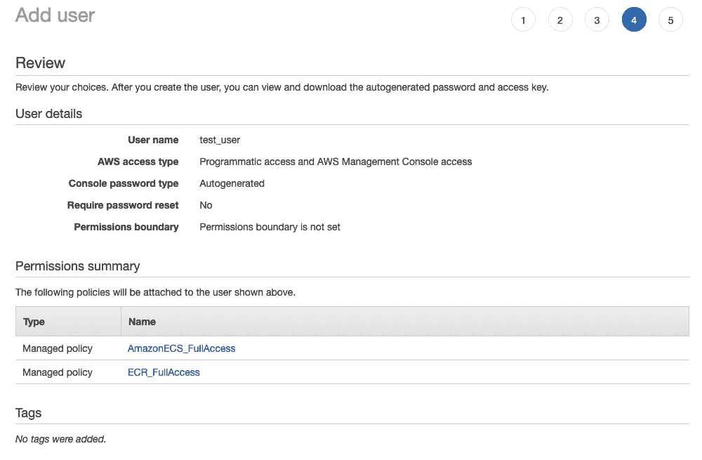

# 使用 ECS 和 Fargate 部署 Docker 容器。

> 原文：<https://towardsdatascience.com/deploying-a-docker-container-with-ecs-and-fargate-7b0cbc9cd608?source=collection_archive---------0----------------------->

## 包括必要权限的指南。


照片由[张秀坤·吕克曼](https://unsplash.com/@exdigy?utm_source=medium&utm_medium=referral)在 [Unsplash](https://unsplash.com?utm_source=medium&utm_medium=referral) 上拍摄

本周，我需要在 ECS 上部署一个 Docker 映像，作为数据接收管道的一部分。我发现将 Docker 映像部署到 ECS 的过程相当简单，但是从安全团队那里获得正确的权限却是一件难事。

在本文中，我们将深入探讨将一个简单的应用程序部署到 ECS 并在 Fargate 集群上运行的步骤，这样您就不必担心配置或维护 EC2 实例。更重要的是，我们将了解必要的 IAM 用户和 IAM 角色权限，如何设置它们，以及如果您在工作中需要这样做，需要向您的网络安全团队提出什么要求。

让我们深入研究一下，从术语开始。

# ECS，ECR，Fargate

我们将在这里使用的三种 AWS 技术是弹性容器服务(ECS)、弹性容器注册(ECR)和 Fargate。

## 精英公司

ECS 是我们工作的核心。在 ECS 中，我们将创建一个任务并运行该任务，以将我们的 Docker 映像部署到一个容器中。ECS 还处理需要运行多个实例的应用程序的扩展。ECS 管理我们应用程序的部署。[了解更多](https://docs.aws.amazon.com/AmazonECS/latest/developerguide/Welcome.html)。

## electroniccashregister 电子现金出纳机

ECR 是 AWS 上 Docker 图像的版本化存储。部署时，ECS 从 ECR 提取映像。[了解更多](https://docs.aws.amazon.com/AmazonECR/latest/userguide/what-is-ecr.html)。

## **法盖特**

Fargate 供应和管理计算实例集群。这很神奇，因为:

1.  您不必供应或管理应用程序运行的 EC2 实例。
2.  您只需为应用运行的时间付费。对于运行定期任务并退出的应用程序来说，这可以节省很多钱。

# 策略、组、IAM 用户和 IAM 角色

如果您是 AWS 生态系统的新手，并且没有以 root 用户的身份学习本教程，那么您需要对 AWS 上的安全管理有所了解。

## 政策

策略是指定服务的权限集合。例如，您可以制定一个策略，仅允许某些用户查看 ECS 任务，但允许其他用户运行这些任务。

策略可以附加到组，也可以直接附加到单个 IAM 用户。

## 组

组顾名思义就是共享访问策略的用户组。当您将策略添加到组中时，该组的所有成员都将获得策略中的权限。

## IAM 用户

IAM 代表身份和访问管理，但实际上它只是一个借口来调用一个识别用户的服务“我是”(聪明吧？).如果您不是 root 用户，您将作为 IAM 用户登录 AWS 管理控制台。

## **IAM 角色**

角色有点令人困惑。角色是 AWS 服务的一组权限。当一个服务需要访问另一个服务的权限时，使用它们。该角色是为它将附加到的特定类型的服务创建的，并且它附加到该服务的实例。(角色还有其他应用程序，但它们超出了本文的范围。)

# 设置权限

正如我提到的，这是过程中最痛苦的部分。亚马逊试图让这变得简单，但访问管理很难。

我们将从 root 帐户开始逐步设置适当的策略。然后，我们会将其转化为对您的安全团队的要求，以便您可以在 ECS 上启动并运行 Docker 容器。

## 创建 IAM 用户并分配权限

这是一个很好的练习，只是为了了解幕后发生的事情。它将帮助您协商您需要从您的组织获得的访问权限，以完成您的工作。

*   以 root 用户身份登录您的 AWS 帐户。如果您没有帐户，您可以在此注册一个帐户[。](https://aws.amazon.com/)
*   搜索 IAM


作者图片

*   从 IAM 仪表板的左侧菜单中选择`Users`。
*   从页面顶部选择`Add user`。


作者图片

*   在添加用户屏幕上选择一个用户名，
*   检查`Programatic access`和`AWS Management Console access`。其余的我们可以离开他们。


作者图片

## 附加 ECS 访问策略

为了简化我们的工作，我们将访问策略直接附加到这个新的 IAM 用户。除了明确属于 ECS 的权限之外，ECS 还需要许多服务的权限，例如列出角色和创建集群。向我们的新 IAM 用户添加所有这些权限的最佳方式是使用 Amazon 托管策略向新用户授予访问权限。

*   选择`Set permissions`下的`Attach existing policies directly`。
*   搜索`AmazonECS_FullAccess`。(前面带有 cube 标志的策略是 Amazon 管理的策略)。
*   选择策略旁边的复选框。


作者图片

# 创建 ECR 策略

我们还需要访问 ECR 来存储我们的图像。除了没有 Amazon 托管策略选项之外，这个过程是类似的。我们必须创建一个新策略来附加到我们的 IAM 用户。

*   再次选择`Create policy`。
*   在维修下选择`Elastic Container Registry`。
*   在动作下选择`All Elastic Container Registry actions (ecr:*)`
*   在资源下选择`specific`和`Add ARN`。在这里，我们将选择地区，留下我们的帐号，并选择`Any`作为存储库名称。


作者图片

*   点击`Add`。
*   点击`Next: Review`跳过标签。
*   填写适当的策略名称。我们将使用`ECR_FullAccess`
*   选择`Create policy`

## 将新策略附加到 IAM 用户

*   创建策略后，返回到我们创建 IAM 用户的浏览器选项卡。
*   通过单击策略表右上角的刷新符号来刷新策略。
*   搜索`ECR_FullAccess ECS_FullAccess`并选择我们创建的每个策略左侧的单选按钮，将其附加到我们的 IAM 用户。


作者图片

*   选择 `Next:Tags`。
*   将标签留空。
*   选择`Next:Review`
*   最后，回顾我们的工作并创建用户。



作者图片

当您提交此页面时，您将看到一个确认屏幕。**将**所有信息保存在安全的地方**当我们部署我们的容器时，我们将需要所有这些信息。**

在现实世界中，您不太可能需要为自己创建这些权限。更有可能的情况是，您需要向组织中的某个人(也许是安全团队)请求它们。现在你已经知道了一些相关的事情，你可以更好地提出要求。

您的请求应包含

*   对你需要完成的事情的一个非常简短的解释。
*   请求的权限列表。

第二种可能是不必要的，但它将节省每个人的时间和许多来回电子邮件的痛苦，因为他们试图找出你到底需要哪些权限。

他们可能会授予您所请求的权限，或者授予您其中的一部分。他们是网络安全专家，所以如果你得到的比你要求的少，真诚地进行。如果你碰壁了，把错误发给他们，这样他们就可以授予你继续前进的必要权限。

您的请求可能如下所示:

```
Hi Joe,I need to deploy a Docker container on ECS.  I will also need access to ECR for this.Please add the following to my IAM user privileges:
- AmazonECS_FullAcces managed policy
- The following policy for ECR access:
{
    "Version": "2012-10-17",
    "Statement": [
        {
            "Sid": "VisualEditor0",
            "Effect": "Allow",
            "Action": "ecr:*",
            "Resource": "*"
        }
    ]
}Thanks! You are the best!
```

好了，接下来是主要事件

# 将 Docker 容器部署到 ECS

这里的步骤是:

1.  创建 Docker 图像
2.  创建 ECR 注册表
3.  给图像加标签
4.  授予 Docker CLI 访问您的 Amazon 帐户的权限
5.  将您的 docker 图像上传到 ECR
6.  为 ECS 创建一个 Fargate 集群，用于部署您的容器。
7.  创建一个 ECS 任务。
8.  运行 ECS 任务！

## 创建 Docker 图像

出于演示的目的，我将使用一个简单的 flask 应用程序来显示 GitHub 库中猫的 gif。该应用程序是 docker-curriculum.com 的一部分，如果你刚刚开始，这是一个很好的 Docker 入门。

## 我们开始吧

*   将 GitHub 和 cd 中的源文件克隆到`flask-app`目录中。

```
$ git clone [https://github.com/prakhar1989/docker-curriculum.git](https://github.com/prakhar1989/docker-curriculum.git)$ cd docker-curriculum/flask-app
```

*   创建 Docker 图像:

```
docker build -t myapp .
```

测试应用程序以确保一切正常。我们下载的 flask 应用程序监听端口 5000，因此我们将使用同一个端口进行测试。

```
docker run --publish 5000:5000 myapp
```

现在你应该可以去`localhost:5000`看到一个随机的猫 gif


作者图片

耶！

## 创建 ECR 注册表。

在这一步中，我们将在 ECR 中创建存储库来存储我们的图像。我们将需要这个存储库的 ARN(Amazon Resource Name——所有 AWS 资源的唯一标识符)来正确标记和上传我们的图像。

使用我们之前创建的 test_user 凭据首次登录 AWS 控制台。Amazon 会询问您的帐户 id、用户名和密码。


作者图片

*   一旦你进入，搜索`Elastic Container Registry`并选择它。


作者图片

*   从这里开始，将存储库的名称填写为`myapp`,其他的都保持默认。


作者图片

*   选择页面左下角的`Create Repository`,您的存储库就创建好了。您将在存储库列表中看到您的存储库，最重要的是 ARN(这里称为 URI)，我们将需要它来提升我们的形象。为下一步复制 URI。


作者图片

如果您愿意，也可以从命令行执行上述步骤，如下所示:

```
$ aws ecr create-repository \
    --repository-name myapp \    
    --region us-east-1
```

## 给图像加标签

为了让 ECR 知道我们将图像推送到哪个存储库，我们必须用那个 URI 标记图像。

```
$ docker tag myapp [use your uri here]
```

我的 ECR 注册表的完整命令如下所示:

```
docker tag myapp 828253152264.dkr.ecr.us-east-1.amazonaws.com/myapp
```

## 授予 Docker CLI 访问您的 Amazon 帐户的权限

我承认这一步有点复杂。我们需要登录 aws 来获得一个密钥，我们将它传递给 docker，这样它就可以将我们的图像上传到 ECR。您将需要 [aws cli](https://aws.amazon.com/cli/) 来完成我们余下的工作。

*   首先，我们将登录到我们的 aws 帐户。

```
# aws configure
```

AWS 将要求我们提供您在创建 AIM 用户时保存的凭据(对吗？).使用这些凭据进行身份验证。

*   接下来，我们需要为 docker 生成一个 ECR 登录令牌。这一步最好与下一步结合起来，但是更深入地看看发生了什么也是好的。当您运行以下命令时，它会抛出一个难看的令牌。Docker 需要这个令牌来推送到您的存储库。

```
# aws ecr get-login-password --region us-east-1
```

*   我们可以像这样将令牌直接传送到 Docker。确保用您的账号替换`**[your account number]**`。末尾的 ARN 与我们之前使用的相同，只是末尾没有存储库的名称。

```
# aws ecr get-login-password --region us-east-1 | docker login --username AWS --password-stdin **[your account number]**.dkr.ecr.us-east-1.amazonaws.com
```

如果一切顺利，响应将是 `Login Succeeded`。

## 将您的 docker 图像上传到 ECR

我们现在已经完成了最困难的部分。从这里开始应该会一帆风顺。

*   使用 docker 将图像推送到 ECR 存储库。

```
docker push 828253152264.dkr.ecr.us-east-1.amazonaws.com/myapp
```

## 创建一个 Fargate 集群。

对于这一步，让我们返回到 AWS 管理控制台。

*   搜索`Elastic Container Service`，选择`Elastic Container Service`。
*   从左侧菜单中选择`Clusters`
*   选择`Create cluster`


作者图片

*   在`Select cluster template`下，我们将只选择网络。我们在集群中不需要 ec2 实例，因为 Fargate 会在我们开始任务时负责加速计算资源，在我们停止任务时负责停止计算资源。


作者图片

*   我将把集群命名为`fargate-cluster`，其余的我们可以保持原样。


*   选择`Create`

## 创建 ECS 任务

ECS 任务是获取我们的映像并将其部署到容器中的操作。要创建 ECS 任务，让我们返回到 ECS 页面并执行以下操作:

*   从左侧菜单中选择`Task Definitions`。然后选择`Create new Task Definition`


作者图片

*   选择`Fargate`
*   选择`Next Step`


作者图片

*   输入任务的名称。我要用`myapp`。
*   将`Task Role`和`Network Mode`设置为默认值。


作者图片

*   保持`Task Execution Role`设置为默认值。
*   对于任务内存和任务 CPU，选择最小值。这项测试我们只需要最少的资源。


作者图片

*   在容器定义下选择`Add Container.`
*   输入容器名称。我会再次使用`myapp`。
*   在图像框中输入我们图像的 ARN。如果您还没有这样做，您将需要从 ECR 仪表板中复制并粘贴它。
*   我们可以将内存限制保持在 128Mb
*   在端口映射中，您会注意到我们实际上不能映射任何东西。我们在这里输入的任何端口都将在实例上打开，并映射到容器上的同一个端口。我们将使用 5000，因为这是我们的 flask 应用程序侦听的位置。


作者图片

*   将其他所有内容设置为默认值，并单击对话框左下角的`Add`。
*   将 Configure task and container definitions 页面中的其他内容保持不变，并选择页面左下角的`Create`。
*   回到 ECS 页面，选择`Task Definitions`,我们应该会看到我们的新任务处于活动状态。


作者图片

## 运行 ECS 任务！

这是我们期待已久的时刻。

*   在任务定义列表中选择任务
*   点击`Actions`，选择`Run Task`


作者图片

*   对于`Launch type`:选择`Fargate`
*   确保`Cluseter`:设置为我们之前创建的`fargate-cluster`。


作者图片

*   集群 vpc 从列表中选择一个 VPC。如果您正在构建自定义应用程序，这应该是分配给任何其他 AWS 服务的 vpc，您将需要从您的实例访问这些服务。对于我们的应用程序，任何都可以。
*   至少添加一个子网。
*   `Auto-assign public IP`应设置为`ENBABLED`


作者图片

*   编辑安全组。
    因为我们的应用程序监听端口 5000，并且我们在容器上打开了端口 5000，所以我们还需要在安全组中打开端口 5000。默认情况下，运行任务创建的安全组只允许端口 80 上的传入连接。单击安全组名称旁边的`Edit`,添加一个打开端口 5000 的自定义 TCP 规则。


作者图片

最后，点击页面左下角的`Run Task`运行任务。

# 查看我们的应用程序是否正在运行

运行任务后，您将被转到`fargate-cluster`页面。当您的集群的最后状态变为`RUNNING`时，您的应用程序启动并运行。在状态为`RUNNING`之前，您可能需要刷新几次表格。这可能需要几分钟时间。


作者图片

*   单击任务列中的链接。
*   在任务页面的网络部分找到公共 IP 地址。


作者图片

*   在浏览器中输入公共 IP 地址**，然后输入:5000** ，查看您的应用程序运行情况。


作者图片

# **关闭 app**

当你看完猫的 gif 后，你会想关闭你的应用程序以避免收费。

*   从 ECS 页面的左侧菜单中选择集群，并从集群列表中选择`fargate-cluster`。


作者图片

*   从页面底部的表格中选择任务。
*   选中正在运行的任务旁边的框
*   从表格顶部的下拉菜单中选择停止


作者图片

# 结论

既然您已经知道如何将 Docker 映像部署到 ECS，那么世界就是您的了。您可以部署一个刮擦应用程序，它会一直运行到完成，然后关闭，这样您只需为它运行的时间付费。您可以扩展 web 服务。你可以用多个 cat gif 服务器在互联网上传播 cat gif。一切都取决于你。

# 资源

*   如果您的权限不允许您的任务创建 ECS 任务执行 IAM 角色，您可以按照以下说明创建一个。

 [## Amazon ECS 任务执行 IAM 角色

### 任务执行角色授予 Amazon ECS 容器和 Fargate 代理在您的…上进行 AWS API 调用的权限

docs.aws.amazon.com](https://docs.aws.amazon.com/AmazonECS/latest/developerguide/task_execution_IAM_role.html) 

*   如果你是 Docker 新手，docker-curriculum.com 是一个不错的起点。

[](https://docker-curriculum.com/) [## 面向初学者的 Docker 教程

### 学习使用 Docker 轻松构建和部署您的分布式应用程序到云中，Docker 由…

docker-curriculum.com](https://docker-curriculum.com/) 

*   将 Docker 映像部署到 ECS 的 Amazon 教程。

 [## 亚马逊 ECS 的 Docker 基础

### Docker 是一种技术，它为您提供构建、运行、测试和部署分布式应用程序的工具，这些应用程序…

docs.aws.amazon.com](https://docs.aws.amazon.com/AmazonECS/latest/userguide/docker-basics.html) 

现在去做好事吧。