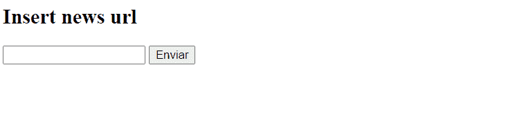
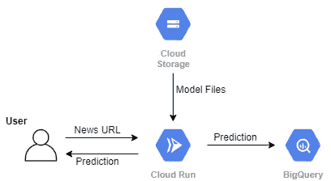
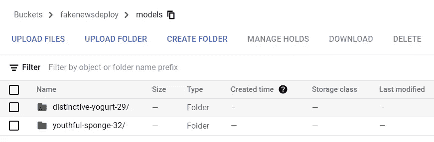
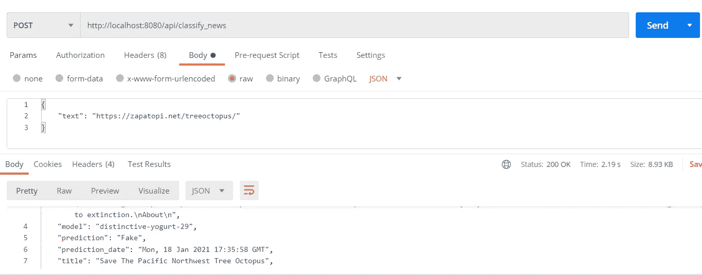
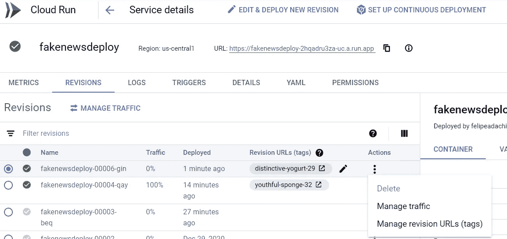
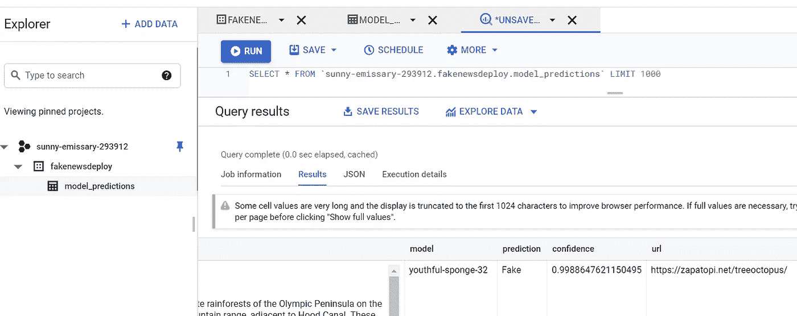

# 使用 Google Cloud Run 和 Flask 部署假新闻检测器 Web 应用程序

> 原文：<https://towardsdatascience.com/deploying-a-fake-news-detector-web-application-with-google-cloud-run-and-flask-eb750cce986d?source=collection_archive---------25----------------------->

## 同时考虑到技术债务


在 [Unsplash](https://unsplash.com?utm_source=medium&utm_medium=referral) 上由 [Teslariu Mihai](https://unsplash.com/@mihaiteslariu0?utm_source=medium&utm_medium=referral) 拍摄的照片

# 你的 ML 模型已经毕业了。现在它需要一份工作。

在你恰当地训练和验证了你的 ML 模型之后，是时候让它去做它应该做的事情了:服务。一种常见的方法是将其部署为 REST API。在这篇文章中，我想分享我是如何在我的个人项目中为假新闻检测构建一个简单的 web 应用程序的。

同时，我想借此机会讨论一个非常重要的问题:**技术债务**。

如今，部署 ML 系统相对较快，但是很容易忽略随着时间的推移维护这些系统是多么困难和昂贵。我不是这方面的专家，所以我不想讨论它的每个方面，而是想谈两个问题:

*   模型陈旧:ML 系统可能会遇到变化的、不稳定的数据。在这些情况下，如果模型没有被足够频繁地训练以产生最新的模型，则该模型被认为是*陈旧的。*
*   训练/服务偏斜:特征可能由系统的不同部分中的不同代码路径来计算。当这些代码路径生成不同的值时，这被称为训练/服务偏差。

根据应用程序的性质和复杂性，了解这两个问题的影响以及如何检测和避免(或减轻)它们是非常重要的。

因此，在向您展示我是如何部署我的应用程序的同时，我还想讨论这些问题是如何出现在这个特定项目中的，以及我们如何在设计中考虑这些问题。

# 应用程序

最后，我想要的是一个假新闻检测的 web 应用程序:一个用户可以输入一篇新闻文章的 URL 的页面，系统会告诉它预测的结果:是假的还是真的。举例来说，这是最终结果:



作者 Gif

应用程序的完整代码可以在[项目的 Github](https://github.com/FelipeAdachi/fake-news-deploy) 中找到。

**注意:**本文建立在我的[上一篇](/how-i-learned-to-stop-worrying-and-track-my-machine-learning-experiments-d9f2dfe8e4b3)的基础上，在这篇文章中，我训练了一个文本分类 SVM 模型(并跟踪了它的性能)。为了训练这个模型，我使用了来自 Kaggle 数据集的数据，你可以在这里找到。

## 需要注意什么

将模型投入生产时，我们应该考虑一些事情(以及其他事情)。

例如，用于训练模型的数据集包含 2015 年至 2018 年间的新闻文章。因此，作为一个例子，如果一篇关于新冠肺炎的文章被提交给模型进行推理，它的预测会是什么？新闻本质上是不断变化的。很明显，模型陈旧是这里的一个重要考虑因素。

另一个问题是没有显示在原始数据集中提取文本的方法。这很可能不是我在生产中用来提取内容的方法。因此，这里存在一些不可避免的训练/服务偏差。但是，当用生产中收集的数据重新训练模型时，我们必须有办法评估它，并从长远来看减轻它。

最后，我们还应该考虑训练和服务期间的文本预处理之间的差异。如果我在培训期间删除停用词，我必须确保在生产中也删除它们。如果在生产中引入了额外的预处理步骤，那么我应该重新训练模型。训练/发球偏斜的另一个例子。

# 概观

建立一个 web 应用程序可以有很多不同的方式。对于这个项目，这是我选择的方式:



作者图片

主应用程序是使用 Flask 构建的。Cloud Run 是 Google 提供的一个完全托管的解决方案，用于部署一个容器化的 web 应用程序。因此，为了在 Cloud Run 上部署我的应用程序，首先必须将它打包到 docker 容器中。

嗯，模型文件需要存储在某个地方。在我的上一篇文章中，我使用的是 AWS，但是因为我要使用 Cloud Run，所以让我们通过使用 Google 云存储将所有东西都放在同一个云环境中。当实例被创建时，所需的文件从我的存储桶中下载。

为了解决前面讨论的问题，我决定将所有预测结果存储在一个表中。在这种情况下，谷歌云 BigQuery。通过这种方式，我可以在未来使用在线预测的数据来重新训练模型。此外，如果我存储每个推断的预测概率值，我可以检查我的模型是否随着时间变得不确定。通过存储新闻内容，我还可以检查文本是如何处理的，并验证单词分布情况。我还可以记录产生结果的模型的名称，这样我就可以在不同版本和不同类型的模型之间进行各种测试。

# 初步步骤

为了设置我的环境，我必须执行一些步骤。

## 创建项目

第一个是创建一个 GCP 帐户，然后通过选择“创建项目”这里的来创建一个项目。

## 创建服务帐户

为了使用 Python APIs 访问存储和 BigQuery，我需要 JSON 格式的 GCP 凭证。我按照谷歌文档中*“创建服务账户”*的指示下载了我的证书。

## 创建存储桶

我还必须按照这里的指示[在云存储中创建一个 bucket](https://cloud.google.com/storage/docs/creating-buckets)。我的桶被命名为“ *models”，*，在其中，我根据模型的名称存储了我需要的模型文件。这些名称和文件是根据我的上一篇文章创建的，在这篇文章中我讨论了跟踪 ML 实验(文章[在这里](/how-i-learned-to-stop-worrying-and-track-my-machine-learning-experiments-d9f2dfe8e4b3)和 Github [在这里](https://github.com/FelipeAdachi/fake-news-experiments))。



作者截图

## 创建表

最后一步是在 BigQuery 上创建表来存储我的预测。这可以用不同的方法来完成。我是这样做的:通过控制台在 BigQuery 上创建一个数据集，然后通过 Python 中的`[google-cloud-bigquery](https://pypi.org/project/google-cloud-bigquery/)`创建表本身:

`pip install -upgrade google-cloud-bigquery`

然后通过这个脚本:

注意，我们使用在上一步中下载的凭证作为环境变量。`table_id`是基于要创建的项目、数据集和表的名称构建的。

创建表后，您可以设置它的模式。对于这个项目，我决定存储以下重要字段:

*   **标题**:新闻的标题
*   **内容:**新闻的文本内容
*   **模型:**生成预测的模型的名称
*   **预测:**预测结果:真假
*   **置信度:**预测的概率，表示模型对其预测的置信度
*   **url:** 原始新闻文章的 url
*   **预测日期:**进行预测的日期和时间

# 前端

既然是很简单的接口，这里就不多说了。主页 URL 只是呈现一个标题和一个文本框作为用户输入:

## 烧瓶应用程序

这是主要的应用程序代码。当表单发送 POST 请求时，会调用`classify_news`函数。它主要执行以下步骤:

1.  从 URL 读取内容
2.  预处理、矢量化文本内容并将其转换为 tf-idf 表示
3.  预测它是假新闻还是真新闻
4.  将预测结果插入到 BigQuery
5.  向用户显示信息

你可以看到到`classify_news`有两条路线。一个是当它从主 URL 被调用时，在这种情况下`text`是从一个表单中获取的，这个函数应该返回一个 HTML 格式的字符串。

您还可以将它作为 API 端点直接调用，以便更容易从任何类型的应用程序中调用。然后，返回结果将等于用于将结果插入 BQ 表的字典。下面是我在 Postman 上本地测试应用程序时的一个例子:



作者截图

## 得到我们需要的

为了进行预测，我们首先需要获得模型文件。这包括 pickle 文件，它是用于 **CountVectorizer** 映射的词汇表，以及 joblib 文件，它是 sklearn 模型本身。

为了下载文件，我使用了`[google-cloud-storage](https://pypi.org/project/google-cloud-storage/)`包。我们可以使用前面创建的表所用的相同凭证。

## 阅读内容

然后，我们需要一种方法来实际提取文本，给定一个 URL。为此，我使用了一个名为`[boilerpy3](https://pypi.org/project/boilerpy3/)`的包。

## 预处理

一旦我们有了文本，我们需要将它转换成模型可以理解的格式。在训练期间，我们有一个简单的文本预处理阶段，随后是计数矢量化，然后将其转换为 tf-idf 表示。我不会详细讨论 NLP 方法，但你可以在这篇 [sklearn 教程](https://scikit-learn.org/stable/tutorial/text_analytics/working_with_text_data.html)中了解更多。

您会发现了解生成模型的代码路径非常重要，这样您就可以在服务时尽可能好地重新创建它。还有，储存你以后可能需要的所有物品。

## 预言；预测；预告

现在我们有了正确的输入，我们可以通过加载我们训练好的模型并调用它的预测方法来进行预测。在这种情况下，`prediction_proba`返回两个类的概率(Real=1，Fake=0)。哪个更高就是预测类。

我们需要预测的概率值来监控模型的性能。但是要访问它，必须在训练阶段之前设置正确的参数。事先意识到这一点，而不仅仅是在生产过程中，肯定会使事情变得容易得多。

## 存储结果

我们最终可以将所有信息收集到一个字典`to_insert`中，然后将结果发送给 BigQuery:

# 打包和部署

一旦 Flask 应用程序在本地得到正确测试，我们现在就可以创建 Docker 映像并将其部署到云上。为此，我在这里遵循了这个很棒的教程:[用 Python 和 Docker 部署 APIs】。](/deploy-apis-with-python-and-docker-4ec5e7986224)

我不会解释这个过程中的每一个细节，因为上面的教程已经解释得很清楚了。但是，总而言之，我需要:

*   创建 Dockerfile 文件:

```
FROM python:3.7WORKDIR /appCOPY . .RUN pip install -r requirements.txtCMD exec gunicorn --bind :$PORT --workers 1 --threads 8 --timeout 0 app:app
```

*   `docker build -t fakenewsdeploy:<model_name> .`
*   [安装谷歌 SDK](https://cloud.google.com/sdk/docs/install)
*   `gcloud auth login`
*   `gcloud auth configure-docker`
*   `gcloud builds submit -t gcr.io/<your_project_id>/fakenewsdeploy:<model_name>`

到目前为止，我们已经创建了图像，并将其上传到了 [Google 容器注册表](https://cloud.google.com/container-registry)。现在，我们必须从我们的映像部署一个云运行应用程序。我们可以通过在控制台的云运行中单击“创建服务”来实现，最终结果应该是这样的:



作者截图

在前面的步骤中，我们在图像中插入了带有型号名称的标签，在这里，我们还可以为每个版本插入版本 URL。这不仅是一个标签，也是一个专门访问该版本的 URL。这样，我们可以访问和比较每个模型的性能，或者版本之间可能存在的任何其他差异。

另一个很酷的功能是你可以设置每个版本的流量。假设您刚刚训练了一个新的花式变压器模型，并希望将其与您的经典模型进行比较。这样，您可以逐渐增加最新型号的流量，以降低风险。因为您记录了结果，所以如果有问题，您可以很容易地恢复流量。

# 结果呢

不幸的是，由于我在 GCP 的试用期即将结束，我不会继续在线提供这项服务了。但是如果你很快就读到了这篇文章，你可以在[https://fakenewsdeploy-2 hqadru 3 za-UC . a . run . app](https://fakenewsdeploy-2hqadru3za-uc.a.run.app)查看

最终的结果已经在本文的开头展示了。剩下要显示的是我们在 BigQuery 的表:



作者截图

我们现在可以直观地检查结果或进行一些 SQL 操作来计算一些有用的度量，如模型置信度、内容的单词分布和类分布。

# 结论

在本文中，我向您展示了我如何部署我的简单 web 应用程序来检测假新闻，同时试图为未来的自己减少债务。为了避免将来的一些大麻烦，你现在可以采取一些不痛不痒的行动。我相信在这件事上还有很多事情要做，但是，嘿，让我们一次学一件事。

既然涨了，剩下的就是维持了。您应该持续监控您的应用程序，并在需要时进行重新培训/重新部署。

为了重新训练你的模型，你最终将不得不标注你存储的在线预测。我读过一些关于人们选择置信度高于某个阈值的预测，并把它作为基本事实的报道。我不知道这是否真的值得推荐，但也许值得一试。

如果我继续这个个人项目，我想下一步应该是建立一个监控仪表板。为了让所有东西都在同一个地方，这可以在 Google Data Studio 中完成，例如，通过将我们的表设置为数据源。这样，我可以建立一些整洁的时间序列图、图表和图形。

暂时就这样吧！如果有什么建议，随时联系！

感谢您的阅读！

## 参考资料:

1.  [机器学习系统中隐藏的技术债务](https://papers.nips.cc/paper/2015/file/86df7dcfd896fcaf2674f757a2463eba-Paper.pdf)
2.  [ML 测试分数:ML 生产准备和技术债务削减的一个指标](https://static.googleusercontent.com/media/research.google.com/en//pubs/archive/aad9f93b86b7addfea4c419b9100c6cdd26cacea.pdf)