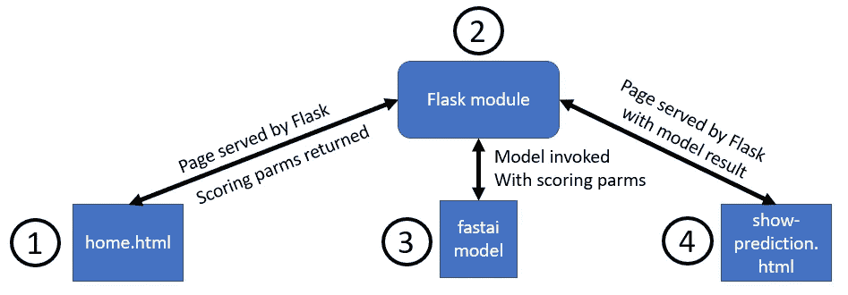
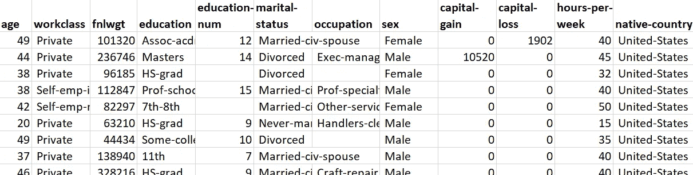
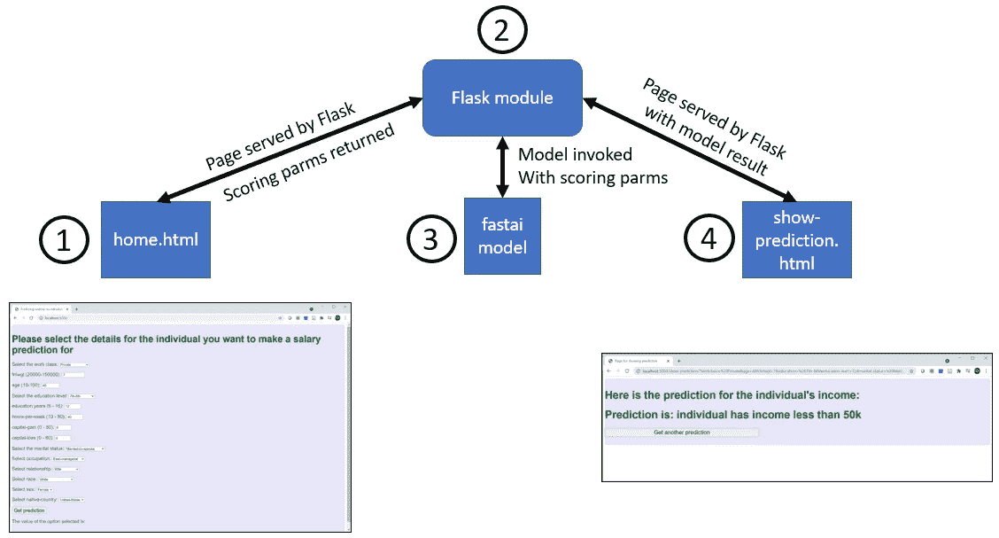

# 使用 Flask 在 Windows 上部署 fastai 模型

> 原文：<https://towardsdatascience.com/deploying-a-fastai-model-on-windows-with-flask-c8846e6b9800?source=collection_archive---------38----------------------->

图片:作者

对深度学习模型进行基本的 web 部署是一种很好的方式，可以原型化如何使用您的模型，并验证您在培训过程中所做的假设。在与 Keras 一起工作时，我做了几个模型的简单部署，并发表了一些文章，描述我用 Facebook Messenger 和 T2 Flask 部署 Keras 模型的经历。

由于我在去年花了大量时间使用另一个主要的高级深度学习框架 **fastai** ，我希望获得 fastai 模型简单部署的实践经验。我决定用 Flask 来修改我在 Keras 模型的 web 部署中使用的方法。在本文中，我将描述创建 fastai 模型的简单 web 部署时必须克服的一些障碍，以及与 Keras 相比 fastai 为部署提供的一些意想不到的好处。

## 目标

我之前使用 fastai 管理的表格数据集 ADULT_SAMPLE 训练了一个 fastai 模型。该数据集的特征描述了个人(他们的年龄、工作类别、教育背景等)，如下所示:

成人样本数据集的片段

我在 ADULT_SAMPLE 上训练的模型预测具有一组给定特征值的个人的收入是高于还是低于 5 万美元。出于部署的目的，我将这些特征值称为**评分参数**。

对于本文中描述的部署，我希望创建一个简单的 web 应用程序，用户可以在其中选择个人的特征值/评分参数，并从训练好的模型中获得关于此人的收入是否会超过 50 k 美元阈值的预测。

## 部署方法

我想尽可能多地重用我为 Keras 模型所做的 web 部署中的代码。我改编了 Keras web 部署中的 HTML 文件和 Flask 模块，并采用了下图中描述的方法:

Web 部署方法

1.  **home.html**—用户选择评分参数(年龄、工作类别、教育背景等值)的网页，他们希望获得个人的收入预测。
2.  **Flask 模块** —服务网页并加载训练好的 fastai 模型。Flask 模块包含用于组成部署的两个网页(home.html 和 show-prediction.html)的视图函数**。当一个网页被加载时，该网页的视图函数被执行，这使我们有机会从熟悉的 Python 设置中采取行动，比如调用模型进行预测。**
3.  **经过训练的 fastai 模型**-这是我使用成人样本数据集训练的模型，它根据个人的评分参数预测个人的收入是否超过 5 万美元。当启动 Flask 模块时加载该模型，并使用从 home.html 传来的评分参数在 show-prediction.html 的查看功能中调用该模型。
4.  show-prediction.html**-显示模型对个人预测的网页，评分参数设置在 home.html。**

在更新 HTML 文件以反映成人样本数据集的细节之后，我可以重用来自 Keras 部署的 HTML 文件。我不需要对这些文件做任何针对 fastai 的更改。

我必须做一些工作来从 Keras 部署中获取 Flask 模块，以便正确地加载和应用 fastai 模型。在下一节中，我将描述实现这一点的挑战和一些惊喜。

## 将所有这些放在一起:三个陷阱和一个惊喜

整个解决方案中最困难的部分是将 fastai 模型正确无误地加载到 Flask 模块中。根据我在 fastai 论坛上读到的内容，如果我一直使用 Linux 而不是 Windows 作为开发环境，我会更容易一些。然而，Windows 应该是 fastai 支持的平台，我的这个部署示例的观众需要能够使用 Windows，所以放弃这个平台不是一个选项。

要使部署工作正常进行，我必须克服三个关键问题。

*   当我试图加载 fastai 模型时，我一直得到 PosixPath 错误。我可以通过向 Flask 模块添加以下导入来解决这个问题(在这个[堆栈溢出线程](https://stackoverflow.com/questions/57286486/i-cant-load-my-model-because-i-cant-put-a-posixpath)的帮助下):

*   由于形状不匹配错误，加载模型一直失败。在我包含了上述代码片段中显示的导入之后，我能够加载模型(在与 Flask 模块相同的目录中)，但是我需要(a)将我的本地系统上的 Pandas 更新到最新级别(b)确保我使用了 Python 的平台不可知路径功能以避免反斜杠/正斜杠混淆，以及(c)使用模型的完全限定文件名作为 load_learner 的参数，如下所示:

*   我用来训练模型的成人样本数据集中的分类值都以空格开头。我忽略了在训练时进行转换来修剪这些空格，所以模型是用每个以空格开头的分类值来训练的。但是，我在 home.html 编码的分类特性的值(指定用户可以选择的有效值)不是以空格开头的。我没有注意到训练集和用户可以选择发送到部署模型的内容之间的不匹配。当我测试 web 部署时，该模型看到了所有分类特性的前所未有的值。结果是，在 web 部署中，模型总是预测“少于 50 k 美元”，即使在 Jupyter 笔记本中一次性调用时，模型预测得分参数集“大于 50 k 美元”。一旦我发现了训练集中的异常，我就更新 home.html 中的分类特征值，以一个空格开始。更新之后，web 部署预测与一次性预测相匹配。

最后，来自 fastai 的一个惊喜是:我能够部署模型，而不必显式地定义评分参数的管道。fastai 在推理时自动调用与训练时相同的分类值转换。这比我在 Keras 部署中所做的修改有更大的优势，例如，如果在训练模型时“星期一”被映射到 0，那么当调用部署的模型来获得预测时，它也被映射到 0。

## 结论

在 Windows 上完成一个 fastai 模型的简单的、基于 Flask 的 web 部署需要一些反复试验。为了能够成功地加载一个经过训练的 fastai 模型，我需要确保我有模型的精确正确的路径定义，这需要进行一些调查。我用来训练模型的数据集有一个异常，如果我在训练时修剪前导空格，就可以避免这个异常。然而，最终我能够使用适用于 Keras 模型的相同方法来部署 fastai 模型，fastai 使我不必担心在训练时和推理时如何同步分类值的编码。

## 背景

*   Git repo 使用本文描述的 web 部署代码:[https://github.com/ryanmark1867/fastai_deployment](https://github.com/ryanmark1867/fastai_deployment)
*   本文视频版:【https://youtu.be/lLCeOPc82DI 
*   fastai 和 Keras 对比视频:[https://youtu.be/3d6rGGyPR5c](https://youtu.be/3d6rGGyPR5c)，[https://youtu.be/wCMuQD2QBMk](https://youtu.be/wCMuQD2QBMk)