# 在 Red Hat OpenShift 容器平台上部署机器学习模型作为 API

> 原文：<https://towardsdatascience.com/deploying-a-machine-learning-model-as-an-api-on-red-hat-openshift-container-platform-5f6553647917?source=collection_archive---------20----------------------->

## 使用 Flask、Scikit-Learn 和 Docker 从 GitHub 库中的源代码


Annamária Borsos 摄影

机器和深度学习应用程序变得比以往任何时候都更受欢迎。正如我们之前所看到的，企业 Kubernetes 平台(Red Hat open shift Container Platform)通过引入额外的安全控制并使环境更易于管理，帮助数据科学家和开发人员使用他们喜欢的工具真正专注于价值。它能够在企业级和高度可用的集群中部署、服务、保护和优化机器学习模型，使数据科学家能够专注于数据的价值。我们可以使用托管服务(IBM Cloud 上的 Red Hat OpenShift、AWS 上的 Red Hat OpenShift 服务、Azure Red Hat OpenShift)在云中安装 Red Hat OpenShift 集群，或者我们可以通过从另一个云提供商(AWS、Azure、Google Cloud、平台无关的)安装来自行运行它们。我们还可以在受支持的基础设施(裸机、IBM Z、Power、Red Hat OpenStack、Red Hat 虚拟化、vSphere、Platform agonistic)上创建集群，或者在我们的笔记本电脑上创建对本地开发和测试有用的最小集群(MacOS、Linux、Windows)。这里很自由。

在本文中，我们将展示如何在云上的 OpenShift 集群上部署一个用 Python 开发的简单机器学习模型。出于本文的目的，我们将在 IBM Cloud 上创建一个 OpenShift 集群，并展示如何从 GitHub 存储库中部署我们的机器学习应用程序，并公开应用程序以访问它(有和没有 docker 文件)。

我们可以用很少很简单的步骤做到这一切。

# 创建一个 OpenShift 集群实例

我们连接到我们的 IBM Cloud 帐户，点击导航菜单，OpenShift，Clusters:

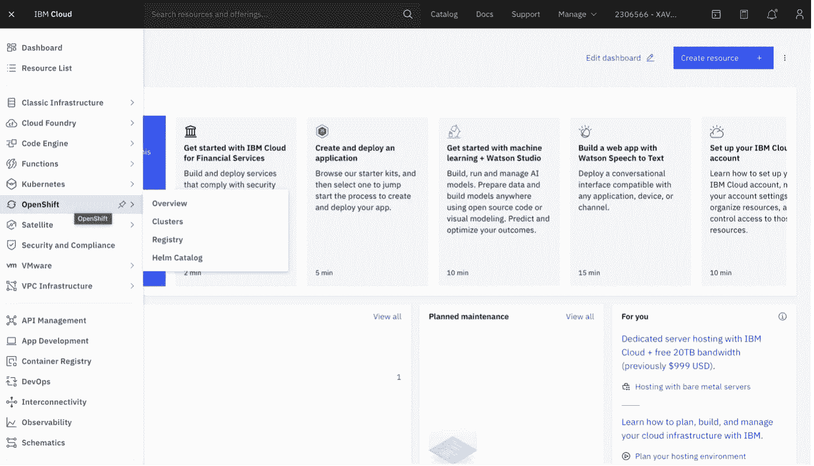

点击创建集群:

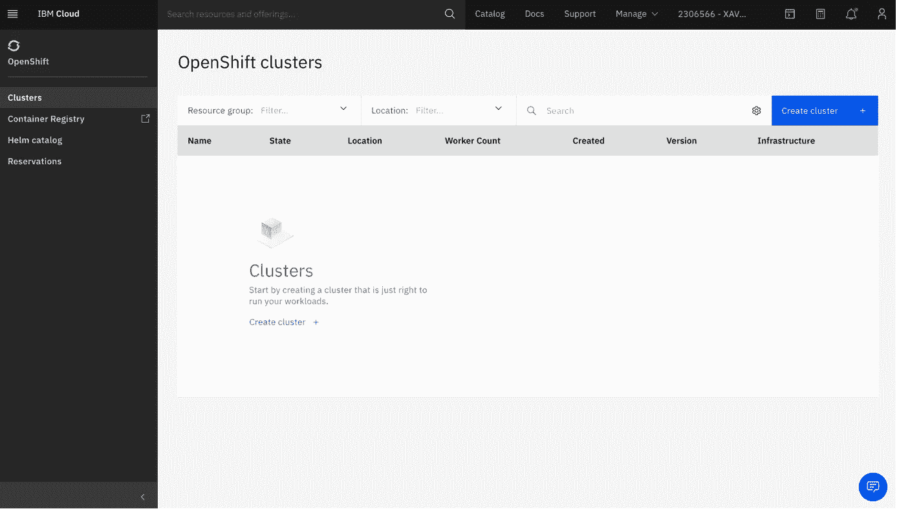

我们可以选择几个选项，如位置、运行集群或工作池的计算环境(vCPUs 数量、内存、加密本地磁盘……)，然后单击“create”。一个有趣的选择是，我们可以选择卫星，它允许在我们自己的数据中心运行我们的集群。出于本文的目的，我们选择了 Classic。

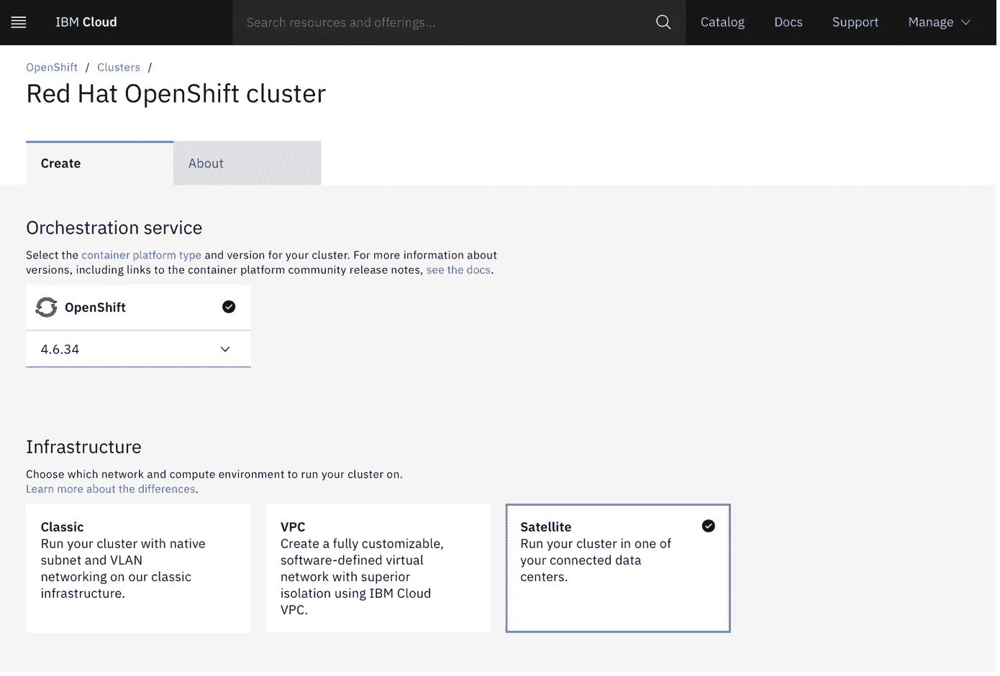

搞定了。

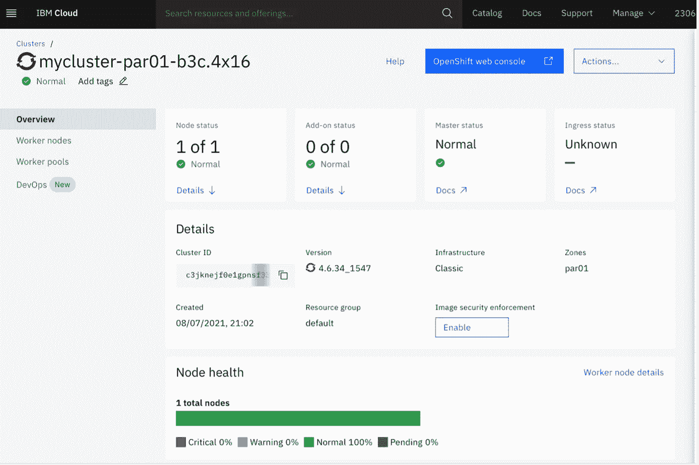

您还可以使用 CLI 创建集群:[https://cloud.ibm.com/docs/openshift?topic=openshift-clusters](https://cloud.ibm.com/docs/openshift?topic=openshift-clusters)

# 从 GitHub 存储库中的源代码部署应用程序

我们可以从源代码、图像或模板创建新的 OpenShift 企业应用程序，并且可以通过 OpenShift web 控制台或 CLI 来完成。用所有的源代码和 Docker 文件创建了一个 GitHub 存储库，以便组装 Docker 映像，并在以后将其部署到 OpenShift 集群:[https://github.com/xaviervasques/OpenShift-ML-Online.git](https://github.com/xaviervasques/OpenShift-ML-Online.git)

首先，让我们看看并测试我们的应用程序。我们克隆我们的存储库:

```
git clone [https://github.com/xaviervasques/OpenShift-ML-Online.git](https://github.com/xaviervasques/OpenShift-ML-Online.git)
```

在文件夹中，我们应该会找到以下文件:

**Dockerfile**

**train.py**

**api.py**

**requirements.txt**

OpenShift 将自动检测是否使用了 Docker 或源代码构建策略。在我们的存储库中，有一个 **Dockerfile。** OpenShift Enterprise 将生成 Docker 构建策略。 **train.py** 是一个 python 脚本，它加载并分割 iris 数据集，这是一个经典且非常简单的多类分类数据集，由 3 种不同类型的 iris(Setosa、Versicolour 和 Virginica)花瓣和萼片长度组成，存储在 150 x4 numpy . NDA array 中。我们使用 scikit-learn 创建数据集和模型(支持向量机分类器)。**requirements . txt**(flask，flask-restful，joblib)用于 Python 依赖关系，而 **api.py** 是将被调用来使用 REST API 执行推理的脚本。API 将返回 svm 模型对测试数据的分类分数。

**train.py** 文件如下:

**api.py** 文件如下:

Dockerfile 文件:

最后是 **requirements.txt** 文件:

为了测试一切是否正常，让我们在本地机器上构建并运行 docker 映像:

```
cd OpenShift-ML-Online
docker build -t my-ml-api:latest .
docker run my-ml-api
```

输出如下所示:

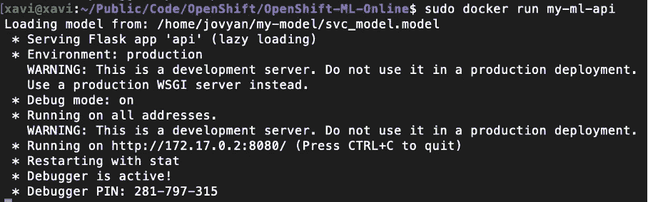

您可以使用带有 curl 的 API:

```
curl [http://172.17.0.2:8080/](http://172.17.0.2:8080/)
```

我们应该得到以下输出:

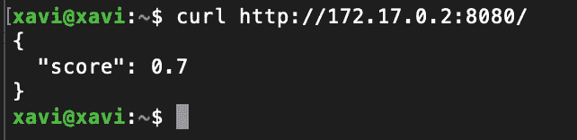

我们现在准备部署。

要创建一个新项目，我们可以同时使用 CLI(使用 IBM Shell 或我们自己的终端)或 OpenShift web 控制台。在控制台中，为了创建一个新项目，我们从 OpenShift 集群控制台中选择我们的集群(mycluster-par01-b3c.4x16 ),然后单击 OpenShift web 控制台。

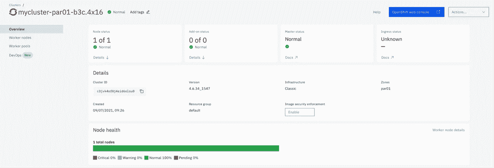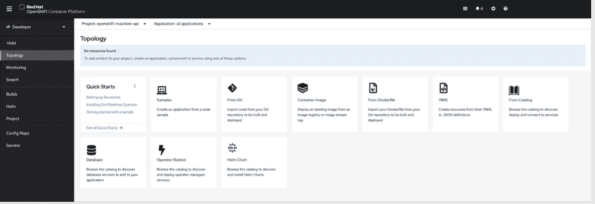

从透视图切换器中，我们选择 Developer 来切换到 Developer 透视图。我们可以看到菜单提供了+Add、Builds 和 Topology 等项目。

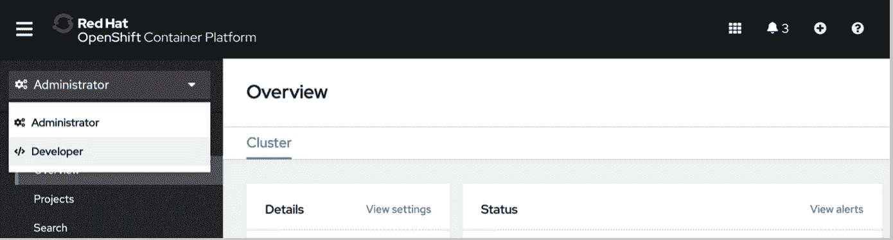

我们点击+Add 并创建项目:


在本章中，我们将在本地机器上使用 CLI。由于我们在 IBM Cloud 上安装了 OpenShift 集群，如果还没有安装，那么有必要安装:

- IBM 云 CLI([https://cloud.ibm.com/docs/cli?topic = CLI-install-IBM cloud-CLI](https://cloud.ibm.com/docs/cli?topic=cli-install-ibmcloud-cli)

-open shift Origin CLI(https://docs . open shift . com/container-platform/4.2/CLI _ reference/open shift _ CLI/getting-started-CLI . html)

然后，我们需要登录 OpenShift 并创建一个新项目。为了做到这一点，我们需要复制登录命令:

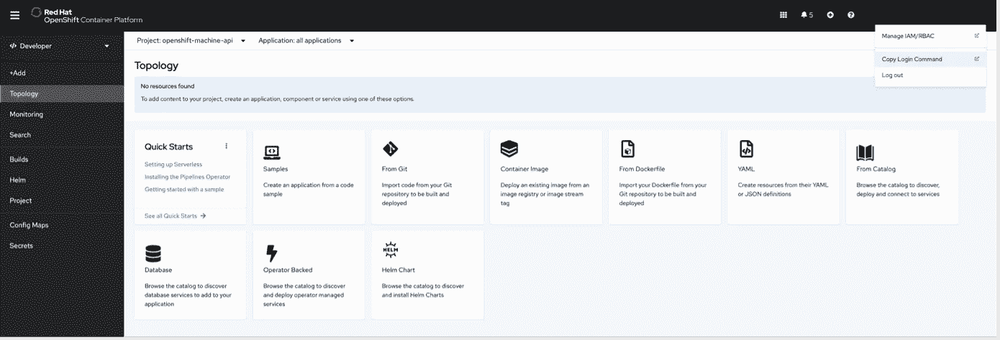

我们登录我们的帐户:

```
ibmcloud login
```

我们复制/粘贴登录命令:

```
oc login — token=sha256~IWefYlUvt1St8K9QAXXXXXX0frXXX2–5LAXXXXNq-S9E — server=https://c101-e.eu-de.containers.cloud.ibm.com:30785
```

new-app 命令允许使用本地或远程 Git 存储库中的源代码创建应用程序。为了使用 Git 存储库创建应用程序，我们可以在终端中键入以下命令:

```
oc new-app [https://github.com/xaviervasques/OpenShift-ML-Online.git](https://github.com/xaviervasques/OpenShift-ML-Online.git)
```

这个命令有几个选项，比如通过指定— context-dir 标志来使用我们的源代码库的子目录，指定 Git 分支或者设置— strategy 标志来指定构建策略。在我们的例子中，我们有一个 Socker 文件，它将自动生成一个 Socker 构建策略。

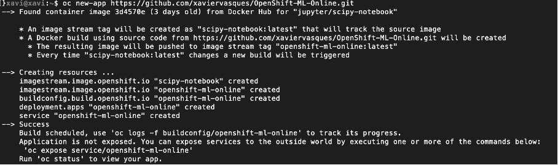

应用程序已部署！应用程序需要向外界公开。正如前面的输出所指定的，我们可以通过执行以下命令来实现这一点:

```
oc expose service/openshift-ml-online
```

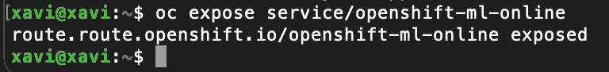

我们可以检查状态:

```
oc status
```

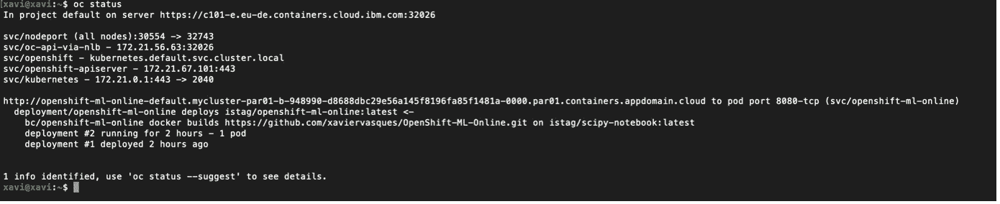

我们可以在输出中找到 API 的路径:

```
curl [http://openshift-ml-online-default.mycluster-par01-b-948990-d8688dbc29e56a145f8196fa85f1481a-0000.par01.containers.appdomain.cloud](http://openshift-ml-online-default.mycluster-par01-b-948990-d8688dbc29e56a145f8196fa85f1481a-0000.par01.containers.appdomain.cloud/)
```

它提供了预期的输出(svm 模型对测试数据的分类得分)


```
oc get pods --watch
```

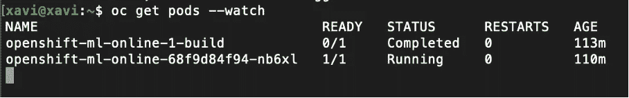

我们还可以在 OpenShift web 控制台中找到关于我们服务的所有信息:

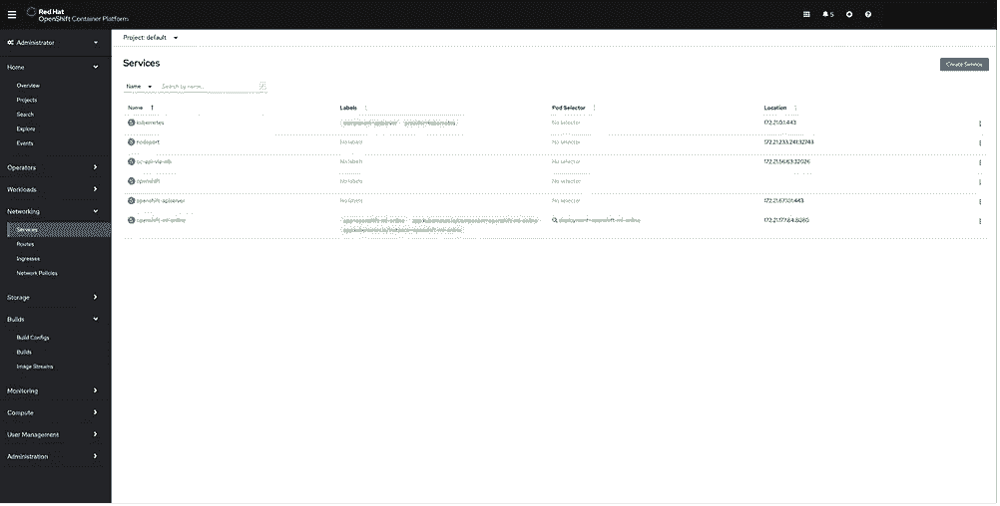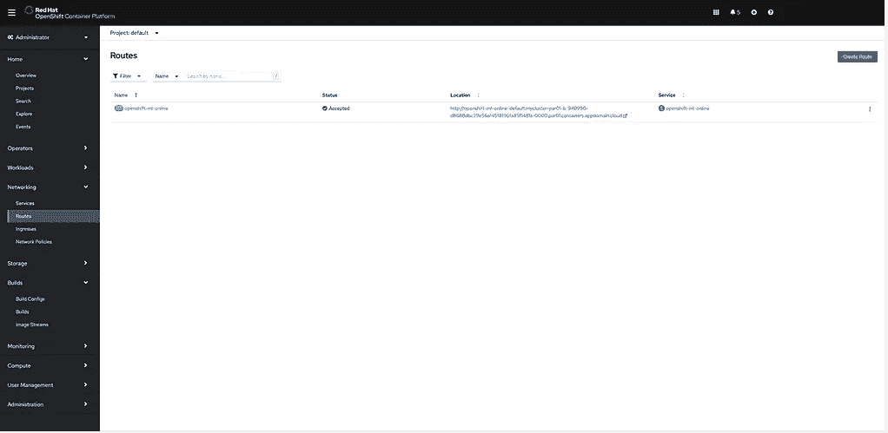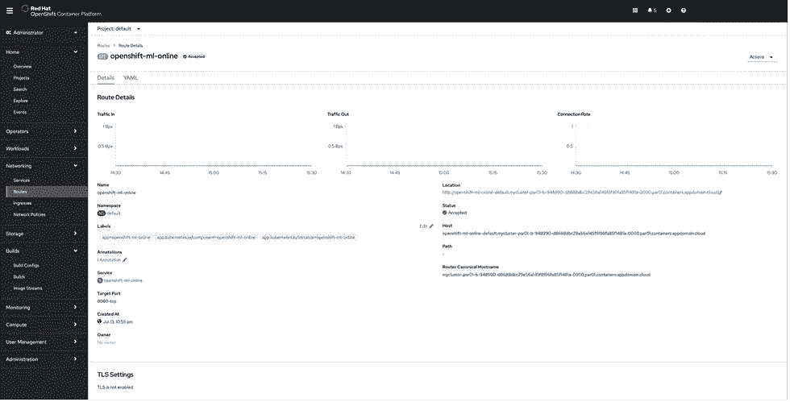

在透视图切换器中，如果我们选择 Developer 切换到 Developer 透视图并单击 Topology，我们可以看到下面的屏幕:

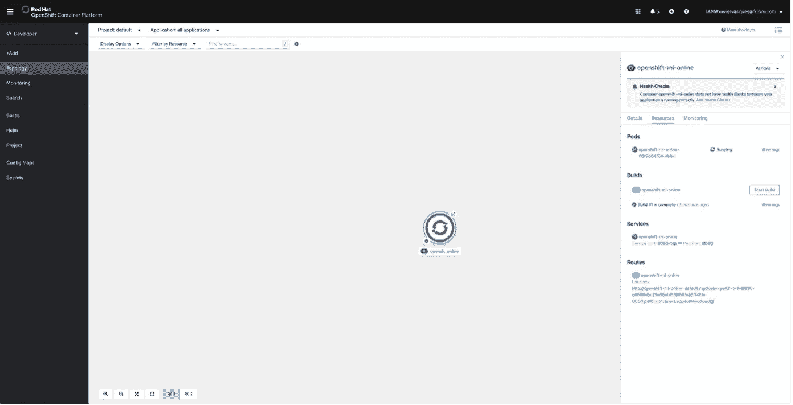

在屏幕的右下角，面板显示了可以访问应用程序的公共 URL。你可以在路线下看到它。如果我们单击链接，我们也可以从应用程序中获得预期的结果。

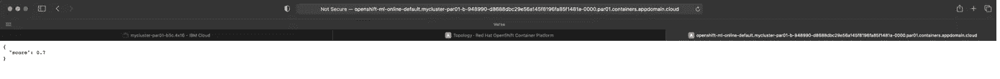

我们可以使用 web 控制台或 CLI 创建不安全和安全的路由。不安全路由最容易设置，也是默认配置。然而，如果我们想为保持私有的连接提供安全性，我们可以使用 *create route* 命令并提供证书和密钥。

如果我们想从 OpenShift 中删除应用程序，我们可以使用 *oc delete all* 命令:

```
oc delete all — selector app=myapp
```

在没有 Docker 文件的情况下，OpenShift Source to Image (S2I)工具包将创建一个 Docker 映像。源代码语言是自动检测的。我们可以遵循相同的步骤。OpenShift S2I 使用构建器映像及其源来创建部署到集群的新 Docker 映像。

# **结论**

使用 Docker、Python、Flask 和 OpenShift 封装和部署机器/深度学习应用变得很简单。当我们开始将工作负载迁移到 OpenShift 时，应用程序被封装到一个容器映像中，该映像将被部署到测试和生产环境中，从而减少了我们在现实生活中部署应用程序时会看到的遗漏依赖项和错误配置问题的数量。

真正的生活就是这样。MLOps 需要数据科学家、开发人员和 IT 运营人员之间的交叉协作，这在协调方面非常耗时。在 Kubernetes 混合云平台(如 OpenShift)上构建、测试和培训 ML/DL 模型，可以实现一致、可扩展的应用部署，并有助于根据需要在我们的生产环境中频繁部署/更新/重新部署。Red Hat OpenShift 中集成的 DevOps CI/CD 功能允许我们将模型自动集成到开发过程中。

**来源**

[https://developer . IBM . com/technologies/containers/tutorials/scalable-python-app-with-kubernetes/](https://developer.ibm.com/technologies/containers/tutorials/scalable-python-app-with-kubernetes/)

[https://cloud . Google . com/community/tutorials/kubernetes-ml-ops](https://cloud.google.com/community/tutorials/kubernetes-ml-ops)

[https://developer . IBM . com/tutorials/deploy-python-app-to-open shift-cluster-source-to-image/？MH src = IBM search _ a&mhq = deploy % 20 python % 20 app % 20 to % 20 open shift % 20 cluster % 20 source % 20 to % 20 image](https://developer.ibm.com/tutorials/deploy-python-app-to-openshift-cluster-source-to-image/?mhsrc=ibmsearch_a&mhq=deploy%20python%20app%20to%20openshift%20cluster%20source%20to%20image)

[https://docs . open shift . com/enterprise/3.1/dev _ guide/new _ app . html](https://docs.openshift.com/enterprise/3.1/dev_guide/new_app.html)

[https://github . com/jjasghar/cloud-native-python-example-app/blob/master/docker file](https://github.com/jjasghar/cloud-native-python-example-app/blob/master/Dockerfile)

[https://docs . open shift . com/container-platform/3.10/dev _ guide/routes . html](https://docs.openshift.com/container-platform/3.10/dev_guide/routes.html)

[https://docs . okd . io/3.11/minishift/open shift/exposure-services . html](https://docs.okd.io/3.11/minishift/openshift/exposing-services.html)

[https://docs . open shift . com/container-platform/3.10/architecture/networking/routes . html # secured-routes](https://docs.openshift.com/container-platform/3.10/architecture/networking/routes.html#secured-routes)

[https://docs . open shift . com/container-platform/4.7/installing/index . html # OCP-installation-overview](https://docs.openshift.com/container-platform/4.7/installing/index.html#ocp-installation-overview)

[https://www . open shift . com/blog/serving-machine-learning-models-on-open shift-part-1](https://www.openshift.com/blog/serving-machine-learning-models-on-openshift-part-1)

[https://developer . IBM . com/technologies/containers/tutorials/deploy-python-app-to-open shift-cluster-source-to-image/](https://developer.ibm.com/technologies/containers/tutorials/deploy-python-app-to-openshift-cluster-source-to-image/)

[https://sci kit-learn . org/stable/modules/generated/sk learn . datasets . load _ iris . html](https://scikit-learn.org/stable/modules/generated/sklearn.datasets.load_iris.html)