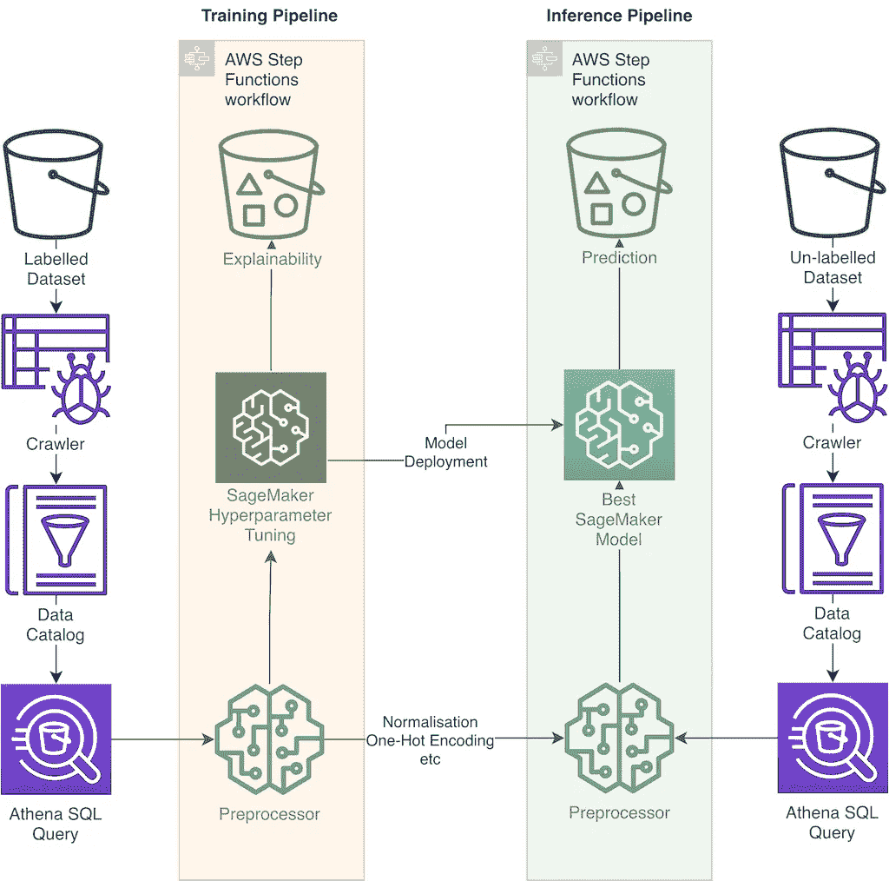
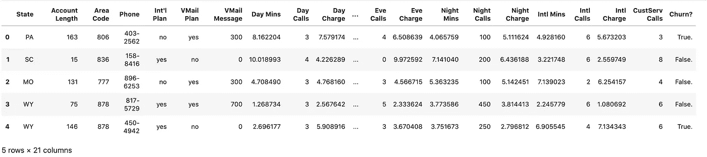
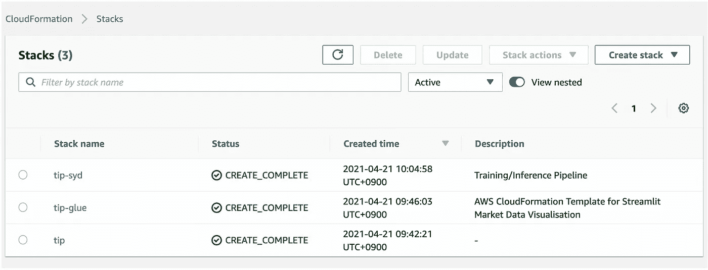
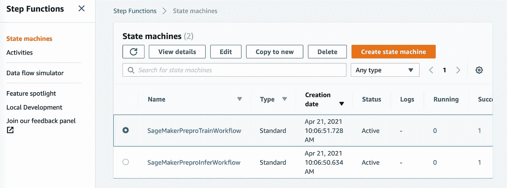
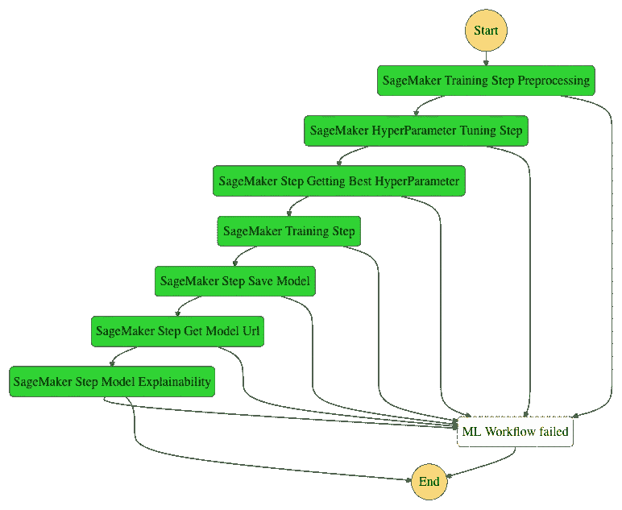
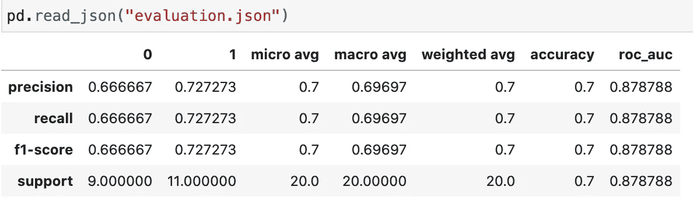
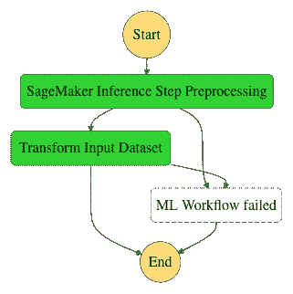
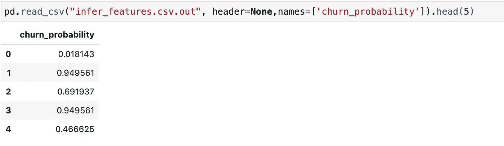
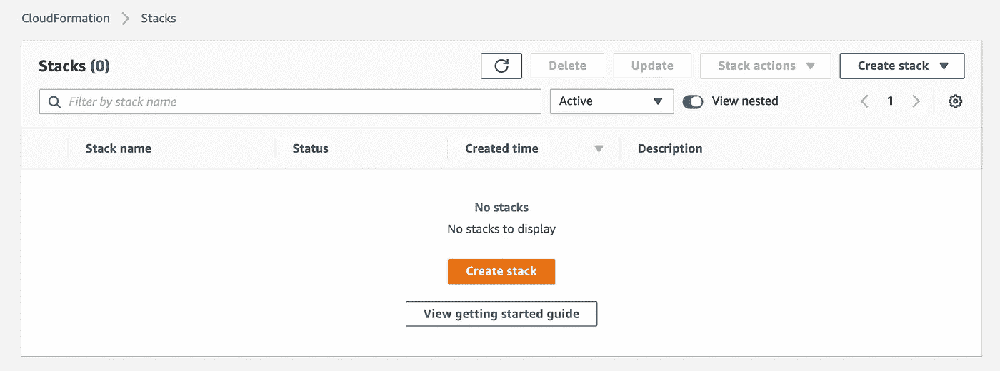

# 使用 AWS 部署可扩展的端到端客户流失预测解决方案

> 原文：<https://towardsdatascience.com/deploying-a-scalable-end-to-end-customer-churn-prediction-solution-with-aws-cbf3536be996?source=collection_archive---------17----------------------->

## *用于生产就绪的端到端客户流失预测管道的部署包*

由[百川孙](https://www.linkedin.com/in/sunbc0120/)、[查理斯弗伦泽尔](https://www.linkedin.com/in/cfrenzel/)、[宋寅](https://www.linkedin.com/in/yin-song-19b2702b/)和[伊登迪希](https://au.linkedin.com/in/eduthie)

失去客户要花钱。发现可能会离开的客户，然后阻止他们流失，这样可以省钱。如果你能留住客户更长时间，最大化他们一生的收入，这不是很好吗？如果这可以通过机器学习大规模实现，那不是更好吗？

猜猜看，现在你可以了！


*来源:金次郎*[*www.brandonlepine.art/*](http://www.brandonlepine.art/)*，承蒙* [*吉菲*](https://giphy.com/)

在这篇博文中，您将使用 AWS 服务部署一个端到端的客户流失预测解决方案。您将使用 [Amazon SageMaker](https://aws.amazon.com/sagemaker/) 和 [AWS 步骤函数](https://aws.amazon.com/step-functions/?step-functions.sort-by=item.additionalFields.postDateTime&step-functions.sort-order=desc)构建自动训练和推理管道，用于机器学习流失检测。除了识别最有可能流失的客户之外，随需应变的能力，作为 ETL 过程运行，支持预处理，并具有可解释性。AWS 上的[客户流失渠道是以基础设施为模板的代码，使其能够扩展和重新应用。该解决方案作为参考实施，使各种规模的组织更容易实施端到端的训练和推理管道。](https://github.com/awslabs/aws-customer-churn-pipeline)

该解决方案通过使用 [Amazon Lambda](https://aws.amazon.com/lambda/) 调用来触发管道运行，从而支持数据摄取、培训/再培训和推理。它利用亚马逊 [S3](https://aws.amazon.com/s3/) 与亚马逊 SageMaker 和 AWS Step 功能直接集成，由[亚马逊胶水](https://aws.amazon.com/glue/?nc2=type_a&whats-new-cards.sort-by=item.additionalFields.postDateTime&whats-new-cards.sort-order=desc)和[亚马逊雅典娜](https://aws.amazon.com/athena/?nc2=type_a&whats-new-cards.sort-by=item.additionalFields.postDateTime&whats-new-cards.sort-order=desc)支持。这使得能够自动运行、快速试验、快速部署，并轻松纳入 TB 级的扩展数据大小。

# 解决方案概述🏗️

以下架构图说明了该解决方案的工作流程:



作者图片

该工作流程包括以下步骤:

1.  一个用来存放数据、云形成模板和模型人工制品的 S3 桶
2.  Amazon Glue Crawler 扫描来自 S3 的数据，并将其加载到 Athena 数据库
3.  指向 S3 的训练和推理数据的 Amazon Athena 数据库
4.  一个训练管道步骤功能工作流(状态空间机器),由 Amazon Lambda 触发器组成，这些触发器运行 Amazon SageMaker 预处理和 Amazon SageMaker 训练作业
5.  推理管道步骤功能工作流(状态空间机器),由运行 Amazon SageMaker 预处理和 Amazon SageMaker 推理作业的 Amazon Lambda 触发器组成

在开始之前，您首先需要一个配置了凭证的 AWS 帐户设置，如本[文档](https://docs.aws.amazon.com/sdk-for-java/v1/developer-guide/setup-credentials.html)中所述。此外，确保已经安装了 [AWS 命令行界面](https://aws.amazon.com/cli/) AWS CLI。本教程假设您有一个具备必要的[身份访问管理 IAM 权限](https://docs.aws.amazon.com/IAM/latest/UserGuide/getting-started.html)的环境。

***请记住，运行本教程将在您的 AWS 帐户中产生费用！！！***

# 对数据的快速浏览📊

在本例中，您将使用一个虚构的电信公司的合成流失数据集，其结果`Churn?`被标记为`True`(流失)或`False`(未流失)。功能包括客户详细信息，如计划和使用信息。客户流失数据集是公开可用的，并在 Daniel T. Larose 的书[发现数据中的知识](https://www.amazon.com/dp/0470908742/)中提到。作者将其归功于加州大学欧文分校的机器学习数据集仓库。



作者图片

请记住，这个数据集可以用您自己的数据替换，只要代码库被更新以适应它。换句话说，如果你的目标是将它重新应用到你的数据中，这篇文章是你实现目标的第一步！继续读下去，你就会明白怎么做了。

# 启动解决方案🚀

首先将 [Github repo](https://github.com/awslabs/aws-customer-churn-pipeline) 克隆到本地文件夹中。

```
git clone [https://github.com/awslabs/aws-customer-churn-pipeline.git](https://github.com/awslabs/aws-customer-churn-pipeline.git)
```

在克隆的目录中应该有一个名为`standup.sh`的文件。接下来，我们将使用这个脚本来构建必要的基础设施，以运行训练和推理管道。该脚本只接受三个命令:您希望为堆栈及其相关资源指定的名称、堆栈的区域以及存放所有工件和数据的 AWS Bucket 名称。您可以像下面这样运行该命令:

`bash standup.sh {STACK_NAME} {S3_BUCKET_NAME} {REGION}`

`bash standup.sh churn-pipeline churn-pipeline-artifacts ap-southeast-2`

这将开始使用调用 AWS CLI 和部署 [Amazon CloudFormation](https://aws.amazon.com/cloudformation/) 模板在您的默认 AWS 帐户中建立必要的资源。

具体来说，该脚本将创建:

1.  Amazon Athena 数据库，包含基于堆栈名称的主要工作组名称
2.  一个 Amazon Glue 爬虫，以及爬虫的 IAM 角色，扫描数据并从指定的 S3 存储桶将其加载到数据库中
3.  将训练、推理和预处理 python 脚本上传到您的 S3 桶中
4.  将 AWS 步骤功能`pipeline.yaml`上传到您的 S3 桶中
5.  为训练和推理部署 AWS 步骤函数管道。这是基于上述 S3 的位置，并创造了多个亚马逊 Lambda 和亚马逊 SageMaker 工作。
6.  将堆栈名称和区域写入`delete_resources.sh`，以便稍后可以使用该脚本来拆除 AWS 基础设施

一旦直立完成，你的云形成控制台应该看起来如下，所有堆栈显示绿色。



作者图片

同样，如果您转到 Athena 控制台，您现在会看到用于训练和推理的表格。

注意，数据库的名称将基于您在`standup.sh`中分配的 S3 存储桶名称。

最后，如果您转到 Step Functions 菜单，您将看到两个状态机(或工作流)，一个用于训练，另一个用于推理。



作者图片

这两个管道都被设计为按需或按计划运行，能够自动部署打包的代码，因此在部署中几乎没有工作和风险。本节和下一节将解释每个管道是如何工作的，让您更接近完全自动化的机器学习流失管道。

# 自动化培训渠道🤖

培训管道使用亚马逊 Lambdas 和亚马逊 SageMaker，通过七个步骤向亚马逊 S3 输出经过全面培训、验证和优化的客户流失模型。



作者图片

让我们首先通过调用 Amazon Lambda 来启动培训管道:

```
aws lambda --region ${REGION} invoke --function-name invokeTrainingStepFunction --payload "{ '': ''}" out
```

您应该会得到 200 代码，表明 Lambda 触发了

```
{"StatusCode": 200,  "ExecutedVersion": "$LATEST"}
```

## 步骤 1: SageMaker 培训步骤预处理🎛️

现在，工作开始了！让我们回顾一下它正在采取的步骤。

Amazon SageMaker 的预处理作业是在使用 [SageMaker 的 Scikit Learn 容器直接从 Amazon Athena 表中查询的数据上运行的。](https://github.com/aws/sagemaker-scikit-learn-container)

使用`scripts/preporcessing.py`按以下顺序运行该步骤:

1.  使用 [awswrangler](https://github.com/awslabs/aws-data-wrangler) 从 Athena 表中读取数据
2.  通过随机拆分将数据分为训练数据集和验证数据集
3.  缺失值被估算，分类值被热编码
4.  然后，经过分割和预处理的数据集将作为 csv 文件写回 S3
5.  预处理器被保存以在推理管道中使用

预处理脚本和云形成模板`pipeline.yaml`的阶跃函数参数是可更新的。例如，容器的入口点参数在 CloudFormation 中设置为:

```
"ContainerArguments": [      
     "--database",      
     "${AthenaDatabaseName}",
     "--region",      
     "${AWS::Region}",      
     "--table",      
     "train",      
     "--train-test-split-ratio",      
     "0.2"]
```

数据库名`{AthendaDatabaseName}`作为栈名传入，并附上`-db`。从您传递给`standup.sh`的变量中设置区域。表名默认为训练数据名，在本例中为“train”。最后，训练和测试之间的随机分割在这里被设置为默认值，25%的数据用于测试。

对于这篇博文，您将保留`pipeline.yaml`的设置。请记住，可以根据您的数据更改所有这些配置。

## 步骤 2 : SageMaker 超参数调整步骤📈

超参数调整步骤为您的模型找到超参数的最佳组合。在本例中，您使用 [XGBoost](https://en.wikipedia.org/wiki/XGBoost) 将流失建模为二元结果(将流失/不会流失)。具体来说，您将尝试通过最大化曲线下的[区域，在重复的并行运行中找到最佳的正则化项、深度和树分裂组合(默认为总共 2 个)来实现最高的精度。在给定可用数据的情况下，这将产生最准确的模型。](https://en.wikipedia.org/wiki/Receiver_operating_characteristic)

值得注意的是，这里没有脚本。使用 [SageMaker 的 XGBoost 容器](https://github.com/aws/sagemaker-xgboost-container)，所有配置都作为 JSON 直接传递给`pipeline.yaml`中的 SageMaker。和以前一样，默认值是硬编码的。然而，像管道的所有部分一样，它们可以根据需要进行更新。要更深入地了解使用 Amazon SageMaker 进行超参数调整以及可能的输入类型，请参见[这里的](https://docs.aws.amazon.com/sagemaker/latest/dg/automatic-model-tuning.html)。

## 步骤 3: SageMaker 步骤获得最佳超参数⭐️

此步骤调用 Lambda 函数来记录最佳执行模型(和超参数配置)，然后将其传递到步骤函数工作流中的下一步。

## 步骤 4: SageMaker 培训步骤👾

现在确定了最佳模型，您将再次重新训练，以获得完全训练的模型和输出模型可解释性度量。

同样，这个步骤使用来自`pipeline.yaml`的 SageMaker 配置来运行 SageMaker 的 XGBoost 容器映像。这一次，培训从优化的超参数和 [SageMaker 调试器](https://sagemaker.readthedocs.io/en/stable/amazon_sagemaker_debugger.html)设置开始。使用调试器运行训练作业，除了完整训练的模型之外，还允许将可解释性度量输出到 S3。

可解释性度量显示了每个特性如何影响客户流失。结合像 [SHAP](https://github.com/slundberg/shap) 这样的技术，能够从整体上解释模型，更重要的是，能够了解如何在单个客户基础上确定分数。

## 步骤 5: SageMaker 步骤保存模型💾

这一步调用一个 Lambda 函数将训练好的模型作为 Amazon SageMaker 模型工件保存到 S3。

## 步骤 6: SageMaker 获取模型 Url🔦

这一步从 S3 检索模型 URI，用于下一步的模型评估。

## 步骤 7: SageMaker 步骤模型评估🧪

最后一步是对训练和测试数据进行全面评估，并向 S3 输出结果报告。模型评估步骤在这里作为一个模块，因为它允许为不同的客户流失用例定制指标、图表和挂钩。

首先，训练好的模型直接从其存储的 S3 URI 加载。然后，它生成测试数据的分类报告，并将结果作为`evaluation.json`输出回 S3。最后，输出 SHAP 值和要素重要性图，并保存回 S3。请注意，与**步骤 4 SageMaker 训练步骤中的 SageMaker 调试器步骤不同，**这些输出直接发送到您命名的 S3 桶，而不是其他地方的 SageMaker 默认桶。



作者图片

# 自动推理管道🤖

推理管道使用从训练管道生成的 Amazon SageMaker 人工制品对看不见的数据进行推理，然后分两步将其放回 S3。



作者图片

## SageMaker 推理步骤预处理🎛️

在这一步中，您将加载保存的预处理程序并转换数据，使其格式适合运行流失推断。

与培训管道相同，这是通过调用 Amazon Lambda 触发的。

```
lambda --region ${REGION} invoke --function-name invokeInferStepFunction --payload "{ '': ''}" out
```

和以前一样，200 代码表示作业启动成功，推理管道开始运行。

```
{"StatusCode": 200,    "ExecutedVersion": "$LATEST"}
```

在`pipeline.yaml` 中查看显示，推断数据被假定在表名`infer`下。

```
"ContainerArguments": [        
       "--database",        
       "${AthenaDatabaseName}",         
       "--region",         
       "${AWS::Region}",         
       "--table",          
       "infer"]
```

和以前一样，数据库名`{AthendaDatabaseName}`作为栈名传入，并附上`-db`。区域设置为传递到`standup.sh`的区域。同样，SageMaker 的配置几乎完全相同，容器映像仍然使用 SageMaker 的 Scikit Learn 的容器。

这里的例外是您将使用`scripts/inferpreprocessing.py`而不是`scripts/preprocessing.py` 。该脚本从**训练管道步骤 1** 加载保存的训练预处理器，用于新数据。然后，转换后的要素以前缀`data/intermediate`的形式输出回 S3，进入您指定的 S3 存储桶。

## 批量转换输入数据集(推理)⚡️

既然推理数据集的格式正确，您就可以获得流失预测。下一步利用 [Amazon SageMaker 的批处理转换](https://docs.aws.amazon.com/sagemaker/latest/dg/batch-transform.html)特性，以批处理作业的形式直接运行推理，然后将数据结果写到前缀`/data/inference_result`中的 S3。

您的最终结果应该包括每个客户的流失概率得分:



作者图片

## 清理🗑

要清理资源以防止进一步收费，请运行以下文件:

`bash delete_resources.sh`

这将拆除 Churn 管道的云形成堆栈。要确认所有东西都被删除了，去你的 CloudFormation 控制台。控制台现在应该没有所有相关的堆栈。



作者图片

请注意，由于该进程没有生成 S3 存储桶，因此运行管道得到的所有文件仍将在那里。如果您不想保留这些文件，您需要清空存储桶并单独删除它们。

# 结论🙏

在这篇博文中，你学习了如何在 AWS 上部署一个带有[客户流失渠道的端到端客户流失解决方案。你首先利用 S3、亚马逊 Athena、亚马逊 Glue、AWS Step Functions 和亚马逊 SageMaker 建立了数据处理和工作流的必要资源。然后，您为流失预测创建一个培训工作流，包括特征预处理、超参数调整、模型可解释性和评估。最后，您使用训练好的模型运行推理工作流，以根据看不见的数据生成批量流失预测。对于这两个工作流步骤，您都调用了 Amazon Lambda 来自动部署变更。现在，您已经掌握了足够的信息来获取客户流失渠道，并在您的用例中运行它！](https://github.com/awslabs/aws-customer-churn-pipeline)

这个博客非常适合开始使用自动化的客户流失预测解决方案。也就是说，还可以做更多的事情来支撑管道。例如，数据完整性检查，像 [PyDeequ](https://github.com/awslabs/python-deequ) 或[亚马逊 SageMaker 模型监视器](https://sagemaker.readthedocs.io/en/stable/amazon_sagemaker_model_monitoring.html)可以添加到管道中，以进一步提高模型完整性。通过改变容器图像和数据库部分，可以将工作负载换成其他形式的数据，如文本。此外，可以通过使用 [AWS 代码管道](https://aws.amazon.com/codepipeline/)或类似的服务来完全自动化，这些服务将构建所有的基础设施并运行由单个提交触发的两个工作流。