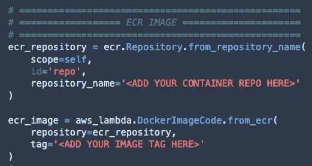

# 使用 Amazon SageMaker 管道部署无服务器推理服务

> 原文：<https://towardsdatascience.com/deploying-a-serverless-inference-service-with-amazon-sagemaker-pipelines-2d2f3cc96c39?source=collection_archive---------20----------------------->

## [实践教程](https://towardsdatascience.com/tagged/hands-on-tutorials)

## SageMaker 无服务器模型部署分步指南

将您的一些 ML 模型部署到[无服务器架构](https://aws.amazon.com/serverless/)中，允许您创建可伸缩的推理服务，消除操作开销，并更快地进入生产。我已经在这里[和这里](https://medium.com/swlh/deploying-a-multi-model-inference-service-using-aws-lambda-synchronous-express-workflows-and-3ef9c71d37f7)和[发布了例子，展示了如何在你的项目中采用这样的架构。](https://medium.com/swlh/deploying-a-serverless-r-inference-service-using-aws-lambda-amazon-api-gateway-and-the-aws-cdk-65db916ea02c)


照片由 [SpaceX](https://unsplash.com/@spacex?utm_source=unsplash&utm_medium=referral&utm_content=creditCopyText) 在 Unsplash 上拍摄

在本文中，我们将更进一步，使用[Amazon SageMaker Pipelines](https://aws.amazon.com/sagemaker/pipelines/)自动部署这种无服务器推理服务。

使用 SageMaker Pipelines，您可以加速端到端 ML 项目的交付。它将 ML 工作流编排、模型注册和 CI/CD 结合到一把伞中，因此您可以快速地将您的模型投入生产。

我们将基于 SageMaker 提供的 [MLOps 模板创建一个项目，用于模型构建、培训和部署](https://docs.aws.amazon.com/sagemaker/latest/dg/sagemaker-projects-walkthrough.html)。该项目在[鲍鱼数据集](https://archive.ics.uci.edu/ml/datasets/abalone)上训练一个示例 XGBoost 模型，并将其部署到 SageMaker 端点中。我们将保留项目的模型构建和培训部分，并更新模型部署，以便它可以是无服务器的。

# 演练概述

我们将分三步部署推理服务:

*   我们将首先在 SageMaker 中启动一个 MLOps 项目，并定义我们的推理服务。
*   然后，我们将更新 ModelDeploy repo 以反映我们的无服务器部署。
*   最后，我将展示如何使用 ModelDeploy 管道将推理服务部署到您的帐户中。

以下是该项目的架构概述:


我们将使用这个 [MLOps 模板](https://aws.amazon.com/blogs/machine-learning/building-automating-managing-and-scaling-ml-workflows-using-amazon-sagemaker-pipelines/)并将模型部署到一个无服务器堆栈中，而不是 SageMaker 端点中。

# 先决条件

要浏览此示例，请确保您具备以下条件:

1.  对于无服务器推理服务，我们将重用我以前的文章中展示的代码和概念。开始前，确保您熟悉[这个例子](https://medium.com/swlh/deploying-a-multi-model-inference-service-using-aws-lambda-synchronous-express-workflows-and-3ef9c71d37f7)和[这个例子](https://medium.com/swlh/deploying-a-serverless-r-inference-service-using-aws-lambda-amazon-api-gateway-and-the-aws-cdk-65db916ea02c)。
2.  访问[使用 Amazon SageMaker 管道构建、自动化、管理和扩展 ML 工作流](https://aws.amazon.com/blogs/machine-learning/building-automating-managing-and-scaling-ml-workflows-using-amazon-sagemaker-pipelines/)和[介绍 Amazon SageMaker 管道](https://www.youtube.com/watch?v=Hvz2GGU3Z8g)可能是一个好的开始，如果这个 SageMaker 特性对您来说听起来很新的话。
3.  访问亚马逊 SageMaker 工作室环境并熟悉工作室用户界面。
4.  [Docker](https://www.docker.com) 构建 Lambda 容器映像并将其推送到 ECR，如果您是在自己的环境中完成的话。 [SageMaker Studio 映像构建 CLI](https://aws.amazon.com/blogs/machine-learning/using-the-amazon-sagemaker-studio-image-build-cli-to-build-container-images-from-your-studio-notebooks/) ，如果您从 Studio 推送容器映像。
5.  这个 [GitHub 库](https://github.com/SofianHamiti/amazon-sagemaker-pipelines-serverless-inference)克隆到您的工作室环境中

# 步骤 1:在 SageMaker 中启动 MLOps 项目并定义推理服务

## 启动您的 MLOps 项目

首先，我们需要启动一个基于 MLOps 模板的 SageMaker 项目，用于模型构建、培训和部署。

你可以按照朱利安·西蒙的视频来做:

项目模板将为 *ModelBuild* 和 *ModelDeploy* 创建 2 个 CodeCommit repos，为 *CI* 和 *CD* 创建 2 个 CodePipeline 管道，为打包和测试工件创建 CodeBuild 项目，以及运行项目的其他资源。

ModelBuild 管道将自动触发 ML 工作流，并将 XGBoost 模型注册到模型注册中心。我们将保持项目的这一部分不变，并修改 ModelDeploy repo，以便我们可以将模型部署到无服务器服务中。


模型部署流程的视图

## 定义您的无服务器推理服务

Amazon API Gateway 将成为我们服务的门户，AWS Lambda 将处理推理。堆栈将由 CDK 定义。你可以在我以前的帖子[这里](https://medium.com/swlh/deploying-a-multi-model-inference-service-using-aws-lambda-synchronous-express-workflows-and-3ef9c71d37f7)和[这里](https://medium.com/swlh/deploying-a-serverless-r-inference-service-using-aws-lambda-amazon-api-gateway-and-the-aws-cdk-65db916ea02c)中找到类似的模式。


无服务器推理服务的一个视图

**为 Lambda 创建推理处理程序**

下面的 *predict.py* 文件包含 XGBoost 模型的推理处理程序:

当一个新的 XGBoost 模型被创建时，SageMaker 将二进制文件保存在 S3 的一个*model.tar.gz*文件中。我们将把这个 S3 位置作为环境变量传递给 Lambda 函数，这样该函数就可以下载并提取它到 */tmp* 文件夹中。我已经创建了 [utils.py](https://github.com/SofianHamiti/amazon-sagemaker-pipelines-serverless-inference/blob/main/container/docker/utils.py) 来处理这件事。

你可以在[容器文件夹](https://github.com/SofianHamiti/amazon-sagemaker-pipelines-serverless-inference/tree/main/container/docker)中找到 Lambda 函数的 Dockerfile。

**将 Lambda 图像推送到 ECR**

ModelDeploy 管道中的第一步运行名为 *ModelDeployBuildProject 的 CodeBuild 项目。*默认使用[非特权](https://docs.aws.amazon.com/codebuild/latest/userguide/troubleshooting.html#troubleshooting-cannot-connect-to-docker-daemon)模式下的[AWS/codebuild/amazonlinux 2-x86 _ 64-standard:3.0](https://docs.aws.amazon.com/codebuild/latest/userguide/build-env-ref-available.html)来封装我们的栈基础架构模板。

因此，CDK 将无法从 CodeBuild 本身构建容器映像并将其推送到 ECR。如果您从 Studio 中完成，您可以使用 [SageMaker Studio 映像构建 CLI](https://aws.amazon.com/blogs/machine-learning/using-the-amazon-sagemaker-studio-image-build-cli-to-build-container-images-from-your-studio-notebooks/) 将容器映像推送到 ECR。在我的例子中，我使用 [build_and_push.sh](https://github.com/SofianHamiti/amazon-sagemaker-pipelines-serverless-inference/blob/main/container/build_and_push.sh) 从我的笔记本电脑推送它:

```
sh build_and_push.sh lambda-inference
```

**注意:**要直接从 CodeBuild 构建容器映像，您可以让 CodeBuild 项目[在特权模式](https://docs.aws.amazon.com/codebuild/latest/userguide/troubleshooting.html#troubleshooting-cannot-connect-to-docker-daemon)下运行，或者甚至创建您的定制项目模板。但是超出了本文的范围。

**为推理服务创建一个 CDK 堆栈**

您可以在[堆栈文件夹](https://github.com/SofianHamiti/amazon-sagemaker-pipelines-serverless-inference/tree/main/stack)中找到推理服务的 CDK 堆栈，并将您的 ECR 映像位置添加到其中。



确保 stack.py 文件中有正确的容器图像位置

我们将在**步骤 2** 中更新 buildspec.yml 文件，以便 CodeBuild 可以从中生成 CloudFormation 模板。

# 步骤 2:更新 ModelDeploy 存储库以反映无服务器部署

在将 ModelDeploy 存储库克隆到您的环境中之后，您可以使用来自[这个存储库](https://github.com/SofianHamiti/amazon-sagemaker-pipelines-serverless-inference)的代码来更新代码。


您的回购在更新之前(左)和之后(右)应该是什么样子

你可以在下面找到 buildspec.yml 文件。它从 CDK 堆栈生成 CloudFormation 模板，并将其输出到 CodePipeline 进行部署:

[build.py](https://github.com/SofianHamiti/amazon-sagemaker-pipelines-serverless-inference/blob/main/build.py) 脚本使用 boto3 从您的模型注册表中获取最新批准的模型二进制文件，并将其放入登台和生产配置文件中。

我们还更新了 [test.py](https://github.com/SofianHamiti/amazon-sagemaker-pipelines-serverless-inference/blob/main/test/test.py) 以便在准备阶段对推理服务进行基本测试。它向 API 发送一个示例有效负载，并检查响应状态是否正常。

# 步骤 3:部署和使用您的推理服务

## 部署前

ModelDeploy 管道为堆栈中的资源提供了 IAM 角色 ARN 以供使用。您将需要更新此角色，以便它可以使用 API 网关、AWS Lambda 和从 ECR 提取图像。

该角色名为*AmazonSageMakerServiceCatalogProductsUseRole*，您可以像我下面所做的那样更新其权限:


我在这个例子中使用了托管策略。确保在您的环境中加强权限。

## 触发部署

现在我们已经做好了启动无服务器推理服务的一切准备。您可以将代码推送到 modeldeploy repo 的主分支。

您还可以进入您的模型注册中心，批准您的模型投入生产。


这将触发 ModelDeploy 管道。一旦测试成功，您就可以导航到 CodePipeline 控制台，并手动批准您的推理服务进入 prod。

## 使用您的服务

当您的服务成功部署到产品中时，您可以导航到 API 网关服务控制台并复制您的 API URL。


我们在这里使用 *$default* 阶段只是为了说明的目的。参见[发布 REST APIs 供客户调用](https://docs.aws.amazon.com/apigateway/latest/developerguide/rest-api-publish.html)以获得发布 API 的指导。

以下是您可以添加到请求正文的测试数据点:

你可以使用像 [Postman](https://www.postman.com) 这样的工具从你的电脑上测试推理 API:


# 结论

Amazon SageMaker Pipelines 将 ML 工作流编排、模型注册和 CI/CD 整合在一起，减少了运行端到端 MLOps 项目的工作量。在这篇文章中，我们用一个现成的模板创建了一个 SageMaker MLOps 项目，并使用它来部署一个无服务器推理服务。

更进一步，你还可以学习如何使用 Amazon SageMaker 优化无服务器推理服务的性价比。