# 通过 Azure 模板部署带有所有自定义配置的 Azure 服务

> 原文：<https://towardsdatascience.com/deploying-an-azure-service-with-all-of-the-custom-configurations-through-azure-templates-4ed711e5eba3?source=collection_archive---------32----------------------->

如何通过点击一个按钮或一行命令来部署一切

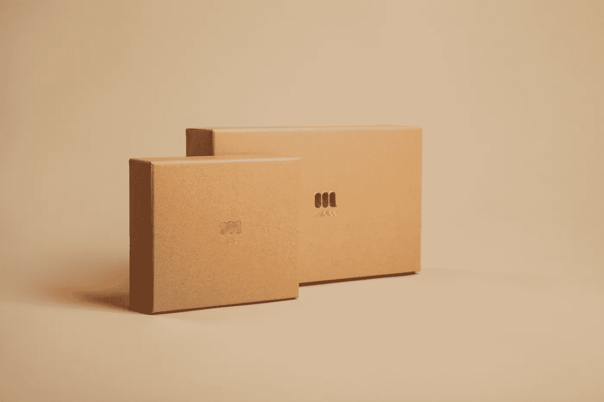

在 [Unsplash](https://unsplash.com/s/photos/box?utm_source=unsplash&utm_medium=referral&utm_content=creditCopyText) 上由[小米勒](https://unsplash.com/@mildlee?utm_source=unsplash&utm_medium=referral&utm_content=creditCopyText)拍摄的照片

# **动机:**

我们都面临过这种情况。当我们测试一个新的服务或者一个新的库时，我们需要制造一个全新的虚拟机来消耗我们每天宝贵的时间。有没有什么东西可以自动做到这一点？嗯，不用担心， **Azure Templates** 就是来解决这个问题的。在这篇博客中，我将写如何为你的资源创建模板，这样你就可以在将来通过点击来部署它们。

# **先决条件:**

1.  一个带有 **Azure 虚拟机**服务的 Azure 账号。
2.  Azure **SSH 密钥**服务
3.  (可选) **Azure CLI**

# **Azure 模板创建:**

有不同的方法来创建模板，但我们将通过简单和首选的方式。所以，让我们以最传统的方式，通过 Azure 门户创建一个 VM。但是在此之前，我们需要创建一个 SSH 密钥。搜索“SSH 密钥”服务，然后创建它。

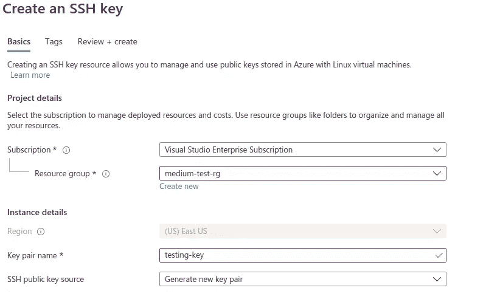

苏拉布什雷斯塔。通过 Azure 模板 1 部署带有所有自定义配置的 Azure 服务。2021.JPEG 文件。

现在搜索**虚拟机**，然后点击它。不要忘记选择您刚刚在虚拟机中创建的密钥。

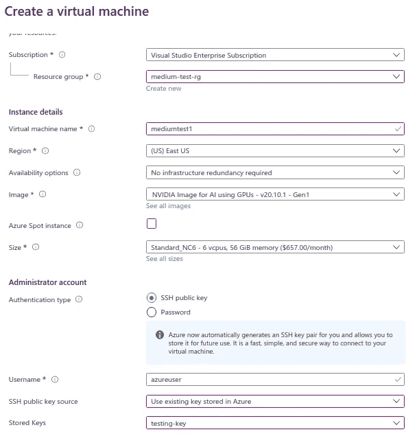

苏拉布什雷斯塔。通过 Azure 模板 2 部署带有所有自定义配置的 Azure 服务。2021.JPEG 文件。

让我们也为这个虚拟机添加自动关闭功能。

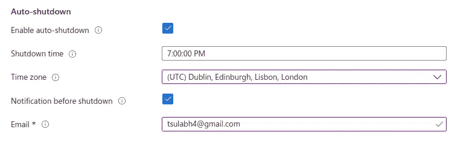

苏拉布什雷斯塔。通过 Azure 模板 3 部署带有所有自定义配置的 Azure 服务。2021.JPEG 文件。

现在，让我们为该虚拟机添加最重要的功能，即自定义数据。这是我们为机器添加脚本以便在启动时运行的地方。我已经添加了一些脚本来将 nvidia docker 镜像安装到机器中。

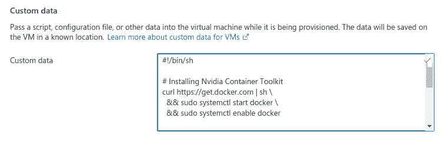

苏拉布什雷斯塔。通过 Azure Templates 4 部署带有所有自定义配置的 Azure 服务。2021.JPEG 文件。

让我们也添加一些标签。

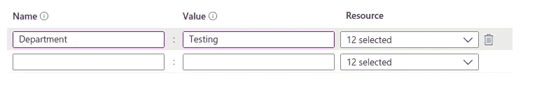

苏拉布什雷斯塔。通过 Azure Templates 5 部署带有所有自定义配置的 Azure 服务。2021.JPEG 文件。

这里，我们不点击“创建”,而是点击“创建”按钮旁边的“下载自动化模板”。

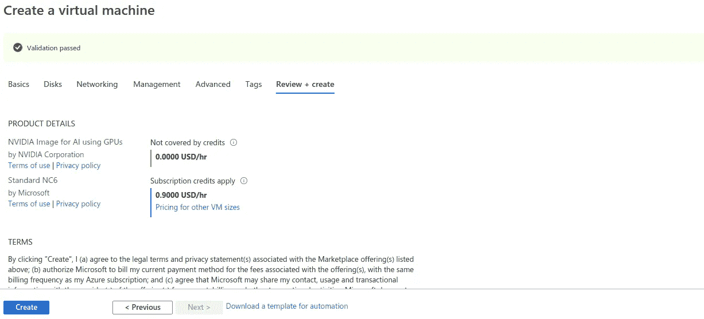

苏拉布什雷斯塔。通过 Azure Templates 6 部署带有所有自定义配置的 Azure 服务。2021.JPEG 文件。

它会提示你进入新的一页。单击“下载”下载您的模板。

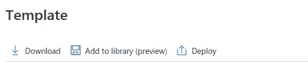

苏拉布什雷斯塔。通过 Azure Templates 7 部署带有所有自定义配置的 Azure 服务。2021.JPEG 文件。

您将获得一个名为“template.zip”的 zip 文件，然后在该 zip 文件中，您将获得两个名为“template.json”和“parameters.json”的文件。模板是您的模式，参数包含您选择的所有值。现在打开 paramters.json 并检查它。您会发现缺少一些东西，adminPublicKey 和自定义数据。这是故意的，因为微软不希望你的敏感信息包含在 JSON 中，这对微软来说是一件非常好的事情。现在，您必须手动将其添加到 JSON 中。

让我们从 adminPublicKey 开始。还记得我们制作的 SSH 密钥吗？现在，让我们再次访问该服务，您将在服务的前端提示中看到公钥，以“**ssh-RSA”**开始，以“**= generated-by-azure”**结束。复制所有内容，然后粘贴到 JSON 的“adminPublicKey”上。

现在是“customData”字段的时间了。这里我们不能像上面那样简单的复制粘贴，我们需要用 base64 严格编码。这里有一个 python 代码来编码它。

苏拉布什雷斯塔。通过 Azure 模板 8 部署带有所有自定义配置的 Azure 服务。2021.JPEG 文件。

运行此代码，您将获得一个编码字符串，将其粘贴到“customData”字段。保存 JSON。现在是有趣的部分。

# Azure 模板部署:

再次转到门户并搜索“部署自定义模板”。

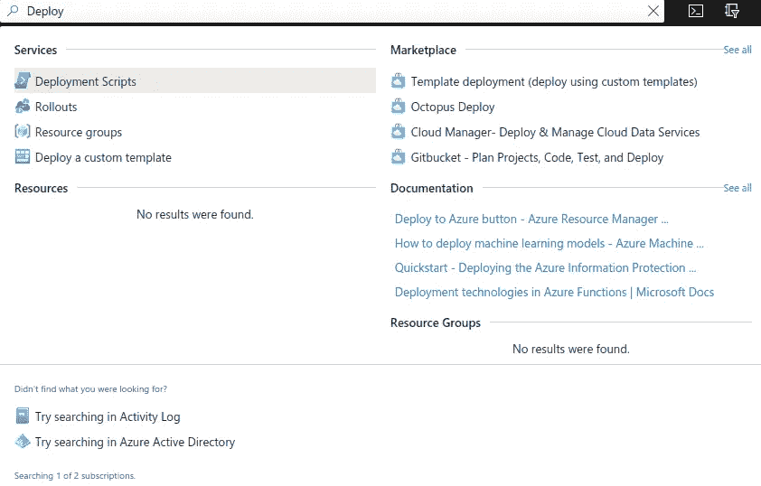

苏拉布什雷斯塔。通过 Azure Templates 9 部署带有所有自定义配置的 Azure 服务。2021.JPEG 文件。

点击后，您将被重定向到另一个页面。点击“在编辑器中构建您自己的模板”。


苏拉布什雷斯塔。通过 Azure Templates 10 部署带有所有自定义配置的 Azure 服务。2021.JPEG 文件。

点击“加载文件”并选择“template.json”。选择后，点击“保存”。

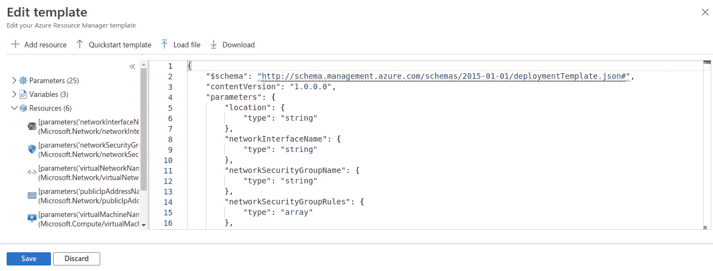

苏拉布什雷斯塔。通过 Azure Templates 11 部署带有所有自定义配置的 Azure 服务。2021.JPEG 文件。

我们的模式已经加载，现在是上传参数的时候了。点击“编辑参数”，然后上传“parameters.json”并点击“保存”。

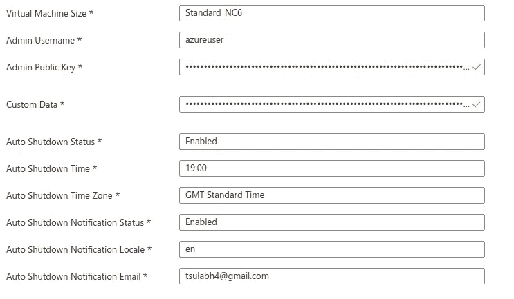

苏拉布什雷斯塔。通过 Azure 模板 12 部署带有所有自定义配置的 Azure 服务。2021.JPEG 文件。

如您所见，我们选择的所有参数都已选中，出于安全考虑，敏感参数放在密码字段中。点击“查看并创建”。

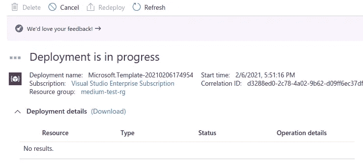

苏拉布什雷斯塔。通过 Azure 模板 13 部署带有所有自定义配置的 Azure 服务。2021.JPEG 文件。

正在部署您的虚拟机。等待一段时间。

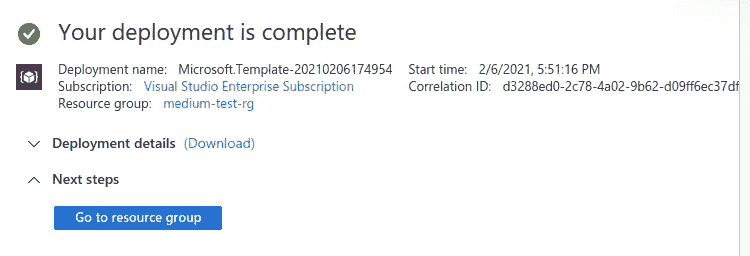

苏拉布什雷斯塔。通过 Azure 模板 14 部署带有所有自定义配置的 Azure 服务。2021.JPEG 文件。

部署完成。现在让我们看看虚拟机本身，并尝试通过 SSH 密钥进入虚拟机内部。

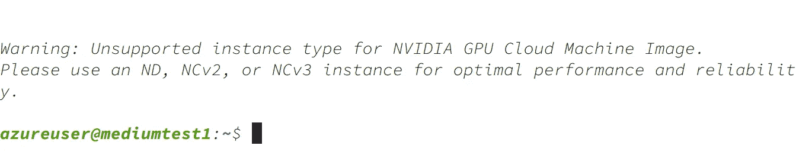

苏拉布什雷斯塔。通过 Azure Templates 15 部署带有所有自定义配置的 Azure 服务。2021.JPEG 文件。

成功了。现在让我们看看在创建虚拟机时初始化的关闭功能。

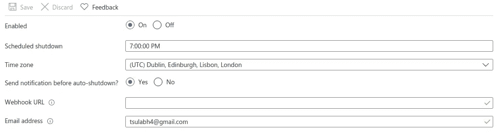

苏拉布什雷斯塔。通过 Azure 模板 16 部署带有所有自定义配置的 Azure 服务。2021.JPEG 文件。

现在是我们加载到虚拟机中的脚本。我的脚本是下载 Nvidia docker 映像，然后安装它，所以我应该在 monitoring 选项卡中看到峰值。让我们检查一下。

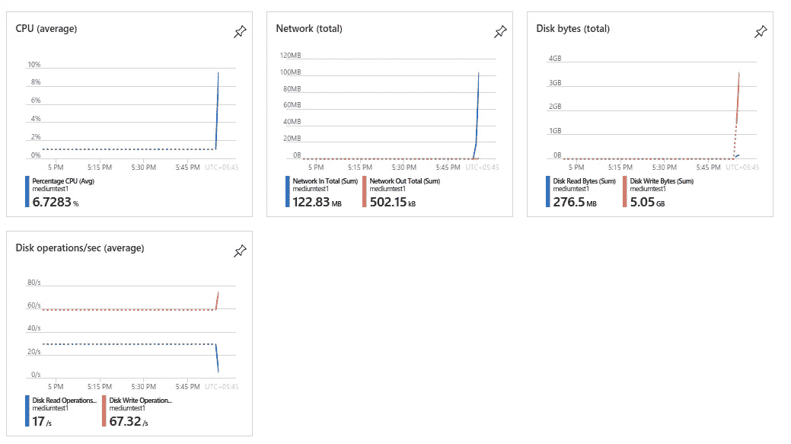

苏拉布什雷斯塔。通过 Azure Templates 17 部署带有所有自定义配置的 Azure 服务。2021.JPEG 文件。

如您所见，所有四个主要指标都出现峰值，这证明后端脚本正在虚拟机内部运行。一切正常。

# **结论:**

它像预期的那样工作。我们为虚拟机创建了一个灵活的模板，可以随时随地进行部署。我们还可以将这个模板存储在我们的 GitHub repo 中，以便与我们的 DevOps 操作集成。我使用 VM 作为例子，因为与其他服务相比，它具有独特的特性。我也选择在 Azure Portal 中这样做，因为这是一种简单直接的方式。创建模板后，我们也可以使用 Azure CLI 进行部署。

```
az deployment group create --resource-group medium-test-rg --name rollout01 --template-file template.json --parameters parameters.json
```

只需这一个命令，一切都将为您部署，但要做到这一点，您需要从主机上使用 Azure 帐户登录。


苏拉布什雷斯塔。通过 Azure 模板 18 部署带有所有自定义配置的 Azure 服务。2021.JPEG 文件。

成功了。我们还可以从 PowerShell、REST API、Github 和 CloudShell 进行部署。您应该根据自己的需求决定从哪里开始部署。然而，选择是无穷无尽的，你想做什么取决于你自己。如果你遇到任何问题或难以遵循这些步骤，请在下面评论这篇文章或在 tsulabh4@gmail.com 给我发消息。你也可以在 [Linkedin](https://www.linkedin.com/in/sulabhshrestha/) 和 [GitHub](https://github.com/codexponent) 上和我联系。

# **资源:**

[1] Azure 模板和 Azure CLI:[https://docs . Microsoft . com/en-us/Azure/Azure-resource-manager/Templates/deploy-CLI](https://docs.microsoft.com/en-us/azure/azure-resource-manager/templates/deploy-cli)

[2] ARM 模板文档:[https://docs . Microsoft . com/en-us/azure/azure-resource-manager/templates/](https://docs.microsoft.com/en-us/azure/azure-resource-manager/templates/)