# 通过几次点击部署端到端深度学习项目:第 2 部分

> 原文：<https://towardsdatascience.com/deploying-an-end-to-end-deep-learning-project-with-few-clicks-part-2-89009cff6f16?source=collection_archive---------21----------------------->

## 初学者的数据科学

## 从 Jupyter 笔记本到 Flask 应用程序采用模型，使用 Postman 和 Heroku 部署测试 API 端点

*注意:这是从零开始实现深度学习项目的两部分系列的第二部分。* [*第一部分*](https://medium.com/towards-data-science/end-to-end-deep-learning-project-part-1-930af1e1e191) *涵盖了问题陈述的设置、数据预处理、迁移学习背后的直觉、特征提取、微调、模型评估。第 2 部分介绍了 Flask 应用程序的实现及其在 Heroku 上的后续部署。为了保持连续性，请遵循教程。* [*上的代码 Github*](https://github.com/V-Sher/house-interior-prediction) *。*


你可以在这里玩烧瓶应用程序。

<https://github.com/V-Sher/house-interior-prediction>  

## 快速抬头

*我倾向于为部署脚本创建新的工作环境。*

*但是为什么呢？
对于云部署，我们需要使用* `*pip freeze*` *命令创建一个* `*requirements.txt*` *文件，所以最好只保留那些在活动环境中运行* `*app.py*` *脚本所需的包。正如你可能在* [*第 1 部分*](https://medium.com/towards-data-science/end-to-end-deep-learning-project-part-1-930af1e1e191) *中看到的，在模型训练期间，我们最终会进行大量的 pip 安装，而这些包中的许多可能并不需要进行部署，并且会不必要地增加你的应用程序大小。*

## 为什么是 Heroku，为什么不是 Docker？

简单的回答:这又快又简单，而且不需要写文档(这需要一些技巧)。

*注意:我打算在 Heroku 仪表板上点击几下就部署代码。话虽如此，没有理由不使用 Heroku CLI 直接从命令行管理他们的应用程序。*

## Flask 应用后端

现在我们已经有了一个名为`fine_tuned_house.h5`(来自[第 1 部分](https://medium.com/towards-data-science/end-to-end-deep-learning-project-part-1-930af1e1e191))的训练有素的模型，现在是时候创建一个快速部署的 Flask 应用程序了。我已经写了一篇关于[如何为初学者创建 Flask app 的详细文章](/deploying-h2o-models-as-apis-using-flask-42065a4fa567)。

在创建前端(即`index.html`)之前，最好使用 [Postman API](https://www.postman.com/) 创建并测试后端脚本(您可能希望[先创建一个账户](https://www.postman.com/postman-account/))。我总是在一个名为`api_test.py`的文件中保存一些样板代码以备测试。目前，它所实现的只是一个名为`intro()`的`GET`方法，该方法返回字典`{“Hello”: “World”}`。

```
***# api_test.py***from flask import Flask, jsonify, request# define this is a flask app
app = Flask(__name__)# some dummy results
res = {"Hello": "World"}@app.route('/', *methods*=["GET"])
*def* intro():
    return jsonify(*result*=res)if __name__=="__main__":
    app.run(*debug*=True)
```

要在 Postman 中测试`api_test`脚本，首先在 VSCode 中本地运行它，然后转到 Postman 桌面应用程序，提供本地主机 URL(通常是`127.0.0.1:5000`)，将方法设置为`GET`，并单击蓝色的 Send 按钮。您将看到它返回预期的结果。

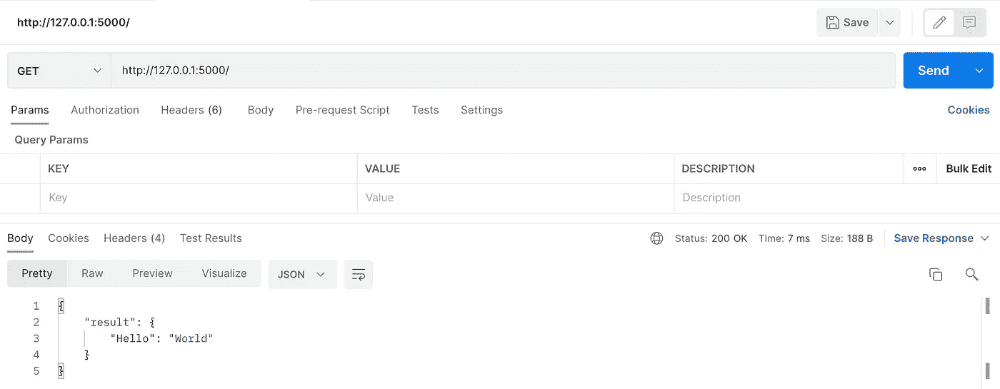

现在，是时候创建将返回模型预测结果的`POST`方法了。为此，让我们创建`predict()`方法:

```
*# api_test.py*from flask import Flask, jsonify, request# define this is a flask app
app = Flask(__name__)# some dummy results
res = {"Hello": "World"}@app.route('/', *methods*=["GET"])
*def* intro():
    return jsonify(*result*=res)**@app.route('/predict-interior', *methods*=['POST'])
*def* predict():
      .
      .
      .**if __name__=="__main__":
    app.run(*debug*=True)
```

`route`装饰器的第一个参数指定了 URL 端点，在这种情况下，URL 看起来类似于`127.0.0.1:5000/predict-interior`。

在这个函数中，我们首先将使用`request.files`读取一个图像文件`img` (我们将从前端接收该文件),现在，让我们只返回它的形状。

```
@app.route('/predict-interior', *methods*=['POST'])
*def* predict():
 **f = request.files['img']
    file = Image.open(f)
    file_shape = np.asarray(file).shape****return jsonify(*file_shape*=file_shape)**
```

在我们在 Postman 上测试`POST`方法之前，我们需要在 Postman 中进行一些设置:

*   将请求类型从获取更改为发布。
*   在 Headers 下，添加一个新的键值对:`Content-Type : application/json`。

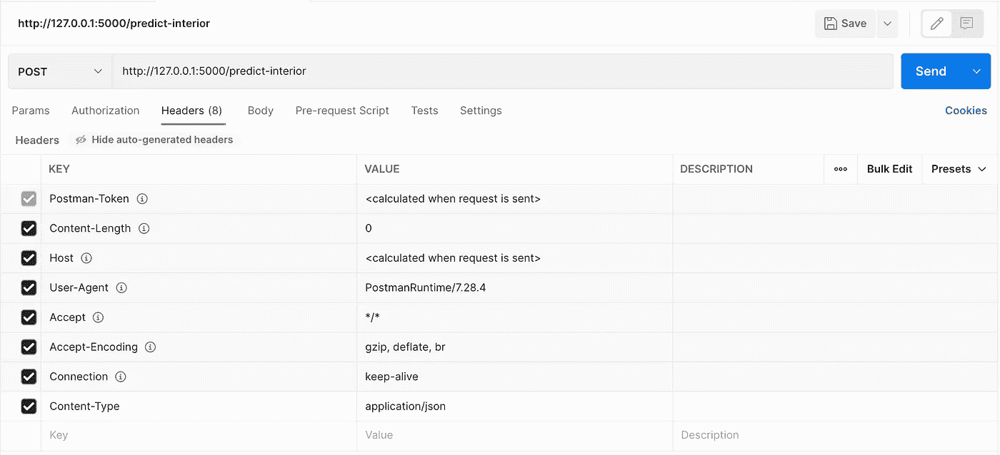

*   要上传图像，进入主体→表单-数据，将关键字设置为字符串`img`(记住该字符串应该与您使用`request.files`请求的文件名相同)。选择文件，点击蓝色的发送按钮。

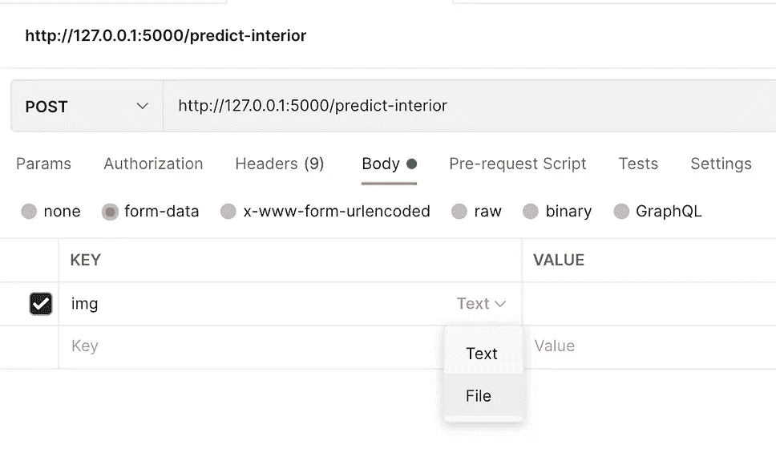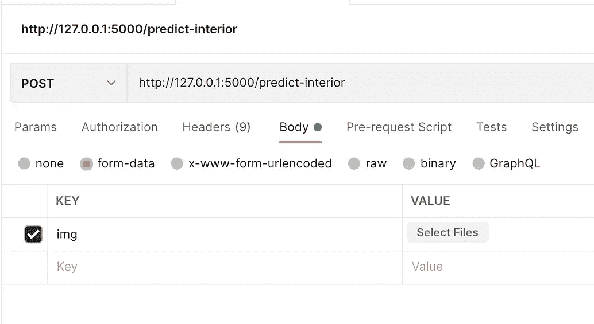

最终输出将是一个字典，其值与输入图像的形状完全匹配。

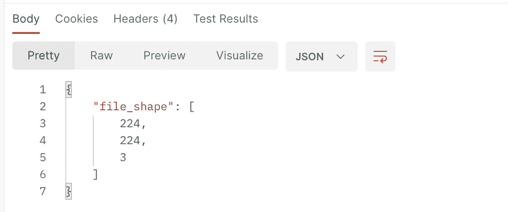

让我们更新`predict()`,现在包括预测功能:

```
**IMG_SHAPE = (224,224)
CLASSES = ["Modern", "Old"]**@app.route('/predict-interior', *methods*=['POST'])
*def* predict():
    f = request.files['img']
    file = Image.open(f)
    file_shape = np.asarray(file).shape*# predictions* **preds = model.predict(np.expand_dims(file, *axis*=0))[0]
    i = np.argmax(preds)
    label = CLASSES[i]
    prob = preds[i]

    predictions={"label": label, "prob": str(prob)}**return jsonify(***predictions*=predictions**)
```

以下是输出结果:

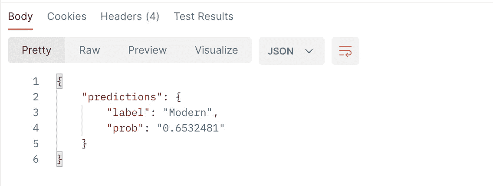

既然测试已经完成，让我们创建最终的`app.py`脚本。

**进口**

```
import base64
import numpy as np
from PIL import Image
from flask import Flask, render_template, request
from tensorflow.keras.models import load_model
```

**加载微调模型和变量**

```
IMG_SHAPE = (224,224)
CLASSES = ["Modern", "Old"]model = load_model('fine_tuned_house.h5')
```

**定义烧瓶应用**

```
*# define this is a flask app* app = Flask(__name__)
```

**指定获取方法**

```
# basic first page@app.route('/')
*def* sayhello():
      return render_template('index.html')
```

顾名思义，`[render_template()](https://flask.palletsprojects.com/en/2.0.x/api/#flask.render_template)`方法将呈现提供给它的`html`文件(我们将很快创建`index.html`)。

**指定发布方法**

```
@app.route('/predict-interior', *methods*=['POST'])
*def* predict():
    f = request.files['img']
    **fpath = getfpath(f)**
    file = Image.open(f)
    file_shape = np.asarray(file).shape***# resize image to (224,224) if needed*
    if file.size != IMG_SHAPE:
       file = file.resize(IMG_SHAPE)
       file_shape = np.asarray(file).shape***# predictions*    preds = model.predict(np.expand_dims(file, *axis*=0))[0]
    i = np.argmax(preds)
    label = CLASSES[i]
    prob = preds[i]

    pred_output={
      'img_size': file_shape,
      'label': label,
      'probability': np.round(prob*100,2)
      }return render_template('index.html',
                      *img_shape*=file_shape,
                      ***user_image*=fpath**,
                      *pred_output*=pred_output
                      )
```

我们做了一些小改动:

*   如果需要，检查并调整输入图像的大小(因为我们的模型是在`224x224`图像上训练的)。
*   渲染`index.html`，但这次我们传递了额外的参数，如`img_shape`、`user_image`和`pred_output`。我们将看到这些将如何在前端`index.html`中使用。
*   创建一个名为`getfpath()`的方法，将输入图像编码为 base 64，并在前端显示。
    *(另外，该方法的输出将被输入到* `*index.html*` *中的* `**` *)。)*

```
*def* getfpath(*img*) -> str:*# convert to bases64*
    data = *img*.read()              # get data from file (BytesIO)
    data = base64.b64encode(data)  # convert to base64 as bytes
    data = data.decode()           # convert bytes to string

    *# convert to  with embed image*
    fpath = "data:image/png;base64,{}".format(data)
    return fpath
```

*注意:确保在* `*Image.open*` *之前调用* `*getfpath()*` *。这是因为* `*Image.open(f)*` *的工作方式是，它会先做* `*f.seek(0)*` *即把指针设置回文件* `*f*` *的起始位置，然后是* `*f.read()*` *，然后返回一个非空字符串。切换顺序将导致调用* `*f.read()*` *两次，而没有将指针设置回文件的开头(和/或关闭它)，因此将产生一个非空但无意义的字符串(这将不会在* `*index.html*` *中呈现 apt 图像)。*

## 前端

这里有一个比较简单的前端`index.html`。

需要考虑的事情很少:

*   与`render_template()`一起传递的`img_shape`、`pred_output`和`user_image`现在用于打印图像形状(第 21-23 行)、模型预测(第 25-27 行)和显示调整到`350x350`分辨率的原始图像(第 29-31 行)。
*   在第 13 行，在`url_for`中指定的字符串应该与`app.py`中的 POST 方法名称相匹配。
*   在第 15 行，为`name`参数指定的值应该与在`app.py`的`request.files`中指定的文件名相匹配。

前端和后端都准备好了，本地运行应用程序，看看一切正常。一旦你满意了，就是 Heroku 部署的时候了。

## Heroku 部署

**第一步:创建 requirements.txt**

对于 Heroku 部署，您需要在使用`pip freeze > requirements.txt`冻结需求之前执行`pip install guincorn`。

*注意:只将应用程序运行所需的那些包放在 requirements.txt 中。因此，在单独的环境中运行您的笔记本电脑，以将内存块大小保持在 500MB 以下(这是 Heroku* *的* [*最大允许大小)。*](https://devcenter.heroku.com/articles/slug-compiler#slug-size)

**第二步:创建过程文件**

在项目根文件夹中创建一个名为 Procfile 的新文件，文件类型为:

```
web: gunicorn app:app
```

**第三步:上传项目目录到 Github repo**

*注意:如果我们在* [*第一部分*](https://medium.com/towards-data-science/end-to-end-deep-learning-project-part-1-930af1e1e191) *中使用一些更大的模型，比如 Resnet-50(而不是 EfficientNet)，我们将需要* [*使用 Git LFS 上传更大的文件*](https://git-lfs.github.com/) *到 Github。这样做将生成一个* `*.gitattributes*` *文件，将其作为回购的一部分上传是很重要的。*

**第四步:头转向** [**Heroku 仪表盘**](https://dashboard.heroku.com/apps)

首先，让我们[创建一个新的应用](https://dashboard.heroku.com/new-app)。接下来，转到 Deploy 选项卡，选择 **Github** 选项。您还需要提供回购名称。

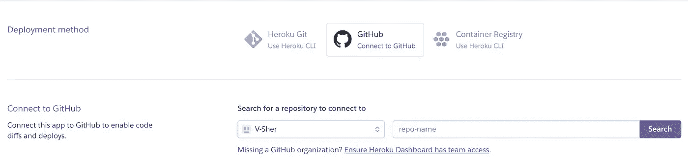

回购连接后，可以选择要部署的分支，点击**部署分支**。

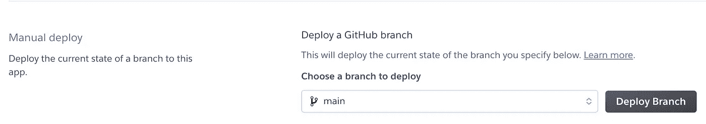

第一次构建应用程序会花费更长的时间，但后续的部署会涉及一些缓存，因此会更快。

完成后，任何人都可以在`https://*<app-name>*.herokuapp.com/`访问您的应用。例如，我的应用程序可以在[https://house-interior-prediction.herokuapp.com/](https://house-interior-prediction.herokuapp.com/)访问。

构建可能失败的原因有两个:

*   废料浆尺寸太大

有许多方法可以有效地管理 Heroku 部署的 slug 大小，但其中一种方法是在您的需求中用 **tensorflow-cpu** 替换 **tensorflow** 。【演职员表: [StackOverflow](https://stackoverflow.com/questions/61062303/deploy-python-app-to-heroku-slug-size-too-large) 】。这很有效，因为推理在 CPU 上运行良好，而 Heroku 不支持 GPU。

*   Git LFS 用于在回购中上传更大的模型。

> Heroku 没有对 Git LFS 的内置支持，因此构建并不简单。

解决方案是使用[构建包](https://devcenter.heroku.com/articles/buildpacks)(我使用[这个](https://elements.heroku.com/buildpacks/raxod502/heroku-buildpack-git-lfs)在其他项目中部署 Resnet-50 模型期间处理 Git LFS 资产)。

设置很简单:
-在 Heroku 仪表板的设置选项卡下，前往 Buildpacks 部分并点击**添加 buildpack** 。当提示输入构建包 URL 时，输入[https://github.com/raxod502/heroku-buildpack-git-lfs](https://github.com/raxod502/heroku-buildpack-git-lfs)。

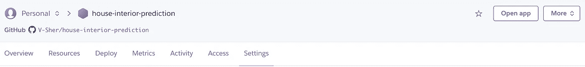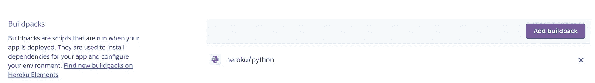

*-在相同的设置选项卡下，转到配置变量部分，输入 KEY 作为 HEROKU_BUILDPACK_GIT_LFS_REPO，输入 VALUE 作为要下载 Git LFS 资产的库的克隆 URL。例如，如果我的当前回购中有一个大型模型，我会将该值设置为 https://<personal _ access _ token>@ github . com/vsher/house-interior-prediction . git。*

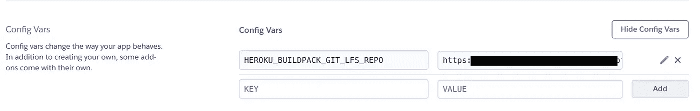

直到下次:)