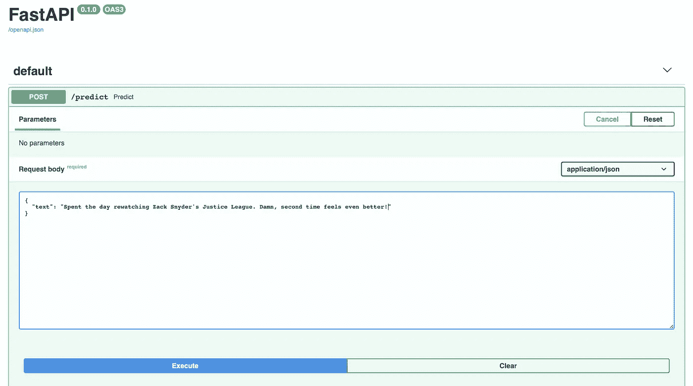
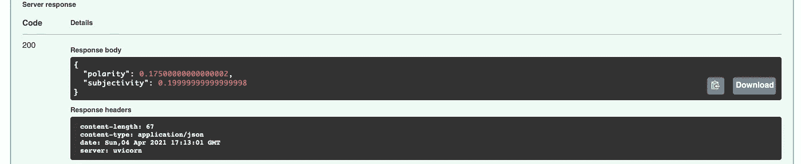

# 使用 FastAPI 部署 ML 模型——简明指南

> 原文：<https://towardsdatascience.com/deploying-an-ml-model-with-fastapi-a-succinct-guide-69eceda27b21?source=collection_archive---------10----------------------->

## 如何使用 NLP 模型作为 API——智能的、生产就绪的方式。


照片由[冉贝尔科维奇](https://unsplash.com/@berko?utm_source=medium&utm_medium=referral)在 [Unsplash](https://unsplash.com?utm_source=medium&utm_medium=referral)

FastAPI 是一种更新、更好的方法，可以将您的机器学习模型部署为 REST API，用于 web 应用程序。在他们的[官方文档](https://fastapi.tiangolo.com/)中，他们声称这是启动并运行生产的最快方法，自然，这激起了我的兴趣。

> 准备好探索这个新的库，我继续前进，用 **spacy** 做了一个简单的 NLP 模型，并试图围绕它构建一个 API。老实说，它相当简单，非常方便，有无数有用的函数，我在不到一个小时的时间里就准备好了 API——还有测试，也没有 Postman 或 CURL。

炒作够了吧？下面我描述一下*你*可以用你自己的 ML 模型做同样的事情的步骤。

👇我们走吧！

## 设置您的环境

设置虚拟环境的两个简单步骤:

1.  激活新的 **pipenv** env:

```
pipenv shell
```

2.在其中安装库:

```
pipenv install spacy spacytextblob pydantic fastapi uvicorn
```

## 构建模型

在尝试任何新的库时，我总是更专注于探索库提供的确切功能，而不是背景细节。

出于这个原因，我只用最少的设置用 spacy 构建了一个简单的情绪分析模型，以便快速获得一个模型来进行预测。

这是模型的完整代码，在一个名为 **model.py.** 的模块中定义

```
import spacy
from spacytextblob import SpacyTextBlob
from pydantic import BaseModelclass SentimentQueryModel(BaseModel):
    text : strclass SentimentModel:
    def get_sentiment(self, text):
        nlp = spacy.load('en_core_web_sm')
        spacy_text_blob = SpacyTextBlob()
        nlp.add_pipe(spacy_text_blob)doc = nlp(text)polarity = doc._.sentiment.polarity      
        subjectivity = doc._.sentiment.subjectivityreturn polarity, subjectivity
```

是的，真的是这个。如果你像我一样从 FastAPI 开始，我建议你先用这个简单的模型探索这个 API 及其特性，然后再去开发更复杂、更大的模型。

我简单解释一下代码:

*   我们首先导入项目所需的库
*   **SentimentQueryModel** 只是一个模型，包含我们对这个模型的唯一查询——我们将预测其情感的文本。 [Pydantic](https://pydantic-docs.helpmanual.io) 库有助于确保我们可以快速拥有一个包含模型所需数据的字段，这将是 ***文本*** 变量。FastAPI 文档还描述了许多使用这个库声明数据字段的方法。
*   **sensition model**是加载 spacy tokeniser 和 spacytextblob 库并对文本执行情感预测的类

**情感分析得分的两个主要组成部分是:**

**极性** —它是一个位于[-1，1]范围内的浮点数，其中 1 表示完全肯定的陈述，而-1 表示完全否定的陈述。

**主观性**—*主观*句一般指个人观点、情感或判断，而*客观*则指事实信息。**主观性**分量是一个位于[0，1]范围内的浮点数。

现在，我们已经从模型中返回了两个分数，让我们转到实际构建 API 的部分。

## 制作 API

首先，我们导入我们的库和模块:

```
import uvicornfrom fastapi 
import FastAPIfrom model 
import SentimentModel, SentimentQueryModel
```

然后，我们实例化 FastAPI 对象和预测类:

```
app = FastAPI()
model = SentimentModel()
```

最后，我们创建了一个新函数，通过一个 **POST** 请求来获取预测:

```
@app.post('/predict')
def predict(data: SentimentQueryModel):    
    data = data.dict()    
    polarity, subjectivity = model.get_sentiment(data['text'])
    return { 'polarity': polarity,        
             'subjectivity': subjectivity    
           }
```

确保我们可以从 POST 函数中访问作为 JSON 对象的文本字符串对象。

得到分数后，我们简单地将它们作为另一个 dictionary 对象返回。

现在我们完成了，我们继续运行应用程序，代码如下:

```
if __name__ == '__main__':    
    uvicorn.run(app, host='127.0.0.1', port=8000)
```

我们完事了。这是完整的代码，你的 API 已经可以测试了。

## 总结→测试您的 API

这是学习使用 FastAPI 最令人兴奋的部分之一。显然，通过它与 SwaggerUI 的集成，你可以直接测试 API，而不需要任何外部工具，如 **Postman** 或终端命令 **CURL** 。

导航到地址`http://127.0.0.1:8000/docs` 以查看您的 API 的运行情况。按下**试一试**按钮。

它应该是这样的:



继续在字段中输入您的文本。

最后，按下**执行**。



现在你知道了！这些预测，以及浏览器本身返回的响应代码。是不是很神奇？

请放心，我将来也会广泛地探索这个库！

整个代码也可以在这个要点[获得。](https://gist.github.com/yashprakash13/998e7322769ce3257b9f8dae786c0e36)

然而，如果您已经遵循了这一点，那么您应该已经有了可以开始构建自己的 API 的代码！

感谢阅读！:)

> 单独学习数据科学可能会很难。跟我来，让我们一起变得有趣。😁
> 
> 在 [Twitter](https://twitter.com/csandyash) 上与我联系。

这里是我所有数据科学故事的代码库。快乐学习！⭐️

另外，看看我的另一篇文章，你可能会感兴趣:

</making-your-first-kaggle-submission-36fa07739272> 