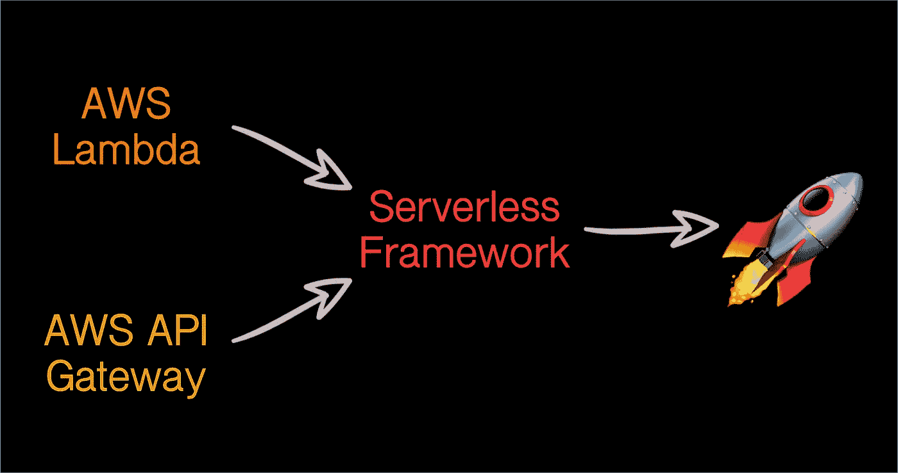
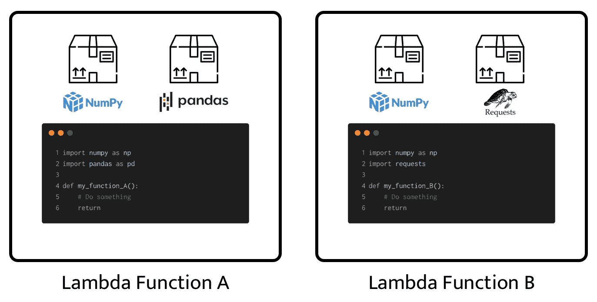
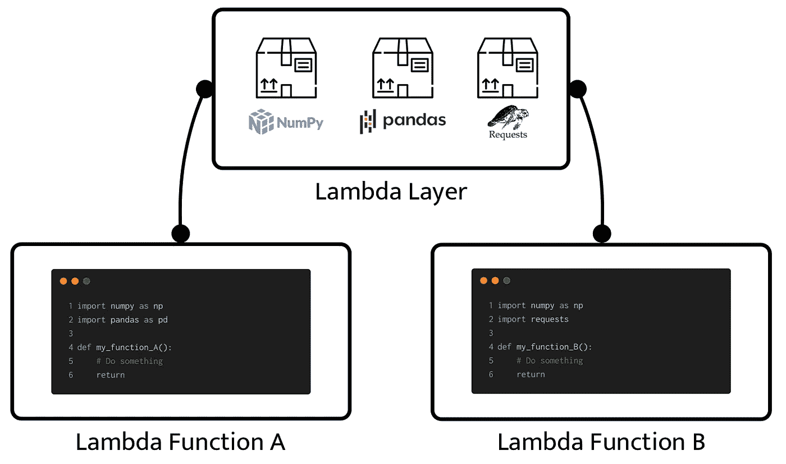
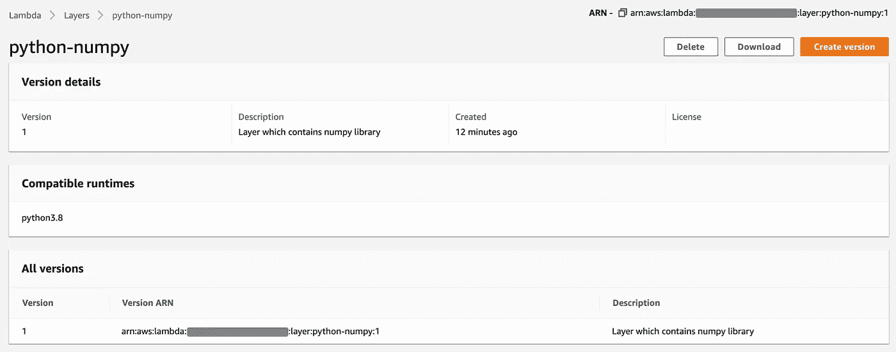
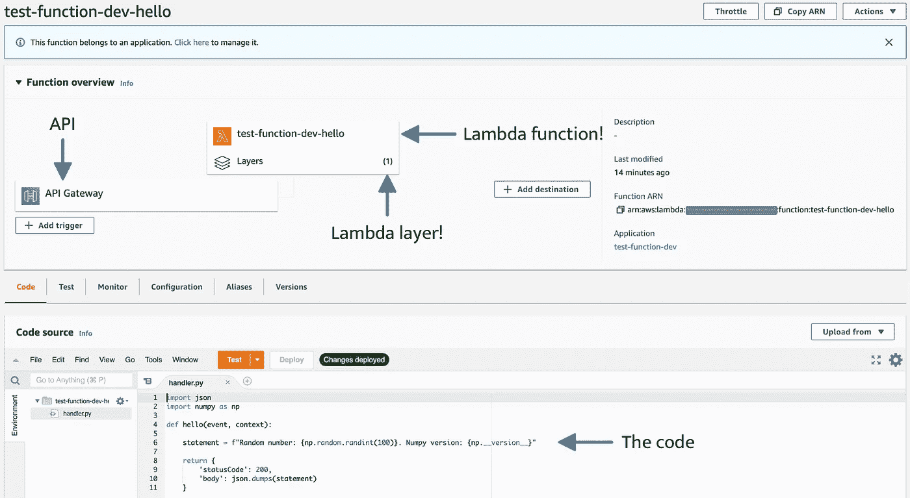

# 使用无服务器框架部署 AWS Lamba 功能和层

> 原文：<https://towardsdatascience.com/deploying-aws-lamba-function-layer-with-serverless-framework-f3f4fab1b7e9?source=collection_archive---------5----------------------->

## 关于在 AWS Lambda 层上安装依赖项并从通过无服务器框架开发和部署的 AWS Lambda 功能扩展它们的教程。



图一。AWS Lambda、API 网关、无服务器框架|作者图片

无服务器环境已经成为在云实例中部署应用程序的一种破坏性替代方案，无需配置、管理、操作和维护*传统服务器。*

在本教程中，我们将看到一个关于如何开发、配置、集成和部署 Lambda 函数[ [1](https://aws.amazon.com/lambda/) ]的示例，该函数通过无服务器框架[ [3](https://www.serverless.com/) ]扩展 Lambda 层[ [2](https://docs.aws.amazon.com/lambda/latest/dg/configuration-layers.html) ]的功能。

本博客将分为以下几个部分:

*   **AWS Lambda 功能&层**
*   **无服务器框架**
*   **我们要做什么**
*   **安装无服务器框架**
*   **部署 AWS Lambda 层**
*   **部署 AWS Lambda 功能**

如果您已经熟悉 AWS Lambda 和无服务器框架，可以跳过接下来的两节，直接看例子。

让我们喝杯咖啡，享受☕️吧！

# AWS Lambda 函数和层

AWS Lambda 是一种计算服务，允许您在不需要配置和管理服务器的情况下运行代码。要使用 AWS Lambda，您只需要打包您的代码以及您将需要的依赖项(作为一个`.zip`文件或一个`docker image`)并将它们组织在一个 Lambda 函数中。

在图 2 中，我们看到了 Lambda 函数中元素组织的典型描述。



图二。Lambda 函数|作者图片

如上图所示，每个 Lambda 函数都是一个独立的环境，也就是说，本质上它们不能直接与另一个 Lambda 函数共享或扩展功能。而这也是 Lambda Layer 出现的原因之一。

Lambda Layer 是一个 AWS Lambda 扩展，可以直接使用 Lambda 函数。Lambda 层的目标是包含应用程序、需求、依赖项，甚至可以从 Lambda 函数扩展的自定义运行时组件。

在图 3 中，我们看到了一个 Lambda 层与一对 Lambda 函数集成的描述。



图 3。Lambda 图层和功能|作者图片

正如我们从上图中看到的，Lambda 层的实现有利于通过 Lambda 函数共享和扩展的组件的组织。此外，Lambda 层的使用有助于减少 Lambda 函数的大小，因为不必多次打包依赖项(如图 2 所示)。

然而，在实践中，定义和配置一个或多个 Lambda 功能，以及与一个或多个 Lambda 层集成，可能是一个费力而乏味的过程，因为 AWS Lambda 通常与不同的服务集成，如亚马逊 API Gateway、亚马逊 S3、亚马逊 SQS、亚马逊 SNS 等等。这就是`Serverless Framework`占据中心舞台的地方。

# 无服务器框架

无服务器框架是一个工具，它简化了 AWS Lambda 的定义和配置，以及与其他 AWS 服务的集成。简而言之，无服务器框架简化了 AWS Lambda 的开发、集成和部署过程。

Serverless 是一个与云无关的框架，也就是说，它允许通过定义一个`YAML`文件和使用 CLI 来为不同的云提供商(如 AWS、Azure、Google Cloud、Knative 等)开发和部署服务。

一旦我们明确了 AWS Lambda Function & Layer 之间的关系以及无服务器框架在云服务开发和部署中的相关性，让我们直接进入教程。

别忘了倒满你的咖啡，☕️！

# 我们要做什么

我们将创建一个 Lambda 函数和一个 Lambda 层。Lambda 层将只包含 numpy 库。lambda 函数将从 Lambda 层扩展 numpy 库，并在其 main 方法中实现它。整个开发和部署过程将通过无服务器框架。

一旦定义了上下文，我们就开始吧！

# 安装无服务器框架

要安装无服务器，我们首先需要有`node.js`。要在 macOS 上安装`node.js`:

```
$ brew install node
```

用于在 Ubuntu 上安装`node.js`:

```
$ sudo apt install nodejs
$ sudo apt install npm
```

或者如果你愿意，可以直接去[官方节点站点](https://nodejs.org/)下载。一旦安装了`node.js`并且启用了`npm`管理器，我们就开始安装无服务器:

```
$ npm install -g serverless
```

如果您对通过`npm`管理器进行的安装有任何问题，您可以遵循官方的[无服务器安装指南](https://www.serverless.com/framework/docs/getting-started/)来安装独立的二进制文件。

由于我们将在本例中开发并部署到 AWS，您需要添加 AWS 帐户的凭证，如下所示:

```
$ serverless config credentials --provider aws \
                                --key <access_key> \
                                --secret <secret_key>
```

一旦安装了无服务器并配置了凭证，我们就可以开始有趣的部分了，让我们开始吧！

# 部署 AWS Lambda 层

首先，让我们用`serverless` CLI 为我们的 Lambda 层创建一个模板，我们称之为`lambda-layer`。

```
(venv) $ serverless create --template aws-python3 \
                           --name layer-numpy \
                           --path layer-numpy
```

上面的命令将生成一个名为`lambda-layer`的目录，其中包含`handler.py`和`serverless.yml`文件。

```
(venv) $ tree
.
└── layer-numpy
    ├── handler.py
    └── serverless.yml
```

本质上，`handler.py`文件包含了将在 AWS Lambda 上运行的代码。`serverless.yml`文件包含 Lambda 函数或层的定义，以及部署服务所需的所有配置。

神经衰弱，因为在这种情况下我们想要部署一个只包含一个库的 Lambda 层，所以`handler.py`文件是不必要的。相反，我们需要的文件是`requirements.txt`，它将包含 Lambda 层将托管的库。

因此，删除`handler.py`文件并添加`requirements.txt`文件，我们的目录如下所示:

```
(venv) $ tree
.
└── layer-numpy
    ├── requirements.txt
    └── serverless.yml
```

其中`requirements.txt`文件仅包含对`numpy`库的引用:

```
(venv) $ cat requirements.txt 
numpy==1.21.0
```

为了通过`serverless`部署`requirements.txt`文件的内容，我们将需要`serverless-python-requirements`插件，该插件允许`serverless`访问`requirements.txt`文件的内容并为部署做准备。

要安装`serverless-python-requirements`插件，我们键入:

```
(venv) $ sls plugin install -n serverless-python-requirements
```

安装插件时，通过添加已安装插件的定义来更新`serverless.yml`文件。我们的`serverless.yml`的默认内容如下面的代码片段所示。

代码片段 1。serverless.yml |默认版本

正如我们所看到的，在第 10 行中，我们有一个默认创建的 Lambda 函数的定义，但是对于 Lambda 层部署，我们不需要它。另一方面，在第 14 行中，我们引用了上一步中安装的插件。

我们的`serverless.yml`文件，在为我们的 Lambda 层的部署做了修改之后，如下所示:

代码片段 2。serverless.yml |准备部署

正如我们所看到的，从第 13 行开始我们的 Lambda 层的定义，它是类型`pythonRequirements`，其内容将是`dockerized`。我们的 Lambda 层被称为`python-numpy`，与`python 3.8`运行时兼容。

值得一提的是，因为我们启用了需求的`dockerization`，所以有必要将`docker`安装在我们的本地机器上，从这里我们将执行部署。

很好，一旦我们有了`requirements.txt`文件，定制了`serverless.yml`文件并安装了`plugin`，我们就可以开始部署了。对于部署，我们仅键入:

```
(venv) $ sls deploy
```

就是这样！我们的 Lambda 层应该可以从 AWS 控制台看到，如下图所示:



图二。AWS 控制台中的 Lambda 层“python-numpy”|作者图片

一旦我们的 Lambda 层被部署，就有必要识别相关的`ARN`，因为它需要引用我们的 Lambda 函数的定义。

太好了，我们已经部署了我们的 Lambda 层。现在让我们看看如何部署扩展 Lambda 层依赖关系的 Lambda 函数。

让我们去吧！

# 部署 AWS Lambda 函数

首先，我们将为我们的 Lambda 函数生成一个`aws-python3`模板，我们将其命名为`test-function`。

```
(venv) $ serverless create --template aws-python3 \
                           --name test-function \
                           --path test-function
```

上述命令将生成一个名为`test-function`的目录，其中包含两个文件`handler.py`和`serverless.yml`。`handler.py`文件将包含 AWS Lambda 将运行的代码。`serverless.yml`文件将包含部署的定义。

```
(venv) $ tree
.
└── test-function
    ├── handler.py
    └── serverless.yml
```

首先，让我们修改一下`handler.py`文件。因为我们假设我们将从上一节创建的 Lambda 层扩展`numpy`库，所以我们在这里要做的就是导入`numpy`并声明一些基本功能。最后，我们的`handler.py`文件应该是这样的:

代码片段 3。handler.py |从 Lambda 层扩展 numpy 库

现在我们将更新`serverless.yml`文件。基本上，我们将定义 3 个主要的东西:Lambda 函数、Lambda 层扩展和一个 API 网关方法(我们将用它来请求我们的 Lambda 函数)。最后，`serverless.yml`文件看起来像这样:

代码片段 4。从 Lamba 层扩展 numpy 的 Lambda 函数的定义

在第 12 行我们定义了函数的名称(`hello`)，在第 13 行我们定义了将从`handler.py`文件中执行的方法。在第 15 行我们定义了 Lambda 层的扩展(这是我们使用前一节中创建的 Lambda 层的`ARN`的地方)，最后在第 19 行我们定义了一个`GET`方法来请求我们的 Lambda 函数。

就这样，我们准备好部署了！

```
(venv) $ sls deploy
```

一旦我们的 Lambda 函数被部署，我们就可以在 AWS 控制台中看到它了。在下图中，我们看到了从控制台部署的 AWS Lambda 函数的特征。



图 3。AWS 控制台中的 Lambda 函数“测试函数”

正如我们所看到的，我们的 Lambda 函数有一个 Lambda 层，它有一个 API 网关作为触发器。

最后，为了测试我们的 Lambda 函数，我们使用如下的`serverless` CLI:

```
(venv) $ sls invoke -f hello 
{
    "statusCode": 200,
    "body": "\"Random number: 17\. Numpy version: 1.21.0\""
}
```

就是这样！我们的 AWS Lambda 函数从 Lambda 层扩展了`numpy`库，整个开发和部署过程都是通过无服务器框架完成的。

# 参考

[1] [AWS Lambda 功能](https://aws.amazon.com/lambda/)

[2][AWSλ层](https://docs.aws.amazon.com/lambda/latest/dg/configuration-layers.html)

[3] [无服务器框架](https://www.serverless.com/)