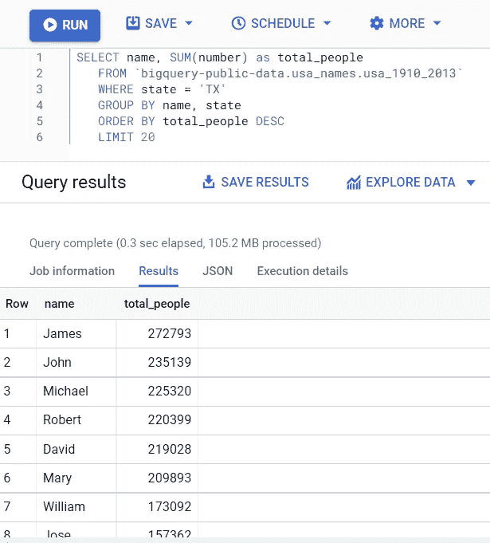
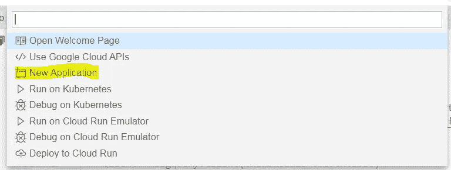
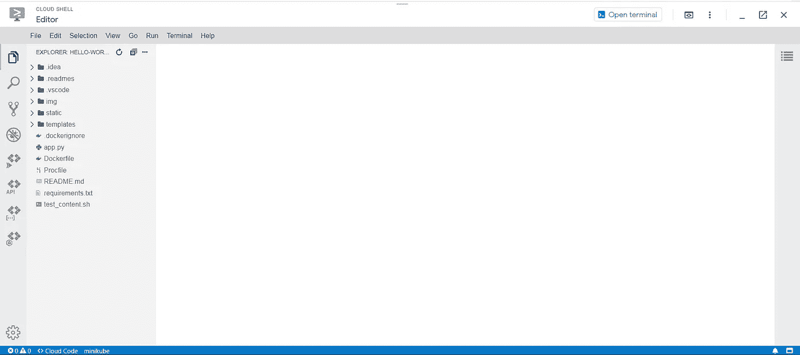
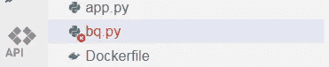
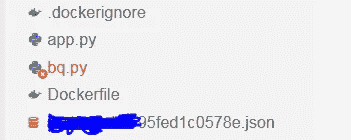
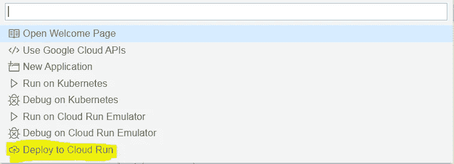
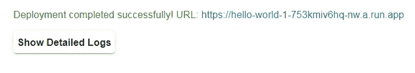
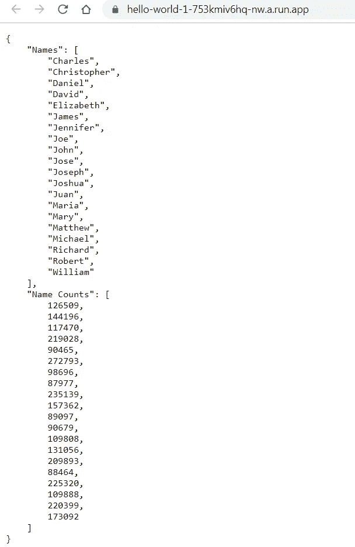

# 使用 Docker、GCP 云运行和 Flask-RESTful 部署容器

> 原文：<https://towardsdatascience.com/deploying-containers-with-docker-gcp-cloud-run-and-flask-restful-809e0ffa1f3?source=collection_archive---------9----------------------->

## 提供一个 API 来访问来自 Google BigQuery 的数据


[伊恩·泰勒](https://unsplash.com/@carrier_lost?utm_source=medium&utm_medium=referral)在 [Unsplash](https://unsplash.com?utm_source=medium&utm_medium=referral) 上拍照

如今，数据科学从业者发现他们越来越依赖云平台，无论是数据存储、云计算还是两者的混合。本文将展示如何利用 GCP 的 Cloud Run 来访问存储在 Google BigQuery 上的数据集，应用快速转换，并通过 Flask-RESTful API 将结果返回给用户。

# 简介— GCP 云运行、容器与虚拟机

[Cloud Run](https://cloud.google.com/run#section-1) 是一项服务，它允许你构建和部署可以通过 HTTP 请求访问的容器。云运行是可扩展的，并且抽象化了基础架构管理，因此您可以快速启动和运行。

*你问的容器是什么？考虑容器的一个简单方法是，它们类似于虚拟机(VM ),但是在规模和范围上要小得多。*

有了虚拟机，你通常会有一个虚拟版本的整个操作系统在运行(比如 Windows PC 通过类似 [VirtualBox](https://www.virtualbox.org/) 的东西运行 Linux 虚拟机)。)这种 Linux 虚拟机通常有一个图形用户界面、一个网络浏览器、文字处理软件、ide 和与之配套的一整套软件。

然而，有了容器，你可以拥有执行你想要的任务所需的最少数量的软件，使它们紧凑高效，易于创建、销毁和动态部署。例如，本文中的容器只安装了 Python 3.8，没有其他内容。

云运行非常适合部署无状态容器。为了更好地理解有状态容器和无状态容器，请看一下本文[。](https://www.contino.io/insights/stateless-vs-stateful-containers-whats-the-difference-and-why-does-it-matter)

# 入门指南

我们将在 BigQuery 上查看的公共数据集是 big query-public-data . USA _ names . USA _ 1910 _ 2013 数据集:



查询以获得名字的总数。

开始之前，您需要创建:

1.  一个关于 GCP 的项目，
2.  一个**服务账户**和一个**服务账户密钥**。

关于如何快速做到这一点的指南，请查看 [BigQuery API 文档](https://cloud.google.com/bigquery/docs/quickstarts/quickstart-client-libraries)。一旦创建了服务帐户，就可以创建并下载一个. json 服务帐户密钥，该密钥用于在尝试通过 BQ API 访问 BigQuery 数据时对您进行身份验证。

## 第一步:谷歌云外壳

进入[谷歌云外壳](https://console.cloud.google.com/home/dashboard?cloudshell=true)，点击‘打开编辑器’。您应该会看到类似这样的内容:


云壳编辑器——注意左下角的“云代码”。

接下来点击左下角的“云代码”:


这将弹出一个选项菜单。选择“新应用程序”:



然后从以下选项中选择'**云运行应用** ' → ' **Python (Flask):云运行**'。这为您提供了用于云运行的基于 Flask 的示例“Hello World”应用程序，我们将在该应用程序上构建以访问我们的 BigQuery 数据集。您现在应该有这样的东西:



Hello World 示例应用程序

接下来的步骤将是更改提供的 *app.py* 和 *Dockerfile，*以及添加一些我们自己的代码来访问 BigQuery。

## 步骤 2:用 Docker 构建容器

第一步是稍微编辑现有的 docker 文件，以指定如何创建我们的容器。将现有的 *Dockerfile* 代码替换为:

```
# Python image to use.FROM python:3.8 # Set the working directory to /appWORKDIR /app# copy the requirements file used for dependenciesCOPY requirements.txt .# Install any needed packages specified in requirements.txtRUN pip install --trusted-host pypi.python.org -r requirements.txt**RUN pip install flask-restful****RUN pip install --upgrade google-cloud-bigquery****RUN pip install --upgrade gcloud****RUN pip install pandas**# Copy the rest of the working directory contents into the container at /appCOPY . .# Run app.py when the container launchesENTRYPOINT ["python", "app.py"]
```

该 Dockerfile 文件将:

1.  从官方 Python 3.8 映像构建一个容器
2.  设置容器的工作目录
3.  在现有的 requirements.txt 文件中安装软件包
4.  **安装必要的额外软件包**(如果愿意，这些软件包可以添加到现有的 requirements.txt 文件中)
5.  将工作目录中的其他现有文件复制到容器的工作目录中(包括我们的服务帐户密钥)
6.  容器启动时运行 app.py

## 步骤 3:用 app.py 启动 Flask 应用程序

将现有 app.py 中的代码替换为:

```
import os
import requests
import bqfrom flask import Flask
from flask_restful import Resource, Apiapp = Flask(__name__)
api = Api(app)class QueryData(Resource):
    def get(self):
        return bq.run_()api.add_resource(QueryData, '/')if __name__ == '__main__':
    server_port = os.environ.get('PORT', '8080')
    app.run(debug=True, port=server_port, host='0.0.0.0')
```

Flask-RESTful 使用 **Resource** 对象来轻松定义 HTTP 方法(更多信息参见[文档](https://flask-restful.readthedocs.io/en/latest/quickstart.html#resourceful-routing))。上面我们定义了一个资源来获取 bq.py Python 脚本的结果，该脚本查询、排序并返回数据。(可以创建许多资源，并使用。add_resource()方法。)

## 步骤 4: BigQuery API Python 代码

以下是将访问 big query-data . USA _ names . USA _ 1910 _ 2013 数据集的代码文件:

**bq.py**

```
def run_():
    import os
    import pandas as pd from google.cloud import bigquery
    from google.oauth2 import service_account key_path = "./your_key.json" credentials =   service_account.Credentials.from_service_account_file(
    key_path, scopes=["[https://www.googleapis.com/auth/cloud-platform](https://www.googleapis.com/auth/cloud-platform)"],
    ) client = bigquery.Client(credentials=credentials) query = """
    SELECT name, SUM(number) as total_people
    FROM `bigquery-public-data.usa_names.usa_1910_2013`
    WHERE state = 'TX'
    GROUP BY name, state
    ORDER BY total_people DESC
    LIMIT 20
    """
    query_job = client.query(query)

    counts = []
    names = [] 
    for row in query_job:
        names.append(row["name"])
        counts.append(row["total_people"])

    # put names and name counts in a dataframe and sort       #alphabetically, to simulate operating on data with a model

    results = {'Names': names, 'Name Counts': counts}
    df = pd.DataFrame.from_dict(results) # convert to DataFrame
    df = df.sort_values(by=['Names']) # sort alphabetically
    df = df.to_dict(orient='list') # convert to dictionary format 

    return df
```

将此代码添加到与 app.py 和 Dockerfile 位于同一目录的新文件名 **bq.py** 中:



bq.py

***bq . py 分解:***

这一部分将允许我们验证和访问 BigQuery 来获取我们的数据:

```
from google.cloud import bigquery
from google.oauth2 import service_account**key_path = "./your_key.json"**credentials =   service_account.Credentials.from_service_account_file(
    key_path, scopes=["[https://www.googleapis.com/auth/cloud-platform](https://www.googleapis.com/auth/cloud-platform)"],
    )client = bigquery.Client(credentials=credentials)
```

注意 **key_path = "。/your_key.json "必须更改为您先前下载的 json 服务帐户密钥的名称。**要将下载的密钥从计算机的下载文件夹导入到云外壳编辑器，只需将文件拖放到浏览器窗口中:



云壳项目中的服务帐户密钥。

下一部分包含对我们所需数据的查询:

```
query = """
    SELECT name, SUM(number) as total_people
    FROM `bigquery-public-data.usa_names.usa_1910_2013`
    WHERE state = 'TX'
    GROUP BY name, state
    ORDER BY total_people DESC
    LIMIT 20
    """
query_job = client.query(query)
```

剩下的代码只是对两个数据列进行排序，根据“Name”列的字母顺序对列进行排序:

```
counts = []
names = [] 
for row in query_job:
    names.append(row["name"])
    counts.append(row["total_people"])

# put names and name counts in a dataframe and sort   #alphabetically, to simulate operating on data with a model

results = {'Names': names, 'Name Counts': counts}
df = pd.DataFrame.from_dict(results) # convert to DataFrame
df = df.sort_values(by=['Names']) # sort alphabetically
df = df.to_dict(orient='list') # convert to dictionary format 

return df
```

数据必须以 json 兼容的格式返回，以便用于 Flask-RESTful，这就是我们以字典格式返回数据的原因。

# 最后一步—使用云运行部署容器！

最后，我们可以将服务部署到 web 上。使用 Cloud Run 进行部署将生成一个链接，允许访问我们的数据转换结果。

再次选择云壳编辑器左下角的“云代码”。这次单击“部署到云运行”:



按照步骤创建一个服务，选择一个区域，允许未经身份验证的调用，以及一个构建环境(本地或云构建)。准备就绪后，单击部署！您可以单击“显示详细日志”来查看正在进行的构建和部署步骤。

容器构建完成后，单击提供的链接:



这个链接为我们的最终结果打开了一个新的选项卡——应用了排序的查询 BQ 数据！



这两个数据列已经按照“名称”列的字母顺序进行了排序！虽然这是一个简单的操作，但是存在更复杂的工作流的可能性。您可以应用经过训练的机器学习模型进行预测，并通过 API 返回结果，而不是对数据进行排序。给页面添加一个更好的设计也会有助于可读性。

顺便提一下，将服务帐户密钥存放在存储中并不被认为是最佳做法，还有其他可供 GCP 使用的身份验证方法。此外，关注 GCP 产品的计费，公共 BQ 数据集可以免费查询 1TB，但如果您不长期使用它们，则值得停用项目。

我希望这篇文章对你有用。如果你喜欢这个故事，请考虑在[媒体](https://mark-garvey.medium.com/)上关注我。你可以在 https://mark-garvey.com/的[上找到更多](https://mark-garvey.com/)

在 LinkedIn 上找到我:[https://www.linkedin.com/in/mark-garvey/](https://www.linkedin.com/in/mark-garvey/)