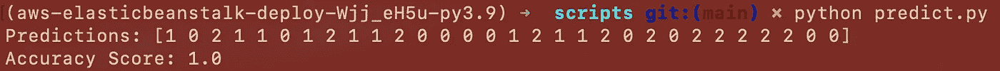
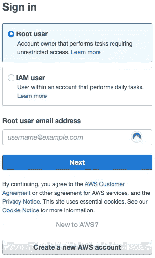
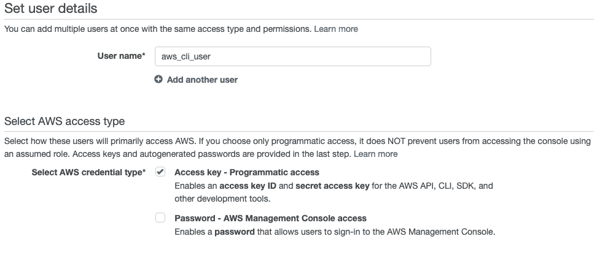
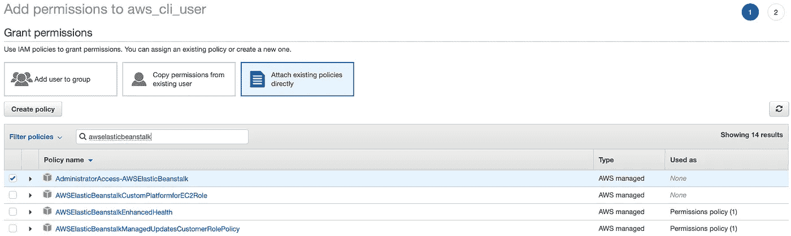
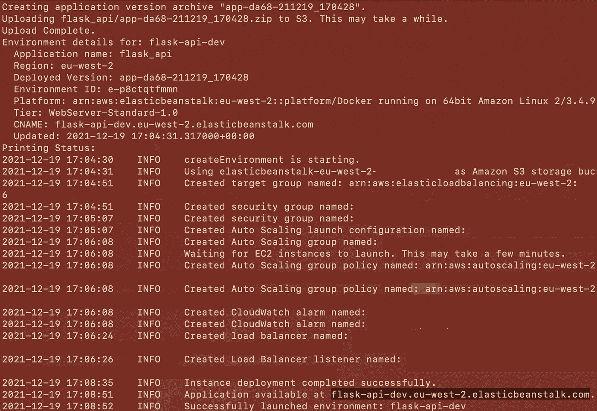
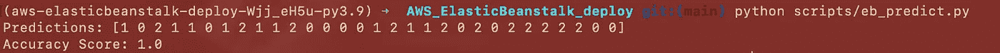
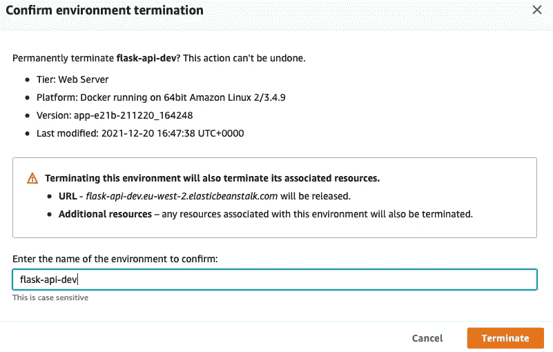

# 在 AWS 弹性豆茎上部署 Docker 集装箱 ML 模型

> 原文：<https://towardsdatascience.com/deploying-docker-containerised-ml-models-on-aws-elastic-beanstalk-67cbfbb2def4?source=collection_archive---------6----------------------->

## 在 AWS 上为您的模型提供服务的银碟指南


基拉·奥德·海德在 [Unsplash](https://unsplash.com?utm_source=medium&utm_medium=referral) 拍摄的照片

# 介绍

iPhone 照片库、亚马逊购物篮和网飞主页有什么共同点？

***以这样或那样的方式，这些应用程序中的每一个都与机器学习模型进行交互，以改善用户体验，并更好地服务于最终用户。***

毫无疑问，机器学习已经从根本上改变了我们今天与技术的互动方式，并将在未来几年继续如此。

我进入数据科学世界的旅程告诉我，训练一个 ML 模型实际上只是任何 ML 解决方案的一部分。大多数数据爱好者都有能力训练一个模型，但部署该模型以使其有用则是一个完全不同的挑战。

在本指南结束时，我将帮助你回答我无数次问自己的问题:

> 我如何部署我的机器学习模型？
> 
> 我如何为我的模特服务？

我将向您展示如何在 Docker 容器内在 AWS 上部署 ML 模型，从而帮助您迈出进入不断增长的机器学习工程领域的第一步。以下是我们将在 AWS Elastic Beanstalk 上部署模型的关键步骤。

1.  训练随机森林分类器。
2.  用 API 端点构建一个简单的 Flask 应用程序。
3.  使用 Docker 封装我们的应用程序。
4.  在 AWS elastic beanstalk 上部署容器化的应用程序。
5.  将我们的模型作为 API。

# 为什么是 AWS 弹性豆茎？

AWS Elastic Beanstalk 是您可以部署模型的许多方式之一，了解没有一种尺寸适合所有解决方案是很重要的。

尽管如此，在云中部署模型时，AWS Elastic Beanstalk 提供了几个优势。

首先，Elastic Beanstalk 通过消除与管理 web 服务底层基础设施相关的复杂性，使开发人员能够快速、轻松地在 web 中部署应用程序。在 Elastic Beanstalk 中，AWS 服务(如 EC2 实例、弹性负载平衡和系统健康监控)的配置和供应是自动化的。这让开发者可以专心开发。其次，Elastic Beanstalk 广泛支持许多语言，如 Java。NET、PHP、Node.js、Python、Ruby、Go 以及最重要的 Docker 容器。

和任何技术一样，总有缺点。需要记住的一点是，您的应用程序将全天候运行。根据项目要求，应用程序的 24/7 实施可能是一项优势，也可能是一项巨大的成本负担。与 AWS Lambdas 不同，在 Elastic Beanstalk 上没有“按需”实现应用程序的选项。此外，Elastic Beanstalk 上缺少日志文件会使失败的部署难以调试，因此，开发会更加困难。

还在吗？那我们开始吧。

# 内容

*   先决条件
*   模特培训
*   构建烧瓶 API
*   码头集装箱化
*   测试烧瓶应用程序
*   设置 AWS CLI 凭据
*   在 AWS 弹性豆茎上展开
*   将我们的模型作为 API
*   AWS 资源终止
*   结束语

# 先决条件

在继续前进之前，您需要满足一些关键的先决条件。我们将使用相当多的工具，所以请花一些时间安装先决条件。

1.  你需要一个 [AWS](https://aws.amazon.com/free/?trk=ps_a131L0000085DtTQAU&trkCampaign=acq_paid_search_brand&sc_channel=ps&sc_campaign=acquisition_UK&sc_publisher=google&sc_category=core&sc_country=UK&sc_geo=EMEA&sc_outcome=Acquisition&sc_detail=create%20aws%20account&sc_content=Account_e&sc_matchtype=e&sc_segment=433803620870&sc_medium=ACQ-P%7CPS-GO%7CBrand%7CDesktop%7CSU%7CAWS%7CCore%7CUK%7CEN%7CText&s_kwcid=AL!4422!3!433803620870!e!!g!!create%20aws%20account&ef_id=Cj0KCQiA5OuNBhCRARIsACgaiqUNTdHnQXzC6JwMM1j7ql2AsqnwnnibvUzn2xXgEfz-O02YoK-nzl4aAh4_EALw_wcB:G:s&s_kwcid=AL!4422!3!433803620870!e!!g!!create%20aws%20account&all-free-tier.sort-by=item.additionalFields.SortRank&all-free-tier.sort-order=asc&awsf.Free%20Tier%20Types=*all&awsf.Free%20Tier%20Categories=*all) 账户。您可以注册免费层，该层将在注册时自动应用。
2.  导航命令行的一些技术知识。
3.  [AWS 弹性豆茎 CLI](https://docs.aws.amazon.com/elasticbeanstalk/latest/dg/eb-cli3-install.html#eb-cli3-install.scripts)
4.  [码头工人](https://docs.docker.com/get-docker/)
5.  Python 3.9.7
6.  VS 代码或任何您喜欢的 Python IDE。
7.  诗歌——Python 包管理工具(阅读我的[上一篇关于诗歌入门的文章](https://python.plainenglish.io/poetic-simplification-of-python-virtual-environments-dc2ebf12b1a4))
8.  Python 库:scikit-learn、numpy、requests、pandas、flask、joblib 和 json。您可以使用 poem 安装我当前的 python 版本，或者将`requirements.txt`文件包含在 Git 存储库中。
9.  这个项目使用的所有代码都可以在 GitHub 链接[这里](https://github.com/lloydhamilton/AWS_ElasticBeanstalk_deploy)找到。

```
AWS_ElasticBeanstalk_deploy
├── Dockerfile
├── README.md
├── documentation.ipynb
├── models
│   └── rf_clf.joblib
├── poetry.lock
├── pyproject.toml
├── requirements.txt
└── scripts
    ├── eb_predict.py
    ├── flask_api.py
    ├── predict.py
    └── train_iris_rf.py
```

太好了！注册 AWS 并安装所有先决条件后，您可以继续本指南的设置部分。

# 构建一个简单的 Flask API

现在我们都设置好了，让我们开始编码。总的来说，下面是我们将在 AWS 上部署模型的步骤。

1.  训练随机森林分类器。
2.  用暴露的 API 端点构建一个简单的 Flask 应用程序。
3.  使用 Docker 容器封装我们的应用程序。
4.  在 AWS Elastic Beanstalk 上部署容器化的应用程序。
5.  将我们的模型作为 API。

**1。模特培训**

让我们用 Iris 数据集训练一个非常简单的 RandomForest 分类器，并用 Flask API 为它服务。

我们将使用 sklearn python 库来加载 Iris 数据集并训练我们的模型。

模型将用`joblib`序列化并保存在模型文件夹中，该文件夹可在 Flask 应用程序中调用。

## 2.构建一个 Flask API

接下来，让我们构建一个带有`/predict`端点的 Flask API 应用程序。

如下面的主代码块所示，`/predict`端点将执行`predict_endpoint()`函数，该函数调用随机森林模型并返回预测作为响应。更详细地说，`predict_endpoint()`函数将一个`json`对象解析成一个`numpy`数组，进行预测，并将响应作为`json`返回。

```
@app.route('/predict', methods=['POST'])
def predict_endpoint():    
   test_data = request.get_json()    
   test_data = np.array(test_data)    
   predictions = model.predict(test_data)    
   response = json.dumps(predictions.tolist())    
   return Response(response, 
                   status=200,    
                   mimetype="application/json")
```

在 Flask app 初始化之前，执行`if __name__ == ‘__main__':`块中的代码。因此，加载序列化模型的代码将从这里的`model = joblib.load('rf_clf.joblib')`开始。

```
if __name__ == '__main__':
   model = joblib.load('rf_clf.joblib')
   app.run(host='0.0.0.0', port=8080)
```

## 3.码头集装箱化

我们将使用 Docker 封装 Flask 应用程序。使用 Docker 有很多好处。一个是跨机器维护构建环境的一致性。

这种一致性允许您在本地机器上测试您的 containerised 化应用程序，并在 Docker 运行的任何系统上部署它，因为您知道它将完全像在本地测试时那样执行。

我还将在 Docker 中使用诗歌来锁定包的依赖关系，以确保相同的构建在机器间得到镜像。我不会对 Docker 中的命令进行过多的详细描述，但一般来说，这些都是`Dockerfile`中列出的步骤。

1.  从官方 Docker 映像库加载 Python:3.9。
2.  安装诗歌(1.1.11)。
3.  设置工作目录。
4.  安装`poetry.lock`和`pyproject.toml`中定义的必要依赖项。
5.  将必要的 Python 文件复制到 Docker 映像中。
6.  暴露端口 8080。
7.  设置 Docker 映像初始化时要执行的入口点或文件。

**注意:** *要在 Docker 中实现一个工作缓存层，应该在安装完诗歌之后，添加任何其他文件之前插入* `*COPY poetry.lock pyproject.toml /deploy/*` *。这确保了只有在两次构建之间发生更改时才重新安装依赖项。*

## 4.测试烧瓶应用程序

让我们构建应用程序的 docker 映像，并在部署之前在本地测试它。请注意此处链接的[当前项目的文件夹结构。`Dockerfile`需要位于构建过程的根文件夹中。](https://github.com/lloydhamilton/AWS_ElasticBeanstalk_deploy)

```
AWS_ElasticBeanstalk_deploy
├── Dockerfile
├── README.md
├── documentation.ipynb
├── models
│   └── rf_clf.joblib
├── poetry.lock
├── pyproject.toml
├── requirements.txt
└── scripts
    ├── eb_predict.py
    ├── flask_api.py
    ├── predict.py
    └── train_iris_rf.py
```

在“终端”中，导航到您的文件夹并使用描述性标签构建 docker 图像:

```
docker build -t flask-api:latest .
```

然后在分离模式`-d`下运行 docker 镜像，用`-p option`暴露端口`8080`。

```
docker run -d -p 8080:8080 flask_api:latest
```

Docker 容器现在将在`http://localhost:8080/predict`上运行，我们可以通过运行`predict.py`脚本在本地调用 API 来测试。



predict.py 脚本的执行调用 localhost:8080/predict API 端点

要查看正在运行的容器列表:

```
docker ps
```

要停止容器:

```
docker stop <NAME_OF_CONTAINER>
```

## 5.在 AWS ElasticBeanstalk 上部署

一旦应用程序经过 Docker 测试，在 AWS 上部署就相对简单了，我们知道它运行起来没有错误。

首先，我们必须在 AWS 上创建一个新用户，并在从我们的机器部署到 AWS 之前分配正确的权限。让我们一步一步来。

**a)** 登录 [AWS 控制台](https://aws.amazon.com/console/)。



AWS 登录控制台

**b)** 在你的控制台中，选择**所有服务**然后是**安全，身份&合规**然后是 **IAM。**

**c)** 在左侧选项卡上，选择**用户。**如果您没有看到左侧选项卡，请单击左上角 AWS 徽标正下方的三个后栏。

**d)** 选择**添加用户**并给用户一个用户名。确保选择**访问键—编程访问**复选框，然后点击**下一步**



**e)** 让我们给这个用户 AWS Elastic Beanstalk 资源的管理员权限。将策略`AdministratorAccess-AWSElasticBeanstalk`附加到权限列表。



**f)** 跳过**添加标签**部分，在查看部分创建用户


**g)** 创建成功后，将**访问密钥 ID** 和**秘密访问密钥**复制到记事本上或下载`.csv`进行安全保存。我们需要这些键来完成 AWS Elastic Beanstalk CLI 的设置。

在终端中，导航到项目目录，并使用以下命令初始化 Elastic Beanstalk CLI:

```
eb init
```

根据提示输入您的**访问密钥 id** 和**秘密访问密钥**。这些是我在具体项目中使用的设置。根据您的位置和延迟，地区会有所不同。

*   默认区域:16
*   选择要使用的应用程序:3[创建新应用程序]
*   应用名称:flask-api
*   码头工人:Y
*   选择平台分支:1 (Docker 运行在 64 位 Amazon Linux 2 上)
*   代码提交:n
*   宋承宪:n

**注意** *:您会注意到 AWS Elastic Beanstalk CLI 已经创建了一个* `*.elasticbeanstalk*` *文件夹，其中包含一个详细描述部署配置的* `*config.yml*` *。*

初始化后，使用以下命令在 AWS Elastic Beanstalk 上创建一个应用程序:

```
eb create
```

按照屏幕上出现的提示操作。对于这个项目，所有选项的默认值就足够了。

Elastic Beanstalk 将自动处理帮助您部署项目所需的所有基础设施部署，因此您可以专注于开发代码库。它将自动创建所有必要的资源，例如启动 EC2 实例、设置负载平衡器、自动扩展组和路由以服务于您的应用程序。



成功部署后，Elastic Beanstalk 将返回一个应用程序可用的地址。在本例中，该应用程序可在`http://flask-api-dev.eu-west-2.elasticbeanstalk.com`获得。

## 6.将我们的模型作为 API

现在我们的应用程序部署在云中，我们可以像以前在本地测试应用程序时一样访问它。这次唯一的主要区别是我们将访问 API 的地址。

由于该应用程序是在 Docker 容器中测试的，我们可以预期我们之前的代码会在一些小的调整后工作。用您的应用程序的网址替换网址`[http://localhost:8080/predict](http://localhost:8080/predict)`。在这种情况下，我将用`[http://flask-api-dev.eu-west-2.elasticbeanstalk.com](http://flask-api-dev.eu-west-2.elasticbeanstalk.com)`代替它。



EB _ preview . py 脚本的执行调用预测 API 端点

如果一切正常，你应该会得到一个回复，上面有一个预测列表和一个准确率分数。

恭喜🎉🎉🎉您已经成功地在云中部署了一个机器学习模型，您可以使用 API 在任何机器上访问该模型。

# AWS 资源终止

在项目结束时终止资源是很重要的。查看所有当前运行资源的最简单方法之一是登录您的 AWS 控制台。

在**服务**下选择**弹力豆茎**然后选择**环境**。您可以在这里找到目前部署在 AWS 弹性 Benstalk 上的所有活动环境。


要终止，请**选择您的环境**，并在**操作**选项卡**下选择** **终止环境**。您需要通过键入环境名称进行确认。



删除应用程序的过程与您希望删除应用程序的过程相似。

# 结束语

您如何部署您的应用程序将对开发构建周期和与维护它相关的成本有许多影响。为了最好地服务于您的模型，理解您的项目和最终用户的需求总是很重要的。AWS 弹性豆茎是众多为模型提供服务的方式之一，理解没有一种适合所有尺寸的解决方案很重要。

> 它是关于为正确的工作使用正确的工具。

我们在本指南中完成了一些工作。我们首先用 Iris 数据训练了一个 RandomForest 分类器，我们把它打包在一个 flashboard 应用程序中作为一个 API。接下来，我们将 flashboard 应用程序包含在 Docker 容器中，并在部署前对其进行本地测试。最后，我们在 AWS 弹性豆茎上部署了容器化的应用程序，作为一个可以通过 URL 访问的 API。

需要注意的是，这里所采取的在弹性豆茎上部署的步骤适用于任何 Docker 容器 web 应用程序。

如果你已经读完了这篇指南，我希望你已经学到了一些新的东西。更多数据科学相关内容，请务必在 Medium 和 Twitter ( [@iLloydHamilton](https://twitter.com/iLloydHamilton) )上关注我。

注意这个空间。