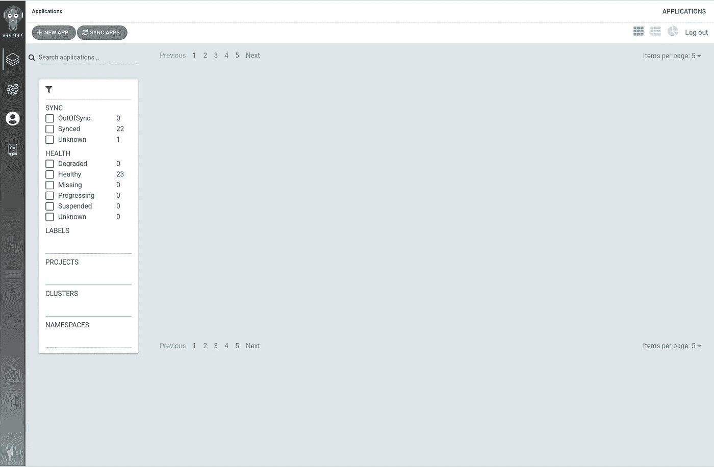
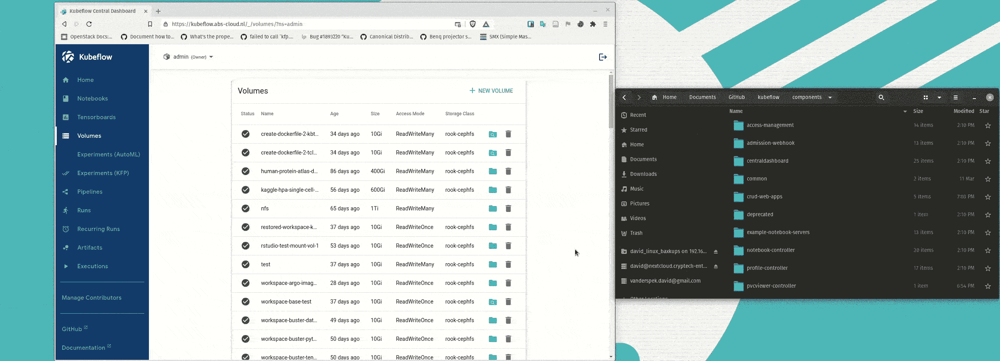
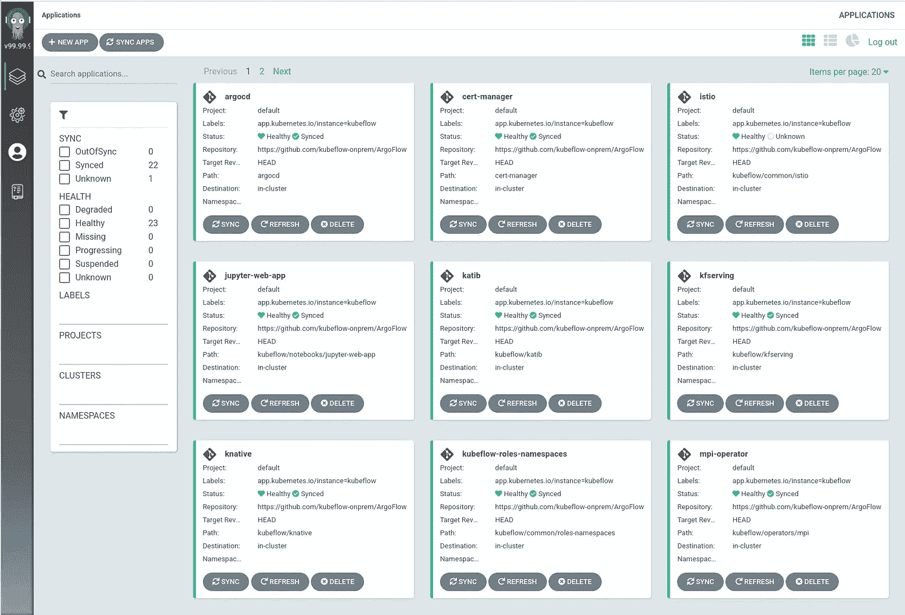
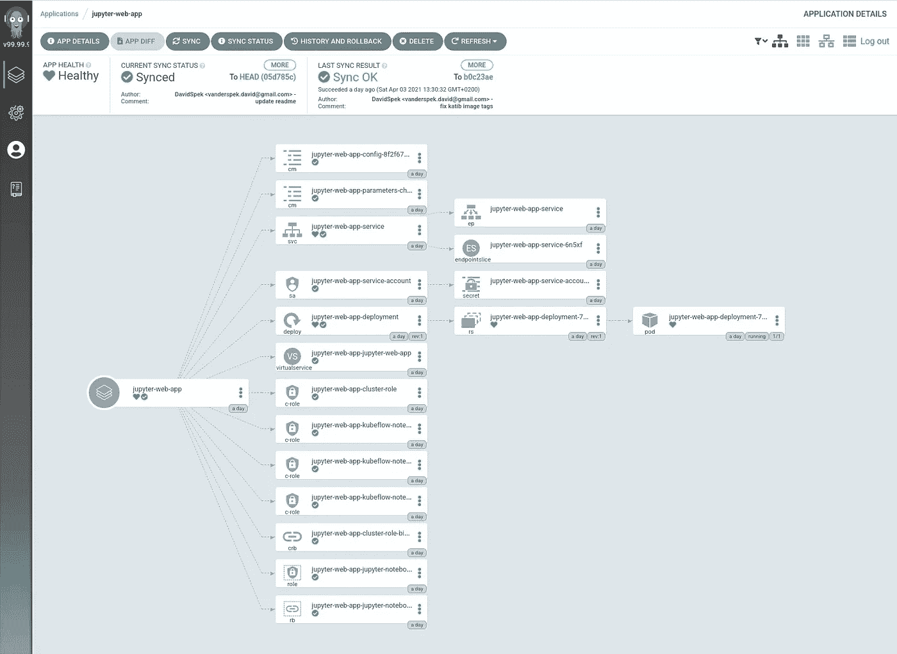

# 使用 Argo CD 部署 Kubeflow 1.3 RC

> 原文：<https://towardsdatascience.com/deploying-kubeflow-1-3-rc-with-argo-cd-ca98606b98eb?source=collection_archive---------13----------------------->

## 使用 GitOps 简化和自动化 Kubeflow 的部署

Kubeflow 是一个流行的开源机器学习平台，运行在 Kubernetes 上。Kubeflow 简化了许多有价值的 ML 工作流，即它允许用户轻松部署开发环境、使用 Kubeflow 管道的可扩展 ML 工作流、使用 Katib 的自动化超参数调整和神经架构搜索、团队内的轻松协作等等。如此多的功能也带来了复杂性。完整的 Kubeflow 部署包含许多服务和依赖项，这使得用户很难使用传统的 [kfctl](https://github.com/kubeflow/kfctl) CLI 工具和 KfDef YAML 文件来定制、管理和安装 Kubeflow。出于这个原因，即将发布的 Kubeflow 1.3 版本已经停止使用 [kfctl](https://github.com/kubeflow/kfctl) ，取而代之的是使用标准 [Kustomize](https://kustomize.io/) ，使得使用 GitOps 工具如 [Argo CD](https://argoproj.github.io/argo-cd/) 部署 Kubeflow 变得更加容易。

Argo CD 是“一个用于 Kubernetes 的声明式 GitOps 连续交付工具”。 [Argo 项目](https://argoproj.github.io/)已经与 Kubeflow 密切相关，因为 Kubeflow 管道在幕后使用 [Argo 工作流](https://argoproj.github.io/projects/argo)，使得 [Argo CD](https://argoproj.github.io/projects/argo-cd) 成为部署 Kubeflow 的自然选择。GitOps 的一个简单描述是使用 Git 存储库作为部署所需状态的真实来源。然后，一个持续的交付工具，如 [Argo CD](https://argoproj.github.io/projects/argo-cd) 监控 Git 存储库的变更和更新部署，如果需要的话。

遵循该指南所需的代码和清单可以在 https://github.com/argoflow/argoflow 找到。部署应该与本地和云中的任何 Kubernetes 集群兼容。注意——虽然包含了一些额外的清单以使内部部署更加容易，例如[metalllb](https://metallb.universe.tf/)和 [Rook Ceph](https://rook.io/) ，但这些清单在默认情况下是禁用的。

# 准备

第一步是派生出 [ArgoFlow](https://github.com/argoflow/argoflow) 存储库并在本地克隆它。接下来，您需要安装 [yq](https://github.com/mikefarah/yq) version 4 来使用允许您轻松设置 fork 的脚本和 [Kustomize v4.0.5](https://github.com/kubernetes-sigs/kustomize/releases/tag/kustomize%2Fv4.0.5) 来安装 Argo CD 和提供的清单。当然，访问 Kubernetes 集群也是一个要求。这可以通过虚拟机或云中的工具在本地完成，如 [minikube](https://minikube.sigs.k8s.io/docs/start/) 、 [kind](https://kind.sigs.k8s.io/) 或 [MicroK8s](https://microk8s.io/) 。但是，设置 Kubernetes 集群超出了本文的范围。

# 安装 Argo CD

为了简单起见，Argo CD 将与 Kubeflow 安装在同一个集群上。高可用性模式下的 Argo CD 2.0 的候选版本是因为我喜欢与软件保持同步。对 Argo CD 配置做了一些优化，包括 Kustomize 的 v4.0.5，这是撰写本文时的最新版本。

在本地克隆了 [ArgoFlow](https://github.com/argoflow/argoflow) 的分支后，您可以在 [ArgoFlow](https://github.com/argoflow/argoflow) 文件夹中执行以下命令来安装 Argo CD:

`kustomize build argocd/ | kubectl apply -f -`

接下来在本地安装 Argo CD [CLI](https://github.com/argoproj/argo-cd/releases/latest) 工具。要访问 Argo CD UI，您可以使用负载平衡器公开其服务，使用`kubectl`和端口转发进入或连接到它。Argo CD [入门页面](https://argoproj.github.io/argo-cd/getting_started/)有更多关于如何操作的说明。

接下来，通过执行以下命令来获取用户`admin`的默认密码:

`kubectl -n argocd get secret argocd-initial-admin-secret -o jsonpath=”{.data.password}” | base64 -d`

现在，您可以使用 Argo CD CLI 工具登录，并按如下方式更改默认密码:

`argocd login <ARGOCD_SERVER> # e.g. localhost:8080 or argocd.example.com`

`argocd account update-password`

你现在应该可以用你的新密码登录 Argo CD 用户界面了。



阿尔戈光盘网络界面

# 定制 Kubeflow 部署

清单已经设置了一些默认值来帮助新用户入门，但是大多数人都应该更改。例如，用户应该更改默认用户的密码，并在 cert-manager 中设置一个颁发者，以便为 Istio 入口网关创建正确的证书。许多人可能需要更改的另一件事是入口网关服务，默认情况下它设置为使用负载平衡器。为了保持这篇文章的清晰和中肯，我不会在这里详细讨论如何更改这些设置，因为这会涉及到很多文件链接。 [ArgoFlow](https://github.com/argoflow/argoflow) 存储库中的[自述文件](https://github.com/argoflow/argoflow/blob/master/README.md)提供了更改部署的这些方面的说明。

## 准备部署 Kubeflow

除了不同 Kubeflow 组件的 Kustomize 清单， [ArgoFlow](https://github.com/argoflow/argoflow) 库还包含每个 Kubeflow 组件的 Argo CD 应用程序规范。为了使人们更容易选择和部署他们想要的组件，位于根存储库中的一个`kustomization.yaml`文件用于定义应该部署哪些 Argo CD 应用程序。反过来，存储库根目录中的`kubeflow.yaml`文件是前面提到的`kustomization.yaml`文件的 Argo CD 应用程序。简单来说就是一个 Argo CD 应用，部署其他 Argo CD 应用。

接下来，需要编辑 Argo CD 应用程序规范，以便它们指向您的 [ArgoFlow](https://github.com/argoflow/argoflow) 存储库的分支。包含一个脚本来简化这一过程。在存储库的根目录中，只需运行下面的命令来更新所有的应用程序规范，使其指向存储库的分支:

`./setup_repo.sh <your_repo_fork_url>`

**奖励:用文件浏览器扩展 Volumes Web 应用**

对于许多人来说，一个大问题是如何容易地将数据上传到安装为笔记本服务器的工作区卷的 PVC，或者从安装为笔记本服务器的工作区卷的 PVC 下载数据。为了使这更容易，创建了一个简单的 PVCViewer 控制器(tensorboard-controller 的稍微修改版本)。PVC 查看器将与 ReadWriteOnce PVCs 一起工作，即使它们安装在活动的笔记本服务器上。这个特性在 1.3 版本中还没有准备好，因此我在这里只是把它作为一个实验性的特性来记录，因为我相信很多人都想拥有这个功能。它(还)不是上游库伯流的一部分，将来可能会改变。



运行中的 PVC 查看器演示

如果您想要部署这个特性，您需要注释掉根`kustomization.yaml`文件中的`argocd-applications/volumes-web-app.yaml`条目，并取消注释以下两行:

```
- argocd-applications/experimental-pvcviewer-controller.yaml- argocd-applications/experimental-volumes-web-app.yaml
```

一旦您完成了对部署的定制，只需将您的更改提交并推送到您的 [ArgoFlow](https://github.com/argoflow/argoflow) 存储库的分支中。

# 部署 Kubeflow

在提交和推送您的更改后，您可以通过执行以下命令来安装 Kubeflow:

`kubectl apply -f kubeflow.yaml`

也可以手动安装组件。例如:

`kubectl apply -f argocd-applications/kubeflow-roles-namespaces.yaml`

您现在应该开始看到应用程序出现在 Argo CD UI 中，如果一切顺利，它们应该是“健康的”和“同步的”。由于 Kubeflow 部署中的大量资源以及一些先有鸡还是先有蛋的场景，一些应用程序可能会保持“不同步”一段时间。



Kubeflow 组件在 Argo CD 中的应用

通过点击一个应用程序，Argo CD 将向您展示由该应用程序创建的所有资源的概述。



Argo CD 中 Jupyter Web 应用程序资源概述

通过点击任何资源，Argo CD 将向您显示有用的信息，例如当前部署的 YAML 与 Git 库或 pod 日志中声明的内容之间的差异。

## 更新您的部署

要更新或更改您的部署，只需将您的更改提交并推送到您的存储库，Argo CD 将自动检测并更改您的 Kubernetes 集群中的部署。

# 结论

由于即将发布的 Kubeflow 1.3 使用标准 Kustomize，这使得使用 Argo CD 等工具来管理其部署变得更加容易。此外，由于 Kubeflow 的大小和复杂性，使用 GitOps 和 Argo CD 的声明性方法应该使用户更容易定制和部署适合他们需求的 Kubeflow。