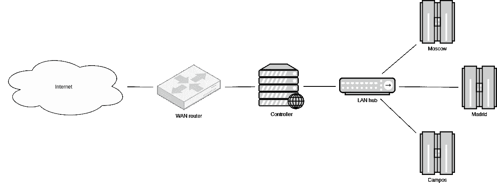
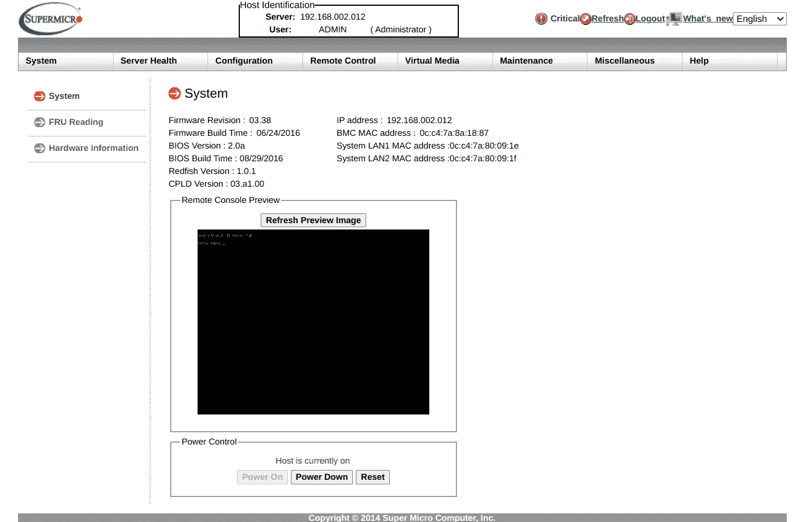

# 从头开始将 Kubeflow 部署到裸机 GPU 集群

> 原文：<https://towardsdatascience.com/deploying-kubeflow-to-a-bare-metal-gpu-cluster-from-scratch-6865ebcde032?source=collection_archive---------21----------------------->

## 我在具有多个 GPU 的物理服务器上部署 Google 的 Kubernetes ML 工具包的经验


攻击库伯弗洛。图片来自 Anastasia Markovtseva，CC-BY-SA 4.0。

## 五金器具

我有 3 个标准的超微塔式服务器，每个都有 256GB 内存、一个固态硬盘、5 个硬盘和 4 个 GPU。以太网将它们连接到可以访问互联网的“控制器”戴尔服务器，并应该控制 SSH 到群集的连接。我用团队成员的家乡城市来命名这些塔；我发现这个方案比分配随机的形容词(“食蚁兽”、“无畏者”)、前缀索引(“数据科学 1”、“数据科学 2”)或希腊字母(“阿尔法”、“贝塔”)更有趣，我在以前工作的地方已经见过太多次了。当有人问你在哪个服务器上训练网络时，你可以回答，“我在马德里”或“我在莫斯科”。



集群网络方案。图片作者。

## 安装 Linux

我在每台机器上都安装了 Ubuntu 20.04。这一步已经存在一定的困难:没有配置 PXE(通过网络引导)，安装操作系统的唯一文明方式是从闪存盘引导，而[戴尔服务器不支持它](https://www.dell.com/community/Storage-Drives-Media/Can-t-Install-OS-from-Bootable-USB-Drive-on-Dell-Poweredge/td-p/6196414)。我的意思是，有 USB 端口，当然，但他们的 UEFI 没有看到一个可引导的设备。我不得不在 2020 年刻录一张 DVD，我仍然无法相信。在超微型电脑上安装 Ubuntu 也不是一件容易的事。[由于 UEFI](https://unix.stackexchange.com/questions/541489/grub-fails-to-install-during-debian-10-installer-re-uefi-supermicro-motherboa) 出了问题，GRUB 无法安装，所以我不得不在安装过程中进入内核外壳并即时修复。

> PXE 代表[预启动执行环境](https://en.wikipedia.org/wiki/Preboot_Execution_Environment)。PXE 指定机器从由 [TFTP](https://en.wikipedia.org/wiki/Trivial_File_Transfer_Protocol) 下载的镜像启动，而不是像往常一样从磁盘读取。

如果我知道计算实例运行在有白名单用户的可信网络中，我总是禁用计算实例上的内核安全补丁。附带的性能损失比强加的风险要昂贵得多。所以我在 GPU 塔上编辑了`/etc/default/grub`如下:

```
GRUB_CMDLINE_LINUX_DEFAULT="pti=off spectre_v2=off l1tf=off nospec_store_bypass_disable no_stf_barrier"
```

> [GRUB](https://en.wikipedia.org/wiki/GNU_GRUB) 是一个开源的 bootloader，可以将 Linux 内核作为常规的 [ELF 应用](https://en.wikipedia.org/wiki/Vmlinux)来执行。`/etc/default/grub`中的命令行标志是真实的`argv`。

正如我在以前的一篇博客文章中提到的，如果您计划点对点 GPU 通信，例如 Tensorflow 或 PyTorch 中的多 GPU 模型训练，禁用 IOMMU 至关重要。这不是什么秘密，经常出现在他们的 GitHub 问题中。

```
GRUB_CMDLINE_LINUX_DEFAULT="intel_iommu=off rcutree.rcu_idle_gp_delay=1"
```

> IOMMU 代表[输入输出内存管理单元](https://en.wikipedia.org/wiki/Input%E2%80%93output_memory_management_unit)。在我们的上下文中，IOMMU 与虚拟化[直接内存访问](https://en.wikipedia.org/wiki/Direct_memory_access) (DMA)相关。英特尔 CPU 以名为英特尔 VT-d 的“面向定向 I/O 的虚拟化技术”来实现它。

我使用 [udhcpd](https://git.busybox.net/busybox/tree/networking/udhcp) 在控制器中设置了内部网的静态 DHCP 租约，使用`apt`很容易安装。这是我的`/etc/udhcpd.conf`:

```
start  192.168.2.2
end  192.168.2.16
interface eno2  # eno1 interface connects to the internet
max_leases 32
static_lease 0C:C4:7A:80:09:1F 192.168.2.2
static_lease 0C:C4:7A:8A:18:87 192.168.2.12
static_lease AC:1F:6B:20:F6:F9 192.168.2.3
static_lease 0C:C4:7A:ED:F1:76 192.168.2.13
static_lease AC:1F:6B:24:1E:FF 192.168.2.4
static_lease AC:1F:6B:2F:98:52 192.168.2.14
```

您可能会注意到 3 台机器有 6 条记录。以`.1x`结尾的是指[IPMI](https://en.wikipedia.org/wiki/Intelligent_Platform_Management_Interface)——每个塔中的独立计算单元，用于远程管理状态，例如，打开电源或查看屏幕。IPMI 不需要特殊的设置:插入以太网电缆，访问 HTTPS 的网络接口。



超微的 IPMI 截图。图片作者。

我选择了一个基于 [Ansible](https://www.ansible.com/) 的传统配置管理解决方案来管理机器。这没有 Terraform 的定制 PXE 那么花哨，但嘿，你不需要私人直升机去市区度假。Ansible 的核心就像在预定义的主机上自动执行 SSH 命令一样简单。我用 GPU 塔名称填充了`/etc/ansible/hosts`:

```
[cluster]
moscow
madrid
campos
```

我用`cluster.yml`来描述配置，并用`ansible-playbook -K cluster.yml`来应用它。下面是一个示例，用于确保我的用户存在，并且可以在 GitHub 上使用我的带有指纹的私钥进行 SSH:

```
---
- hosts: cluster
  become: yes
  become_user: root
  tasks:
    - name: Group "docker"
      group:
        name: docker
    - name: User "vadim"
      user:
        name: vadim
        shell: /bin/bash
        groups: adm,sudo,cdrom,docker,dip,plugdev,lxd
        append: yes
        uid: 1000
        create_home: yes
    - name: vadim's SSH keys
      authorized_key:
        user: vadim
        state: present
        key: [https://github.com/vmarkovtsev.keys](https://github.com/vmarkovtsev.keys)
```

当然，我需要在机器上运行一个 SSH 服务器。Ubuntu 安装程序方便地允许在第一次启动前设置一个 SSH 服务器。

Ansible 也是一个很好的增量解决方案。您不必在第 0 天强制配置所有内容。反而可以在有时间的时候和配置债打一场。

## 安装 Kubernetes

我决定试试 [k0s](https://k0sproject.io/) 。有几个优点吸引了我:

*   轻松自举。下载一个没有外部依赖的大二进制，复制到每个节点，运行`k0s install`，就大功告成了。
*   使用相同的`k0s`命令轻松进行初始配置。
*   一组合理的内置电池，例如， [Calico](https://www.projectcalico.org/) 网络和 [etcd](https://etcd.io/) 集群状态数据库。
*   香草 Kubernetes，这样我就不用学习 DevOps 技术的另一个雪球。

> Kubernetes 是运行在一台或多台物理机器上的服务联盟。有两种操作模式:控制器和工人。管制员管理工人。两者都可以水平扩展，即增加实例的数量。如果用户不关心高可用性和故障转移，只产生一个控制器就足够了。

官方文档目前缺乏细节，所以让我一步步地走完部署 k0s 的过程。在控制器上运行以下命令:

```
sudo k0s install controller
```

该命令将创建`/etc/systemd/system/k0scontroller.service`，它将 k0s 控制器实例打包成一个 [systemd 服务](https://www.digitalocean.com/community/tutorials/how-to-use-systemctl-to-manage-systemd-services-and-units)，您可以方便地`sudo systemctl start|stop|restart`。因此我们开始它:

```
sudo systemctl start k0scontroller.service
```

下一个缺失的元素是`kubectl`——人人都使用的 Kubernetes 命令行命令。我更喜欢用`snap`安装:

```
sudo snap install kubectl --classic
```

k0s 为 kubectl 提供了一个管理配置，又名`KUBECONFIG`，我们将使用它来创建普通用户:

```
sudo cp /var/lib/k0s/pki/admin.conf .
sudo chown $(whoami) admin.conf
export KUBECONFIG=$(pwd)/admin.conf
export clusterUser=$(whoami)
kubectl create clusterrolebinding $clusterUser-admin-binding --clusterrole=admin --user=$clusterUser
export KUBECONFIG=
mkdir -p ~/.kube
sudo k0s kubeconfig create --groups "system:masters" $clusterUser > ~/.kube/config
```

最后，我们必须将工作者加入集群的控制器。[文档钉住了那个程序](https://docs.k0sproject.io/v0.11.0/k0s-multi-node/#create-a-join-token)，我就不重复了。

在成功完成上述设置后，我发现了两个恼人的问题。

1.  `kubectl logs`和`kubectl exec`超时有 80%几率。错误信息总是一样的:`error dialing backend: dial tcp …: connection timed out`。
2.  `kube-system`名称空间中的系统盒无法引导，状态为“ImagePullBackOff”。`kubectl describe pod`表示 DNS 解析超时，例如 registry-1 . Docker . io—Docker 容器注册表。然而，当我用`kubectl get pod -n kube-system <whatever> -o yaml | kubectl replace --force -f -`手动重启 pods 时，有 50%的时间图像都是成功的。

> `kubectl logs`直接连接到 Kubernetes worker 并请求指定 pod 的日志。如果 pod 包含多个集装箱，您必须指定要寻址的集装箱。该命令的工作方式类似于`docker logs`。
> 
> `kubectl exec`直接连接到 Kubernetes 工作器，并在指定的 pod 中执行任意命令。同样，您必须指定 pod 运行多个容器。该命令的工作方式类似于`docker exec`。

那些问题在普通的工作机器上没有重现。Kubernetes 官方文档中的[“调试 DNS 解析”中的建议没有帮助。花了几个小时调试之后，我发现:](https://kubernetes.io/docs/tasks/administer-cluster/dns-debugging-resolution/)

1.  `kubectl logs`和`kubectl exec`超时，因为 kubelet-s 监听了错误的网络接口。每个 GPU 塔有两个物理以太网插座，网络在`eno2`连接，而`eno1`保持未配置。Kubernetes 无法找出主要接口和 Calico 的路由中断。我仍然不完全理解为什么这些命令有时会起作用。我通过执行以下命令解决了这个问题:

```
kubectl set env daemonset/calico-node -n kube-system IP_AUTODETECTION_METHOD=interface=eno2
```

2.在控制器上运行(黑客的)DNS 服务器是个坏主意。虽然我没有提到，但我最初使用以下服务配置将 DNS 转发到 [systemd-resolved](https://wiki.archlinux.org/index.php/Systemd-resolved) :

```
[Unit]
Description = Forward DNS lookups from 192.168.2.0/24 to 127.0.0.53
After = network.target[Service]
ExecStart = /usr/bin/socat UDP-LISTEN:53,fork,reuseaddr,bind=192.168.2.1 UDP:127.0.0.53:53[Install]
WantedBy = multi-user.target
```

实用开发者合理化你糟糕的黑客工作。

systemd-resolved 是 Ubuntu 内置的 DNS 中间件，所以我偷工减料，搬起石头砸自己的脚。我用 [socat](http://www.dest-unreach.org/socat/) 做的黑客工作出奇的好，除了[容器](https://containerd.io/)。在`/etc/hosts`中，我打算避免配置全功能 DNS 服务器和硬编码 IP。

> 容器运行时是提取和执行容器映像的引擎。Kubernetes 过去默认使用 Docker 运行时。[最近已经切换到了 CRI 和 Docker 运行时本身所基于的较低级别的 containerd 运行时](https://kubernetes.io/blog/2020/12/02/dont-panic-kubernetes-and-docker/)。互联网上的大多数 GPU 集成手册都假定了 Docker 运行时，因此不再适用于现代的 Kubernetes。

还有最后一件事需要配置:NVIDIA GPU 调度。它实际上的意思是当吊舱规格像这样

```
metadata:
  spec:
    ...
    containers:
    - ...
      limits:
        nvidia.com/gpu: 2
```

然后 Kubernetes 确保`/dev/nvidia0`和`/dev/nvidia1`存在于容器内部。

[k0s 在文档](https://docs.k0sproject.io/v0.11.0/containerd_config/#using-custom-nvidia-container-runtime)中简单提到了如何启用 GPU，但实际过程要复杂一点。有一个[迈克尔·韦贝尔](https://dev.to/mweibel/add-nvidia-gpu-support-to-k3s-with-containerd-4j17)关于 k3s 中解决任务的很棒的帖子，k0s 应该也有类似的调整。

首先，在每个 GPU 塔上安装 NVIDIA 驱动程序。NVIDIA 提供了一个可行的角色来实现自动化。在`rc.local`中添加`nvidia-smi`，在引导时创建设备。按照 NVIDIA 文档通过[安装`nvidia-container-runtime`。按照](https://nvidia.github.io/nvidia-container-runtime/)[约瑟夫·borġ's 博客文章](https://josephb.org/blog/containerd-nvidia/)中的描述，在 worker 节点上修补 containerd 配置，除了您应该用`/etc/k0s/containerd.toml`替换`/etc/containerd/config.toml`并如下更改头:

```
version = 2
root = "/var/lib/k0s/containerd"
state = "/run/k0s/containerd"
...[grpc]
  address = "/run/k0s/containerd.sock"
```

然后，从`kubectl version`开始计算 Kubernetes 服务器版本，比如说 1.20，并应用 Google 的 daemonset，以便集群学习新的资源类型`nvidia.com/gpu`:

```
kubectl apply -f [https://raw.githubusercontent.com/kubernetes/kubernetes/release-1.20/cluster/addons/device-plugins/nvidia-gpu/daemonset.yaml](https://raw.githubusercontent.com/kubernetes/kubernetes/release-1.20/cluster/addons/device-plugins/nvidia-gpu/daemonset.yaml)
```

然后，您必须将工作节点标记为 NVIDIA 友好的:

```
kubectl label nodes --all cloud.google.com/gke-accelerator=true
```

瞧啊。用`kubectl get daemonset -n kube-system nvidia-gpu-device-plugin`检查状态。它应该输出 *n* / *n* ，其中 *n* 是 GPU 塔的数量:

```
NAME                       DESIRED   CURRENT   READY   UP-TO-DATE
nvidia-gpu-device-plugin   3         3         3       3
```

> 您可以通过 SSH 访问一个 worker、`sudo apt install containerd`、`sudo systemctl disable containerd.service` (Kubernetes 运行自己的)，并使用`sudo ctr --address /run/k0s/containerd.sock -n k8s.io`发出命令来访问 k0s 的 gory containerd 内部。例如，下面的命令将列出所有拉出的图像:`sudo ctr --address /run/k0s/containerd.sock -n k8s.io image list`。界面类似于`docker`。

## 分布式文件系统

[Kubeflow 的文档详细介绍了现有 Kubernetes 集群的安装。他们多次强调缺省设置的必要性，原因是:没有共享文件系统=没有 ML。定义了在 Kubernetes 中的 pods](https://www.kubeflow.org/docs/started/k8s/kfctl-istio-dex/) 中存储和挂载持久卷的后端。该类在集群中统一工作，以便一个 pod 中的文件更改可以被另一个 pod 看到。我们必须返回到 OS 和 Kubernetes 配置。

我决定部署[牧场主的本地路径供应器](https://github.com/rancher/local-path-provisioner)和一个很穷但很骄傲的人的基于 NFS 十字坐骑和 [mergerFS](https://github.com/trapexit/mergerfs) 的分布式 FS。我将从 DFS 开始。

> NFS 代表[网络文件系统](https://en.wikipedia.org/wiki/Network_File_System)，由 Linux、macOS 和 Windows 10 原生支持。这是一个比博客作者还要古老的协议。不要让它的年龄欺骗了你:NFS 通常是快速和可靠的。

我以前有过患 [GlusterFS](https://www.gluster.org/) 的经验。虽然它以前工作稳定，但我对它的性能并不满意。在类似的集群配置中，写入、读取和删除大量小文件(例如 ImageNet)所需的时间是不可接受的。当时，GlusterFS 是由出色的 DevOps 工程师 [Maartje Eyskens](https://medium.com/u/1254fe362752?source=post_page-----6865ebcde032--------------------------------) 和 [Rafael Porres Molina](https://medium.com/u/f78752bca73e?source=post_page-----6865ebcde032--------------------------------) 部署的，因此糟糕的性能应该不是由糟糕的配置造成的。

所以我设计了一个机器间 NFS 安装的全连接图。


NFS 全对全连接方案。图片作者。

节点 X 通过 NFS 导出`/data/X`,并通过 NFS 挂载剩余的`/data`子目录。这还不是一个共享的文件系统:我们需要将所有的子目录联合在一起。Linux 中存在几种合并目录或映像的文件系统，比如 OverlayFS——Docker 用它来堆叠容器层。我们的目标与 Docker 的不同，因为我们没有层级，所有 4 个子`/data`都是等价的。mergerFS 是一个很好的 FUSE(不需要内核模块)工具来达到这个目标。以下是项目自述文件中的一个示例:

```
A         +      B        =       C
/disk1           /disk2           /merged
|                |                |
+-- /dir1        +-- /dir1        +-- /dir1
|   |            |   |            |   |
|   +-- file1    |   +-- file2    |   +-- file1
|                |   +-- file3    |   +-- file2
+-- /dir2        |                |   +-- file3
|   |            +-- /dir3        |
|   +-- file4        |            +-- /dir2
|                     +-- file5   |   |
+-- file6                         |   +-- file4
                                  |
                                  +-- /dir3
                                  |   |
                                  |   +-- file5
                                  |
                                  +-- file6
```

mergerFS 支持如何执行文件系统操作的各种策略，它称之为策略。当用户创建一个目录时，它可以出现在所有合并的`/data` -s 中，也可以只出现在其中一个中；当用户创建一个文件时，它可以去本地的`/data`或者有最多空闲空间的地方。例如，这就是我如何在`moscow`上配置`/etc/fstab`以在`/dfs`挂载合并的目录(为了清楚起见，制表符被替换为新行):

```
/data/moscow:/data/campos:/data/madrid:/data/controller
/dfs
fuse.mergerfs allow_other,use_ino,cache.files=partial,dropcacheonclose=true,category.create=all
```

> `/etc/fstab`定义主机上的本地文件系统。操作系统在启动时挂载列出的项目。

当我们在`moscow`上写一个新文件时，我们在本地`/data/moscow`上操作，其他机器通过 NFS 访问它。另一方面，目录结构到处复制。

让我们考虑一下这样的 DFS 的利弊。

优点:

*   不可能腐败。文件作为一个整体存储在节点上，而不是分散的块中。
*   如果我们使用本地文件，我们的性能与本机磁盘 IOPS 相当。
*   外部文件的对等 NFS 读取也是有性能的。
*   快速文件删除。

缺点:

*   如果某台机器坏了，我们就无法访问它的文件。但是，当我们有 4 台机器时，这不是问题。
*   读写非本地存储的大文件比在真正的 DFS-s 上运行要慢，DFS-s 将文件块分散在各个节点上，因此当您读写它们时，您可以并行聚合数据。我们可以通过本地复制大文件来缓解这个问题，老实说，如果磁盘有足够的空闲空间，这是典型 ML/DL 任务的最佳方法。

> NFS 挂载是用`nofail,soft,retry=1,timeo=10`配置的，这样内核就不会无限期地等待一个断开的共享重新出现，从而阻塞用户空间进程并引发混乱和破坏。

剩下的工作是在 Kubernetes 上部署本地路径`StorageClass`，这样工作人员就可以在`/dfs`上持久化数据:

```
wget [https://raw.githubusercontent.com/rancher/local-path-provisioner/master/deploy/local-path-storage.yaml](https://raw.githubusercontent.com/rancher/local-path-provisioner/master/deploy/local-path-storage.yaml)
sed -i 's/\/opt\/local-path-provisioner/\/dfs/g' local-path-storage.yaml
kubectl apply -f local-path-storage.yaml
kubectl patch storageclass local-path -p '{"metadata": {"annotations":{"storageclass.kubernetes.io/is-default-class":"true"}}}'
```

完成这些操作后，您应该会看到类似的内容:

```
$ kubectl get storageclass
NAME                   PROVISIONER             RECLAIMPOLICY   VOLUMEBINDINGMODE      ALLOWVOLUMEEXPANSION   AGE
local-path (default)   rancher.io/local-path   Delete          WaitForFirstConsumer   false                  13d
```

## 安装 Kubeflow

理论上，如果所有先决条件都满足，部署 Kubeflow 就很容易:

```
sudo mkdir /opt/my-kubeflow && cd /opt/my-kubeflow
chown $(whoami) .
export BASE_DIR=/opt
export KF_NAME=my-kubeflow
export KF_DIR=${BASE_DIR}/${KF_NAME}# Download kfctl from [https://github.com/kubeflow/kfctl/releases](https://github.com/kubeflow/kfctl/releases)# Suppose that the version is 1.2
wget [https://raw.githubusercontent.com/kubeflow/manifests/v1.2-branch/kfdef/kfctl_istio_dex.v1.2.0.yaml](https://raw.githubusercontent.com/kubeflow/manifests/v1.2-branch/kfdef/kfctl_istio_dex.v1.2.0.yaml) -o kfctl_istio_dex.yaml
kfctl apply -V -f kfctl_istio_dex.yaml
```

不幸的是，练习并不顺利。`kfctl`打印出一切都部署好了，只是没有。我和 katib 遇到了一个[棘手的问题。Katib 是 Google 针对 Kubernetes/Kubeflow 的 AutoML 解决方案。例如，它可以进行超优化。](https://github.com/kubeflow/katib/issues/1415)

```
$ kubectl get pods -n kubeflowNAME                     READY   STATUS             RESTARTS
katib-db-manager-...     0/1     CrashLoopBackOff   235
katib-mysql-...          0/1     CrashLoopBackOff   24
```

日志消息信息不多，所以我花了几个小时才明白失败的原因。我应该简要回顾一下 Kubernetes 中的就绪性和活性探测。

> Kubernetes 通过执行就绪探测来了解发射的吊舱是否准备好工作。它定期运行一个 shell 脚本并检查退出代码。如果退出代码为 0，Kubernetes 会将 pod 标记为就绪。
> 
> Kubernetes 通过执行活性探测来了解启动的 pod 是否起作用(“活性”)。它定期运行一个 shell 脚本并检查退出代码。如果退出代码不是 0，Kubernetes 将重新启动 pod。

katib-mysql 在第一次启动时初始化一个 mysql 数据库。该配置将活动探测延迟 30 秒。偏偏 30 秒太少，吊舱无法按时完成初始化。Kubernetes 杀了它。不幸的是，DB 初始化是不可抢占的，重启的 pod 再次失败。

该问题的解决方案是增加活性探针的`initialDelaySeconds`。

```
KUBE_EDITOR=nano kubectl edit deployment katib-mysql -n kubeflow
# locate livenessProbe and set initialDelaySeconds to 300
# save and exit# Important! Delete the old screwed database, e.g.
# pvc-25dc2b81-9873-430f-8bc4-365fe5ff0357_kubeflow_katib-mysqlkubectl delete pod -n kubeflow katib-mysql-...
```

最后，我们必须设置草稿端口转发来访问 web 界面。我写了一个 systemd 服务:

```
[Unit]
Description=kubeflow port forwarding
ConditionFileIsExecutable=/snap/bin/kubectlAfter=k0sserver.service
Wants=k0sserver.service[Service]
StartLimitInterval=5
StartLimitBurst=10
Environment="KUBECONFIG=/var/lib/k0s/pki/admin.conf"
ExecStart=/snap/bin/kubectl port-forward svc/istio-ingressgateway -n istio-system 8080:80...
```

> Istio 是 Kubeflow 的一部分，负责组织服务网络和管理流量。例如，Kuberflow 使用 Istio 以受控和统一的方式将内部服务公开给外部，这样您就不必使用`kubectl port-forward`单独的 pod。

你好，库伯弗洛！


Kuberflow 起始页。图片作者。

## 包裹

我试图从零开始勾勒出建立一个裸机集群来做 ML 的过程。这绝对是一种痛苦。我必须解决大量的问题，我不能在帖子中描述所有的问题，因为否则它会爆炸。然而，对于一个经验丰富的 DevOps 工程师来说，这并不复杂。2021 年的 MLOps 肯定比几年前容易。然而，如果你没有做好心理准备来打开现代 DevOps 技术的潘多拉魔盒——因为你不会在不了解自己在做什么的情况下解决不可避免的问题——我建议忘记裸机，继续在云中飞行。

正如一些人意识到的那样，我在走了很多捷径。一个专门的 DevOps 团队将重建集群，以充分利用 Kubernetes 和底层硬件。我估计我的努力是 2 周的全职工作。另一方面，配置越先进，对维护人员的依赖性就越强，暴露组件不当行为和损坏的面就越广。

请在 Twitter 上订阅 [@vadimlearning](https://twitter.com/vadimlearning) ，这样你就不会错过我的下一篇博文。非常感谢 [@Miau_DB](https://twitter.com/Miau_DB) 的资助、支持和宝贵意见；[@艾纳 _ 菲奥](https://twitter.com/aina_fiol)进行校对。我们正在进行咨询，如果感兴趣，请发邮件到 fragile.tech 的 guillem。