# 使用 EFS 在 AWS Lambda 上部署大型包

> 原文：<https://towardsdatascience.com/deploying-large-packages-on-aws-lambda-using-efs-3a707f83d918?source=collection_archive---------9----------------------->

## [理解大数据](https://towardsdatascience.com/tagged/making-sense-of-big-data)

## AWS Lambda 是一个非常方便的工具，可以轻松地在线部署简单的功能。但是如果你碰巧有一个大项目或者依赖于一个大的库，这可能会变成一场噩梦。

AWS Lambda 还是挺方便的。在云上部署一个功能真的很简单，不用担心设置。你可以在几分钟内让它运行起来。但是，它的一个主要限制是部署大小，您不能部署大于 250MB 的任何东西。

您自己的代码不太可能那么大，但是您可能需要基本设置中不包含的库，这些库很容易达到几百 MB 或几 GB。当您使用现有的模型和您的模型的特定 ML 包来训练模型或运行推理时，通常就是这种情况。

在这种情况下，AWS EFS(弹性文件系统)来拯救。EFS 是一个文件系统，可以从不同的实例挂载，包括 Lambda 函数。一个主要的警告是，所有这些资源应该在同一个安全组和 VPC(虚拟私有云)中。

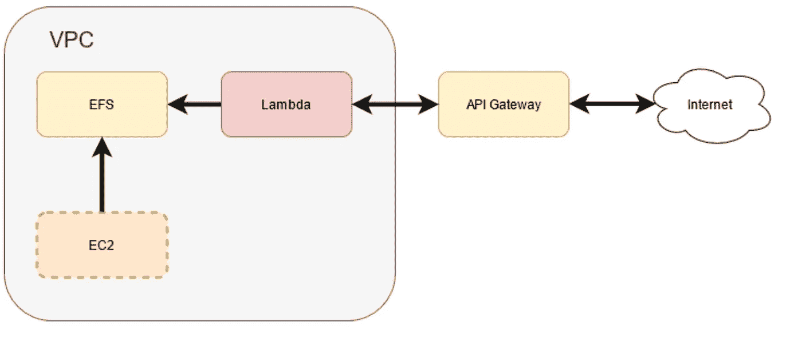

架构的高级视图[图片由作者创建]

该设置包括以下步骤:

*   创建一个 VPC 和一个安全组，在以下所有步骤中使用该 VPC 和安全组。
*   创建一个 EFS
*   创建 EC2 实例
*   EC2 实例中的 EFS 山
*   安装所需的软件包
*   创建 AWS Lambda 函数
*   在 Lambda 函数中挂载相同的 EFS 文件系统

一旦安装了软件包，您就可以关闭 EC2 实例，不再需要它了。

这个系统的整体架构并不复杂，但是 AWS 界面的复杂性和部署中的某些变化使得设置起来更加困难。所需的库和 CLI 命令发生了变化，而 AWS 博客上的指南已经过时。在撰写本文时，我将尝试提供一个详细的分步说明。我将使用 AWS 网络控制台(【https://console.aws.amazon.com】T2)。如果您不熟悉 AWS 控制台，可以简单地搜索相关资源。

# 创造 VPC

除非你知道你在做什么，否则我建议你使用 VPC 向导。默认情况下，VPC 是隔离的，它不能访问互联网。将 internet 接入添加到 VPC 涉及一长串详细的步骤，如创建路由表、公共和私有子网、NAT 和 internet 网关等。(【https://stackoverflow.com/a/55267891】)。VPC 向导可以为你做这些。只需从 AWS 控制台转到 VPC 部分，然后单击启动 VPC 向导按钮。

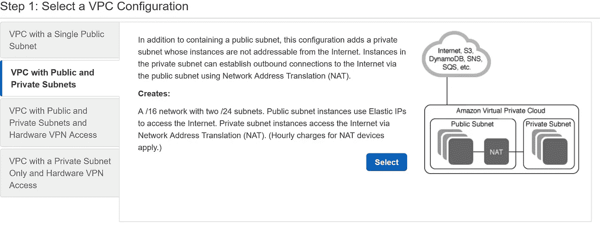

VPC 巫师

*拥有公共和私有子网的 VPC*将为您的 lambda 功能提供互联网接入。但是由于 NAT 网关的使用，这可能具有更高的成本。如果你不要求，你可以用一个公共子网去 *VPC。但是你应该在做那件事之前深思熟虑，这一步之后就很难改变了。*

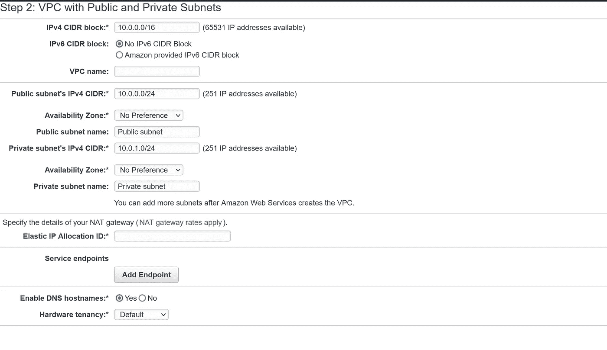

VPC 细节

你所需要做的就是给你的 VPC 一个名字，并选择一个弹性 IP，你可以让其余的保持原样，并创建一个 VPC。

# 创建安全组

现在我们有了一个 VPC，我们需要创建一个安全组。出于本指南的目的，我将只创建一个允许所有传入/传出流量。您当然可以创建一个更适合您的安全需求的，但要确保它给你访问权限。

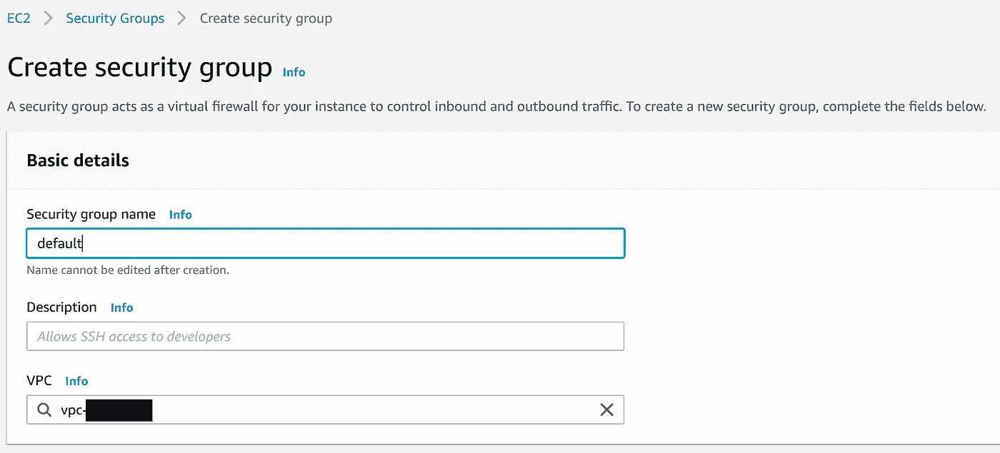

确保您已经选择了我们创建的 VPC。你喜欢怎么命名都行。

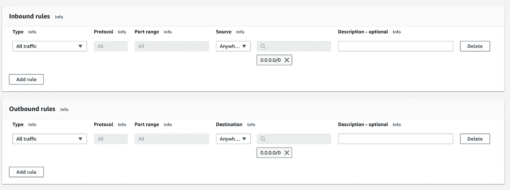

网络访问的入站和出站规则

出于本指南的目的，我简单地设置了所有允许的传入和传出流量。理想情况下，您应该只授权访问您自己的 IP 地址和您需要的端口(即 SSH)。

现在我们有了 VPC 和安全组，我们可以创建我们的 EFS、EC2 实例和 Lambda 函数。

# 创建一个 EFS

您可以在创建 EC2 实例的过程中自动创建一个 EFS，但是您仍然需要对其进行更改，以便从 Lambda 函数中进行访问。因此，更简单的方法是预先创建一个包含所有必需细节的 EFS。

要创建 EFS，您必须转到 AWS 控制台上的 EFS 页面。您会在 EFS 主页上看到一个“创建文件系统”按钮。

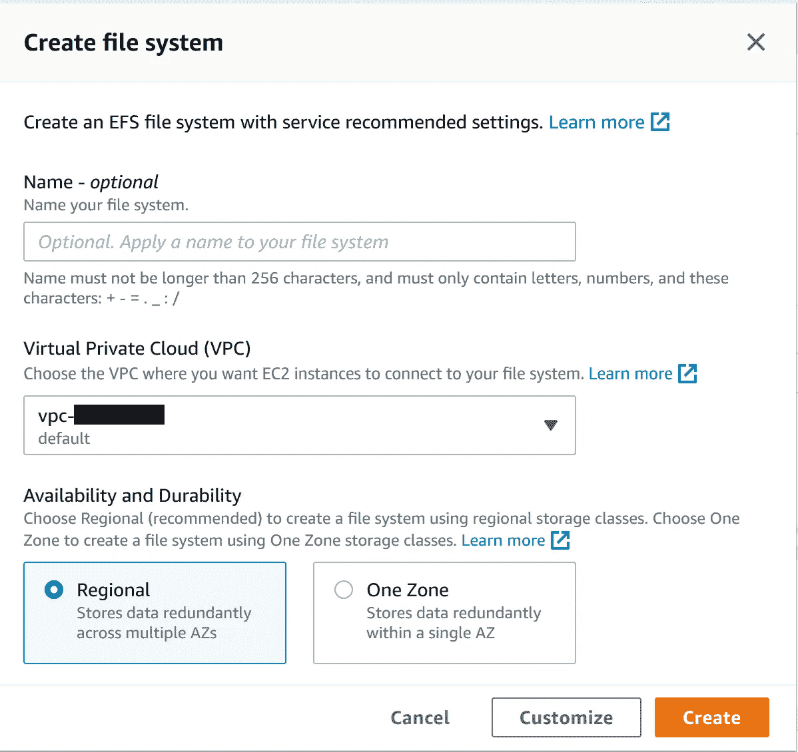

创建文件系统对话框

创建文件系统后，我们需要创建一个访问点。当您进入新创建的文件系统时，有一个“访问点”选项卡，您可以在其中单击“创建访问点”按钮。

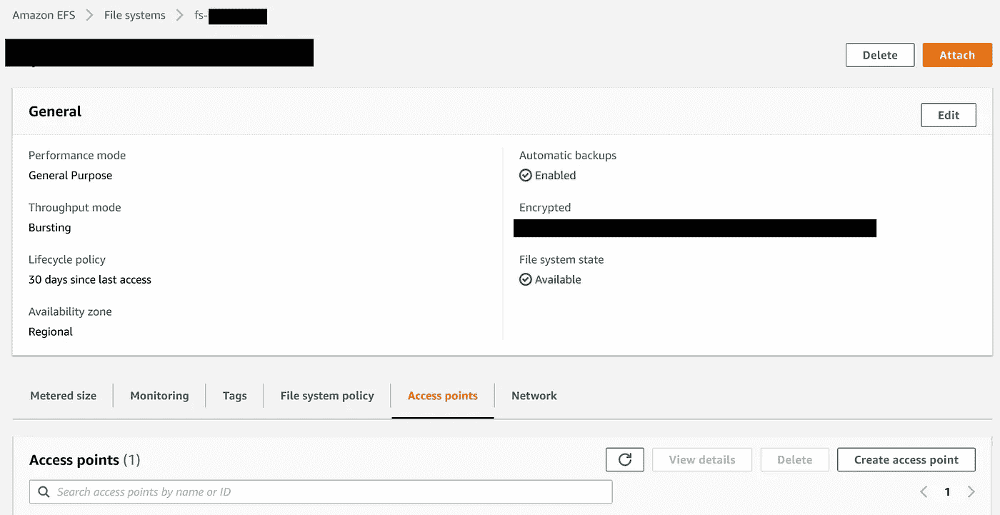

接入点选项卡

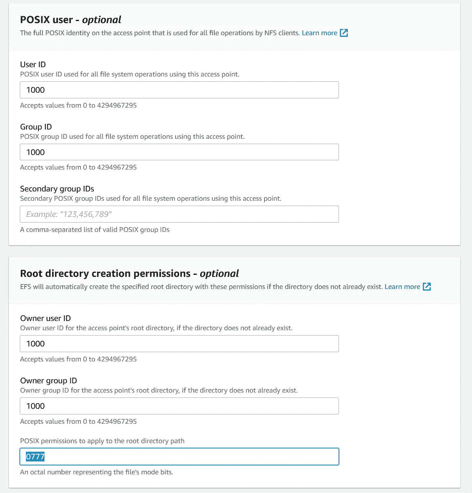

创建接入点对话框

您可以输入任意数量的用户和组 id 值。设置这些值会为挂载创建一个默认的根目录。

我已经将权限设置为 777，这将允许任何人写访问。这只是为了方便。当您以后不再需要写入时，您可以创建一个单独的只读访问点。那会更安全。

# 创建 EC2 实例

现在我们有了一个 EFS 文件系统，我们需要在同一个 VPC 中有一个 EC2 实例，以便装载和访问存储。虽然 AWS 可以在创建实例时自动创建 EFS 文件系统，但它不会创建访问点，没有访问点 Lambda 函数就无法挂载它。

转到控制台上的 EC2 仪表板，并单击“启动实例”按钮。您需要选择一个 Linux 或 OSX 实例，因为您不能在 Windows 设备上挂载 EFS。我将继续使用默认选择，一个符合条件的免费 Amazon Linux 2 AMI 实例 t2.micro。

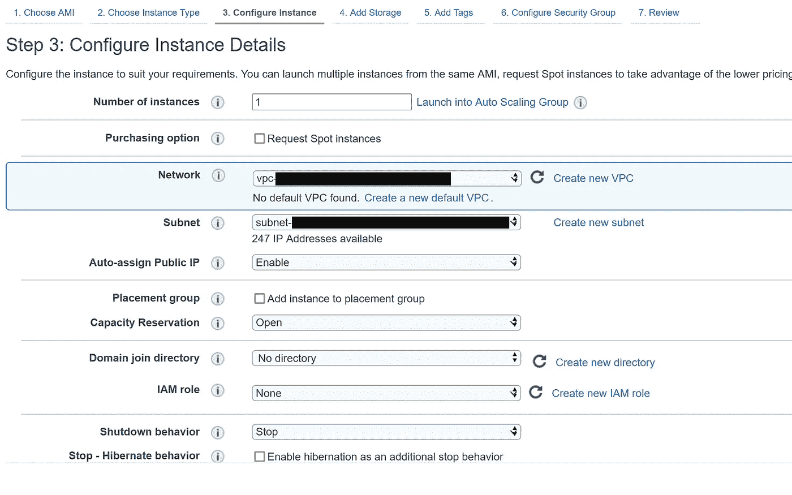

实例详细信息

确定您选择了一个子网(装载 EFS 所需的)并将“自动分配公共 IP”设定为“已启用”。

在下面你会看到文件系统的设置。

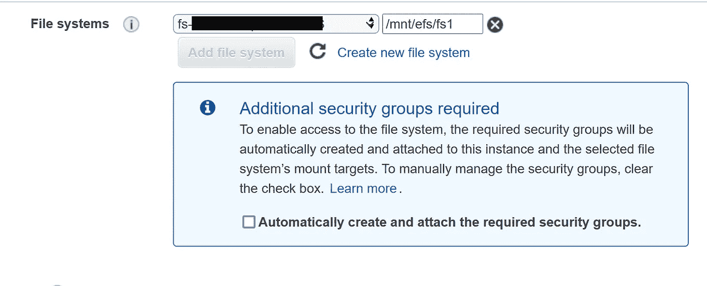

添加文件系统选项

单击“添加文件系统”按钮将允许您选择我们创建的 EFS。您可以在这里设置 EFS 将被挂载到哪个文件夹。我们将在稍后安装软件包时使用它。

我们不必创建新的安全组，因此您可以取消选择它。但是要确保进入“配置安全组”步骤来选择安全组。

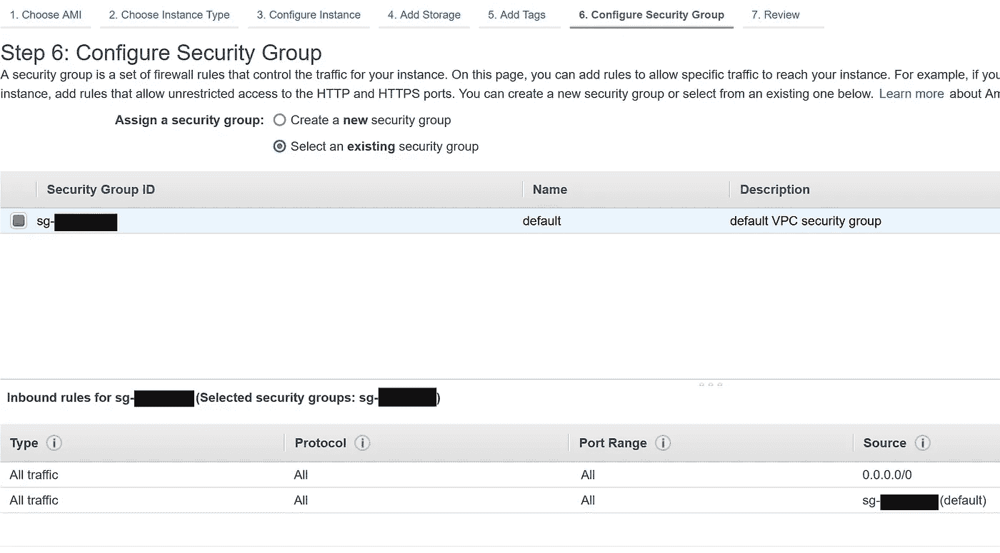

安全组步骤

现在可以启动实例了。确保下载密钥文件，我们将需要它来 ssh 到 EC2 实例中。

# 安装软件包和库

现在您可以 SSH 到 EC2 实例并安装您需要的库。例如，如果您需要安装 Python 包，只需使用 pip 安装在已挂载的 EFS 文件夹中。

```
sudo pip3 install — target /mnt/efs/fs1 pandas
```

“/mnt/efs/fs1”是我们在创建 EC2 实例时为文件系统挂载设置的文件夹。

你可以安装所有你想要的软件包，并上传你自己的文件。您也可以上传大型模型文件。所有文件都可以使用挂载文件夹直接从 Lambda 函数中访问。

您可以使用 scp 上传文件，但不能直接上传到挂载的驱动器，因为它需要 root 权限。您必须首先更改文件夹的权限:

```
sudo chmod 777 /mnt/efs/fs1
```

同样的概念也适用于其他语言。如果您正在开发一个节点应用程序，您可以简单地使用 npm 将库安装到挂载的 EFS 中。稍后我们可以通过 Lambda 函数访问它们。

完成安装包和上传文件后，您可以停止或终止 EC2 实例。如果需要进行其他更改，可以重新启动实例，甚至按照相同的步骤创建一个新实例。

# λ函数

现在，您可以转到 AWS 控制台上的 Lambda 仪表板，创建您的 Lambda 函数，命名它并展开高级设置部分。

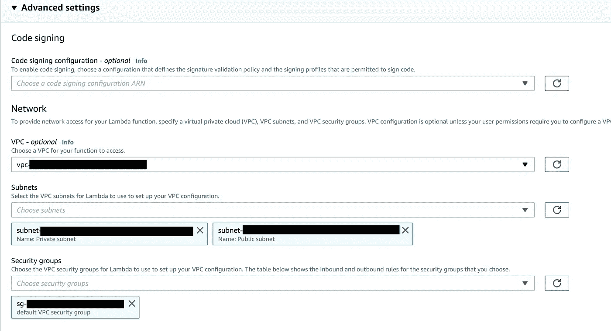

Lambda 高级设置

在这里，确保您已经选择了 VPC，以及我们之前创建的安全组。然后，您可以创建 Lambda 函数。这可能需要几分钟时间。

一旦创建了 Lambda 函数，并且您看到了确认消息，请进入 Lambda 函数的“配置”选项卡的“文件系统”部分。

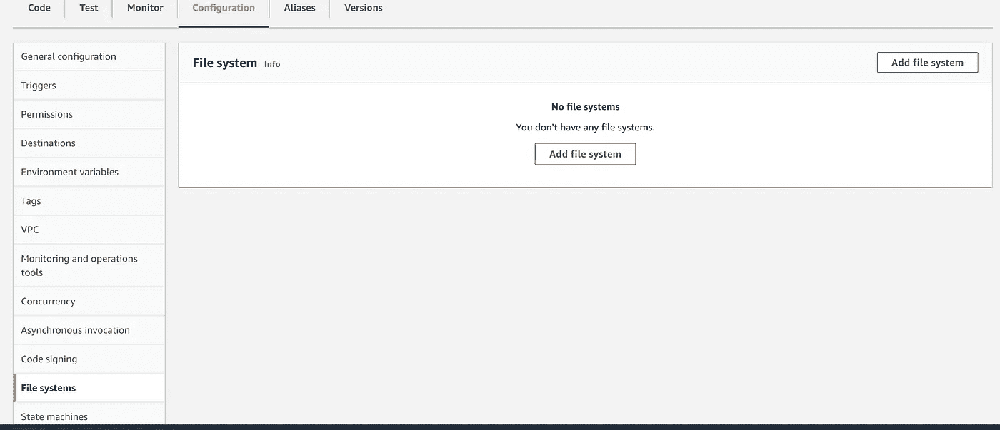

单击“Add file system”按钮将允许您选择我们之前创建的文件系统和访问点。

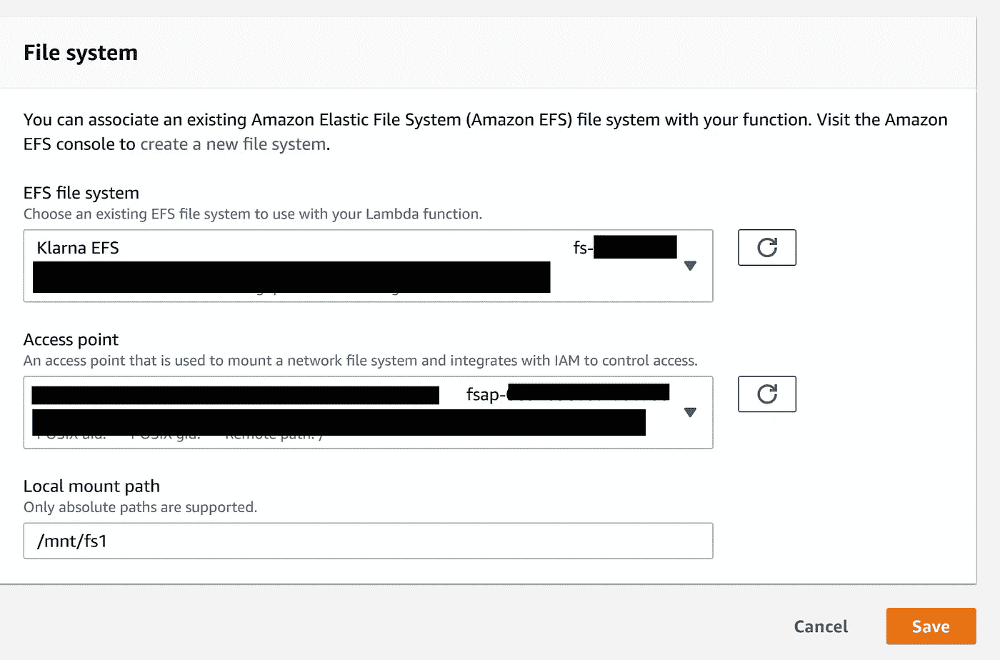

Lambda 中的文件系统设置

请注意，这里的挂载路径略有不同。只需复制这个路径，我们将在环境变量部分使用它。

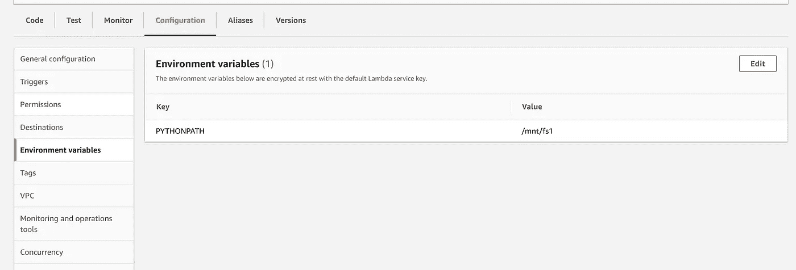

环境变量

对于 Python，我们有 PYTHONPATH 环境变量。在“环境变量”选项卡下，只需单击“编辑”并添加此变量，使用我们在上一步中使用的挂载路径(即/mnt/fs1)。对于 node.js 应用程序，您可以设置 NODE_PATH 变量等等。

现在你都准备好了。你安装的包可以直接从你的 Lambda 函数中加载，不需要做任何其他事情。您还可以从同一个 Lambda 函数中访问添加到 EFS 的其他文件。