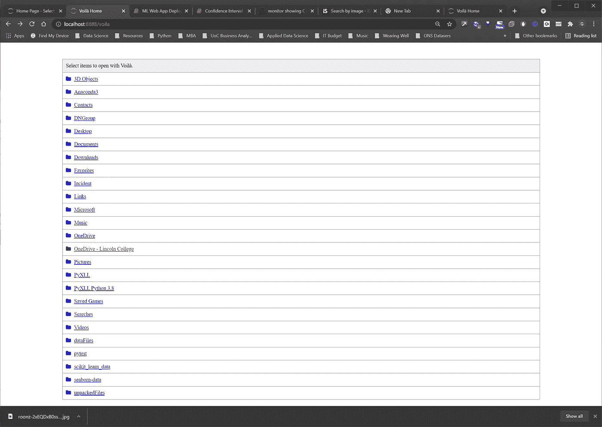
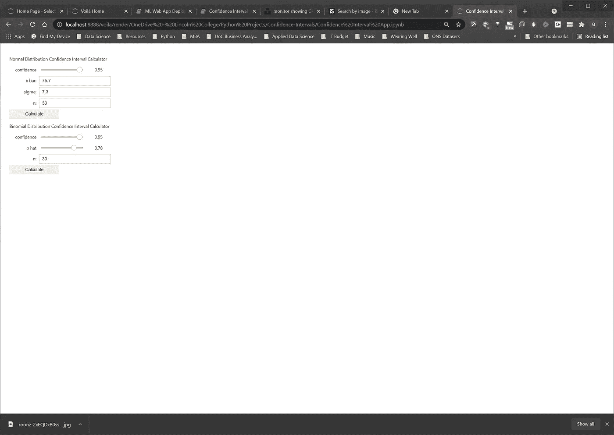
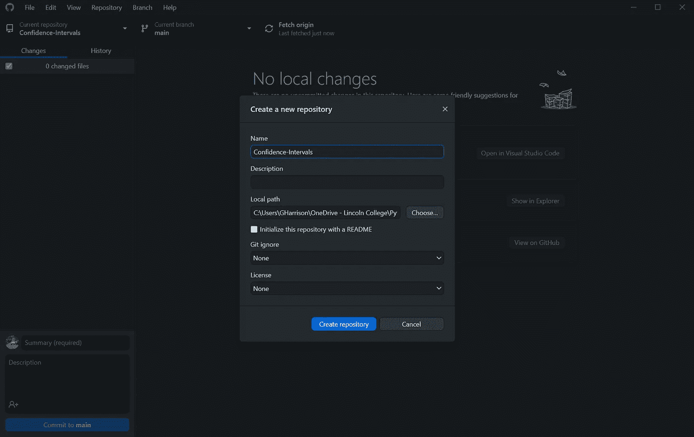
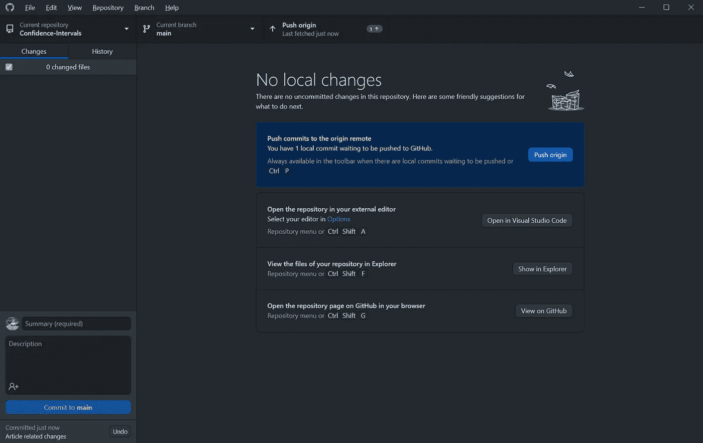
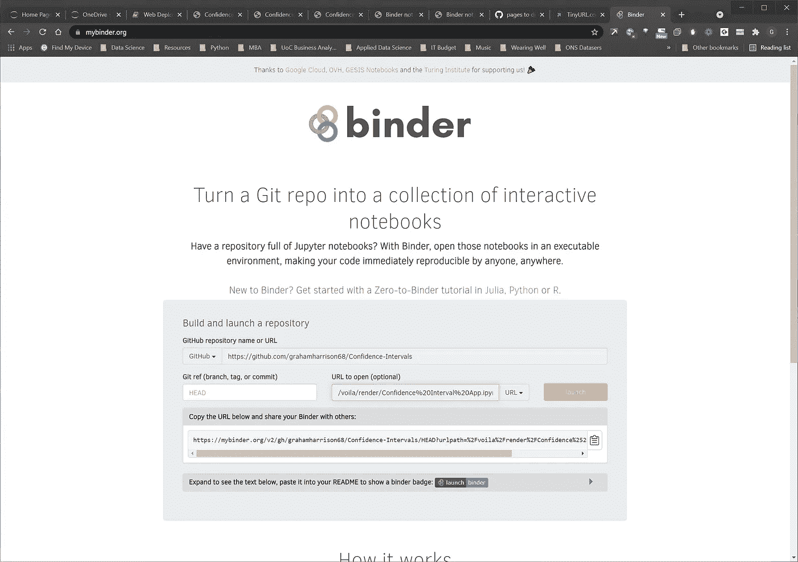
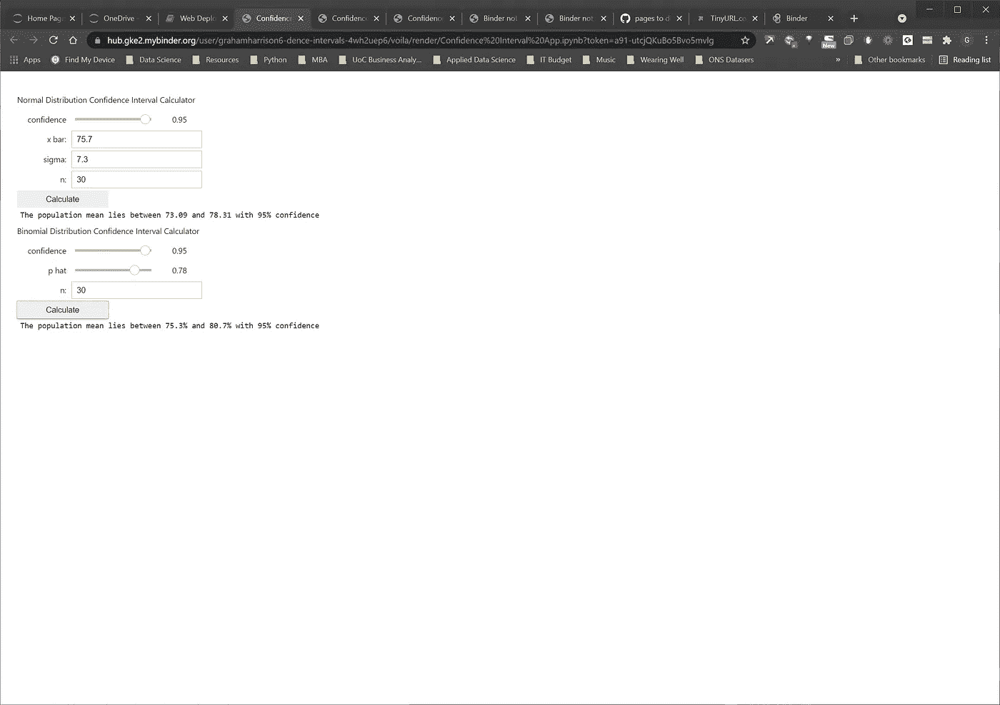
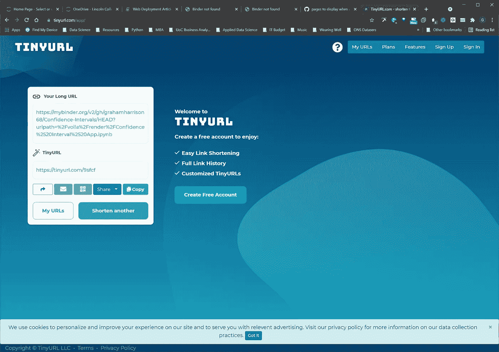

# 将机器学习和数据科学项目部署为公共 Web 应用程序

> 原文：<https://towardsdatascience.com/deploying-machine-learning-and-data-science-projects-as-public-web-applications-3abc91088c11?source=collection_archive---------12----------------------->

## [实践教程](https://towardsdatascience.com/tagged/hands-on-tutorials)

## 如何从本地 Jupyter 笔记本开发环境中获取数据科学项目，并将其发布为公开可用的 web 应用程序


由[隆兹](https://unsplash.com/@dlanor_s?utm_source=unsplash&utm_medium=referral&utm_content=creditCopyText)在 [Unsplash](https://unsplash.com/s/photos/deploy-code?utm_source=unsplash&utm_medium=referral&utm_content=creditCopyText) 上拍摄的照片

# 介绍

许多有用的机器学习和数据科学应用是在 Jupyter 笔记本环境中开发的，但是当它们完成并准备好与内部客户或外部数据科学社区共享时，这些笔记本如何共享呢？

有许多不同的方法可以实现这一点，但这篇文章解释了如何使用 voila 和 mybinder 部署 Jupyter 笔记本，使用这种方法是因为它快速、有效且免费。

在配置和设置方面有一些细微差别，本文的其余部分将通过详细的解释和屏幕截图，以易于遵循的步骤解释如何实现这种部署…

# 第一步:在笔记本上写一个“应用程序”

第一步是在 Jupyter 笔记本中编写一个“应用程序”，它可以以用户可以与之交互的方式显示或呈现。

大多数数据科学家更熟悉编写机器学习算法，而不是 web 应用程序，但幸运的是，有一个易于使用的库，使 Jupyter 笔记本能够作为 web 应用程序交付，这就是 IPython widgets (ipywidgets)。

解释如何使用 ipywidgets 创建一个交互式应用程序超出了本文的范围，但是网上有一套优秀的文档可以帮助您入门——[https://ipywidgets.readthedocs.io/en/stable/user_guide.html](https://ipywidgets.readthedocs.io/en/stable/user_guide.html)

## 步骤 1a:创建示例应用程序

我们将需要一个使用 ipywidgets 的应用程序来用于这个示例，为此，我修改了我在以前的一篇文章中写的一个笔记本，该笔记本计算正态和二项式分布的置信区间。

如果你想看看这篇文章，其中包含了所有的细节和解释，请看看这个链接—[https://towards data science . com/how-to-build-an-interactive-confidence-interval-calculator-in-python-6 EAA 08d 69 be 3](/how-to-build-an-interactive-confidence-interval-calculator-in-python-6aea08d69be3)

同时，这是修改后的代码，将用于我们的示例-

它看起来比实际更复杂，因为每个控件都有单独的代码行，但是如果您想要详细的代码解释，只需使用我以前文章的链接即可—[https://towards data science . com/how-to-build-a-interactive-confidence-interval-calculator-in-python-6 EAA 08d 69 be 3](/how-to-build-an-interactive-confidence-interval-calculator-in-python-6aea08d69be3)

# 步骤 2:在本地部署应用程序

我们现在有一些数据科学代码来计算 Jupyter 笔记本中呈现的置信区间。输出组织得相当好，运行得相当好，但是有几个问题-

1.  如果我们想将它分发给用户，这些用户必须能够访问 Jupyter 笔记本环境。
2.  代码都混在“应用程序”中，这可能会让那些只想使用计算器而不关心它是如何实现的用户感到困惑。

这就是 Voilà Jupyter 服务器扩展的用武之地。

一旦 Voilà安装完成，它将像 Jupyter 一样运行笔记本电脑，但有一个重要的区别。它去掉了所有的单元格输入，只留下包含 ipywidgets 和 markdown 的输出。通过这种方式，python 代码被删除，剩下的就是一个功能完整的 web 应用程序。

Voilà必须按照以下方式安装-

1.  通过从命令行运行`pip install voila`或从 Jupyter 笔记本内部运行`!pip install voila`来安装 voila 库。
2.  通过在命令行运行`jupyter serverextension enable voila –sys-prefix`或者在笔记本中使用前缀`!`来启用扩展。
3.  重新启动计算机，否则新的服务器扩展不会被选中，也不会启动。

安装并运行 Voilà后，您可以将任何笔记本电脑作为 web 应用程序运行，如下所示-

1.  启动 Jupyter 笔记本应用程序。
2.  编辑地址栏中的网址，将`/tree`替换为`/voila`，如果你使用的是端口 8888 - `http://localhost:8888/voila` -



作者图片

3.浏览文件夹结构，直到找到要作为 web 应用程序运行的笔记本，然后单击。ipynb 笔记本文件。

您的笔记本现在将呈现为一个全功能的 web 应用程序-



作者图片

如果您想查看 Voilà的完整文档，请使用此链接—[https://voila.readthedocs.io/en/stable/index.html](https://voila.readthedocs.io/en/stable/index.html)。

恭喜您，您现在拥有了一个完整的、可工作的 web 应用程序，可将数据科学代码直接部署到 web 浏览器用户界面中！

唯一的问题是，你是这个世界上唯一可以使用它的人，这有点违背了网络应用的目的…

# 步骤 3:将应用程序部署到 Github

为了公开部署这款应用，我们需要使用另外两个工具——GitHub 和 mybinder。GitHub 将用于保存一个公开可用的 web 应用程序源代码库，mybinder 将用于托管应用程序及其运行时环境，并向用户提供一个公开的 URL。

创建 GitHub 存储库有几种方法。一些数据科学家喜欢使用命令行来完成这项工作，但我更喜欢使用 GitHub 桌面应用程序。如果你还没有桌面应用程序，而你想完全按照下面的步骤操作，你需要使用此链接[https://desktop.github.com/](https://desktop.github.com/)下载并安装它。

您还需要一个 GitHub 帐户，您可以通过访问 GitHub 主站点—【https://github.com/】T2 来创建该帐户。

启动 GitHub 桌面应用程序，选择“文件|新建存储库”…



作者图片

很长一段时间，我发现库的创建是反直觉的，我努力在正确的地方创建我的代码库。我发现这些建议非常有用-

1.  当创建一个想要上传到 GitHub 作为资源库的文件夹时，不要在名称中使用任何空格。例如，使用“置信区间”而不是“置信区间”。
2.  您在“名称”框中选择的名称必须与存储代码和项目文件的文件夹名称完全匹配。
3.  “本地路径”必须准确地指向您用来存储代码的文件夹的父文件夹，而不是指向文件夹本身(这一点非常重要，因为如果您弄错了，您将得到一个空的存储库，这是我一直弄错的一步！).
4.  出现提示时，您应该为您的私有代码选中“私有”，但对于公共 web 应用程序和 mybinder 项目，您必须取消选中“私有”，以便新存储库是公共的，即任何人都可以浏览并查看它(但不能更改它)。

现在，您可以使用 GitHub 桌面作为您的“命令中心”,通过提交和推送更改、在您选择的外部编辑器中打开代码、在文件资源管理器中查看存储库文件或在 GitHub 中在线打开存储库页面，与您的 GitHub 源代码存储库进行交互..



作者图片

在这个阶段，我们有一个工作的本地 web 应用程序，我们已经将它部署到 GitHub 中的一个公共存储库中。接下来，我们需要在云中创建一个运行时环境来执行我们的应用程序，完成部署并创建一个公共 URL -

# 步骤 4:使用 mybinder.org 创建云运行时环境

有许多不同的基于云的工具可以用于这一步，但我选择了 mybinder.org，因为它快速、免费且易于使用。在本文结束之前，我们将探索和理解一些缺点。

## 步骤 4.1 创建一个“environment.yaml”配置文件

下一个任务很关键，我在网上没有找到太多关于它的参考资料；在使用 mybinder 创建运行时环境之前，您必须在 Jupyter 笔记本代码所在的目录下创建一个“environment.yaml”文件，然后确保它被提交并推送到 GitHub。

这个文件确切地告诉 mybinder 运行您的项目需要哪些库和先决条件。如果您还记得，我们的 web 应用程序使用了以下库…

…最重要的是，它依赖于 voila 库和相关的服务器扩展。

指示 mybinder 创建这些依赖项所需的“environment.yaml”文件如下…

```
name: voila-gallery-country-indicators
channels:
- conda-forge
dependencies:
- ipywidgets
- scipy
- numpy
- jupyterlab>=3.1
- voila>=0.2.11
```

如果你不包含“environment.yaml”文件，什么都不会起作用，如果你错过了库，你的 web 应用程序将会崩溃，如果你不包含 voila，我的 binder 将无法呈现 web 应用程序，因此遵循这一步骤至关重要。

## 步骤 4.2 将 web 应用从 GitHub 部署到 mybinder

my binder([https://mybinder.org/](https://mybinder.org/))是一个令人惊叹的云实用程序，它可以有效地从任何 GitHub 存储库中获取代码，并提供一个可配置的运行时环境来执行和交付笔记本应用程序。

让一切都正确地排列起来有点棘手，但是如果你按照本文中的步骤去做，它应该完全按照预期的那样工作。

第一步是导航到 https://mybinder.org/的 T2，输入一些非常基本的信息告诉我的 binder 在哪里可以找到你部署的应用程序

1.  在“GitHub”字段中输入 GitHub 存储库的 URL(如果您找不到 GitHub URL，只需点击 GitHub 桌面内的“打开存储库页面…”链接，它会直接将您带到那里)。
2.  点击“文件”下拉菜单，将其更改为“网址”。
3.  在“要打开的 URL”字段中，输入“/voila/render/notebook filename . ipynb”(例如/voila/render/Confidence % 20 interval % 20 app . ipynb)
4.  单击复制粘贴图标将完整的 URL 复制到粘贴缓冲区。
5.  点击“启动”按钮。

确保精确地执行这些步骤，尤其是将“文件”更改为“URL ”,并输入正确的路径到/voila/render/您的笔记本名称。

如果你得到了正确的，你会看到完整的网址包含“urlpath ”,如果你错过了第 3 步，它将包含“labpath ”,这将不会工作。

字段应该是这样的…



作者图片

单击“launch”后，mybinder 需要一点时间来构建和部署环境。在构建过程中，您将看到各种消息输出到控制台窗口，当构建完成时，您将在浏览器窗口中看到您完成的 web 应用程序…



作者图片

## 步骤 4.3 从 web 应用程序 url 中创建一个 tinyurl

请务必注意，正确的 URL 是在步骤 4.2 中复制到粘贴缓冲区的 URL，编号为第 4 项，而不是显示在浏览器 URL 栏中的 URL。正确的 URL 看起来像这样-

[https://my binder . org/v2/GH/grahamharrison 68/Confidence-Intervals/HEAD？URL path = % 2f voila % 2f fronder % 2f confidence % 2520 interval % 2520 app . ipynb](https://mybinder.org/v2/gh/grahamharrison68/Confidence-Intervals/HEAD?urlpath=%2Fvoila%2Frender%2FConfidence%2520Interval%2520App.ipynb)

每次您或用户访问正确的 url 时，它都会在浏览器中解析成不同的最终 URL，但是在步骤 4.3 中复制到粘贴缓冲区中的 URL 是永久的，并且可以通过访问 https://tinyurl.com/app/的[转换成 tinyurl](https://tinyurl.com/app/)



作者图片

您可以通过访问此链接来试用我已完成和部署的置信区间计算器—【https://tinyurl.com/9sfcf 

# 结论

这涉及到很多步骤，你必须把它们都做好才能达到目的，但是这个目的是值得努力的！

一旦您以这种方式部署了一个机器学习或数据科学应用程序，只需片刻即可完成下一个应用程序，然后您就可以快速、高效、免费且易于使用的方式将您的 Jupyter 笔记本电脑作为全功能网络应用程序共享给客户、同事和同行。

我注意到的一个缺点是，没有办法发布一个公共的 web 应用程序，只能将程序代码保密；您必须在您创建的 GitHub 存储库中公开您的代码，否则 mybinder 阶段无法工作。

这可能是 mybinder 的未来功能，我想在某个阶段，他们可能会发布带有附加功能的付费版本，这样的事情就可以完成了。

另一个主要缺点是，这个过程有点笨拙，而且很容易犯错误，没有将 mybinder.org 页面中的“文件”下拉列表改为“URL ”,如果弄错了，就会阻止 web 应用程序打开。

作为最后一个提示，我总是将 bear 最少的代码放在 GitHub 的应用程序库中，只有当我对它的完成感到满意时才发布它，这样它就不需要不断地重新发布，这可能会影响到你已经将链接分发给的最终用户。

总之，一旦你学会了这些怪癖，这是一个相对简单的过程，如果你按照本文中的步骤去做，它每次都会起作用。

您可以从我的 GitHub 资源库下载完整的源代码

*   [https://github.com/grahamharrison68/Confidence-Intervals](https://github.com/grahamharrison68/Confidence-Intervals)
*   [https://Github . com/grahamharrison 68/Public-Github/tree/master/Web % 20 deployment](https://github.com/grahamharrison68/Public-Github/tree/master/Web%20Deployment)

# 感谢您的阅读！

如果你喜欢读这篇文章，为什么不去 https://grahamharrison-86487.medium.com/的[看看我的其他文章呢？此外，我很乐意听到您对这篇文章、我的任何其他文章或任何与数据科学和数据分析相关的内容的看法。](https://grahamharrison-86487.medium.com/)

如果你想联系我讨论这些话题，请在 LinkedIn 上找我—【https://www.linkedin.com/in/grahamharrison1 或者发电子邮件给我[ghar rison @ Lincoln college . AC . uk](mailto:GHarrison@lincolncollege.ac.uk)。

如果你想通过订阅来支持作者和全世界 1000 个为文章写作做出贡献的人，请使用这个链接——[https://grahamharrison-86487.medium.com/membership](https://grahamharrison-86487.medium.com/membership)(注意:如果你使用这个链接注册，作者将收到一定比例的费用)。