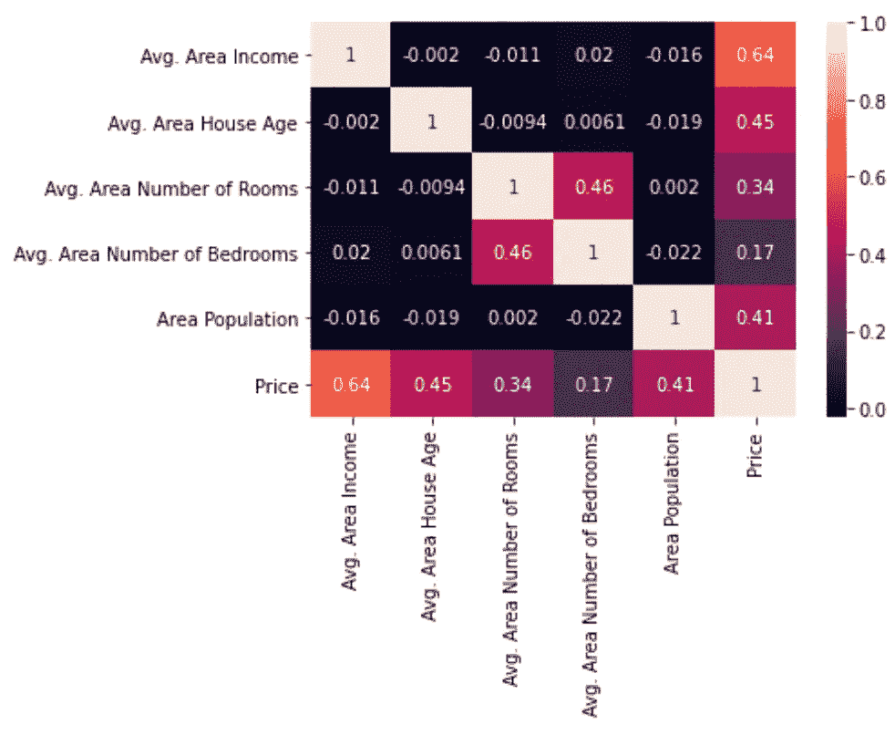
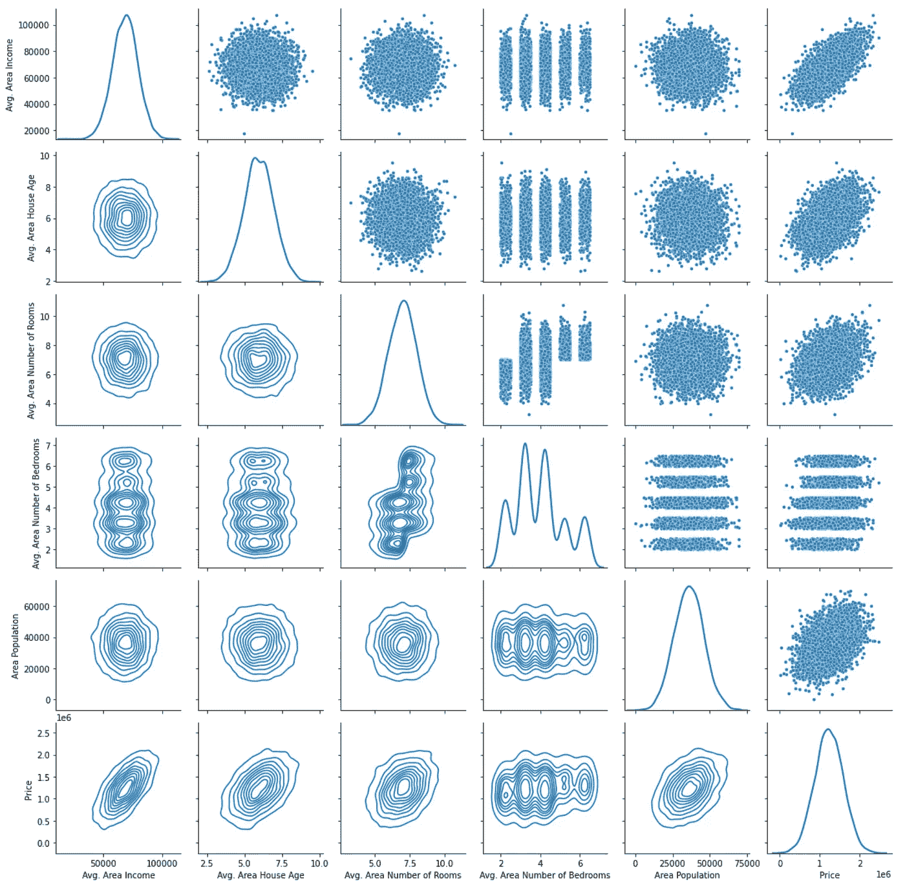
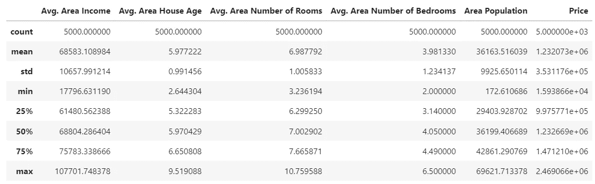
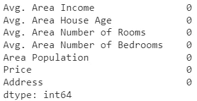
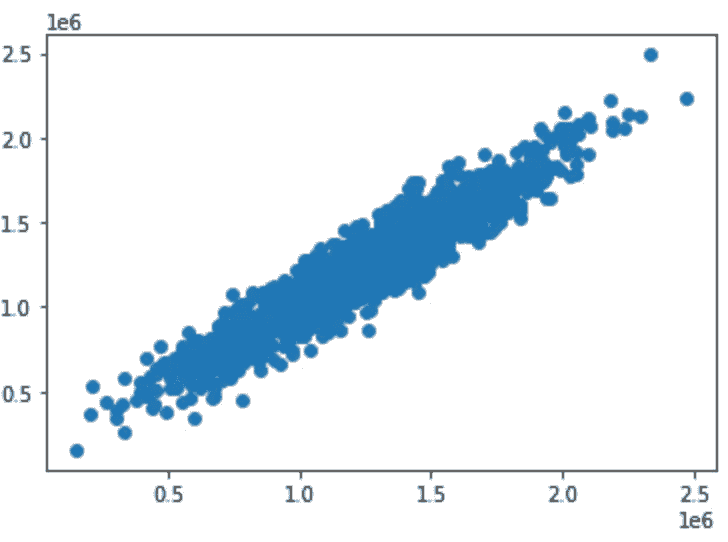
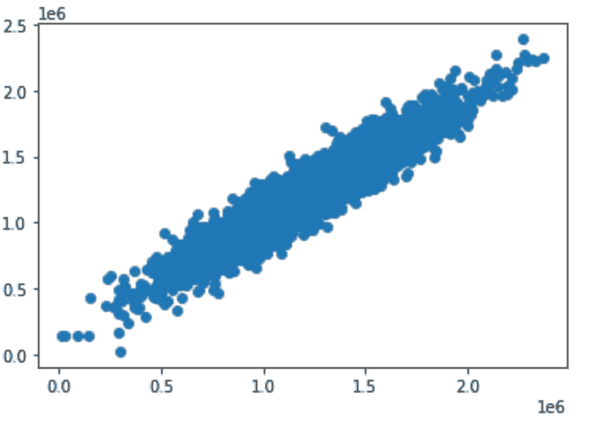
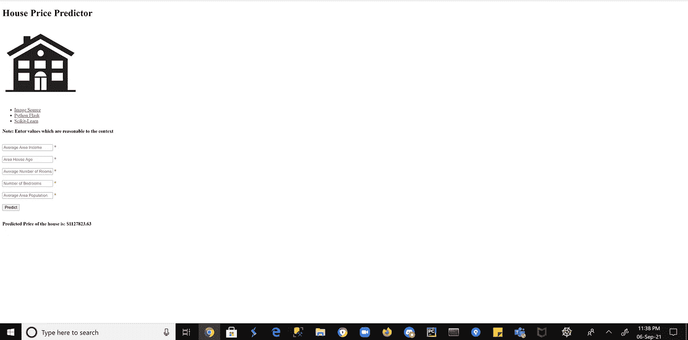
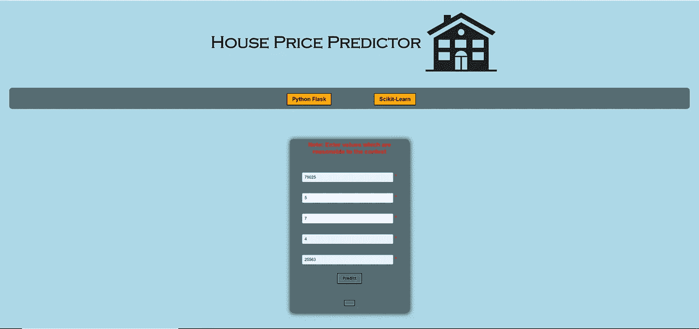
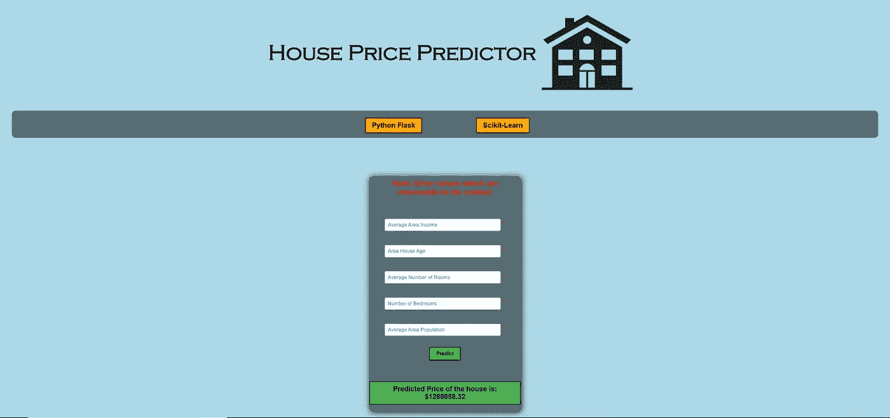

# 使用 Flask 将机器学习模型部署到网站中

> 原文：<https://towardsdatascience.com/deploying-machine-learning-models-into-a-website-using-flask-8582b7ce8802?source=collection_archive---------8----------------------->

## 从模型开发到应用…一段有趣(有时也不愉快)的旅程。


内森·达席尔瓦在 [Unsplash](https://unsplash.com?utm_source=medium&utm_medium=referral) 上的照片

经过 3 年多对数据科学领域关键概念的研究，开发实施、设计和评估机器学习和预测模型的必要技能已成为常态。

然而，随着对具有将机器学习模型集成和部署到各种软件架构中的技能的专业人员的需求开始飙升，其应用程序继续以指数速度增长。

有趣的是，在我迄今为止的学术经历中，很少或没有接触到部署这种模型。大学和学院过于强调机器学习的理论**而没有展示其背后的实用性。**

让我们面对现实吧，如今许多数据科学专业人士都是全栈式的。

我说的全栈是什么意思？实际上，现在你应该在数据科学开发周期的每一步**中都掌握一些技能，从需求/业务分析开始，一直到将这些模型扩展和部署到公司的现有基础设施中。**

数据科学家的技能在不断变化，这些技能包括:

*   数学:微积分、线性代数、最优化、统计/概率。
*   计算机科学:算法、数据结构、编程
*   人工智能:神经网络，分类，回归，聚类，调整。
*   最近，软件工程实践:版本控制，文档，测试。

更不用说特定领域的知识了。

正是因为这些技能，我们现在被认为是“万金油……无所不能的大师”，或者换句话说是“独角兽”(不是字面上的意思)。

然而，这提出了一个有趣的问题…

如果这些实用的概念不在他们的学习中出现，毕业生们又如何能跟上这些日益增长的需求呢？

答案是，**项目…很多项目。**

事实上，我们不能改变教育体系，我们必须主动在其他地方拓展我们的技能。如果你对进入 STEM 感兴趣，请了解…

你必须全身心地投入到学习的生活中。

在很多情况下，课外学习。

在本文中，我将介绍我最近的一个个人项目，该项目旨在使用 Python 的 Flask 框架将预测房价的多元线性回归模型部署到一个网站应用程序中。

所以系好安全带，让我们开始吧！

首先，我们需要涵盖这个应用程序的一些关键指标和目标。

目标？预测美国某些大都市地区的房价。

我们还需要了解一些要观察和研究的关键变量/指标。使用来源于 Kaggle 的数据集:

美国住房:[https://www.kaggle.com/vedavyasv/usa-housing](https://www.kaggle.com/vedavyasv/usa-housing)

要观察的变量有:

*   平均地区收入
*   平均面积房屋年龄
*   房间的平均面积数量
*   卧室的平均面积数量
*   区域人口
*   价格
*   地址

首先，“地址”与我们的分析无关，因为我们的预测是基于数字变量。

应用程序的目的是预测房屋的价格，因此我们的响应变量将是“价格”。至于地区收入、房龄、房间数量、卧室数量和地区人口，它们可以显著影响房屋的价格。

现在，让我们对数据集进行一些探索性分析。



查看上面的关联热图，我们可以看到，所有 6 个预测变量之间的大多数正面响应都与响应变量“价格”有关。有趣的是，Avg 之间似乎存在正相关关系。卧室面积和平均面积。房间数量。我们还可以观察到，最大的相关性是在 Avg。收入和价格。考虑到房屋的质量和价值可能取决于该地区的平均收入，这一点尤其有意义。

现在让我们看看其他一些观察结果:



我们可以看到，所有变量中的大多数都是正态分布的。“卧室面积数”具有不同程度的分布和概率。至于右边的散点图，除了“平均”,所有变量似乎都显示出正的线性趋势。卧室面积数”。因此，卧室的数量可能不会对结果产生积极影响。

让我们来看看一些样本统计数据:



我们有足够数量的相同大小的样品。这可能是为什么我们的变量是正态分布的原因之一，与**中心极限定理**联系在一起。

此外，大多数 50%的人:

*   “平均地区收入”的收入在 75，783.34 美元和 61，480.56 美元之间。
*   “平均房龄”在 6.65 到 5.32 岁之间。
*   “平均房间数”在 7.67 至 6.30 间房间之间
*   “平均面积:卧室数量”有 4.49 和 3.14 间卧室
*   “地区人口”分别为 42861.29 人和 29403.93 人
*   “价格”介于 1417210 美元和 997577 美元之间

最后，让我们检查空值:



谢天谢地，我们没有。

因此，我们可以得出结论，除了卧室数量之外，所有变量都是正态分布和相关的，没有空值。

现在我们对数据背后有了一些了解，让我们开始讨论我们的数据，以获得正确的预测和响应变量。我们还将把它们的数据类型转换成整数:

不久之后，我们将把数据分成训练集和测试集，并开始模型拟合:

让我们来看看模型的性能:

该模型显示训练集的 R2 分数为 89.396%，测试集的为 89.028%。这表明我们的模型显示了我们的反应和预测变量之间的强线性关系和趋势。让我们也看看 RMSE 以及我们的预测的可视化:

我们的模型的 RMSE 为 114729.221，这表明我们的残差在很大程度上从最佳拟合线分散开来，表明其周围的残差集中度较低。但是请记住，RMSE 是**规模依赖的**，没有一个具体的阈值来衡量好坏，但根据经验法则……**越小越好**。



散点图 y _ 测试与预测



y_train 与预测值的散点图

至于图，预测值与真实值显示了强有力的、积极的和线性的关系，具有良好的相关性，因此可以用前面的 R2 分数来解释。

总的来说，至少可以说是一个不错的模型，但从长远来看，我们可以改进它。现在，让我们开始在 Flask 中部署它，这是这个项目的焦点。

首先，我们需要保存我们的模型。通过 pickle 库，我们将使用以下脚本来保存我们的回归模型:

理解 Flask 的基本机制花了我几个小时来理解，特别是路由、设置我的环境和创建我的工作树目录。但是在最终理解了这些概念之后，我带着下面的程序来了:

上面的代码有助于控制我们网站的路由和模板使用。具体来说，def predict()负责返回给定用户输入的预测房价，这些输入是使用 request.form.values()收集的。最后，我们在 debug 设置为“True”的情况下运行应用程序，这样我们就可以在本地设备上看到网站的开发和环境状态。

我还使用了下面的树形目录来完成这个项目:

```
/project
   app.py
   model.py
   model.pkl

   /template
      /index.html #home page
   /static
      /img #all images stored in this folder
      /styles #all CSS styles are stored here 
```

最后，我们的 html 文档的基本结构是:

当我们在命令提示符下运行程序时(在我的例子中是 Anaconda，因为我的程序在 Anaconda 虚拟环境中运行)，我们会得到下面的 web 页面:



很可怕吧？让我们用下面的 CSS 样式来改进设计:

请原谅我和我的 CSS 和 HTML 脚本的笨拙。我真的需要找到更多的机会来使用它。

看，最终产品:



按下“预测”，我们会得到一个预测价格…



现在看看那些前端开发人员…现在正在坟墓里打滚…

我本来可以添加一个更令人印象深刻的背景图片，但你知道…版权是一个问题。

有趣的是，CSS 样式花费的时间比开发应用程序和模型加起来还要长。

这个项目，虽然从整体上看相对简单，但却是我完成的所有项目中最有洞察力的。为什么你会问？因为从头开始构建一个 ML 应用程序，而不是纯粹地展示和报告您的发现，这种感觉是纯粹的狂喜。爱它的每一分钟:)

也许，在不久的将来，我甚至会在 Heroku 甚至 AWS 上部署它！好吧，现在让我们把注意力集中在设计上，不要想太多。学习是一个循序渐进的过程，我们不能错过每一步。

你有它！一个相对简单的应用程序，结合了最好的理论和实践。此外，它还深入介绍了用于开发这些应用程序的一些技术和框架。这个微不足道的网站需要 3 种不同的语言，多个框架…和一些脑细胞。但最终这一切都是值得的，这是一次前所未有的学习经历。

希望这篇文章能够启发你在不久的将来开发更复杂的应用程序和 ML 模型！

记住，学习不仅仅局限于你的学习，在其他地方探索和征服那些技能！