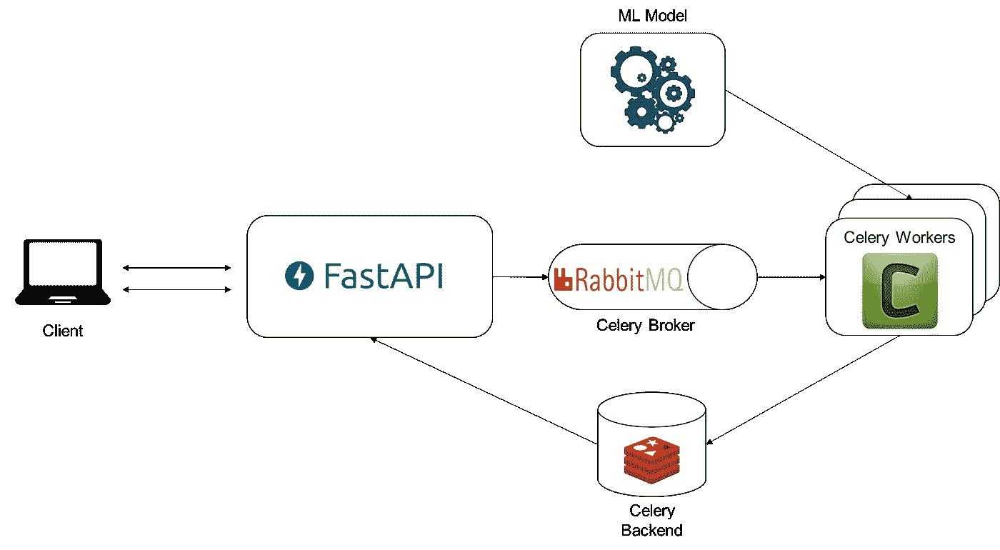

# 为生产中的 ML 模型提供 FastAPI 和芹菜

> 原文：<https://towardsdatascience.com/deploying-ml-models-in-production-with-fastapi-and-celery-7063e539a5db?source=collection_archive---------2----------------------->

## 使用异步 Celery 任务和 FastAPI 为您的模型服务的完整工作示例。


阿诺·弗朗西斯卡在 [UnSplash](https://unsplash.com/) 上的照片

## 概观

网上有大量关于建立和训练各种机器学习模型的材料。然而，一旦一个高性能的模型被训练出来，将它投入生产的材料就少得多了。

这篇文章介绍了一个使用 Celery 和 FastAPI 服务 ML 模型的工作示例。所有代码都可以在[这里](https://github.com/jonathanreadshaw/ServingMLFastCelery)的资源库中找到。

***我们不会专门讨论本例中使用的 ML 模型，但是它是使用示例银行客户流失数据(***[【https://www.kaggle.com/sakshigoyal7/credit-card-customers](https://www.kaggle.com/sakshigoyal7/credit-card-customers)***)进行训练的。存储库中有一个笔记本，概述了 LightGBM 模型的培训，包括超参数优化和性能评估。***

## 潜在选项

下面总结了将训练好的模型部署到生产中的可能方法:

1.  直接在应用程序中加载模型:这个选项包括直接在主应用程序代码中加载预训练的模型。对于小型模型，这可能是可行的，但是大型模型可能会引入内存问题。这个选项还在主应用程序中引入了对模型的直接依赖(耦合)。
2.  离线批量预测:不需要接近实时预测的用例可以使用这个选项。该模型可用于对以规定时间间隔运行的流程中的一批数据进行预测(例如，一夜之间)。一旦批处理作业完成，应用程序就可以利用这些预测。只有在批处理运行时才需要用于预测的资源，这可能是有益的。
3.  API:第三种选择是将模型部署为自己的微服务，并通过 API 与之通信。这将应用程序从模型中分离出来，并允许从多个其他服务中利用它。ML 服务可以以下面描述的两种方式之一来服务请求。

同步:客户端请求预测，并且必须等待模型服务返回预测。这适用于需要少量计算的小型模型，或者客户端在没有预测的情况下无法继续其他处理步骤的情况。

异步:模型服务将返回任务的唯一标识符，而不是直接返回预测。当模型服务完成预测任务时，客户可以自由地继续其他处理。然后可以使用唯一的任务 id 通过结果端点获取结果。

## 工艺流程

以下步骤描述了处理预测请求所采取的操作:



架构示例(图片由作者使用来自[维基共享](https://commons.wikimedia.org/wiki/Main_Page)的标识)

1.  客户端向 FastAPI 预测端点发送 POST 请求，请求体(JSON)中包含相关的特性信息。
2.  FastAPI 根据定义的模型验证请求主体(即检查是否提供了预期的功能)。如果验证成功，则创建芹菜预测任务，并将其传递给已配置的代理(例如 RabbitMQ)。
3.  如果任务创建成功，唯一 id 将返回给客户端。
4.  预测任务由代理交付给一个可用的工作者。一旦交付，工人使用预先训练的 ML 模型生成预测。
5.  生成预测后，使用 Celery 后端(例如 Redis)存储结果。
6.  在步骤 3 之后的任何时候，客户机都可以使用惟一的任务 id 开始轮询 FastAPI 结果端点。一旦预测就绪，它将被返回给客户端。

现在让我们看一些实现这个架构的示例代码。

## 项目结构

项目结构如下:

```
serving_ml
│   app.py
│   models.py
│   README.md
│   requirements.txt
│   test_client.py
│
├───celery_task_app
│   │   tasks.py
│   │   worker.py
│   │   __init__.py
│   │
│   ├───ml
│   │   │   model.py
│   │   │   __init__.py
```

*   *app.py* :包含路线定义的 FastAPI 应用。
*   *models.py:* 用于 API 验证和响应结构的 Pydantic 模型定义。
*   *test_client.py* :用于测试设置的脚本。我们稍后将更详细地讨论这一点。
*   *celery _ task _ app \ tasks . py:*包含 Celery 任务定义，具体来说就是我们案例中的预测任务*。*
*   *celery _ task _ app \ worker . py:*定义 celery 应用程序实例和相关配置。
*   *celery _ task _ app \ ml \ model . py:*用于加载预训练模型和服务预测的机器学习模型包装类。

## ML 模型

首先，让我们看看我们将如何加载预训练模型和计算预测。下面的代码为预训练模型定义了一个包装类，它在创建时从文件中加载，并在其 predict 方法中计算类概率或成员资格。

只要模型有 predict 和 predict_proba 方法(即 Scikit-Learn 或 Keras 实现)，这个实现就可以在各种 ML 模型中重复使用。

在我们的示例中，保存的模型实际上是一个 Scikit-Learn 管道对象，它包含一个预处理步骤，因此我们不需要担心在预测之前有额外的预处理代码。我们可以简单地用特征数据创建一个数据帧，并调用管道预测方法。

## 芹菜

Celery 是一个简单的任务队列实现，可以用来跨线程和/或机器分配任务。实施需要一个代理和一个后端(可选):

*   Broker:这是用来在客户和工人之间传递消息的。为了启动一个任务，客户机向队列中添加一条消息，然后代理将这条消息传递给一个工人。RabbitMQ 通常用作代理，并且是 Celery 使用的默认设置。
*   后端:这是可选的，它唯一的功能是存储任务结果以备日后检索。Redis 常用作后端。

首先让我们看看如何定义我们的芹菜应用程序实例:

这个应用程序定义非常简单，但是可以定义大量的附加配置选项(例如时区、序列化)。

*include* 参数用于指定为 Celery 应用程序定义任务的模块。在这种情况下，我们在 *tasks.py:* 中定义一个任务

我们的任务实现比平常稍微复杂一些。大多数简单的任务可以使用 task decorator 来定义，它覆盖了 Celery 的基本任务类的 run 方法。然而，如果我们使用这种方法，它将导致定义一个模型类，并因此为每个处理的任务从磁盘加载。

通过扩展 Celery 任务对象，我们可以覆盖默认行为，这样 ML 模型只在任务第一次被调用时加载一次。随后的调用可以使用相同的加载模型。

尽管这比每次运行任务时都加载模型要好，但仍有一些注意事项:

1.  每个工作进程都有一个 PredictTask 对象。因此，如果一个工作线程有四个线程，那么模型将被加载四次(每个线程都存储在内存中……)。
2.  这为每个工作进程引入了一个冷启动场景，其中第一个任务会很慢，因为需要加载模型。有不同的方法可以用来解决这个问题，而任务是异步的这一事实使得这个问题变得不那么严重。

然后我们可以使用通常的装饰方法并指定 *base=PredictTask* ，这样 Celery 就知道使用我们的自定义任务类而不是默认的。 *bind* 参数允许我们使用 *self* 访问模型属性(就像我们直接在类中定义 run 方法一样)。

## FastAPI

最后，我们可以创建一个 API 来生成任务，并根据客户端请求从后端获取结果。

需要两个端点:

*   …/churn/predict (POST):客户端发送包含所需特性的 JSON。返回了唯一的任务 id。
*   …/churn/result/ <task_id>: (GET):检查任务结果在后端是否可用，如果可用则返回预测。</task_id>

我们按如下方式实现这些端点:

在结果路由中实现特定的响应，以处理任务结果未准备好的情况。客户机可以用它来轮询结果端点，直到结果准备好(我们将用它来测试……)。

## 测试

为了检查一切是否按预期工作，我们可以创建一个单独的 Python 脚本来模拟预测请求。为此，我们利用 Python 的*请求*包。

一旦代理和后端服务器都在运行，我们就可以使用 uvicorn 启动 API:

```
uvicorn app:app
```

接下来启动一个工作进程:

```
celery -A celery_task_app.worker worker -l info
```

运行 *test_client.py* 将执行以下操作(代码见 repo):

1.  一个示例特征 JSON 被发送到预测端点。这些特性被硬编码在脚本的字典中。
2.  如果成功，返回的任务 id 将用于轮询结果端点。在每次请求之间，虚拟客户端将等待 5 秒钟，最多尝试 5 次。
3.  如果任务成功，结果(在这种情况下，属于类 1 的概率)将被打印出来。

```
(venv) python.exe test_client.py
0.011178750583075114
```

## 后续步骤

上面讨论的解决方案只是一个工作示例，应该通过更高级的 Celery 和 FastAPI 配置进行调整，以供全面生产使用。

另一种可能性是对整个解决方案进行分级，以便它可以轻松地部署在云基础架构上。