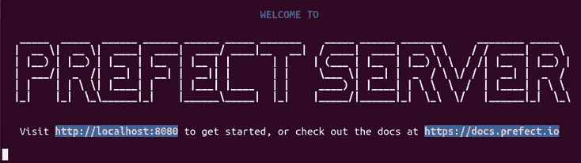
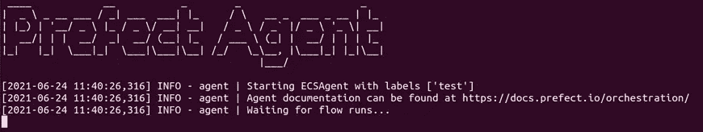
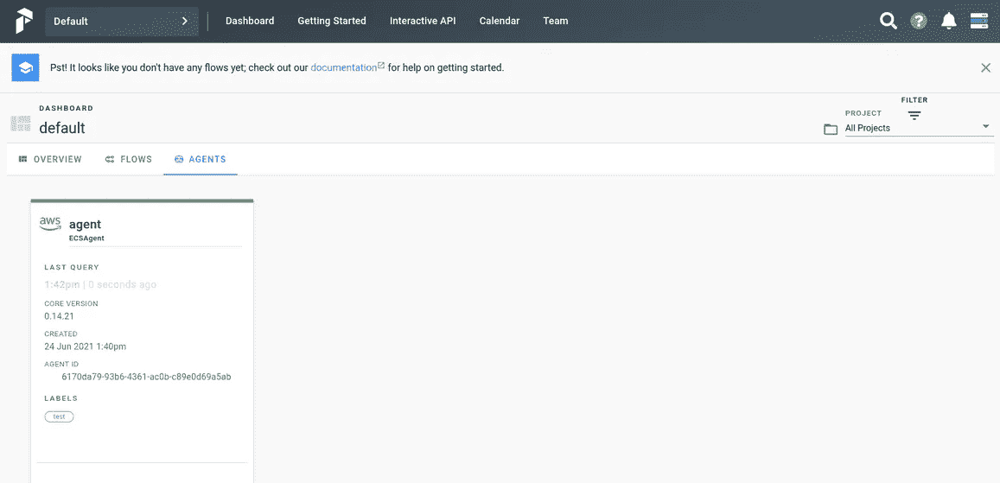
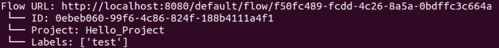
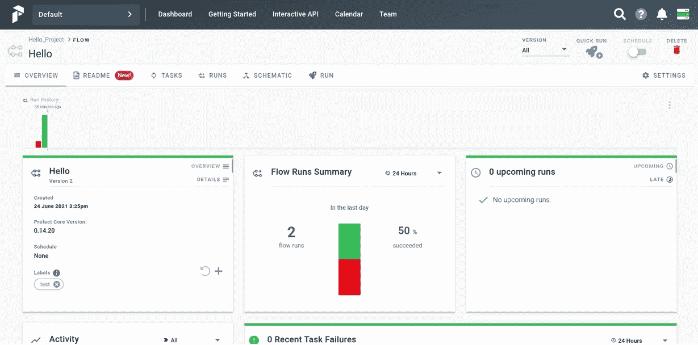
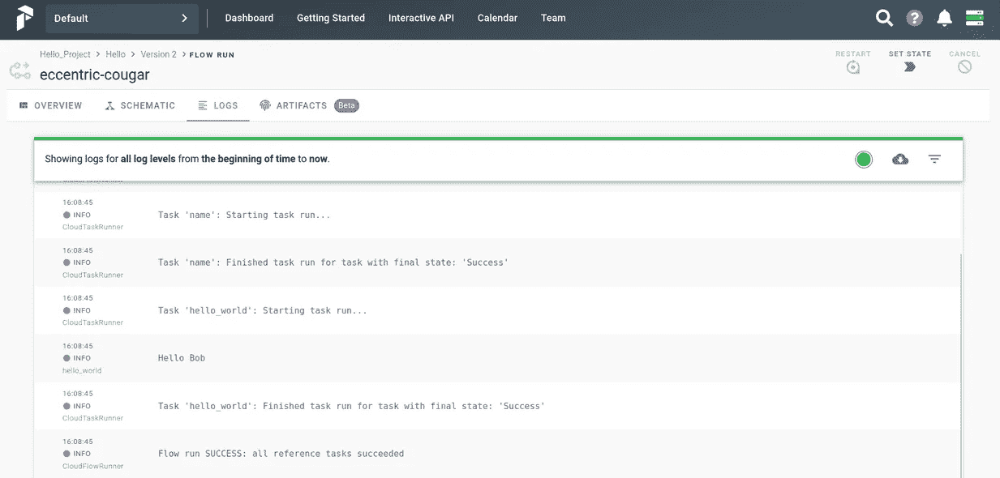

# 使用 AWS ECS 和 Docker 存储部署完美服务器

> 原文：<https://towardsdatascience.com/deploying-prefect-server-with-aws-ecs-fargate-and-docker-storage-36f633226c5f?source=collection_archive---------10----------------------->

## 如何使用在 ECS Fargate 上运行的带有私有 Docker 注册表的 Prefect 来编排和自动化工作流

这篇文章一步一步地介绍了我如何使用私有注册中心上的 Docker 存储来部署带有 Fargate ECS 集群的完美服务器。有几篇文章介绍了使用完美的云以及不同的运行器和存储组合进行部署。当我在部署这个特定的架构时遇到一些问题，我决定在本文中详述这些步骤。


约书亚·阿拉贡在 [Unsplash](https://unsplash.com?utm_source=medium&utm_medium=referral) 上拍摄的照片

本教程结束时，我们将拥有:

*   运行在 EC2 上的完美服务器
*   EC2 上运行的 ECSAgent
*   将我们的流打包到私有注册中心的 docker 映像中
*   通过 UI 和 GraphQL API 在 ECS 集群中运行流

你可以选择使用不同的[代理](https://docs.prefect.io/orchestration/agents/overview.html)和[存储](https://docs.prefect.io/orchestration/flow_config/overview.html#storage)选项，这篇文章只是对许多提督选项的基本指导。虽然我不会详细介绍 Prefect 和 AWS 的概念，但是您可以找到相关文档的参考资料来帮助您。

先决条件:

*   AWS 帐户
*   码头工人登记处
*   基本的 Python 技能

如果这是您第一次使用 Prefect，我建议您首先尝试在本地部署它，以便更容易掌握 Prefect 的概念。

# 部署完美服务器

第一步是在 EC2 实例上部署完美服务器。创建并启动 EC2 实例。当我在其上部署多个服务时，我使用了一个 *g4dn.2xlarge* 实例，但是如果您计划在其上只使用 Prefect，那么一个小实例就足够了。您需要更新安全规则，以允许端口 **8080** 上的 TCP 连接访问 UI，并允许端口 **4200** 访问后端。

如果您的实例上还没有 docker-compose 的话，您可能需要安装它。

接下来，在您的实例上安装 SSH 并运行:

```
pip install “prefect[aws]”
```

在此查看完美安装[的其他选项。](https://docs.prefect.io/core/getting_started/installation.html#optional-dependencies)

```
prefect backend server
```

创建文件 **~/。提督/配置. toml** 包含以下信息:

```
[server]
[server.ui]
apollo_url = “http://X.X.X.X:4200/graphql"
```

用您的实例公共地址替换 *X.X.X.X* ,因为它允许将 UI 连接到后端。

现在，您可以从以下内容开始:

```
prefect server start
```



完美服务器已启动

从现在开始，你可以通过 [http://X.X.X.X:8080](http://x.x.x.x:8080) 从任何机器(由你的安全规则授权)连接到 UI

# 部署 AWS 代理

代理负责启动和监控您的运行。这里，我们将它部署在与 Prefect Server 相同的 EC2 实例上。您可以选择在第二个实例上部署它，方法是[在 config.toml 文件中或通过命令行提供](https://docs.prefect.io/orchestration/agents/overview.html#prefect-api-address)完美服务器的实例 IP 地址。

在这两种情况下，您都需要添加:

```
[cloud]
api = “[http://X.X.X.X:4200](http://x.x.x.x:4200)"
```

到 config.toml 文件，用 *X.X.X.X* 把公共 IP 地址传给提督主机。

AWS 任务需要这个变量来连接到后端(即使我们运行的是 Prefect Server 而不是 Cloud)。您可以关注这个[问题](https://github.com/PrefectHQ/prefect/issues/4662)以获得关于这个端点配置的更多信息。

如果您还没有 ECS fargate 集群，那么您应该现在就创建它。使用 Prefect 不需要特殊的配置，所以根据您的任务需求进行选择。请将 ARN 集群放在身边，因为您很快就会用到它。

然后，创建一个拥有权限 [AmazonECS_FullAccess](https://console.aws.amazon.com/iam/home#/policies/arn:aws:iam::aws:policy/AmazonECS_FullAccess) 的 AWS 用户，这是为代理提供权限以代表您在 ECS 集群中启动任务所必需的。将*访问密钥 id* 和*秘密访问密钥*存储在将托管代理的实例上的配置文件中:

创建一个文件 **~/。aws/config** 包含:

```
[default]
aws_access_key_id=SECRET_KEY_ID
aws_secret_access_key=SECRET_ACCESS_KEY
region=REGION
```

现在，部署代理:

```
prefect agent ecs start -cluster arn:your-cluster-arn -label your-label
```



提督代理已启动

“群集”选项允许您指定将使用哪个群集来运行您的任务。“标签”选项允许您为代理提供标签。请注意，只有当代理的标签完全匹配时，代理才能拾取流，这有助于控制哪个代理将运行您的流。点击了解有关代理配置[的更多信息。](https://docs.prefect.io/orchestration/agents/ecs.html#requirements)

检查用户界面，你可以看到你的代理正在运行。现在提督准备运行你的流量！



代理在完美用户界面上注册

# 创建一个流程

让我们创建一个流程。以下是 Hello world job 的一个示例:

```
import prefect
from prefect.run_configs import ECSRun
from prefect.storage import Docker
from prefect import task, Flow, Parameter@task
def hello_world(name):
  logger = prefect.context.get(“logger”)
  logger.info(“Hello “+name)with Flow(“Hello”) as flow:
  name = Parameter(‘name’, default = ‘Bob’)
  hello_world(name)flow.storage = Docker(
    registry_url=’your-registry-url’,
    image_name=”hello_container”,
    base_image=”python:3.8"
  )flow.run_config = ECSRun(
  task_definition={
    ‘containerDefinitions’:[
      {
        ‘name’: ‘flow’,
        ‘image’: ‘your-registry-url/hello_container:latest’,
        ‘repositoryCredentials’: {
          ‘credentialsParameter’: ‘arn:aws:secretsmanager:your-secret-arn’
      }
    }
  ],
  ‘networkMode’ : ‘awsvpc’,
  ‘memory’:’2 GB’,
  ‘cpu’:’1024'
  },
execution_role_arn=’arn:aws:iam::your-arn-role’,
labels=[‘your-label’]
)flow.register(project_name=”Hello_Project”)
```

这个脚本定义了一个执行一个任务并接受一个输入参数“name”的流。

**flow.storage** 定义存储策略。当您想要控制流中包含哪些文件时，Docker 存储非常有用，因为其他存储选项仅存储流文件。您可以使用公共存储库，在这种情况下，您只需指定注册地址。在这里，我详细描述了私有注册中心所需的配置:

为了允许提督推送映像，在代理的实例上运行 *SSH*

```
docker login <registry_address>
```

并遵循身份验证步骤。然后，我们需要允许 ECS 集群提取图像:在 AWS 上创建一个秘密来存储您的注册表登录，这个 ARN 在 *credentialsParameter* 参数中给出。

现在，转到角色管理部分，创建一个对这个秘密具有读权限的新角色，然后在 *execution_role_arn* 中给出这个角色的 ARN。

ECS 代理允许两种类型的角色:执行和任务角色。根据您的流程，您可能需要更多的角色。有关角色的信息，请参见提督的[文档](https://docs.prefect.io/orchestration/agents/ecs.html#task-role-arn)。

这里需要 *task_definition* 参数，这是为私有注册中心提供凭证的唯一方式。*网络模式*、*内存*和 *cpu* 字段为必填字段，阅读本[文档](https://docs.amazonaws.cn/en_us/AmazonECS/latest/userguide/fargate-task-defs.html)了解更多信息

如果您使用公共注册表，您可以简单地提供注册表和映像名称。

> 当我将图像推送到注册表时，我遇到了超时，因为我的图像太大了(在我的例子中是 2GB，这是由于机器学习的依赖性)。一个快速的解决方法是手动推送第一个图像，这样具有较大依赖性的公共层已经在我的注册表中可用，下一次推送可以重用它们。

最后，根据您的代理的标签添加标签，您的流就可以注册了。

要在您的本地机器上执行 Prefect 命令，您可以安装 Prefect 并创建 **~/。比如 EC2 实例上的文件。每个提督命令现在将连接到您的提督服务器实例。**

您可以运行:

```
prefect create project ‘Hello_Project’
```

或者通过用户界面创建项目。然后，执行 python 脚本:

```
python flow.py
```

您将看到映像正在构建并被推送到您的注册表中。



注册流程

# 运行流程

然后，您可以直接从 UI 启动您的流程，快速运行允许您使用默认参数运行流程。



任务概述

您可以通过命令行触发它:

```
prefect run flow -name “Hello” -project “Hello_Project”
```

我们也可以通过 GraphQL API 启动这个流。这个方法允许您从任何地方触发一个流(这是您的 Prefect Server EC2 实例上的安全规则所允许的！)只需要一个 HTTP 请求。下面是一个使用流 ID 的示例脚本:

```
import json
import urllib.parse
import urllib.requestPREFECT__FLOW_ID = 'your-flow-id'
PREFECT__CLOUD__API='http://X.X.X.X:4200/graphql'def trigger_flow(flow_id, host):
  create_mutation = """
    mutation {
      create_flow_run(input: { flow_id: "%s" }) {
        id
      }
    }
  """ % (flow_id) inputs = dict(flowId=flow_id)
  variables = dict(input=inputs)
  data = json.dumps(
    dict(query=create_mutation, variables=json.dumps(variables))
  ).encode("utf-8") req = urllib.request.Request(host, data=data)
  req.add_header("Content-Type", "application/json") resp = urllib.request.urlopen(req) return json.loads(resp.read().decode())if __name__ == "__main__":
print(trigger_flow(PREFECT__FLOW_ID, PREFECT__CLOUD__API))
```

更多选项[此处](https://docs.prefect.io/orchestration/concepts/flow_runs.html#creating-a-flow-run)。以下是运行该脚本后产生的日志:



流量日志

# 结论

我们在本文中详细介绍了如何在 EC2 上部署一个完美的服务器，以及如何使用带有私有注册中心的 Docker 存储在 ECS 集群上运行任务。现在，您已经准备好创建自己的任务了！

资源:

*   [https://towards data science . com/server less-data-pipelines-made-easy-with-prefect-and-aws-ECS-fargate-7 e 25 BAC b450 c # 4a 07](/serverless-data-pipelines-made-easy-with-prefect-and-aws-ecs-fargate-7e25bacb450c#4a07)和[https://www . le Jimmy . com/distributed-data-pipelines-with-AWS-ECS-fargate-and-prefect-cloud/](https://www.lejimmy.com/distributed-data-pipelines-with-aws-ecs-fargate-and-prefect-cloud/)提供了关于 AWS 配置的更多细节
*   [https://docs.prefect.io/](https://docs.prefect.io/)提督文档
*   [https://prefect-slackin.herokuapp.com/](https://prefect-slackin.herokuapp.com/)提督社区懈怠