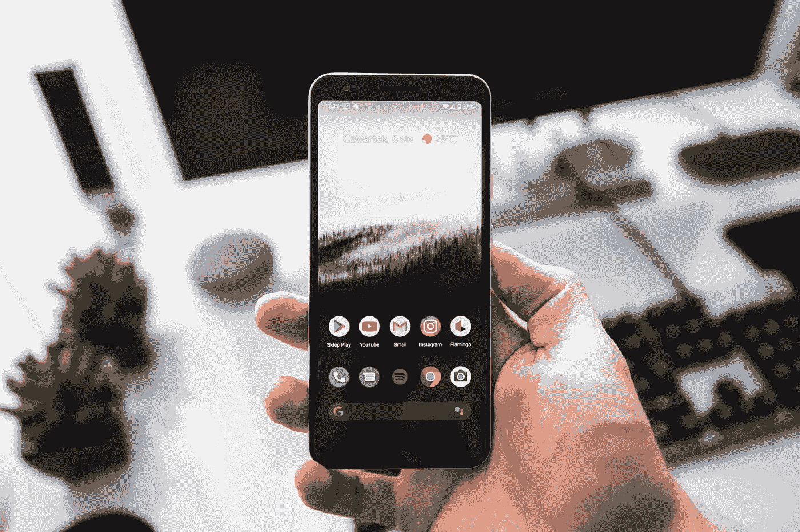
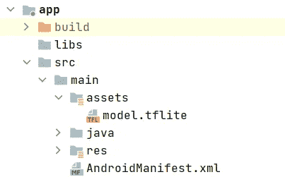
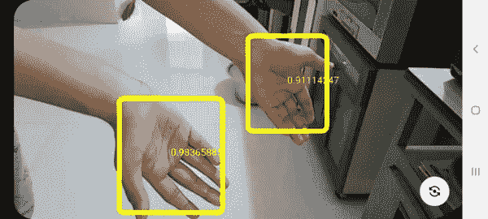

# 在 Android 上部署预训练的 TF 对象检测模型

> 原文：<https://towardsdatascience.com/deploying-pretrained-tf-object-detection-models-on-android-25c3de92caab?source=collection_archive---------10----------------------->

## 📱[移动机器学习](https://equipintelligence.medium.com/list/stories-on-mobile-ml-with-kotlin-and-tf-lite-3ebee822c87b)

## 从训练有素的检查站到安卓应用



由[塞巴斯蒂安·贝德纳雷克](https://unsplash.com/@abeso?utm_source=medium&utm_medium=referral)在 [Unsplash](https://unsplash.com?utm_source=medium&utm_medium=referral) 上拍摄的照片

在移动设备上部署机器学习模型是 ML 即将开始的新阶段。视觉模型，主要是对象检测模型，已经与语音识别、图像分类、文本完成等一起进入移动设备。这些模型通常运行在支持 GPU 的计算机上，当部署在移动设备上时，有大量的用例。

为了演示如何将 ML 模型，特别是对象检测模型引入 Android 的端到端示例，我们将使用来自[Victor Dibia/hand tracking](https://github.com/victordibia/handtracking)repo 的 [Victor Dibia 的](https://github.com/victordibia)手部检测模型进行演示。该模型可以从图像中检测人手，并使用 TensorFlow 对象检测 API 制作。我们将使用来自 Victor Dibia 的 repo 的经过训练的检查点，并将其转换为 TensorFlow Lite ( TFLite)格式，该格式可用于在 Android(甚至 iOS、Raspberry Pi)上运行模型。

接下来，我们转到 Android 应用程序，创建运行模型所需的所有必要的类/方法，并通过实时摄像头显示其预测(边界框)。

我们开始吧！

# 内容

[**将模型检查点转换为 TFLite**](#4bc9)

**👉 *1。*** [***设置 TF 对象检测 API***](#64b6)

**👉 *2。*** [***将检查点转换为冻结图形***](#73f1)

**👉 *3。*** [***将冻结的图形转换到 TFLite 缓冲区***](#3841)

[**在 Android 中集成 TFLite 模型**](#50b5)

**👉 *1。*** [***为 CameraX、Coroutines 和 TF Lite 添加依赖***](#ccc1)

**👉 *2。*** [***初始化 CameraX 和 ImageAnalysis。分析器***](#ad18)

**👉 *3。*** [***实现手部检测模式***](#75a5)

**👉 *4。*** [***在相机进给上绘制边界框***](#2264)

作者的项目/博客

# 将模型检查点转换为 TFLite

我们的第一步将是将 [Victor Dibia 的 repo](https://github.com/victordibia/handtracking) (麻省理工学院许可证)中提供的训练模型检查点转换为 [TensorFlow Lite](https://ww.tensorflow.org/lite) 格式。TensorFlow Lite 提供了一个在 Android、iOS 和微控制器设备上运行 TensorFlow 模型的高效网关。为了运行转换脚本，我们需要在我们的机器上设置 [TensorFlow 对象检测 API](https://github.com/tensorflow/models/tree/master/research/object_detection) 。你也可以使用这个 [Colab 笔记本](https://github.com/shubham0204/Google_Colab_Notebooks/blob/main/Hand_Tracking_Model_TFLite_Conversion.ipynb)在云中执行所有转换。

> 我推荐你使用 [Colab 笔记本](https://github.com/shubham0204/Google_Colab_Notebooks/blob/main/Hand_Tracking_Model_TFLite_Conversion.ipynb)(特别是针对 Windows)，因为我个人在这样做的时候犯了很多错误。

## 1.设置 TF 对象检测 API

TensorFlow 对象检测 API 提供了许多[预训练的对象检测模型](https://github.com/tensorflow/models/blob/master/research/object_detection/g3doc/tf2_detection_zoo.md)，这些模型可以在自定义数据集上进行微调，并直接部署到移动设备、web 或云中。我们只需要能够帮助我们将模型检查点转换成 TF Lite 缓冲区的转换脚本。

手部检测模型本身是使用 TensorFlow 1.x 的 TF OD API 制作的。因此，首先我们需要[安装 TensorFlow 1.x](https://www.tensorflow.org/install) 或 TF 1 . 15 . 0(1 . x 系列中的最新版本)，然后克隆包含 TF OD API 的 [tensorflow/models](https://github.com/tensorflow/models) repo。

代码片段 1:设置 TF OD API。在[作者的 GitHub](https://github.com/shubham0204) 上托管。

此外，我们将克隆 [Victor Dibia 的手跟踪回购](https://github.com/victordibia/handtracking)来获得模型检查点，

```
!git clone https://github.com/victordibia/handtracking
```

## 2.将检查点转换为冻结图

现在，在`[models/research/object_detection](https://github.com/tensorflow/models/tree/master/research/object_detection)`目录中，您将看到一个 Python 脚本`[export_tflite_ssd_graph.py](https://github.com/tensorflow/models/blob/master/research/object_detection/export_tflite_ssd_graph.py)`，我们将使用它将模型检查点转换成一个 TFLite 兼容的图形。这些检查点可以在`[handtracking/model-checkpoint](https://github.com/victordibia/handtracking/tree/master/model-checkpoint)`目录中找到。`ssd`代表“[单次检测器](https://arxiv.org/abs/1512.02325)”，这是手部检测模型的架构，而`mobilenet`表示 [MobileNet](https://arxiv.org/abs/1704.04861) ( v1 或 v2)的主干架构，这是一种专门用于移动设备的 CNN 架构。


工作流->将模型检查点转换为 TFLite 缓冲区。(图片来源:作者)

导出的 TFLite 图包含固定的输入和输出节点。我们可以在`export_ssd_tflite_graph.py`脚本中找到这些节点(或张量)的名称和形状。使用这个脚本，我们将把模型检查点转换成一个 TFLite 兼容图，给出三个参数，

1.  `pipeline_config_path`:包含所用 SSD Lite 型号配置的`.config`文件路径。
2.  `trained_checkpoint_prefix`:我们希望转换的已训练模型检查点的前缀。
3.  `max_detections`:要预测的包围盒的数量。这很重要，因为它是添加到图表中的[非最大抑制](https://learnopencv.com/non-maximum-suppression-theory-and-implementation-in-pytorch/)后处理操作的重要参数。

代码片段 2:将模型检查点转换为 TFLite 兼容图。在[作者的 GitHub](https://github.com/shubham0204) 上托管。

脚本执行后，我们剩下两个文件，`tflite_graph.pb`和`tflite_graph.pbtxt`，它们是 TFLite 兼容的图形。

## 3.将冻结的图形转换到 TFLite 缓冲区

现在我们将使用第二个脚本(或者更准确地说，一个实用程序)将步骤 2 中生成的冻结图形转换成 TFLite 缓冲区(`.tflite`)。由于 TensorFlow 2.x 排除了`Session`和`Placeholder`的使用，我们无法在这里将冻结的图形转换为 TFLite。这也是我们在第一步安装 TensorFlow 1.x 的原因之一。

我们将使用`[tflite_convert](https://github.com/tensorflow/tensorflow/blob/master/tensorflow/lite/python/tflite_convert.py)`实用程序将冻结的图形转换成 TFLite 缓冲区。我们也可以使用`[tf.lite.TFLiteConverter](https://www.tensorflow.org/versions/r1.15/api_docs/python/tf/lite/TFLiteConverter)` API，但是现在我们将坚持使用命令行实用程序。

代码片段 3:将冻结的图形转换成 TFLite 缓冲区。在[作者的 GitHub](https://github.com/shubham0204) 上托管。

一旦执行完成，您将在`outputs`目录中看到一个`model.tflite`文件。为了检查输入/输出形状，我们将使用`[tf.lite.Interpreter](https://www.tensorflow.org/api_docs/python/tf/lite/Interpreter)`加载 TFLite 模型，并调用`.get_input_details()`或`.get_output_details()`分别获取输入和输出细节。

> **提示**:使用`pprint`获得漂亮的输出。

代码片段 4:检查 TFLite 模型的输入和输出形状。在[作者的 GitHub](https://github.com/shubham0204) 上托管。

# 在 Android 中集成 TFLite 模型

一旦我们得到了 TFLite 模型及其输入和输出形状的所有细节，我们就可以在 Android 应用程序中运行它了。在 Android Studio 中创建一个新项目，或者随意[派生/克隆 GitHub repo](https://github.com/shubham0204/Hand_Detection_TFLite_Android/archive/refs/heads/main.zip) 来开始！

## 1.为 CameraX、协程和 TF Lite 添加依赖项

因为我们要在直播摄像头上检测手，我们需要在我们的 Android 应用程序中添加 [CameraX](https://developer.android.com/training/camerax) 依赖项。类似地，为了运行 TFLite 模型，我们将需要`tensorflow-lite`依赖项以及 Kotlin 协程依赖项，以帮助我们异步运行模型。在应用程序级的`build.gradle`文件中，我们将添加以下依赖项:

代码片段 5:为 CameraX、Coroutines 和 TensorFlow Lite 添加依赖项。在[作者的 GitHub](https://github.com/shubham0204) 上托管。

确保你添加了`aaptOptions{ noCompress "tflite" }`,这样模型就不会被系统压缩来缩小你的应用程序。现在，为了在我们的应用程序中放置 TFLite 模型，我们将在`app/src/main`下创建一个`assets`文件夹。将 TFLite 文件(`.tflite`)粘贴到该文件夹中。



将“model.tflite”放在资产文件夹中。(图片来源:作者)

## 2.初始化 CameraX 和 ImageAnalysis。分析者

我们将使用 CameraX 包中的一个`[PreviewView](https://developer.android.com/reference/kotlin/androidx/camera/view/PreviewView)`向用户显示实时摄像机反馈。在它上面，我们将放置一个覆盖图，称为`[BoundingBoxOverlay](https://github.com/shubham0204/Hand_Detection_TFLite_Android/blob/main/app/src/main/java/com/shubham0204/ml/handdetection/BoundingBoxOverlay.kt)`，在摄像机画面上绘制边界框。我不会在这里讨论实现，但是您可以从源代码或我的这个故事中了解它，

<https://proandroiddev.com/realtime-selfie-segmentation-in-android-with-mlkit-38637c8502ba>  

因为我们要预测实时帧数据上的手的边界框，所以我们还需要一个`ImageAnalysis.Analyzer`对象，它返回来自实时摄像机馈送的每一帧。请看来自`[FrameAnalyzer.kt](https://github.com/shubham0204/Hand_Detection_TFLite_Android/blob/main/app/src/main/java/com/shubham0204/ml/handdetection/FrameAnalyser.kt)`的片段，

代码片段 FrameAnalyser 类。在[作者的 GitHub](https://github.com/shubham0204) 上托管。

`[BitmapUtils](https://github.com/shubham0204/Hand_Detection_TFLite_Android/blob/main/app/src/main/java/com/shubham0204/ml/handdetection/BitmapUtils.kt)`包含一些有用的静态方法来操作`Bitmap`。`isFrameProcessing`是一个布尔变量，它决定了输入帧是否必须被丢弃或传递给模型。正如您可能观察到的，我们在`CoroutineScope`中运行模型，因此您将不会观察到模型产生推理时的延迟。

## 3.实现手部检测模型

接下来，我们将创建一个名为`[HandDetectionModel](https://github.com/shubham0204/Hand_Detection_TFLite_Android/blob/main/app/src/main/java/com/shubham0204/ml/handdetection/HandDetectionModel.kt)`的类，它将处理所有的 TFLite 操作并返回给定图像的预测(作为`Bitmap`)。

代码片段 7:创建“HandDetectionModel”类。

我们将在上面的代码片段中分别理解每个术语，

1.  `modelImageInputDim`是我们模型的输入图像的大小。我们的模型将接受大小为 300 * 300 的图像。
2.  `maxDetections`代表我们的模型做出的预测的最大数量。它决定了`boundingBoxesTensorShape`、`confidenceScoresTensorShape`、`classesTensorShape`和`numTensorShape`的形状。
3.  `outputConfidenceThreshold`用于过滤我们的模型做出的预测。这不是 NMS，但我们只拿分数大于这个阈值的盒子。
4.  `inputImageProcessorQuantized`和`inputImageProcessorNonQuantized`是`TensorOperator`的实例，它们将给定的图像调整到`modelImageInputDim` * `modelInputImageDim`的大小。在量化模型的情况下，我们用平均值和标准偏差都等于 127.5 来标准化给定的图像。

现在，我们将实现一个方法`run()`，它将获取一个`Bitmap`图像并以`List<Prediction>`的形式输出边界框。`[Prediction](https://github.com/shubham0204/Hand_Detection_TFLite_Android/blob/main/app/src/main/java/com/shubham0204/ml/handdetection/Prediction.kt)`是一个保存预测数据的类，比如置信度得分和边界框坐标。

代码片段 8:hand detection model 类。

`confidenceScores`、`boundingBoxes`、`classes`和`numBoxes`是保存模型输出的四个张量。`processOutputs`方法将过滤边界框，只返回那些置信度得分大于阈值的框。

代码片段 9:过滤我们模型的输出。

## 4.在相机馈送上绘制边界框

一旦我们收到了边界框，我们想把它们画在摄像机的画面上，就像我们用 OpenCV 做的那样。我们将创建一个新的类`[BoundingBoxOverlay](https://github.com/shubham0204/Hand_Detection_TFLite_Android/blob/main/app/src/main/java/com/shubham0204/ml/handdetection/BoundingBoxOverlay.kt)`并将其添加到`[activity_main.xml](https://github.com/shubham0204/Hand_Detection_TFLite_Android/blob/main/app/src/main/res/layout/activity_main.xml)`中。这个类看起来像，

代码片段 BoundingBoxOverlay 类。

仅此而已！我们刚刚在一个 Android 应用程序中实现了一个手部检测器！你可以在检查完所有代码后运行这个应用程序。



运行手部检测模型的 Android 应用程序。每个框中间的文本表示该预测的可信度。

# 结束了

希望你喜欢这个故事！欢迎在***【equipintelligence@gmail.com】***或在下面的评论中发表你的想法。

亲爱的开发者，祝你有美好的一天！