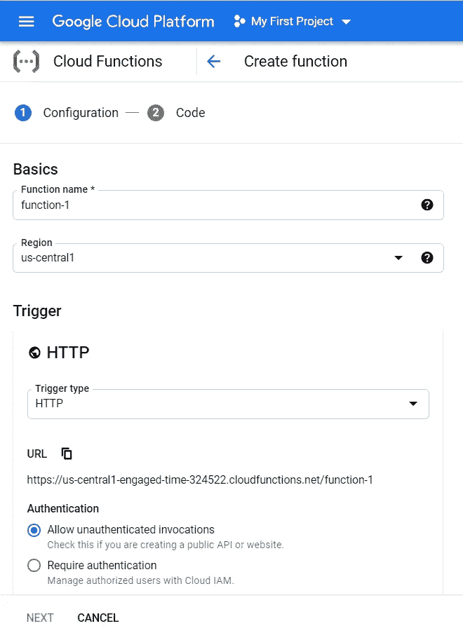
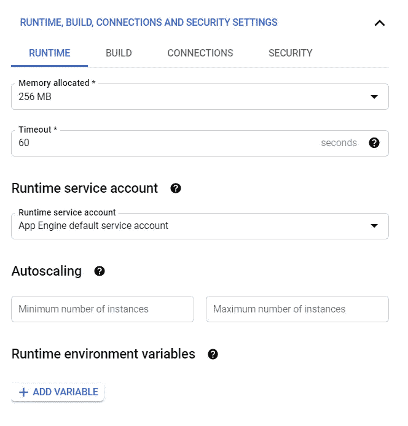
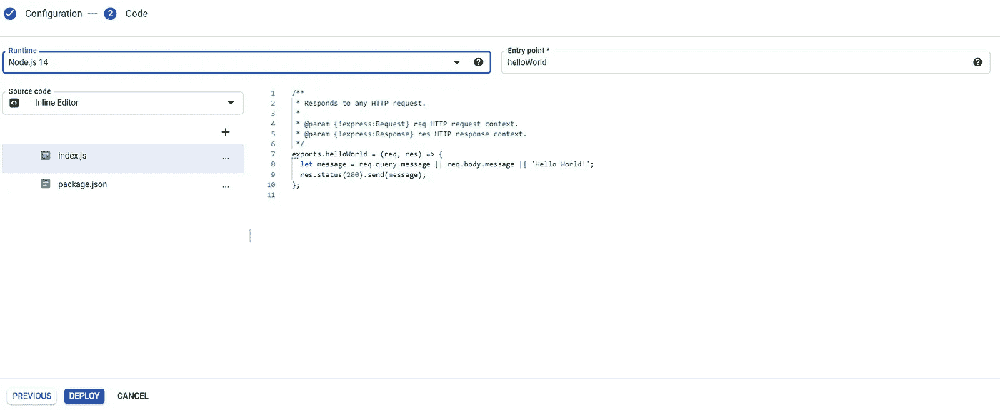
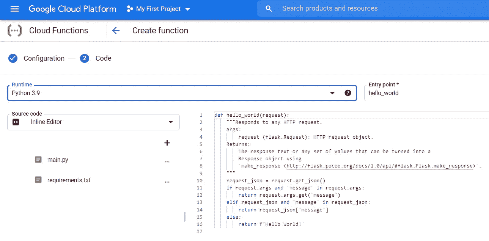
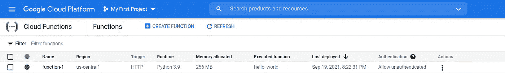
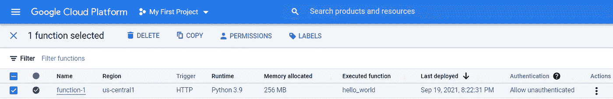
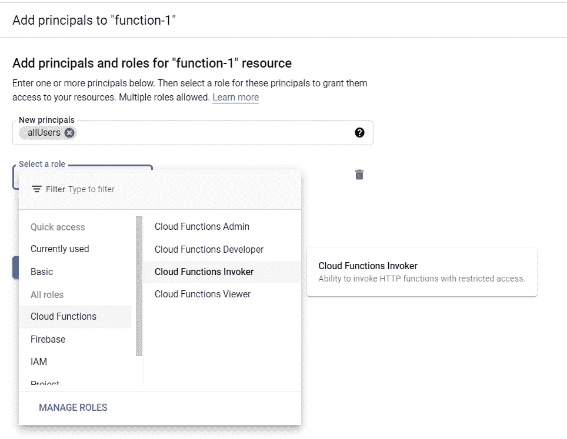
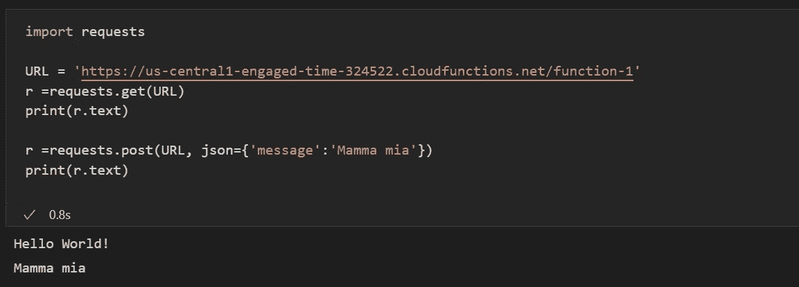

# 在谷歌云函数上部署 python 函数

> 原文：<https://towardsdatascience.com/deploying-python-functions-with-google-cloud-functions-557517865ba7?source=collection_archive---------8----------------------->

## 部署 python 函数从未如此简单

安德里克·朗菲尔德在 [Unsplash](https://unsplash.com?utm_source=medium&utm_medium=referral) 上拍摄的照片

# 介绍

部署应用程序总是一个需要分析的过程。应用程序的复杂性、大小等等都是影响应用程序部署位置和方式的因素。

当您的应用程序很小，并且不需要大量资源时，如大型数据库查询和硬处理，您可以使用 Google Cloud 功能来部署它。不需要设置一个虚拟机和使用气流(举例来说),你只需要准备你的代码并把它发送到 GCF，google 会处理所有需要的资源来部署和运行你的功能。

总之，GCF 是一个工具，它允许您部署“可伸缩随用随付功能即服务(FaaS ),无需服务器管理就能运行您的代码。”一些功能包括:

*   没有要供应、管理或升级的服务器；
*   根据负载自动缩放；
*   集成监控、记录和调试功能；
*   基于最小特权原则的角色和每个功能级别的内置安全性；
*   针对混合云和多云场景的关键网络功能；
*   一个不错的免费层，允许你免费使用它；

# 部署

## 设置功能

使用谷歌云功能进行部署的方式有很多种。我将在本文中展示更简单的方法，在下一篇文章中，我将展示我更喜欢的方法(通过与 github 的持续集成)。

1.  首先，进入谷歌控制台，在左边栏选择云函数，然后点击创建一个函数。应该会出现下面的模式

这里有些字段应该解释一下:

*   **功能名称:**您要部署的功能的名称。选择合适的名称很重要，因为它将帮助您在需要时找到您的功能。
*   **区域:**将部署该功能的地方。将函数的区域设置为应用程序的相同区域。
*   **触发器:**你的函数将如何被调用。有很多方法可以调用你的函数。这里我会选择 HTTP，这是最通用的一个。
*   **URL:** 你的功能在 google 上的地址；
*   **验证:**您的函数是否需要验证才能被调用。我将在这里检查允许未经验证的调用。

之后，单击保存，然后单击运行时、构建、连接…

这里我们有很多字段，每个字段可能需要一篇文章。我将尝试只对内存，超时和自动缩放。在接下来的文章中，我们将深入讨论其他领域。

*   **分配的内存:**为运行该功能而分配的 ram 内存。最大值是 8 Gb，这就指向了我上面说的事实:GCF 不是针对需要很多资源的函数。我会把它设置在 256 Mb。这对我们的测试来说足够了
*   **超时**:允许运行您的功能的最长时间。
    “如果云功能在超时期限内没有完成，那么该功能将被终止。默认值为 60 秒，但可以在 1 秒到 540 秒(9 分钟)之间。一般来说，我将它设置为最大值，因为 GCF 具有冷启动功能，第一次调用该函数会比接下来的调用慢得多。”
*   **自动缩放**:你是否会为你的函数创建更多的实例，以允许多个调用同时进行。"为了提高性能，您可以将最小实例数设置为大于 0。您还可以为用例设置最大实例数，例如限制成本。突然的流量高峰可能会导致暂时超出限制。留空或设置为 0 可清除此控件，并根据需要自动创建新实例。

## 源代码

之后，单击下一步，应该会出现如下页面:

*   **运行时:**源代码的语言。将其更改为您在函数中使用的 python 版本。
*   **入口点:**代码执行过程中首先调用的 python 函数。
*   **源代码:**你的代码的来源。让我们在这个例子中使用内联编辑器，但是在第二篇文章中我们将使用云存储库。

让我们在部署函数之前检查一下代码:

正如我们所见，默认情况下我们有两个文件，main.py 和 requirements.txt。在 requirements 中，我们需要编写运行代码所需的库及其版本。在 main.py 中，该示例接收一个 HTTP 请求，并检查请求中是否存在字段消息。如果是，它将返回消息(和文本)。否则，它返回 Hello World。

现在，点击按钮**展开**，等待展开过程结束。

## 允许未经授权的访问

现在我们需要允许任何人调用这个函数:

点击页面左侧的复选框选择您的功能。点击权限后。

点击添加委托人，输入 **allUsers** ，在**选择角色**，选择**云函数调用者**，如下图。这样做，你将允许互联网上的任何人访问你的功能。有很多方法可以让这个过程更安全，但是我们暂时先不做。

之后，会出现一个窗口。点击**允许..**

## 测试它

现在，让我们使用一个简单的脚本来测试它，如下所示:

URL 保存了我们函数的地址。可以在 gcp 控制台点击我们的功能。

代码的第一部分只是一个 **get 请求**，所以它不发送任何信息。因此，request_json(来自 main.py)为空，因此我们的函数返回 Hello World！。在代码的第二部分，我们发出一个 **post 请求**，并通过 json 发送一条消息。在这种情况下，我们的函数返回了消息，这是正确的，因为现在 request_json 不再是空的，并且具有字段 message。

# 结论

Google cloud functions 是一项让简单功能的部署过程变得更加简单的服务。部署一个功能的完整过程可以在不到 1 小时的时间内完成，当您需要设置一个简单功能的快速部署时，这是一个很好的工具。在通过 GCF 部署一个功能的过程中，可以配置很多东西，但是大多数都很容易理解和配置。

在下一篇文章中，我们将讨论使用 git hub 在 google 云功能上的持续集成。在那里见！

# 参考

【https://cloud.google.com/functions 