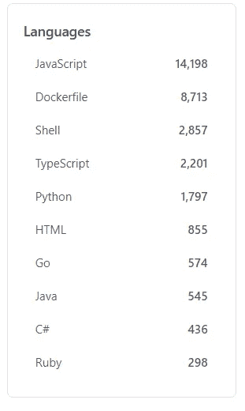
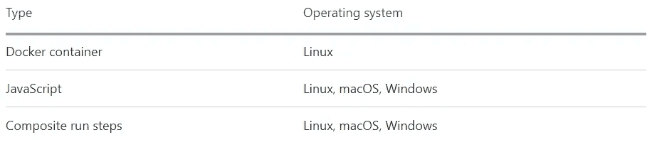
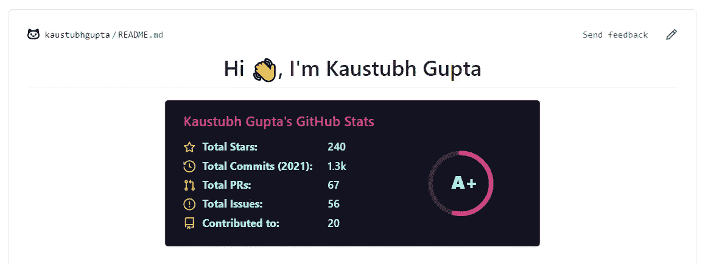
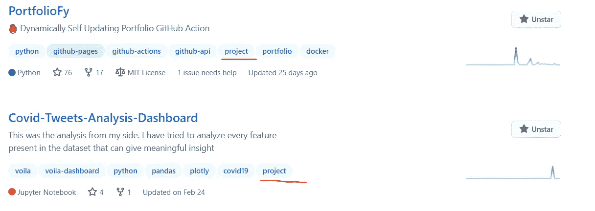
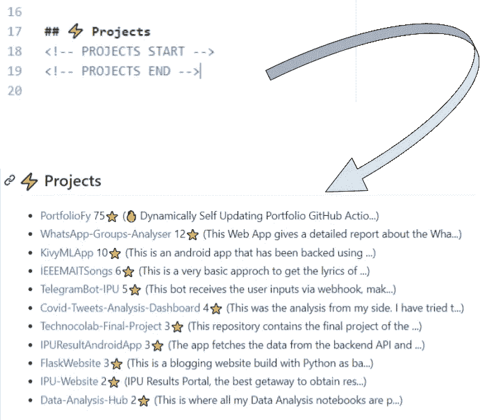

# 将 Python GitHub 操作部署到市场

> 原文：<https://towardsdatascience.com/deploying-python-github-actions-to-marketplace-d07790e9817d?source=collection_archive---------11----------------------->

## 将 Python 脚本作为没有 Dockers 的操作运行


杰佛森·桑多斯在 [Unsplash](https://unsplash.com?utm_source=medium&utm_medium=referral) 上拍摄的照片

> 查看此处开发的动作:

[](https://github.com/kaustubhgupta/readme-projects-display) [## kaustubhgupta/readme-项目-显示

### GitHub 的个人资料自述文件是向潜在的招聘人员/开发人员展示您的技能和项目的一个很好的工具。这个…

github.com](https://github.com/kaustubhgupta/readme-projects-display) 

# 为什么是 Python？

我使用 GitHub actions 已经有一段时间了，我相信它比目前的用法有更大的潜力。我见过很多 GitHub 动作自动化任务的用例，但是一个值得注意的事情是，这些动作主要是使用 Javascript 和 Dockers 完成的。如果你在 GitHub 中搜索“ [GitHub Action](https://github.com/search?o=desc&q=github+actions&s=stars&type=Repositories) ”这个词，你会看到一长串使用或者做出这个动作的库。根据所选的编程语言，结果如下:



来自 GitHub [搜索结果](https://github.com/search?o=desc&q=github+actions&s=stars&type=Repositories)的截图(数字在 28/03/21)

这些数字清楚地表明，使用 Python 的存储库非常少。主要原因是 GitHub 在为市场构建动作的同时正式支持 Docker 和 Javascript。



来自[行动文件](https://docs.github.com/en/actions/creating-actions/about-actions#types-of-actions)的截图

这并不意味着不支持其他语言，但是它们的解决方法很复杂。需要对 Dockers 有很好的理解，如果动作使用当前 repo 中的文件，那么如何管理动作的路径。

在本文中，我将向您展示在没有 Dockers 的情况下发布基于 Python 的 GitHub 操作的最佳方式！

# 形势

我在本文中构建的 GitHub 动作是为了用用户在其 GitHub 帐户上托管/推送的项目信息更新 GitHub 概要自述文件。这个特殊的自述文件显示在公开的个人资料上，这已经成为一种趋势，每个人都试图让它尽可能吸引人。GitHub 统计数据、最新的博客帖子显示或提交活动是用户已经集成到他们的个人资料中的一些著名的工作流类型。



统计数据示例(作者图片)

我想创建一个类似的动作，更新用户的项目信息，如星星，描述中的任何变化，或任何其他新的项目添加。让我们看看我是如何制作基本工作流程的。

# 编码时间！

逻辑非常简单。由于人们不能从 100 个储存库中确定以下哪些储存库有资格显示在简档部分上，因此这项工作必须由用户手动完成。我们的工作是将“项目”主题添加到每个存放项目文件的存储库中。这个标签将帮助我筛选出将包含在项目部分中的存储库。



标记为项目的我的存储库示例

接下来，我需要提出这样的逻辑，即每次触发动作时，只修改自述文件的特定部分，而不是整个文件。为此，我参考了[的自述工作流程。](https://github.com/eugeneyan/eugeneyan)我修改了一般用法的逻辑。另外，在我之前的项目中，还有一点被忽略了，那就是只有当内容发生变化时，才应该提交。这部分采取了一系列的点击和试验，想出了一个解决方案。整个脚本并没有花太多时间来编码，下面是代码的样子:

我从用户那里获得 4 个输入:GitHub 访问令牌、readme 文件的名称、检出存储库的路径(我将在下面详细讨论)以及存储库描述的最大字符数。所有这些输入都来自命令行。下一步也是最后一步是将脚本作为工作流中的操作运行。

# 操作、工作流和发布

我在以前的一篇文章中描述了动作和工作流之间的区别，所以我在这里简单介绍一下。动作是任务，可以是称为工作流的任何更大任务的一部分。实际上，配置文件自述文件可以有一个工作流，其中包含多个更新不同部分的操作。我上面展示的脚本实际上是一个动作，在它公开后可以成为任何工作流的一部分。

GitHub 制作了一个流程，用于制作一个动作供其他用户使用。必须在动作存储库的根目录下创建一个名为 action.yml 的文件，该文件包含动作的所有输入输出。此外，它还定义了操作运行的环境。这就是 Python 脚本需要额外步骤的地方。

在**运行参数**中，我们需要使用**组合。**composite 采用强制步骤参数，steps 参数采用两个强制参数:run 和 shell。YAML 文件最好的部分是它们本质上是分层的，缩进定义了参数的级别。下面是我如何定义我的 action.yml runs 参数:

> **重要的事情:**无论你什么时候公开动作，文件的路径都不会一样。要在操作运行时获取文件的确切路径，可以使用 github.action_path 变量。这些变量被称为上下文信息，GitHub 提供了大量的上下文变量，可以在运行操作时使用。查看这个[文档](https://docs.github.com/en/actions/reference/context-and-expression-syntax-for-github-actions#github-context)获取完整列表。
> 
> 我使用了 action_path 和 workspace 路径，因为这两个路径服务于不同的目的。动作路径是存储动作文件的位置。它们存储在:
> 
> /home/runner/work/_ actions/{ git _ username }/{ action _ repo }/master/
> 
> 工作区路径是当前存储库被检出的地方，在那里触发了这个动作(称之为克隆的)。
> 
> /home/runner/work/{检查的回购名称}/{检查的回购名称}/

# 来试试动作吧！

既然动作是公开的，我们可以在任何配置文件中使用它。此操作要求您在自述文件中添加特殊注释:

```
<!-- PROJECTS START -->
<!-- PROJECTS END -->
```

接下来，创建一个目录:

```
.github/workflows/<any_name>.yml
```

并粘贴以下起始代码:

现在，该特定部分将使用您的项目信息进行更新！



# 结论

使用 Github 动作、上下文变量和触发器可以实现很多事情。这个特别的动作是受[博客-文章-工作流程](https://github.com/marketplace/actions/blog-post-workflow)的启发。

你可以在 [Linkedin](https://www.linkedin.com/in/kaustubh-gupta/) 和 [GitHub](https://github.com/kaustubhgupta) 上和我联系。

查看我的其他以 Python 为中心的文章:

[](/rebuilding-my-7-python-projects-8c629079c8e6) [## 重建我的 7 个 Python 项目

### 这就是我如何重建我的 Python 项目:数据科学、Web 开发和 Android 应用程序

towardsdatascience.com](/rebuilding-my-7-python-projects-8c629079c8e6) [](/3-ways-to-convert-python-app-into-apk-77f4c9cd55af) [## 将 Python 应用程序转换为 APK 的 3 种方法

### 结束构建 Python 系列的 Android 应用程序！

towardsdatascience.com](/3-ways-to-convert-python-app-into-apk-77f4c9cd55af) [](/run-python-code-on-websites-exploring-brython-83c43fb7ac5f) [## 在网站上运行 Python 代码:探索 Brython

### Python 中的 JavaScript 等效脚本

towardsdatascience.com](/run-python-code-on-websites-exploring-brython-83c43fb7ac5f) [](/building-android-apps-with-python-part-1-603820bebde8) [## 用 Python 构建 Android 应用程序:第 1 部分

### 使用 Python 构建 Android 应用程序的分步指南

towardsdatascience.com](/building-android-apps-with-python-part-1-603820bebde8)