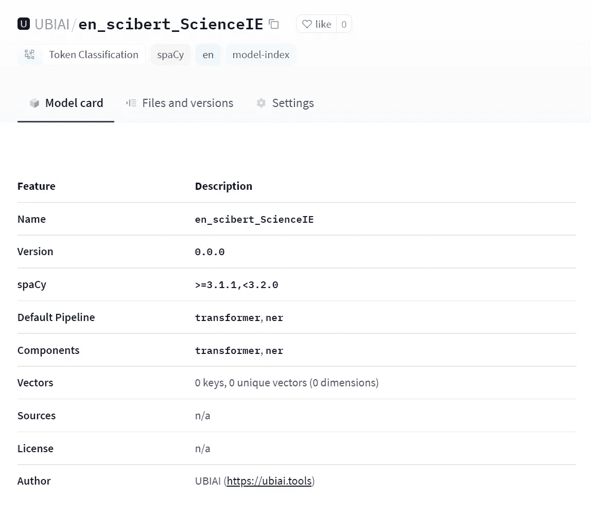
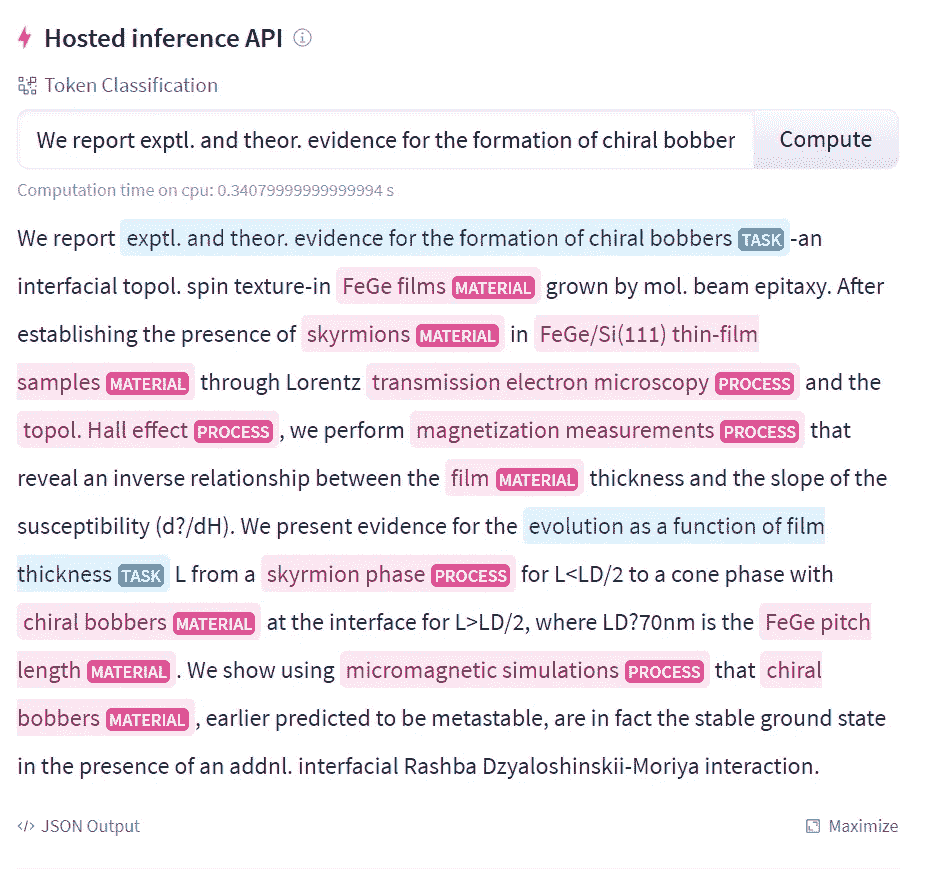
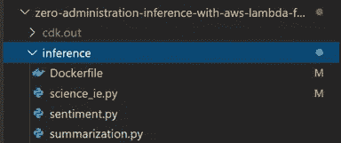
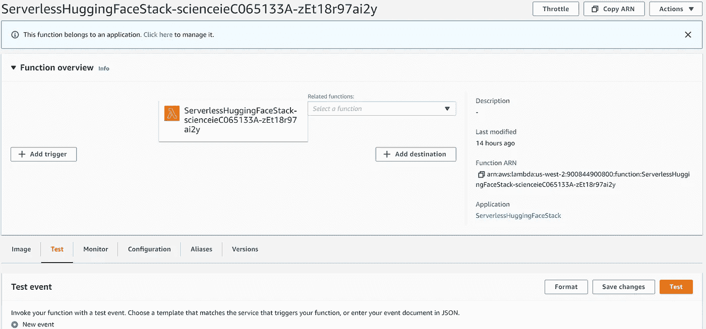

# 使用 AWS Lambda 部署无服务器空间转换器模型

> 原文：<https://towardsdatascience.com/deploying-serverless-spacy-transformer-model-with-aws-lambda-364b51c42999?source=collection_archive---------13----------------------->

## 关于如何部署 NER 变压器模型无服务器的分步指南


约书亚·索蒂诺在 [Unsplash](https://unsplash.com/s/photos/server?utm_source=unsplash&utm_medium=referral&utm_content=creditCopyText) 上拍摄的照片

# 介绍

由于 transformer 无与伦比的性能，它已成为许多 NLP 任务的基本工具，每天都有各种有用且有影响力的 NLP 模型被创建出来。然而，许多 NLP 实践者发现将模型部署到生产中是一个挑战。[根据这份报告](https://venturebeat.com/2019/07/19/why-do-87-of-data-science-projects-never-make-it-into-production/)，90%的机器学习模型从未投入生产。

模型部署使您能够在服务器环境中托管您的模型，例如，当被 API 调用时，它可以用于输出预测。

在本教程中，我将向你展示如何将 NER 空间转换器模型推送到 Huggingface，并在 AWS Lambda 上部署该模型来运行预测。

根据 AWS 网站:

> *“AWS Lambda 是一种无服务器计算服务，让您无需配置或管理服务器、创建工作负载感知集群扩展逻辑、维护事件集成或管理运行时即可运行代码。有了 Lambda，您几乎可以为任何类型的应用程序或后端服务运行代码——所有这些都无需管理。”*

**部署模型而无需管理后端服务器是一个游戏规则改变者**。它将使没有 devops 资源的开发人员和小型初创公司能够开始部署准备用于生产的模型。

以下是我们将要遵循的步骤:

*   在 Huggingface 中部署一个经过训练的空间变形器模型
*   将模型存储在 S3
*   在 AWS Lambda 中部署模型
*   运行 AWS Lambda 函数，根据用户输入输出预测

# 在 Huggingface 中部署空间变压器模型

在本教程中，我们对变压器 NER 模型 SciBert 进行了微调，以从科学摘要中提取材料、流程和任务。使用 [UBIAI 文本注释工具](https://ubiai.tools)完成注释。我们遵循了在[我之前的文章](/how-to-fine-tune-bert-transformer-with-spacy-3-6a90bfe57647)中介绍的相同方法，我们利用 google colab 来训练模型。训练模型后的下一步是在 huggingface 上托管它，这样它就可以被 API 访问。更多关于如何将空间模型推送到 huggingface 的信息，请查看这个[链接](https://huggingface.co/spacy)。

首先，从 pip 安装 spacy-huggingface-hub:

```
pip install spacy-huggingface-hub
```

从经过训练的空间管道构建一个. whl 文件(确保事先创建输出目录):

```
huggingface-cli login
python -m spacy package ./model_science_scibert/model-last ./output --build wheel
```

将砂轮锉推入轮毂:

```
cd ./output/en_scibert_ScienceIE-0.0.0/dist
python -m spacy huggingface-hub push en_scibert_ScienceIE-0.0.0-py3-none-any.whl
```

让我们检查一下模型是否已经成功上传到 Huggingface:



作者图片

既然这个模型已经被推送到 huggingface 库中，我们可以在一个科学摘要上测试它了:



作者图片

太棒了—它像预期的那样工作！我们现在可以直接用 API 查询模型:

```
import requests

API_URL = "https://api-inference.huggingface.co/models/UBIAI/en_scibert_ScienceIE"
headers = {"Authorization": "[API Token]"}

def query(payload):
	response = requests.post(API_URL, headers=headers, json=payload)
	return response.json()

output = query({"inputs": "*We report exptl. and theor. evidence for the formation of chiral bobbers-an interfacial topol. spin texture-in*"})
```

下一步是将模型与 AWS Lambda 集成，这样我们就不会受到 Huggingface 的 API 使用的限制。

# 在 AWS Lambda 上部署:

在本节中，我们将在 S3 上存储训练好的模型，并将其导入 lambda 函数进行预测。以下是步骤:

1.  将训练好的模型存储在 S3 上(或者，我们可以直接从 huggingface 库下载模型)
2.  基于容器图像设置推理 Lambda 函数
3.  将容器图像存储在您帐户内的 [Amazon 弹性容器注册库](https://aws.amazon.com/ecr/) (ECR)中
4.  在 Amazon 弹性文件系统存储上导入并缓存训练好的模型，以改善推理延迟
5.  对 AWS Lambda 运行预测

为了加快这个过程，我们按照 AWS 的教程[自动提供基于容器图像的 Lambda 函数。首先，让我们按照教程中所示克隆回购:](https://aws.amazon.com/blogs/compute/hosting-hugging-face-models-on-aws-lambda/)

```
git clone https://github.com/aws-samples/zero-administration-inference-with-aws-lambda-for-hugging-face.git
```

安装所有要求:

```
pip install -r requirements.txt
```

安装自动气象站 CDK:

```
npm install -g aws-cdk
```

接下来，我们将添加推理文件以从我们的模型中获得预测。

将目录更改为推理文件夹，并添加一个新的 python 文件来运行模型，对于本教程，我添加了 science_ie.py 文件:



作者图片

现在，我们将在 science_ie.py 中创建两个函数:

1.  一个从 S3 下载模型的函数，将其解压缩并存储在缓存文件夹/mnt/hf_models_cache 中。
2.  第二个函数查询我们的模型并返回提取的实体。

```
import os
import urllib.request
import spacy
import spacy_transformers
from zipfile import ZipFile
from pathlib import Path

#Download the model from S3
def download(model, dest):
    save_path = Path(dest) / model
    if not os.path.exists(save_path):
        print(**'Downloading...'**)# Enter url path to the model on S3
        url = **f'https://[bucket name].s3.us-west-2.amazonaws.com/**{model}**.zip'** filename = Path(dest) / **f'**{model}**.zip'** res = urllib.request.urlretrieve(url, filename)
        with ZipFile(filename, **'r'**) as f:
            print(dest)
            f.extractall(path=dest)
            print(**'finished extracting'**)
    dirname = model.split(**'-'**)[0]
    return save_path

#Handler function for predictions
def handler(event, context):
    doc = nlp(event[**'text'**])
    response = [
        {
            **'text'**: ent.text,
            **'label'**: ent.label_,
            **'start'**: ent.start_char,
            **'end'**: ent.end_char
        }
        for ent in doc.ents

    ]
    return response

model = **'model-last'** mnt_path = **'/mnt/hf_models_cache'** model_path = download(model, mnt_path)
nlp = spacy.load(mnt_path)
```

我们现在准备部署。只需运行下面的命令来部署 CDK 应用程序(注意:我在运行下面的命令时发现了一个错误，如果发生这种情况，只需在 cdk.json 文件的“app”行中用 python 替换 python 3:“python app . py”):

```
cdk bootstrap
cdk deploy
```

一旦部署开始，我们将开始看到进展，这将需要一些时间来完成全面部署。完成后，转到 AWS 控制台中的 AWS Lambda 并选择 test 选项卡:



作者图片

按如下方式输入测试文本，然后按下测试按钮:

```
{
"text": "*We report exptl. and theor. evidence for the formation of chiral bobbers-an interfacial topol. spin texture-in FeGe films grown by mol. beam epitaxy.  After establishing the presence of skyrmions in FeGe/Si(111) thin-film samples through Lorentz transmission electron microscopy and the topol. Hall effect, we perform magnetization measurements that reveal an inverse relationship between the film thickness and the slope of the susceptibility (d?/dH).  We present evidence for the evolution as a function of film thickness L from a skyrmion phase for L<LD/2 to a cone phase with chiral bobbers at the interface for L>LD/2, where LD?70nm is the FeGe pitch length.  We show using micromagnetic simulations that chiral bobbers, earlier predicted to be metastable, are in fact the stable ground state in the presence of an addnl. interfacial Rashba Dzyaloshinskii-Moriya interaction.*"
}
```

以下是预测:

```
[
  {
    "text": "exptl. and theor. evidence for the formation of chiral bobbers",
    "label": "TASK",
    "start": 10,
    "end": 72
  },
  {
    "text": "FeGe films",
    "label": "MATERIAL",
    "start": 111,
    "end": 121
  },
  {
    "text": "skyrmions",
    "label": "MATERIAL",
    "start": 186,
    "end": 195
  },
  {
    "text": "FeGe/Si(111) thin-film samples",
    "label": "MATERIAL",
    "start": 199,
    "end": 229
  },
  {
    "text": "transmission electron microscopy",
    "label": "PROCESS",
    "start": 246,
    "end": 278
  },
  {
    "text": "topol. Hall effect",
    "label": "PROCESS",
    "start": 287,
    "end": 305
  },
  {
    "text": "magnetization measurements",
    "label": "PROCESS",
    "start": 318,
    "end": 344
  },
  {
    "text": "film",
    "label": "MATERIAL",
    "start": 393,
    "end": 397
  },
  {
    "text": "evolution as a function of film thickness",
    "label": "TASK",
    "start": 482,
    "end": 523
  },
  {
    "text": "skyrmion phase",
    "label": "PROCESS",
    "start": 533,
    "end": 547
  },
  {
    "text": "chiral bobbers",
    "label": "MATERIAL",
    "start": 580,
    "end": 594
  },
  {
    "text": "FeGe pitch length",
    "label": "MATERIAL",
    "start": 645,
    "end": 662
  },
  {
    "text": "micromagnetic simulations",
    "label": "PROCESS",
    "start": 679,
    "end": 704
  },
  {
    "text": "chiral bobbers",
    "label": "MATERIAL",
    "start": 710,
    "end": 724
  }
]
```

瞧，我们从 AWS Lambda 上的模型中得到了预测，而无需担心设置服务器基础设施。

# 结论:

在本教程中，我们演示了如何在 Huggingface 上部署一个经过训练的 transformer 模型，将其存储在 S3 上，并使用 AWS lambda 函数获得预测，而无需设置服务器基础架构。

如果您有任何问题，请不要犹豫，在下面提问或发送电子邮件至 admin@ubiai.tools。

如果你喜欢这篇文章，请喜欢并分享！

在 Twitter 上关注我们 [@UBIAI5](https://twitter.com/UBIAI5) 或[订阅这里](https://walidamamou.medium.com/subscribe)！