# 在 Google Cloud 上部署简单代码

> 原文：<https://towardsdatascience.com/deploying-simple-code-on-google-cloud-2cb3d50f7d33?source=collection_archive---------32----------------------->

自从我从学术界转到私营部门，我意识到企业面临的一个极端挑战是开发过程的可伸缩性。换句话说，构建流程(可能是简单的数据流、仪表板或更复杂的 ML 管道)是一回事，但部署流程以便执行和监控是可调度的、自动的且易于调试是另一回事。

在这篇文章中，我将介绍我在一个项目需求中使用的一种方法(一个每天更新的仪表板)，以及我如何使用谷歌云平台(GCP)来扩展项目以允许自动更新。

# 商业案例

在这个项目中，我被要求提供一个交互式仪表板，用于监控一系列 KPI 和其他与公司数字通信相关的指标。

像往常一样，第一步包括查询数据位置、构建数据管道，最后构建仪表板。我有另一个[帖子](https://juls-dotcom.github.io/tableau&python.html)更侧重于这种过程，所以我不会在这里关注这方面。

一旦构建了管道，我需要每天早上执行它，以便向仪表板提供新的数据。真烦人。我需要开发一个可扩展的系统，允许管道按计划执行，并允许用户监控管道是否被正确执行。

# 谷歌云平台

GCP 是一个了不起的工具，不断得到改进和功能。我自己学会了如何使用 GCP，所以不要把我的过程当成最佳实践。可能还有其他我不知道的功能，可以让你以更有效的方式运行这个过程。

第一步是将管道导出到 GCP，在云上运行。

## GCP 的出口管道

我首先在 GCP 上的`AI Platform / Notebooks`下创建了一个虚拟机实例。这个部分提供了`JupyterLab`接口，允许您在一个笔记本框架中探索数据。

创建实例后，您可以**启动虚拟机**。请注意，您将会收到运行实例的账单，所以请确保您在完成后**停止了**它们。

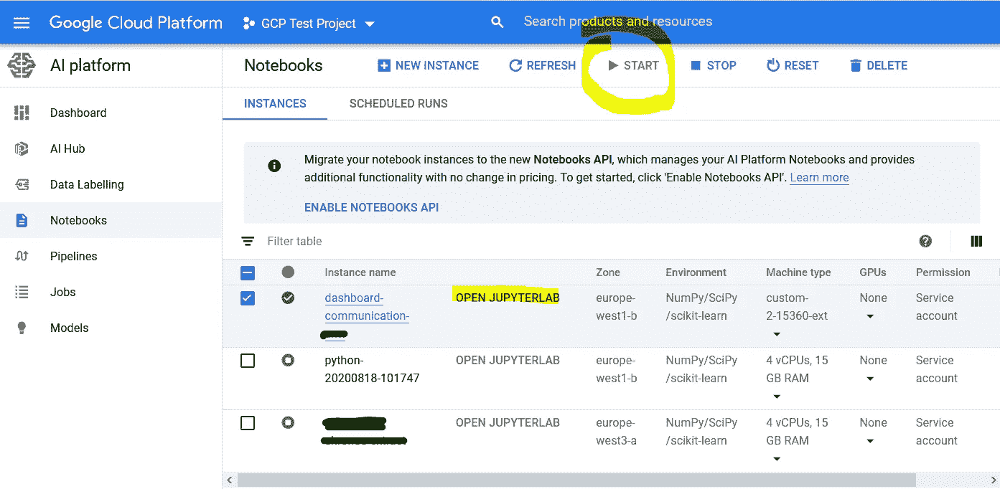

显示笔记本界面的屏幕截图。该图显示了三台虚拟机，其中第一台已经启动。图片作者。

一旦进入`JupyterLab`界面，你就可以打开一个终端，Git 克隆你的库。我假设读者知道 Git，并把它的库放在某种在线存储库上。

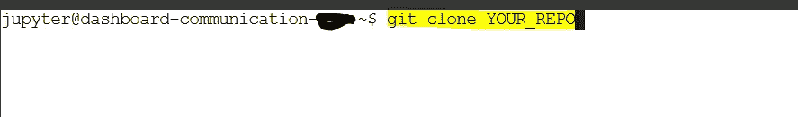

图片作者。

一旦您的 repo 被克隆，您将获得包含您的库的文件夹，它被复制到您的虚拟机上，在我的例子中，它包含几个文件和文件夹，如下所示:

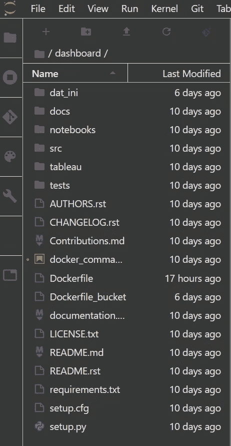

图片作者。

现在你的代码已经在云上了，你可以在虚拟机上运行所有的计算，并确保一切按预期运行。如果您的代码是在不同的操作系统下编写的，可能会有一些问题，所以在这里重新启动代码并确保输出是需要的总是一个好主意。

## 使用 Docker 来封装你的代码

Docker 本身是一种轻量级虚拟机，它包含了运行应用程序所需的所有组件。你可以把它看作一个气泡，一个应用程序的快照，它允许你和其他人在完全相同的条件下在其他地方重新运行你的代码。你可以在这里找到更多关于 Docker [的信息，现在我假设你知道使用 Docker 的基本知识](/how-docker-can-help-you-become-a-more-effective-data-scientist-7fc048ef91d5)

既然你知道基础知识；)，你知道你应该使用一个`Dockerfile`来具体说明如何构建和运行你的容器。`Dockerfile`是一个文本文件，用这个术语命名，包含运行应用程序所需的所有命令。

您可以在文件夹根目录下创建一个 docker 文件，并根据项目需要添加命令。在我的情况下，它需要以下内容:

1.  在 Python 环境中运行—
    `FROM Python: 3.8`
2.  复制容器中的一系列文件，包括:

*   全部。源文件中包含的 py 文件—
    `COPY ./src/jhl001_digital_communication ./`
*   requirements.txt 中包含的项目依赖关系—
    `COPY ./requirements.txt ./requirements.txt`
*   谷歌令牌凭证文件—
    `COPY ./dat_ini/mycreds.txt ./mycreds.txt`
*   Google 帐户的访问密钥—
    `COPY ./dat_ini/client_secrets.json ./client_secrets.json`

3.安装必要的库
`RUN pip install -r requirements.txt`

4.运行 Python 文件
`ENTRYPOINT ["python", "run_pipe_all.py"]`

文件`run_pipe_all.py`包含我需要执行的管道，都在一个文件中。提醒一下，这条管道从不同的位置获取数据，对其进行处理，然后在另一个位置将其导出，以提供给 Tableau 仪表板。

文件看起来就像这样，有几行注释，是我测试后不需要的文件。

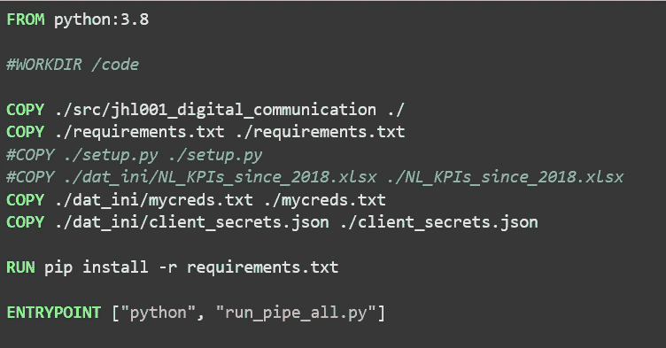

DockerFile 示例。图片作者。

不错！所以构建容器的一切都准备好了，您可以通过在终端中运行下面一行来轻松完成

`docker build . -t gcr.io/PROJECT_NAME/CONTAINER_NAME:latest`

在我的例子中，我使用了一个测试项目(你可以在 GCP 的项目部分找到你的项目的 ID ),我将容器命名为`dashboard`。`:latest`通知 Docker 容器应该被构建为最新版本。

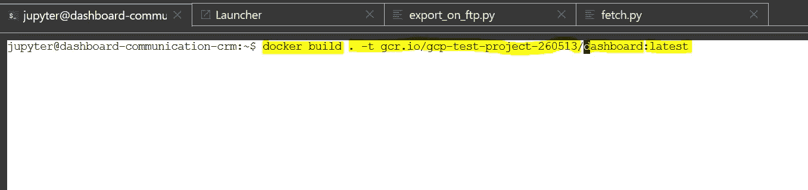

图片作者。

现在，您已经将应用程序/代码容器化了。运行容器应该和在 VM 中运行最后一行代码一样，其中所有的依赖项都已经安装在 Python 环境中

您可以通过在终端中键入以下命令进行测试

`docker run -ti gcr.io/PROJECT_NAME/CONTAINER_NAME:latest`

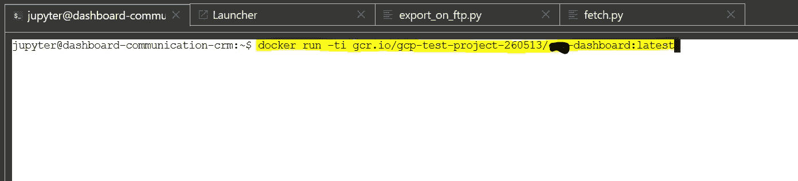

图片作者。

在我的例子中，执行 python 文件和管道，我把它们放在一个文件中。

很好！您的代码现在已经打包好了，您可以使用这个容器与其他人共享它，或者通过这个接口轻松地执行它。

现在，让我们看看是否可以使用其他 GCP 特性来分解这段代码，并定期执行它

## 将容器推送到 Google 容器注册表

为了共享你的容器，你可以使用下面的命令行`push`它:

`docker push gcr.io/PROJECT_NAME/CONTAINER_NAME:latest`

这将把您的容器放在容器注册表中，以便从其他接口访问它

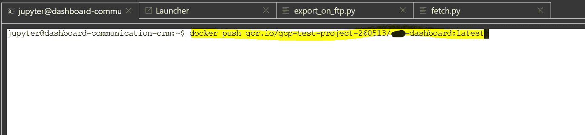

图片作者。

如果你现在进入容器注册(左 GCP 工具栏)，你应该看到你的容器位于列表中

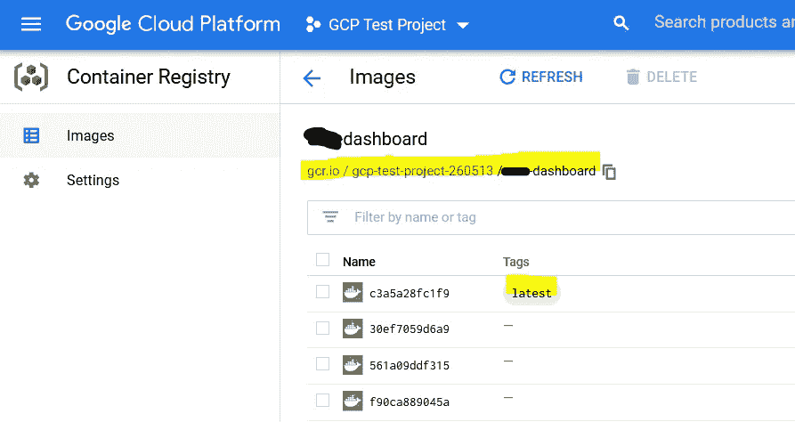

图片作者。

你可以看到我的容器，它的`latest`图像，现在出现在容器注册中。仅供参考，docker 映像是运行容器时需要构建的蓝图。

很好，现在您已经推送了您的容器映像。让我们使用 GCP 的其他特性来安排它的执行和监控！

## 谷歌计算引擎(GCE)

一旦您的映像出现在注册表中，下一步就是在 GCE VM 上部署容器。GCE 的一个很好的特性是，它会自动提供一个带有 Docker 安装程序的容器优化操作系统。这意味着一旦 VM 启动，就会执行**容器。**

下面，您可以看到我创建的名为`update-dashboard`的新 VM 来托管容器映像。

注意在`AT Platform / Notebook`接口下创建的 VM `dashboard-communication`是如何出现在 GCE 中的。

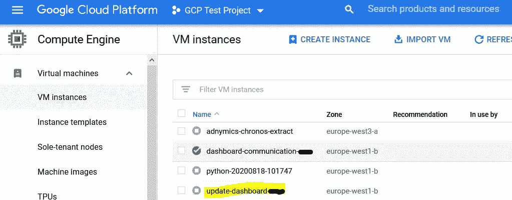

图片作者。

为此:

*   在 GCE 上创建一个虚拟机，并设置所需的区域
*   在容器部分，选中*将容器映像部署到这个虚拟机实例*
*   提供容器图像。这是集装箱成像仪的实际位置，在我的例子中是 fcr.io/gcp-test-project-260513/dashboard:latest 的
*   *我将*重启策略*设置为*失败*并且*以特权身份运行*设置为*真**
*   *最后，勾选*为标准输入*分配一个缓冲区和*分配一个伪 TTY* 框，因为我们需要这些选项链接到容器。*

*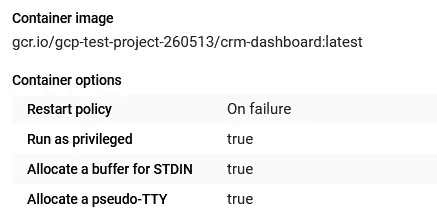*

*图片作者。*

*现在，您的容器托管在一个 GCE VM 中。*

*现在让我们使用两个 GCP 组件，`Cloud Scheduler`和`Cloud Functions`。我使用这个 [Google 文档](https://cloud.google.com/scheduler/docs/scheduling-instances-with-cloud-scheduler)来实现这些功能，这很容易理解。*

## *创建云函数*

*下面的步骤摘自谷歌文档，但是我把它们放在这里是为了保持一致*

*要创建云函数来启动虚拟机实例，请执行以下操作:*

1.  *转到云功能页面*
2.  *创建功能*
3.  *将函数 Nae 设置为 startInstancePubSub*
4.  *保留区域的默认值。*
5.  *对于触发器类型，选择云发布/订阅。*
6.  *对于选择云发布/订阅主题，请选择创建主题…*
7.  *应该会出现一个新的发布/订阅主题对话框。*
8.  *在主题 ID 下，输入开始实例事件。*
9.  *单击创建主题以完成对话框。*
10.  *单击触发器框底部的保存。*
11.  *单击页面底部的下一步。*
12.  *对于运行时，选择 Node.js 10。*
13.  *对于入口点，输入 startInstancePubSub。*
14.  *在代码编辑器的左侧，选择 index.js。*
15.  *用下面的代码替换启动代码，您将在这里[和下面](https://cloud.google.com/scheduler/docs/start-and-stop-compute-engine-instances-on-a-schedule)找到。*

*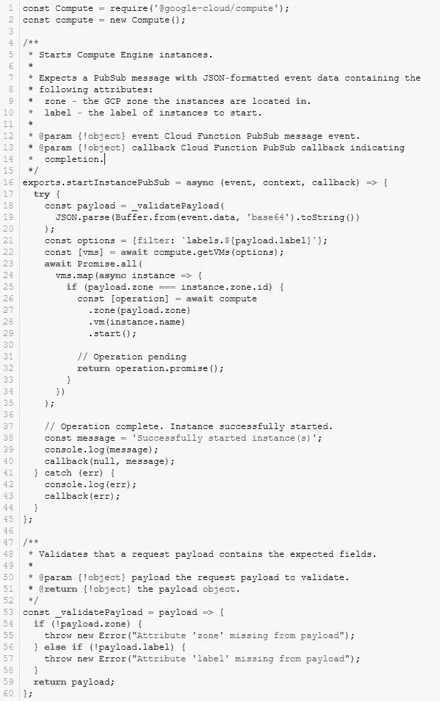*

*16.在代码编辑器的左侧，选择 package.json。*

*17.将启动代码替换为您将在此处[和以下](https://cloud.google.com/scheduler/docs/start-and-stop-compute-engine-instances-on-a-schedule)找到的代码。*

*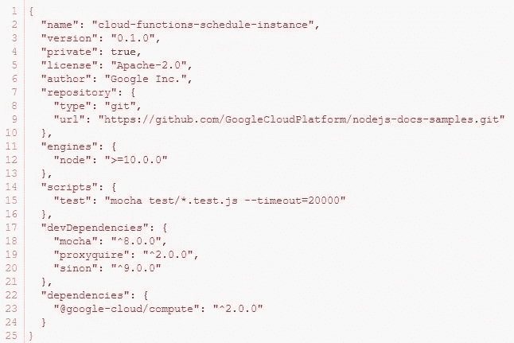*

*18.现在，您可以单击“部署”。*

*Stop 函数(如果你需要的话)是按照相同的步骤创建的，查看 Google 文档，找到正确的代码片段。*

*准备好这两个功能后，您应该会在主窗格中看到它们:*

*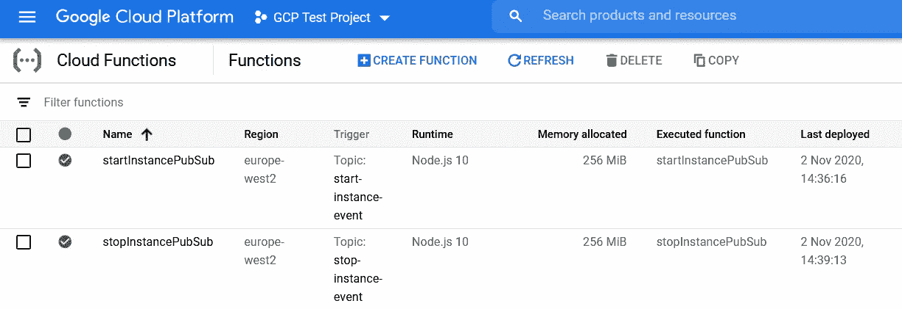*

*图片作者。*

*您可以通过进入函数并进入测试模式来测试该函数是否正确启动了 VM。还是那句话，跟着 Google Doc 走，信息量很大；)*

## *使用 Google Scheduler 来控制你的容器/虚拟机*

*最后一步是使用 Google Scheduler 来定义 VM 应该何时启动和停止。因为容器是在 VM 启动时启动的，所以启动它将自动启动您的代码。*

*在 Google 日程安排页面上:*

1.  *创建作业*
2.  *定义名称*
3.  *输入执行频率*
4.  *这遵循一个非常容易理解的 CRON 作业语法。如果你不熟悉那个，请检查[这个]。*
5.  *在目标中选择`Pub/Sub`*
6.  *创建一个主题，如`start-VM-instance`*

*现在，您需要指定需要执行的虚拟机的标签。这是通过在 GCE 中查找虚拟机的标签来完成的。转到您之前在 GCE 中创建的 VM 实例，并查找分配的标签。在这种情况下，它是:`container-vm=cos-stable-85-13310-1041-24`*

*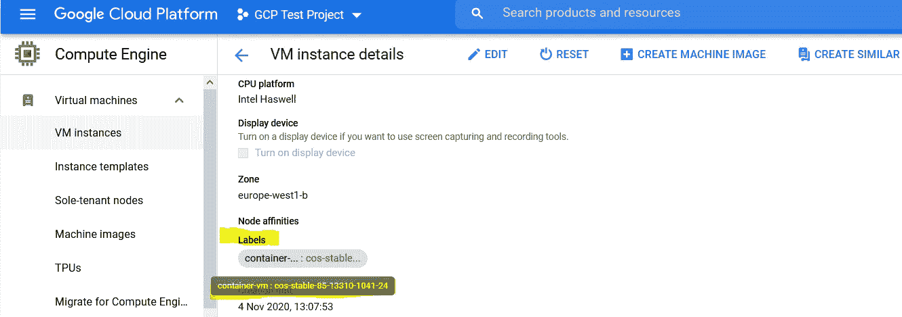*

*图片作者。*

*7.因此，在 Cloud Scheduler 的 payload 部分，输入以下内容:*

*   *{"zone":"europe-west1-b "，" label ":" container-VM = cos-stable-85–13310–1041–24 " }*

*您最终会看到这样一个窗口，在我的例子中，它定义了一个每天早上 6:35 开始的作业:*

*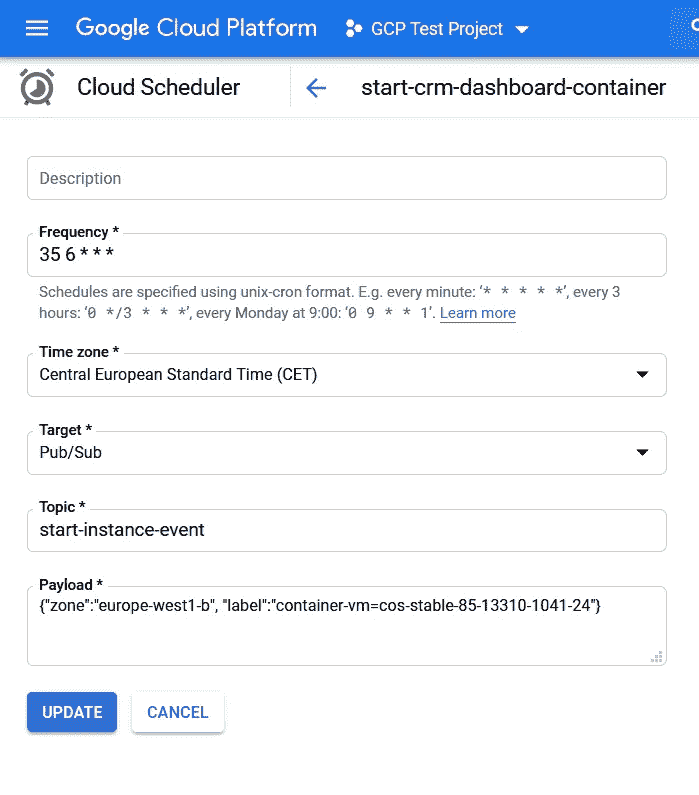*

*图片作者。*

*您可以通过采取类似的步骤来创建停止调度程序作业。*

*这将为您带来两个计划作业:*

*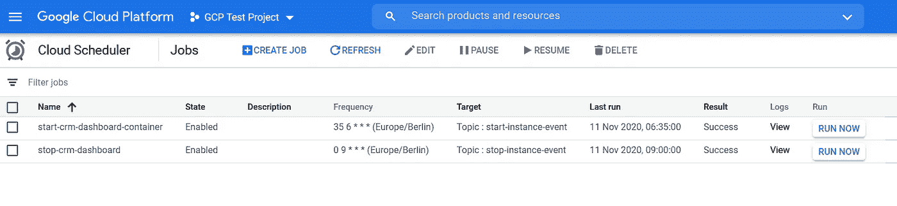*

*图片作者。*

*您也可以通过按下启动和稍后停止作业上的`RUN NOW`按钮来测试作业是否正常工作。他们应该分别启动和停止您的 GCE 虚拟机。*

# *搞定了。*

*就是这样！我们在 GCP 上导入了一个回购协议，将其打包，并使用 GCP 的功能来安排其执行。通过访问 GCE 虚拟机中的`Logs`窗口，可以相对容易地完成对流程的监控:*

*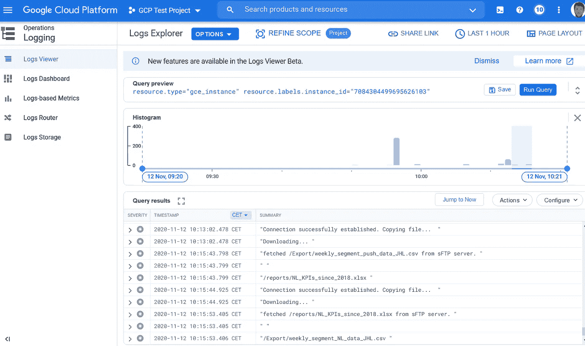*

*图片作者。*

*此窗口将允许您观察代码的日志。正如你从上面的截图中看到的，我可以看到`print`命令在每一行中输出，这对于首次展示和监控你的应用程序是如何部署和执行的非常有用。*

*在后续的帖子中，我将讨论如何使用 Python 从 GCP 导出和导入文件。保持联系！*

# *附加参考*

*以下是我在执行这个项目时使用的一些参考资料*

*   *关于如何使用我在这里描述的一些 GCP 组件的很好的教程。*
*   *[另一个教程](https://dragonprogrammer.com/deploy-docker-container-gcp/)更详细地介绍了在 GCP 上部署应用的细节*