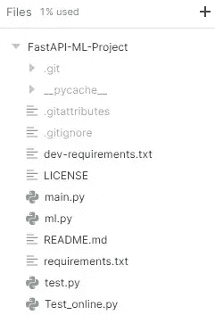
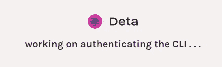
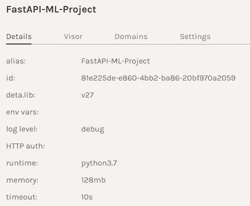
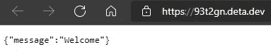

# 部署您的第一个机器学习 API

> 原文：<https://towardsdatascience.com/deploying-your-first-machine-learning-api-1649236c695e?source=collection_archive---------13----------------------->

## 使用 FastAPI 和 Deta 轻松开发和部署机器学习 API。


图片作者|元素作者 [vectorjuice](https://www.freepik.com/vectorjuice)

# 介绍

在这个项目中，我们将学习如何为您的机器学习模型构建应用程序编程接口(API ),然后用简单的代码部署它。我花了一个小时学习 FastAPI，花了五分钟学习如何将它部署到 Deta 服务器。我们还将使用 Python ***请求*** 在本地服务器和远程服务器上测试我们的 API。让我们更深入地了解一下我们将在项目中使用的技术。


作者图片

## 宽大的

与用于实验和评估的著名 NLTK Python 库相比，spaCy 对应用程序和部署更加友好。spaCy 附带预构建的统计神经网络 NLP 模型，具有强大的功能，易于在您的项目中使用和实施。我们将使用一个非常简单的小型预建英语模型来从我们的文本中提取实体。

## FastAPI

FastAPI 是一个用 python 构建 API 的快速 web 框架，它具有更快的查询时间，简单且最小化代码，让您在几分钟内设计出您的第一个 API[FastAPI](https://fastapi.tiangolo.com/)。在我们的项目中，我们将学习 FastAPI 如何工作，以及如何使用我们预先构建的模型从英文文本中获取实体。

## 二亚乙基三胺

我们将为我们的 API 使用 Deta Micros 服务，并在没有 docker 或 YAML 文件的情况下部署项目。Deta 平台具有易于部署的 CLI、高可扩展性、安全的 API 认证密钥、更改子域的选项以及 web 流量的日志记录。这些功能在 [Deta 上完全免费使用。](https://www.deta.sh/)在我们的项目中，我们将使用 Deta CLI 通过几行脚本部署我们的 Fast API。

[](https://www.kdnuggets.com/2021/10/top-news-week-1011-1017.html)

2021 年 10 月的顶级 KDnuggets 博客

# 密码

在我学习 FastAPI 的时候，我偶然发现了 YouTube 上的视频[激励我写这篇文章。](https://www.youtube.com/watch?v=1zMQBe0l1bM&t=854s&pp=sAQA) [Sebastián Ramírez](https://dev.to/tiangolo) 解释了 Fast API 的工作原理，以及它是目前最快的 python web 框架的原因。我们将编写两个 Python 文件。一个文件包含机器学习模型，另一个文件包含您的 API 代码。

## 要求

在开始之前，我们需要用一个 *requirements.txt* 文件创建一个新目录。您可以在下面找到我们将要使用的所有必要的库👇

```
fastapi
spacy
uvicorn
https://github.com/explosion/spacy-models/releases/download/en_core_web_sm-3.1.0/en_core_web_sm-3.1.0.tar.gz
```

您可以逐个安装它们，也可以使用🔻

```
$ pip install -r requirements.txt
```

我们将为这个项目使用一个预训练的 NLP 模型，所以我们需要从 GitHub 库[https://github.com/explosion/spacy-models](https://github.com/explosion/spacy-models)下载它，或者只是运行需求文件，它会自动下载并安装它。

## 机器学习模型

我们将使用预训练的[空间](https://www.analyticsvidhya.com/blog/2021/07/creating-data-science-python-package-using-jupyter-notebook/)自然语言处理模型从文本中提取实体。如果你用的是 Jupyter notebook，试着用 *%%writefile* 在你的目录下创建 python 文件。

首先，我们加载 NLP 模型，然后从 CBS [News](https://www.cbsnews.com/news/gabby-thomas-womens-200-meter-bronze-medal-olympics/) 文章中提取实体。只需几行代码，你就可以运行你的第一个机器学习模型。您也可以使用相同方法加载已训练模型。

## API 文件

这是您的主文件，其中包含:

1.  **read_main** :使用 ***GET* ，**从资源中请求数据，在我们的例子中，它将显示一条消息说 ***欢迎使用*。**
2.  **类文章**:使用*pydantic****base model***定义将用于你的 API [(helpmanual.io)](https://pydantic-docs.helpmanual.io/usage/models/) 的对象和变量。在我们的例子中，我们将内容定义为字符串，将注释定义为字符串列表。
3.  **analyze_article** :它从 ml 文件中获取带有注释的文本列表，并使用 *NLP* 对象显示实体。

*我知道这相当混乱，所以我们把它分解成更小的部分，以便更好地理解它。*

## 分解

我们已经创建了一个 FastAPI 的对象，然后使用 ***@app 将它作为函数的[装饰器](https://www.python.org/dev/peps/pep-0318/)。*得到("/")**。

*   **@app** 是你 FastAPI 对象的装饰器
*   **。获取或。post** if 返回数据或处理输入的 HTTP 方法
*   **(“/”)**是 web 服务器上的位置。在我们的例子中是主页。如果要添加另一个目录，可以使用("/ < new_section > /)

我们已经创建了 **read_main** 函数在主页上显示消息，就这么简单。

现在我们将创建一个 ***Article*** 类，它从 **BaseModel** 继承函数和变量。这个函数帮助我们创建将要在 ***POST*** 方法中使用的参数类型。在我们的例子中，我们创建了字符串变量形式的内容和字符串列表形式的注释。

在最后一部分中，我们为我们的 API 创建了一个**方法("/article/")。这意味着我们将创建一个新的部分，它将参数作为输入，并在处理后返回结果。**

*   ****文章类作为参数:**使用文章列表创建文章参数，这将允许我们添加多个文本条目。**
*   ****从文章中提取数据:**创建循环，从文章列表中提取数据，然后从评论列表中提取数据。它还向数组添加注释。**
*   ****加载文本到 NLP 模型:**加载内容到 ***nlp*** 预训练模型。**
*   ****提取实体:**从 ***nlp*** 对象中提取实体，然后添加到 ***ents*** 数组中。这将堆叠结果。**
*   ****显示:**该函数将返回实体和注释的列表。**

# **测试**

**Fast API 建立在 uvicon 上，所以服务器也运行在 uvicon 上。在 Jupyter notebook 中，您可以使用👇或者在终端中输入***uvicon***然后输入 ***main*** 文件和带有 FastAPI 对象的 ***app*** 。**

**我们的服务器运行流畅，所以让我们使用 ***request.get*** 方法来访问它。API 通过在主页上显示“欢迎”消息来工作。**

**现在让我们尝试在列表中添加单个文本和注释作为字典。我们将使用 ***POST*** request 方法和 ***/article/*** 来访问我们的 NLP 模型函数。将你的输出转换成 ***。json()*** 使提取数据变得容易。**

**我们有自己的字典键: **['ents '，' comments']****

**让我们检查一下我们的整个输出是什么样子的。看起来我们已经有了带有标签和实体列表的*。同样适用于 ***注释*** 键***

**现在让我们提取单个实体及其文本来检查输出的灵活性。在我们的例子中，我们从输出中提取第二个实体。**

**结果显示出完美。**

# **部署**

**转到您的终端，或者您可以在 Jupyter 笔记本电脑中执行相同的步骤，但添加“**！**“先于任何剧本。首先，您需要使用 ***cd*** 访问您的目录，其中包含您的 ***main.py*** 和 ***ml.py*** 文件。**

```
**cd ~”/FastAPI-ML-Project”**
```

****Deta** 需要的三个主文件是 ***ml.py*** ， ***main.py*** ，和***requirements . txt***。**

****

**作者图片|项目目录**

**如果您使用的是 **Windows** ，请在 PowerShell 中使用下面的命令下载并安装 Deta CLI**

```
**iwr [https://get.deta.dev/cli.ps1](https://get.deta.dev/cli.ps1) -useb | iex**
```

**对于 **Linux****

```
**curl -fsSL [https://get.deta.dev/cli.sh](https://get.deta.dev/cli.sh) | sh**
```

**然后使用 ***deta 登录*** ，它会带你到浏览器，要求你输入*用户名*和*密码*。如果您已经登录，认证将需要几秒钟时间。**

```
**deta login**
```

****

**Deta 认证| [deta](https://www.deta.sh/)**

**你终端里的这**两个字**就是**魔法字**，两分钟就能上传文件，部署好你的 app。**

```
**deta new**
```

**您的应用程序已上传至端点链接。在我们的情况下[https://93t2gn.deta.dev/](https://93t2gn.deta.dev/)**

```
**Successfully created a new micro{“name”: “FastAPI-ML-Project”,“runtime”: “python3.7”,“endpoint”: “https://93t2gn.deta.dev/",“visor”: “enabled”,“http_auth”: “disable”}Adding dependencies…Collecting fastapi…Successfully installed ……**
```

**如果您使用 ***deta 日志*** 查看错误检查日志，进行一些更改，然后使用 ***deta 部署*** 更新更改。**

**如你所见，我们的应用程序部署并运行在 Deta 服务器上。**

****

**项目概要| [详细资料](https://www.deta.sh/)**

**可以去 **Deta** 提供的链接自己查一下。**

****

**作者图片**

## **测试 Web API**

**最后，让我们在 Deta 平台上将远程 API 作为微服务进行测试。这一次，我们将添加 Deta 端点链接，而不是添加本地 IP。我们可以在没有头文件的情况下运行，因为我们没有启用 API 认证。当认证被启用时，Deta 还提供免费的 API 密钥。这意味着只有你或拥有 API 密匙的人才能访问网络服务器。要了解更多关于认证和子域的信息，我建议你阅读[文档](https://docs.deta.sh/docs/home/)。**

**我们将添加相同的参数和相同的代码，以获得相同的结果，瞧，这很神奇。您的 API 是在线的，可以通过使用链接轻松访问。**

# **结论**

**在学习 FastAPI 之后，我一直在思考下一步该做什么，所以有一天在浏览网页时，我偶然发现了引起我注意的 Deta。我花了几分钟在远程服务器上安装 **Deta CLI** 和部署我的 API。他们的子域和免费 API 关键特性给我留下了深刻的印象。我很快就明白了这项服务是如何工作的，以及我将如何在未来的项目中使用它。**

**我们学了几个机器学习模型之后都会问这个问题。**

> **我知道如何训练我的模型并获得预测，但下一步是什么？我如何与他人分享我的模型？这样他们就可以看到我构建的东西，并在他们的项目中使用这些特性。**

**这就是像 **Heroku** 、 **Google** 、 **Azure** 这样的云平台的用武之地，但是这些平台非常复杂，你需要学习为 **Docker** 文件编码，这有时会令人沮丧。 **Deta** 用简单的两个字的脚本解决您的所有问题，它将在几秒钟内部署并运行您的应用。**

***你也可以查看我对这个项目的 GitHub 回购:*[*kingabzpro/FastAPI-ML-Project*](https://github.com/kingabzpro/FastAPI-ML-Project)*。***

> **你可以在 LinkedIn 和 Polywork 上关注我，我每周都会在那里发表文章。**

# **别忘了给你的👏**