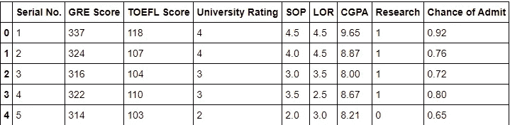
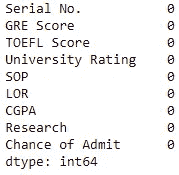
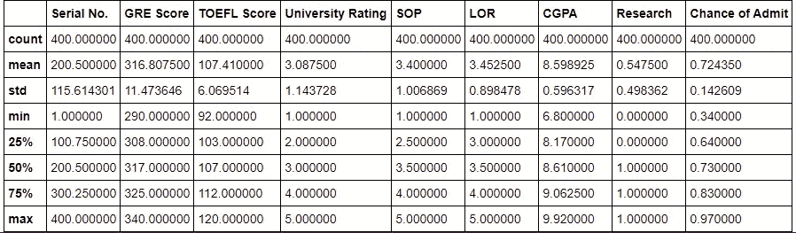
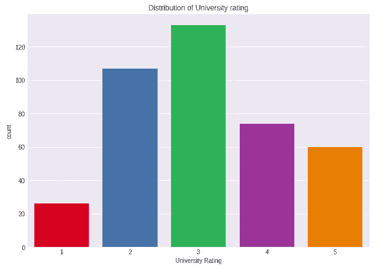
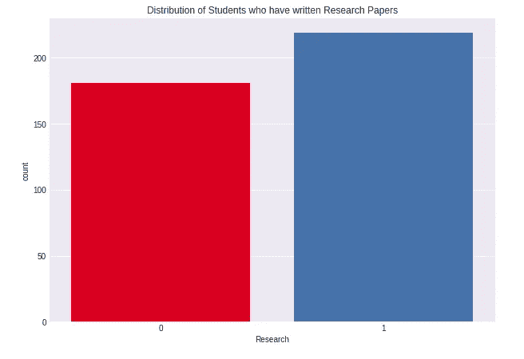
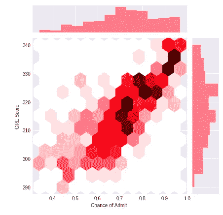
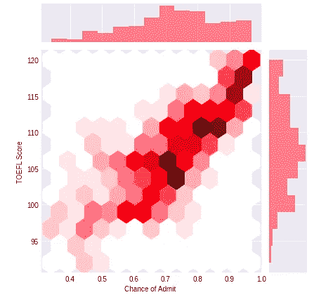
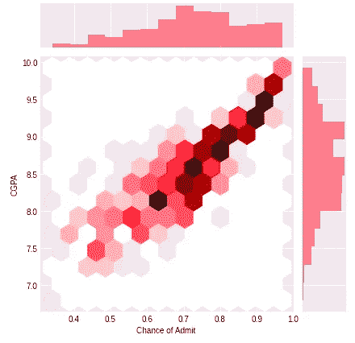

# 使用 Streamlit 和 Ngrok 部署您的 ML 模型

> 原文：<https://towardsdatascience.com/deploying-your-ml-model-using-streamlit-and-ngrok-c2eea3fd9763?source=collection_archive---------21----------------------->

## 关于如何使用 Streamlit 创建和部署模型的完整指南

弗洛里安·奥利佛在 [Unsplash](https://unsplash.com?utm_source=medium&utm_medium=referral) 上拍摄的照片

如果你一直在处理数据，那么你很有可能至少做过一次机器学习模型。我们每天都会遇到各种各样的机器学习模型。每个模型都是不同的，用于不同的目的。我们有各种各样的问题，为了建立一个好的模型，我们需要使用不同的算法。但是我们有了模型之后该做什么呢？大多数人制作模型，但是他们忽略了一个事实，没有部署模型就没有多大用处。在这篇博客中，我们将介绍创建一个模型并将其部署到 web 上的完整过程。

让我们从导入数据集开始。我们将使用来自 Kaggle 的数据集，其中包含不同的栏目，如学生的 GRE 成绩、托福成绩、CGPA 等等。我们将利用这些数据来预测一个学生是否能够进入研究生项目。让我把整个过程分解一下:

*   我们将从创建一个模型开始，我们的数据有连续的值，这意味着线性回归将足以帮助我们。
*   一旦我们有了模型，我们将把它存储在一个。pkl”或 pickle 文件。
*   我们将在新的 jupyter 笔记本中使用这个 pickle 文件，在其中我们将使用 streamlit 和 ngrok 将我们的模型部署到 web 上。

让我们首先从导入数据和创建模型开始。

在上面的代码中，我们只是导入我们将用来读取和可视化数据集的库，然后我们检查前 5 行，看看我们的数据到底是什么样子。

这是我们的数据，我们有学生的 GRE 和 TOEFL 成绩以及 CGPA 和其他栏，如 LOR 和学生是否写了研究论文。我们现在将做一些数据预处理和可视化我们的数据。

如您所见，我们的数据中没有空值。让我们假设我们很幸运，因为获得没有空值的数据是一个奇迹。让我们看看 describe 方法做了什么。

既然我们知道了这些重要的细节。我们将会看到一些情节，并试图从这些情节中获得深刻的见解。

该图向我们展示了大学评级栏中每个大学评级的条目数量分布。正如我们所看到的，这一栏中的大多数大学的评分为 3。最少的是评级为 1 的大学和中等数量的评级为 5 的大学，这是我们数据中大学的最高评级。

上面的图显示了我们的数据中有多少人写了一篇研究论文。研究论文在决定一个人是否能够进入研究生项目中起着关键作用，正如我们可以看到的，在我们的数据中有许多人写过研究论文。让我们看看通过可视化学生的分数以及输出栏(即被某个项目录取的机会)可以发现什么。

这张图向我们展示了 GRE 分数的分布与被某个特定项目录取的几率。我们可以观察到的是，这些点有些线性分布。较暗的六边形有更多的相关值，反之亦然。我们也来对比一下托福成绩吧。

我们也可以看到类似的趋势。在上面的情节中，我们有相当数量的托福成绩在 100 分以上的人。在进入建模部分之前，我们还将比较 CGPA 列。

正如我们所看到的，CGPA 列也具有与其他列相似的分布。可视化这些列的目的是选择制作模型的最佳列。我们首先处理我们的数据，然后将其可视化，在这一切之后，我们有了将用于制作模型的列。让我们开始建模。

在上面的代码片段中，我们导入了可以帮助我们制作模型的库。然后我们选择我们的列，我们也知道我们的输出列。然后，我们将进行一次拆分，从而得到两个集合——一个训练集和一个测试集。下一步是使用线性回归建立我们的模型。

这就是我们创建模型的方式。我们使用 Sci-Kit learn 中的线性回归来帮助建立我们的模型。我们将我们的训练数据拟合到这个模型中，然后调用 predict 方法，通过向模型提供测试数据来进行预测。我们拆分数据的主要原因很简单，并且可以与一个简单的现实世界场景联系起来。假设你有一个测试，如果我们给你所有的测试问题，你只是练习这些问题，你就可以把所有的东西都记下来，并在实际测试中取得好成绩。但是这里并没有真正的学习，你只是在强记东西。模型也是如此。我们用我们的训练数据训练它，然后用测试数据测试它的表现好坏。

我们使用的度量标准是 MSE 或均方误差。你可以使用这个[链接](https://www.freecodecamp.org/news/machine-learning-mean-squared-error-regression-line-c7dde9a26b93/)来了解它背后的数学原理。经过评估，我们知道这个模型相当不错，MSE 为 0.005。让我们用一些输入来测试这个模型，然后我们将把这个模型放在一个。这样我们可以在以后的部署中使用它。

因此，我们用一些用户给定的输入来检查模型，与实际值的偏差非常小，这意味着我们在正确的轨道上。然后，我们导入了 pickle，它帮助我们存储模型以用于部署。我们刚刚做了自己的机器学习模型！现在是时候部署它了。

为了部署我们的模型，我们将使用 Streamlit 和 Ngrok。Streamlit 是一个 python 库，它帮助我们创建易于构建的出色的 web 应用程序。也是开源的！我建议你浏览一下 streamlit [文档](https://docs.streamlit.io/en/stable/)以便更好地理解整个框架的工作。让我们从加载模型和导入库开始。

既然我们已经有了可以使用的库和加载的模型，我们就可以开始设计我们的 web 页面了。

因此，我们有许多 Streamlit 提供的功能，可以用来设计我们的网页。在上面的代码片段中，我们使用 streamlit 特性来创建不同的特性，如侧边栏、创建标题等等。一旦我们完成了页面的设计，我们就可以使用我们加载的模型，通过用户在文本框或者滑块的帮助下输入的信息来进行预测。所有这些都是由 Streamlit 提供给我们的，所以我们不需要任何 web 开发的一般知识，但拥有一些 web 开发知识总是有利的。

在这里，我们正在创建滑块，这将有助于用户在给用户输入。我们为所有的输入值创建滑块，我们将使用这些值作为我们给模型的输入。然后我们创建一个按钮，点击它，我们就得到结果。最后，我们打印结果供用户查看。

我们现在有了完整的网页设置，它也能够根据我们给模型的输入给出输出。现在，我们部署的最后一步是使用 Ngrok。但是它有什么用呢？用最简单的话来说，它把我们的本地开发服务器放到互联网上。你可以在这里了解更多关于 Ngrok [的信息。让我们使用 Ngrok 在互联网上部署我们的模型。](https://ngrok.com/product)

有了这段代码，我们就可以创建服务器并在互联网上运行我们的模型。它将被托管在 Ngrok 的子域之一，因此我们不需要任何公共域或 IP。一旦我们这样做了，我们就可以转到生成的 URL，我们将能够查看我们的 web 应用程序。

至此，我们结束了创建机器学习模型并将其部署到 web 上的整个过程。完整的代码将被链接下来供您查看。这是它的这一个。因此，继续构建一些模型并部署它们，并且不要忘记在您这样做的同时享受一些乐趣！

链接到模特-[https://github.com/AM1CODES/PythonWeek-GraduateAdmission](https://github.com/AM1CODES/PythonWeek-GraduateAdmission)

这里和我连线-【https://www.linkedin.com/in/aayushmishra1512/ 