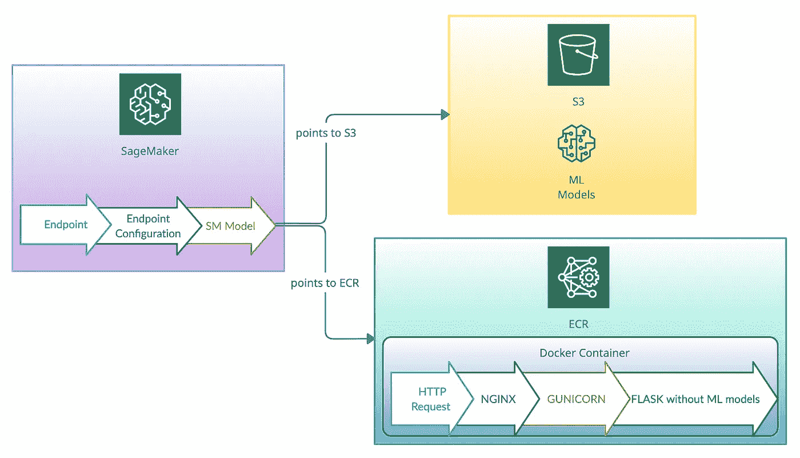

# 将您的 ML 模型部署到 AWS SageMaker

> 原文：<https://towardsdatascience.com/deploying-your-ml-models-to-aws-sagemaker-6948439f48e1?source=collection_archive---------5----------------------->

## 为了 2021 年夏季奥运会，我们创建了这个 web [应用程序](https://share.streamlit.io/gitskim/aqa_streamlit/main/main.py)来预测人类裁判会给跳水视频打多少分。我们使用 [Streamlit.io](https://streamlit.io/) 库制作了我们的应用程序。

由 Suhyun Kim 创建的 GIF

我们在使用 Streamlit.io 时遇到了一些困难，所以我们决定将我们的 ML 模型部署到 AWS SageMaker。你可以在这里看到我们的 SageMaker 实现。本文的目的是提供一个示例教程，展示如何将 ML 模型部署到 AWS SageMaker。本教程只涉及部署没有在 SageMaker 中培训过的 ML 模型。部署在 AWS SageMaker 之外训练的 ML 模型比在 SageMaker 内训练模型并进行端到端部署要复杂得多。有一些例子[代码](https://github.com/aws/amazon-sagemaker-examples/tree/master/advanced_functionality/scikit_bring_your_own/container)是关于如何部署你的内部培训模型的，但是这不足以支持我们的产品，所以我们必须更进一步。我将首先描述 SageMaker 如何与模型部署一起工作的高层架构，然后提供一步一步的指导。

如果你想使用 SageMaker 作为服务来部署你的模型，涉及到部署到 3 个 AWS 服务: **AWS SageMaker** ， **AWS 弹性容器注册中心(ECR)** ，为容器镜像提供版本控制和访问控制， **AWS 简单云存储(S3)** 。下图详细描述了该过程。

由 Suhyun Kim 创建的图像

首先，将您的打包 ML 模型放入 AWS S3 桶。然后您将 Docker 映像部署到 AWS ECR，它将由您的 SageMaker 使用。Docker 用于将你的 ML 推理逻辑代码打包到一个容器化的环境中。SageMaker 也会在 S3 消费你的模型。作为客户机，您只与 SageMaker 端点交互，它首先从 S3 下载您的模型，然后从 ECR 调用您的 ML 推理代码。

首先，我想描述一下 AWS 提供的示例[代码](https://github.com/aws/amazon-sagemaker-examples/tree/master/advanced_functionality/scikit_bring_your_own/container)中有什么，它描述了 ECR 下的架构。示例[代码](https://github.com/aws/amazon-sagemaker-examples/tree/master/advanced_functionality/scikit_bring_your_own/container)遵循基本的服务器架构，该代码将被部署到 ECR。

1.  **Nginx** 是一个 web 服务器，它是 HTTP 请求首先到达的地方。它处理请求的方式是只允许有效的请求通过。
2.  Gunicorn 是“一个 WSGI 预分叉工作服务器，它运行应用程序的多个副本，并在它们之间进行负载平衡。”([引用](https://github.com/aws/amazon-sagemaker-examples/tree/master/advanced_functionality/scikit_bring_your_own/container))当请求进来时，它调用你的 Python 代码。
3.  Flask 是一个 python web 框架，可以让你指定如何处理 ML 推理请求的逻辑。它允许您响应 */ping* 和*/调用*。

示例[代码](https://github.com/aws/amazon-sagemaker-examples/tree/master/advanced_functionality/scikit_bring_your_own/container)提供 *build_and_push.sh* ，通过运行脚本构建 docker 容器并推送到 AWS ECR。在运行脚本之前，我建议您转到 AWS ECR 页面，尝试手动将图像发布到 ECR。然后，您将在 ECR 页面上推荐的脚本中看到相同的命令。

现在我将描述 AWS SageMaker 部分需要做什么。这是为您的推理声明硬件实例的地方。您还创建了一个端点，您的客户机通过它与您的 ML 服务进行通信。为了获得一个功能完整的实例，您需要创建一个 SageMaker 模型、SageMaker 端点配置和 SageMaker 端点。

1.  **型号**指的是 docker 容器和您的 ML 型号的位置。需要注意的一点是，您可以将 ML 模型附加到 docker 容器中，也可以将压缩模型(必须是 thing 格式)放在 S3 中。然后 SageMaker 将下载压缩的模型文件到 *opt/ml/model* 目录中，在您的推理代码中，您需要引用该目录中的模型。
2.  **端点配置**是将模型(来自步骤 1)连接到端点(步骤 3)的地方。端点是 Sagemaker 与外界接口的一部分。您可以创建不同的变体，以便 beta 和 prod 使用不同的模型。这样，您还可以配置进入不同变体的流量。例如，如果您想对您的 ML 模型进行 A/B 测试，您可以使用生产变量来划分流量，并查看您的每个 ML 模型的执行情况。对于我们的示例代码，除了 prod，我没有使用生产变量。
3.  **端点**是您从服务中调用的，以使用您的 ML 模型进行推理。您可以用 python、java、javascript 或 shell 调用您的端点。这里是[的例子](https://gist.github.com/mvsusp/b9de070b310af6876de7b59beda0fb4a)。

## 第一步。写一个 [Docker 文件](https://github.com/gitskim/AQA_SageMaker/blob/main/Dockerfile)

在我们的[示例](https://github.com/gitskim/AQA_SageMaker/blob/main/Dockerfile)中，我们从公共存储库中提取一个映像，并用 Ubuntu 版本 18.04 设置基本映像。大多数 docker 文件以 FROM 指令开始，图像可以是任何有效的图像。由于我们有了一个全新的映像，我们正在安装必要的库，并在运行后设置变量，这将执行 docker 映像中的命令。然后，SageMaker 的推理代码包被复制到工作目录，以便代码可用于后续指令。

## 第二步。在/ping 函数中编写健康检查代码，在/调用中编写推理逻辑

需要定义两个必要的函数: */ping* 和 */invocations* 。

一旦调用 CreateEndpoint 和 UpdateEndpoint APIs，容器就会启动。容器启动后，SageMaker 通过不时地持续 ping 服务来检查容器的健康状况，以查看容器是否启动并运行。健康检查 ping 通过 */ping* ，您将看到该函数已准备好返回静态 200 响应。您可以在此呼叫中添加其他健康检查，如打印报表。如果容器在启动后的 4 分钟内没有发送 200 响应，CreateEndpoint 将失败，因此 UpdateEndpoint 将无法完成。

当 SageMaker 端点被调用时，默认情况下，调用被路由到 */invocations* ，因此推理代码需要在调用函数下。你可以从 flask 的 request 对象中获取这个函数附带的内容，比如这里:[https://github . com/gitskimp/AQA _ sage maker/blob/main/getPredScore/predictor . py # L61](https://github.com/gitskim/AQA_SageMaker/blob/main/getPredScore/predictor.py#L61)

## 第三步。本地测试:验证功能

为了在本地测试 docker 映像功能中的推理逻辑，我们将通过创建一个 docker 容器来进行测试，该容器对模型位置的路径进行了一些更改。确保在测试之前下载 docker 并运行它。Sagemaker 会自动下载位于 S3 的 */opt/program/models/* 目录下的模型，当您部署代码时，您应该编写代码，以便它在该目录中查找它的模型。但是为了在本地测试功能，我们需要在本地重新定位模型，并引用本地模型位置。当您创建一个容器时，如上面的脚本所示，我们需要 AWS 凭证，因为我们提供输入数据作为到 S3 的链接。我们为什么这样做的详细描述将在后续文章中描述。

## 第四步。使用 build_and_push.sh 进行部署

starter 示例代码附带了 build_and_push.sh bash 脚本来自动化部署。你只需要***chmod+x build _ and _ push . sh .***然后输入 ***运行脚本。/build_and_push.sh.*** 要自动创建三个主要组件(模型、端点配置和端点)，可以使用 Cloud Formation 或 SageMaker Studio。您可以通过 Sagemaker Studio python 控制台创建所有三个组件，如下所示:[https://github . com/git skim/AQA _ sage maker/blob/main/sage maker _ one _ click _ create _ with _ integ _ test . py](https://github.com/gitskim/AQA_SageMaker/blob/main/sagemaker_one_click_create_with_integ_test.py)

总之，我们的想法是创建一个 docker 容器并将其部署到 AWS ECR，并创建一个 SageMaker 实例来使用 ECR 映像。我希望你发现这个解释和附加的代码是有用的，但是值得一提的是，与 SageMaker 的整个交互是相当令人沮丧的。

令人惊讶的是，SageMaker 的 ML 部署工具既原始又复杂。SageMaker 几乎只提供了最低限度的部署，它需要很多意想不到的部署和维护步骤，特别是对于在 AWS SageMaker 之外训练的 ML 模型。对于这样一个推广良好的平台，我们期望更成熟的部署和版本控制工具。虽然给出了 boiler plate 代码，但是使用 nginx、gunicorn 和 flask 会导致系统变得笨重，难以维护。我不妨在 AWS EC2 中创建自己的机器学习服务器。

> 好在 AWS 还在继续努力改进 SageMaker。AWS re:invent 2021 为 SageMaker 展示了一个新的无服务器推理功能，在这个功能中，您不必指定一种主机来运行您的 SageMaker 代码。然而，我上面解释的架构仍然存在，没有太大的变化，所以新版本没有完全消除将 ML 模型部署到 SageMaker 所带来的复杂性和繁琐的设计。另外，我想知道这个特性有多大用处，因为我们已经有了一个方便的无服务器选项:AWS Lambda。

出于上述原因，在我们 ML 服务的实际实现中，我们使用了 AWS Lambda。它的无服务器功能可处理扩展、容错，并实现我们服务的高可用性。2020 年 12 月，AWS 开始支持将 Docker 容器映像部署为 lambda 函数的功能。这意味着 docker 容器映像可以部署到 lambda，而不是 zip 文件。这对于 ML 部署来说是一个有用的特性，因为它现在为 ML 服务的大文件和依赖性提供了空间。然而，也有缺点，包括[现有的λ问题](https://hevodata.com/blog/serverless-architecture-aws-lambda/)，比如启动延迟。此外，特定于 ML 部署的特性，如连续模型部署和模型版本控制，需要实现额外的层。它们不是作为方便的特征提供的。

说到底，SageMaker 对 ML Ops 来说并不方便；在 SageMaker 之外训练的模型的 ML 部署特别差。因此，我们使用 AWS Lambda 进行 ML 模型部署，因为它便于集成。将会有另一篇文章描述我们基于 AWS Lambda 的 ML 系统的架构。

*我与* [*延庆戴*](https://www.linkedin.com/in/yanqing-dai-2001948a/) *合作写了这篇博客。*

# 注意

我和 [*延庆戴*](https://www.linkedin.com/in/yanqing-dai-2001948a/) 开始了我的自由职业生涯。我们接受专注于生产机器学习服务、数据工程和分布式系统的自由职业者的工作。