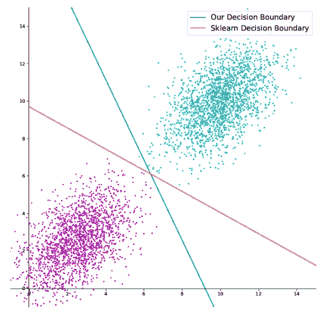
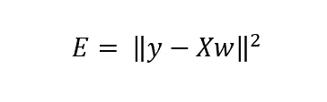
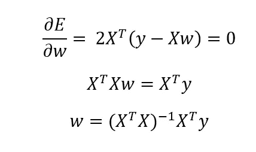
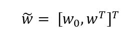
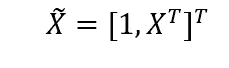
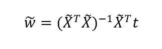
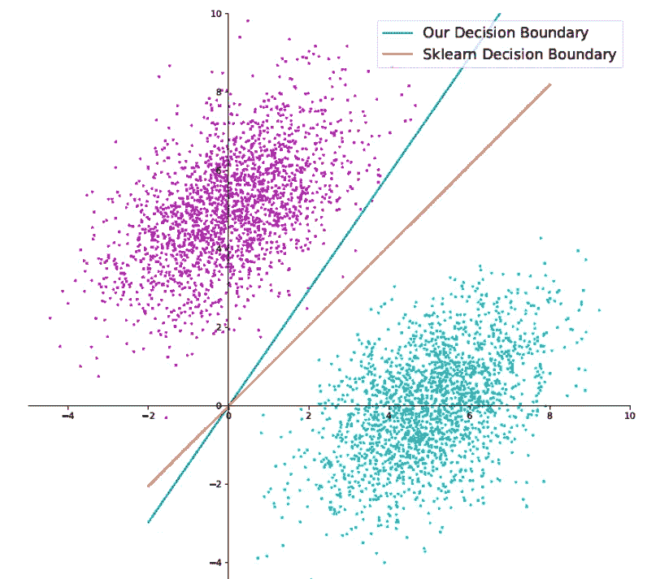

# 最小二乘回归器和分类器的推导

> 原文：<https://towardsdatascience.com/derivation-of-least-squares-regressor-and-classifier-708be1358fe9?source=collection_archive---------12----------------------->

## 基本机器学习推导

## 一个基本但功能强大的分类器和回归器，它们的派生以及它们工作的原因

作者图片

在本文中，我推导了最小二乘回归和分类算法的伪逆解。

虽然不是很复杂，但在一些问题中，它仍然是一个非常强大的工具，今天仍然被用作其他机器学习模型的核心，如集成方法或神经网络(其中感知机提供了非常相似的算法)。如果你刚刚开始进入机器学习的世界，这是迄今为止让你头脑清醒的最重要的话题之一！

# **线性回归**

让我们首先推导回归问题的最小二乘解。

我们尝试从数据矩阵 x 中估计目标向量 y。为此，我们尝试优化权重向量 w，使误差平方和最小化，如下所示:

其中 E 是误差平方和，y 是目标向量，X 是数据矩阵，w 是权重向量

最小二乘问题有一个解析解。当用 w 对误差求微分时，当导数等于零时，求 w 得到伪逆解:

# 最小平方分类器

通过尝试寻找最佳决策边界，最小二乘解也可用于解决分类问题。

如果试图在二维问题中进行分类，可以按以下方式调整最小二乘算法:

首先注意，目标张量不再是 Nx1 向量，而是 Nxc 张量，其中 c 是我们试图分类的类别的数量。此外，权重向量需要额外的维度来表示决策边界的截距:

其中 w0 是决策边界的截距，w 可以用作梯度。

数据矩阵 X 也必须适应要兼容的维度。将一个向量串联起来增加维度就达到了这个目的。

新的数据矩阵和目标向量 t 可用于导出解析解。结果是最小二乘分类器及其伪逆解。

这里是一个二元高斯分类器的小例子，用上面显示的方法实现，与默认的 SK-learn 分类器相对。

作者图片

决策边界的等式简单来说就是 ax + by + c = 0。权重向量是[a，b，c]。孤立 y 我们发现分类器的梯度是-a/b，分类器的截距是-c/b。

值得注意的是，这是二元高斯问题的最大后验估计量，对于无限数据，它将趋于完美的结果。

# **结论**

在我攻读硕士学位时，线性回归是一个反复出现的话题。它的简单性和它与最大后验解的关系是它在机器学习领域成功的原因。我希望这篇文章能帮助您理解如何将它应用于分类问题。

## 支持我👏

希望这对你有所帮助，如果你喜欢，你可以 [**关注我！**](https://medium.com/@diegounzuetaruedas)

你也可以成为 [**中级会员**](https://diegounzuetaruedas.medium.com/membership) 使用我的推荐链接，获得我所有的文章和更多:[https://diegounzuetaruedas.medium.com/membership](https://diegounzuetaruedas.medium.com/membership)

## 你可能喜欢的其他文章

[可微发电机网络:简介](/differentiable-generator-networks-an-introduction-5a9650a24823)

[傅立叶变换:直观的可视化](/fourier-transforms-an-intuitive-visualisation-ba186c7380ee)