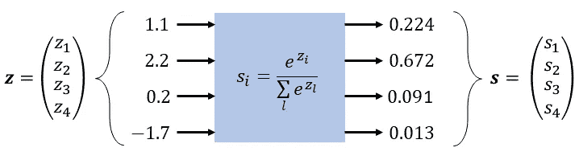
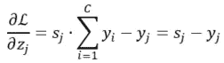

# Softmax 函数的导数和分类交叉熵损失

> 原文：<https://towardsdatascience.com/derivative-of-the-softmax-function-and-the-categorical-cross-entropy-loss-ffceefc081d1?source=collection_archive---------0----------------------->

## 简单快速的推导

在这篇短文中，我们将计算 softmax 函数的雅可比矩阵。通过应用一个优雅的计算技巧，我们将使推导非常短。使用获得的雅可比矩阵，我们将计算分类交叉熵损失的梯度。

# Softmax 函数

softmax 函数的主要用途是获取任意实数的向量，并将其转换为概率:

(图片由作者提供)

上面公式中的指数函数确保获得的值是非负的。由于分母中的归一化项，获得的值总和为 1。此外，所有值都在 0 和 1 之间。softmax 函数的一个重要属性是它保留了其输入值的等级顺序:

# Softmax 函数的雅可比矩阵

形式上，softmax 函数是所谓的*矢量函数*，它将一个矢量作为输入，并产生一个矢量作为输出:

所以，我们在讲 softmax 函数的导数时，其实讲的是它的雅可比矩阵，雅可比矩阵是所有一阶偏导数的矩阵:

在哪里

请注意，softmax 函数的每个输出如何依赖于所有输入值(由于分母)。由于这个原因，雅可比矩阵的非对角线元素不为零。

由于 softmax 函数的输出是严格的正值，因此我们可以通过应用以下技巧来使下面的求导非常简短:我们不求输出的偏导数，而是求输出的对数的偏导数(也称为“对数导数”):

其中右边的表达式直接来自链式法则。接下来，我们重新排列上面的公式，得到:

左手边正是我们要找的偏导数。我们很快就会看到，右边简化了导数的计算，因此我们不需要导数的商法则。我们必须首先取𝑠:的对数

所得表达式的偏导数为:

让我们看看右边的第一项:

可以使用指示符函数 1{ }简明地写出。如果 indicator 函数的参数为真，则该函数的值为 1，否则为 0。

右边的第二项可以通过应用链式法则来计算:

在上面的步骤中，我们使用了自然对数的导数:

获得和的偏导数是很简单的:

将结果代入公式得出:

最后，我们必须用𝑠乘上表达式，如本节开头所示:

我们的推导到此结束。我们已经得到了雅可比矩阵所有元素的公式(对角的和非对角的)。对于𝑛 = 4 的特殊情况，我们得到:

看看对角线元素与非对角线元素有何不同。

# 分类交叉熵损失

分类交叉熵损失与 softmax 函数密切相关，因为它实际上仅用于输出处有 softmax 图层的网络。在我们正式引入分类交叉熵损失(通常也称为 softmax 损失)之前，我们必须先澄清两个术语:**多类分类**和**交叉熵**。

分类问题可以细分为以下两类:

*   **多类别分类**，每个样本只属于一个类别(互斥)
*   **多标签分类**，每个样本可能属于多个类别(或不属于任何类别)

类别交叉熵损失专门用于多类分类任务，其中每个样本恰好属于 *𝙲* 类之一。因此，分配给每个样本的真实标签由 0 和 *𝙲* -1 之间的单个整数值组成。标签可以由大小为 *𝙲* 的独热编码向量来表示，对于正确的类，该向量的值为 1，而在其他地方为 0，参见下面的示例，其中 *𝙲* = 4:

**交叉熵**将两个离散的概率分布(简单地，其元素位于 0，..，1 和 sum to 1)并输出单个实值(！)表示两种概率分布相似性的数字:

其中 *𝙲* 表示不同类别的数量，下标𝑖表示向量的𝑖-th 元素。交叉熵越小，两个概率分布越相似。

当交叉熵被用作多类分类任务中的损失函数时，𝒚被馈送一个热码编码标签，并且由 softmax 层生成的概率被放入 **𝑠** 。这样我们就不会取零的对数，因为数学上 softmax 永远不会真正产生零值。

通过最小化训练期间的损失，我们基本上迫使预测的概率逐渐类似于真正的独热编码向量。

(图片由作者提供)

为了启动反向传播过程，如本文[帖子](/deriving-the-backpropagation-equations-from-scratch-part-1-343b300c585a)所述，我们必须计算损耗 w.r.t 对输出层的*加权输入* 𝑧的导数，见上图:

让我们代入上一节得到的导数:

并在最后一项中扩展产品:

对于𝑖 = 𝑗，指示符函数 1 { 0 }取值为 1，其他地方取值为 0:

接下来，我们将𝑠从总和中剔除，因为它不依赖于𝑖:指数

在最后一步中，我们使用了这样一个事实，即独热编码向量𝒚和为 1。请记住，一个独热编码向量可以被解释为一个概率分布，其概率质量以单个值为中心。在简明的矢量符号中，我们得到:

# 更多阅读

[伊莱·本德斯基的网站](https://eli.thegreenplace.net/2016/the-softmax-function-and-its-derivative/)
[劳尔·戈麦斯的博客](https://gombru.github.io/2018/05/23/cross_entropy_loss/)