# 使用知识图技术从健康数据中获得洞察力

> 原文：<https://towardsdatascience.com/derive-insights-from-health-data-using-knowledge-graph-technologies-b6cf2b742cd6?source=collection_archive---------13----------------------->

## [业内笔记](https://towardsdatascience.com/tagged/notes-from-industry)

## 知识图技术如何帮助临床自然语言处理

本文描述了`knowledge graph technologies`如何帮助健康数据科学，特别是自由文本电子健康记录。这是基于我在[第一届循证人工智能和医学国际研讨会](https://airs.cuhk.edu.cn/en/event/13233)上的一次受邀演讲。

[国立癌症研究所](https://unsplash.com/@nci?utm_source=medium&utm_medium=referral)在 [Unsplash](https://unsplash.com?utm_source=medium&utm_medium=referral) 上拍摄的照片

对于那些想知道一点什么是知识图的人来说，你可能会发现[这个知识图介绍](https://medium.com/@honghan.wu/a-very-simple-guide-of-knowledge-graph-for-health-data-scientists-bb8cefc1db31)很有用。

我将使用真实世界的例子来介绍知识图技术如何帮助临床自然语言处理。我将在《医疗保健知识图谱的挑战和未来方向》中，用我自己的一点想法来完成这个故事。

我知道不是每个人都对技术细节感兴趣。所以，我会用一种讲故事的方式来做演讲。

# 为什么要使用自由文本的临床笔记呢？

世界上很大一部分数据都是非结构化格式的，如新闻文章、推文和博客。有人说我们 80%的数据是非结构化的，而其他人估计更多。不足为奇的是，这种现象在医疗保健领域也能观察到，比如医院的电子健康记录。如果您想知道**自由文本数据为什么/如何有用，**请查看[这个小故事](https://medium.com/@honghan.wu/why-bother-using-free-text-clinical-notes-for-research-or-patient-care-ba08d8e9e040)。

# 两个故事，一个超硬的要求

现在，让我们讨论知识图如何对健康数据科学有用，特别是在本文中对临床自然语言处理有用。

我先说两个我自己研究经历的故事。两者都以几乎不可能实现的相同要求而告终。

图片由作者提供——伦敦南部和 Maudsley 医院:欧洲最大的精神健康服务提供商

*   **故事# 1**2016 年来自伦敦南部。我与伦敦南部的[和 Maudsley 医院](https://www.slam.nhs.uk/)(简称 SLaM)的同事一起工作，这是欧洲最大的精神健康服务提供商，2016 年有> 33 万个独特的患者记录。SLaM 是英国使用 NLP 从自由文本文档中导出有用临床特征的先驱之一，例如吸烟状况、抑郁症状和自杀想法。当我在那里开始工作时，他们已经这样做了 7 年，他们有 60 个 NLP 应用程序例行运行在他们的数据上。大多数应用程序都是为识别心理健康相关功能而开发的。我加入的项目有点雄心勃勃，要识别所有的身体疾病(如糖尿病、心脏病等)，因为他们对研究精神和身体状况之间的界面感兴趣。**从技术上讲，他们有兴趣从 ICD-10 中识别所有 69k 人类疾病。ICD-10 是国际疾病分类第 10 版，是我们之前讨论的 BioPortal 的 T-box 之一。**

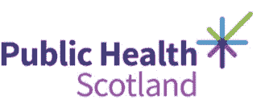

*苏格兰公共卫生部提供的图像* —这是一个与苏格兰公共卫生部合作的项目，旨在使苏格兰成像数据可用于研究

*   **故事#2** 来自苏格兰爱丁堡，始于 2019 年。这仍然是一个活跃的项目。我与苏格兰公共卫生部合作苏格兰医学影像项目，该项目旨在使苏格兰所有的医学影像数据可供研究访问。在这里，我们只讨论自由文本结构化报告，即当您在医院做 MRI 或 CT 扫描时会得到的那些报告。数据集中有> 33m 个结构化报表。PHS 不愿意让研究人员直接接触到这些报告。原因是可以理解的，因为自由文本报告包含大量个人信息，几乎不可能 100%匿名。因此，他们建议使用 NLP 来查看所有疾病、症状和临床发现，以便将结果保存到结构化数据库中。然后，研究人员可以访问数据库，而不是原始的自由文本报告。**本质上，他们要求的是一个 NLP 模型，该模型识别的疾病远不止之前故事中的 69k 种，而是总共约 400 万种的所有生物医学概念(我们将在后面看到)。**

# 不可能的任务？

因此，两个不同的故事，但都要求同样的事情:一个超级 duper NLP 模型，识别所有疾病和表型。如果你不知道什么是表现型，不用担心。基本上，对医疗保健很重要的是任何临床属性，如头痛、出汗、药物使用、不良事件等。

实现这样一个超级自然语言处理模型几乎是一个不可能完成的任务，不仅仅是对我们——一群学术界研究人员来说，甚至对谷歌和亚马逊这样的科技巨头来说也是非常具有挑战性的。让我们做一点分析，看看为什么会这样。

# 两个主要挑战和一个次要挑战。

实现这样一个超级 NLP 模型有两个挑战——我称之为主要挑战。还有一个次要的挑战是，即使你有这样一个系统，它也很难用于最终用户，即临床研究人员。

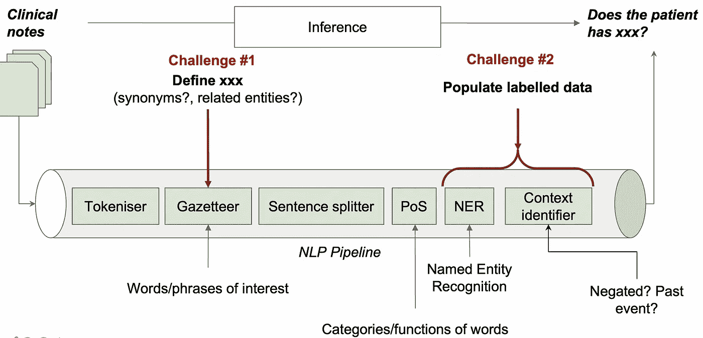

作者图片——剖析传统临床 NLP 流程，以确定大规模表型分析任务中的两个主要挑战

让我们对典型的 NLP 管道(上图)进行一点剖析，以理解实现超级 NLP 模型的挑战。请注意，这里的管道是出于解释的目的，并不适用于所有的 NLP 方法，尤其是那些使用大型神经网络语言模型的方法，如[伯特](https://arxiv.org/abs/1810.04805)或 [GPT](https://openai.com/blog/gpt-3-apps/) 。但是，我们讨论的挑战具有普遍性。

如上图所示，临床 NLP 模型通常将一组临床笔记作为输入，并做出推断来回答问题**患者是否患有 xx？这样的管道通常有几个组件，每个组件在自由文本上执行一个特定的任务。所有人联合起来实现这个推论。让我们忽略所有细节，只看与我们的挑战相关的两组组件。**

1.  管道中的第二个组件叫做**地名词典**。本质上，它是一个字典，定义了我们想要从自由文本数据中识别的一组概念。对于每个概念，它需要列出所有的同义词。比如腹泻，有> 20 种不同的叫法。显然，他们都需要列出来。此外，还需要定义概念的子类型。例如，我支持了一项关于肝病的研究，我发现有 70 种不同类型的肝病。当然，每个子类型及其同义词也需要包括在内。所以，对于所有的 69k 疾病，你可以计算出`69k x 70 x 20`也就是> 1 亿个名字。而且，像 ICD-10 这样的疾病分类系统是不合适的，因为它没有同义词。本质上，我们需要一个全面的地名录来定义所有这些关于人类疾病的信息。这是一个巨大的努力，不是一个小团队能在短时间内完成的。我称之为**知识表达挑战**。如果你还记得我们在知识图表中使用的术语，这就是我们需要的 T-box。
2.  管道中的最后两个组件是那些从自由文本中识别概念的重要组件。在机器学习术语中，这是一个受监督的学习过程，意味着需要提供基本事实(即大多数情况下人类标记的数据)供计算机学习。显然，要求医生标注所有 69k 疾病的数据几乎是不可能的。所以，这是第二个主要挑战——没有或没有足够的标记数据用于学习。这被称为**低资源学习挑战**。

# 使用大型 NLP 结果数据的第二个挑战是

最后一个挑战是次要的。当你有了这样一个识别所有疾病和表型的系统，显然，这将是一个大数据空间。你需要搜索空间，找到与你的学习最相关的内容。而且，有效地做到这一点可能很有挑战性。让我们看一个 SLaM 医院的真实使用案例。

首先，介绍一下这个用例的临床背景:

> 情绪稳定剂是用于治疗双相情感障碍的药物，双相情感障碍是一种精神疾病。

假设我们的用例是通过寻找服用情绪稳定剂的人来识别躁郁症患者。现在，假设我们已经在整个 SLaM 数据上应用了 super-duper NLP 系统，并识别了所有内容。为了找到所有的躁郁症患者，人们必须知道所有的情绪稳定剂药物。这当然不是一个用户，甚至是一个有经验的临床医生，可以不容易提供的东西。

# 解决方案

> 【SemEHR:】SemEHR:一个通用语义搜索系统，用于从临床记录中提取语义数据，以用于定制护理、试验招募和临床研究
> 吴等，《美国医学信息学协会杂志》，第 25 卷，第 5 期，2018 年 5 月，第 530-537 页，

好吧，挑战太多了。现在，让我们看看解决方案。我将谈谈我们在利用知识图谱技术应对这三个挑战方面的工作。这是我们从 2016 年到 2017 年做的一个工作，这个软件叫做 SemEHR。该系统已在英国多家医院部署。技术细节在 2018 年发表在《美国医学会杂志》上的 [a 论文](https://academic.oup.com/jamia/article/25/5/530/4817428)(见上图)中，也在本次 [Github Repo](https://github.com/CogStack/CogStack-SemEHR) 中。在这里，我给出了与知识图相关的方法的非常高层次的描述。

# 应对知识表示的挑战

> ***【统一医疗语言系统】(UMLS)*** 【UMLS】整合并分发关键术语、分类和编码标准以及相关资源，以促进创建更有效且可互操作的生物医学信息系统和服务，包括电子健康记录。[https://www.nlm.nih.gov/research/umls/index.html](https://www.nlm.nih.gov/research/umls/index.html)

如果你还记得，第一个主要挑战是**知识表示挑战**。本质上，我们使用了一个本体，叫做 [**统一医学语言系统**](https://www.nlm.nih.gov/research/umls/index.html) 。它涵盖了广泛的概念——2020 年发布的 440 万个。此外，UMLS 整合了大量的生物医学本体——准确地说是 215 个。

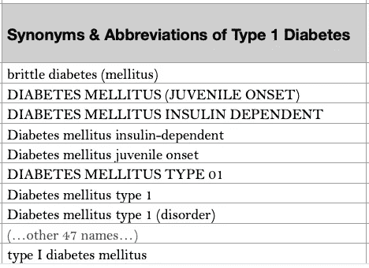

作者图片——在 UMLS，1 型糖尿病有 56 种不同的名称

在 UMLS，每一个概念都有一套标签，定义了所有的同义词，在不同的语言中也是如此。例如，对于*1 型糖尿病*，在 UMLS 有 56 种不同的同义词或缩写(见上图)。它还有一个 *prefLabel* 属性，该属性给出了概念的首选标签。这些属性对于我们的 NLP 任务非常有用。

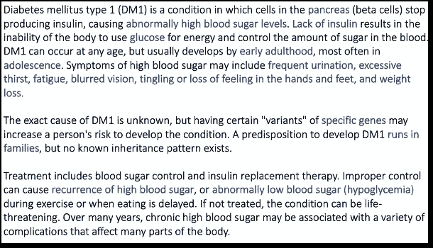

作者图片——1 型糖尿病的文字描述:清晰明确的概念描述，包括表型、病因和治疗。它提到了关键的临床特征(上面蓝色的文字)。这样的信息允许计算机通过数学表示(如文档嵌入)来捕捉语义。

除了结构化属性，UMLS 还提供了每个概念的文本描述(见上面的例子)，这本质上是概念的临床或生物医学解释。这些信息对于计算机以某种数学表示形式捕捉概念的`meaning`非常有用。例如，使用 word2vect 或 doc2vect 模型。这种表征将有助于 NLP 任务显著地特别是在歧义消除任务中，即“她感冒了”中的感冒不同于“今年冬天感冒了”中的感冒。

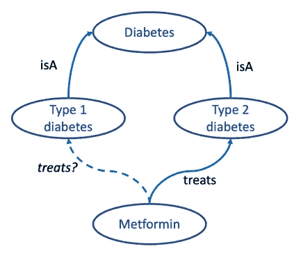

按作者分类的图像-以机器可以“理解”和进行推理的方式表示知识。(这是一个简化的表示，整合了来自各种本体的数据。)

此外，UMLS(与其他本体互连)还以图形格式提供概念之间的关联。了解哪些概念与一个概念相关，以及它们是如何关联的，使得计算机能够进行大量智能计算，其中一些将做出临床上合理的推断。例如，知道 1 型和二型糖尿病都是一种特定类型的糖尿病，二甲双胍用于治疗二型糖尿病，计算机可能会推断这种药物可能对 1 型糖尿病有用。从计算上来说，这个推论是通过在图上走几步来做出的(见上文)。这样的推论实际上具有临床意义，正如一些临床指南所建议的:

> 二甲双胍可用于超重的 1 型糖尿病患者，他们希望改善血糖控制，同时尽量减少胰岛素的剂量。

# 应对低资源学习挑战

现在让我们看看第二个主要挑战——低资源学习，这意味着我们没有针对所有疾病或表型的足够的训练数据。

为了解决这个问题，我们实现了两种方法。第一种方法的想法很简单:因为我们不能提供一个超级好的 NLP 模型，我们提供一个基线模型，它可以给你 NLP 结果，对某些研究来说可能足够好，也可能不够好。在基线模型之上，我们实现了一个验证和迭代改进机制，使每个用户能够通过手动评估随机选择的一小组 NLP 结果来检查性能。该系统将从评估中生成性能指标，如果性能足够好(由用户决定)，那么每个人都很高兴。NLP 结果已准备好供下游使用。如果不够好，评估基本上是一小组标记数据，它们将作为进一步的训练数据反馈给 NLP 系统，以进一步改进 NLP 模型。反复进行这样的评估和改进将有希望达到性能足够好的阶段。通常，它需要 5-6 次迭代。当然，也有模型无法改进的情况。

由于篇幅所限，第二种做法我就不说了。相反，如果你有兴趣，请查看这篇论文:[https://doi.org/10.2196/14782](https://doi.org/10.2196/14782)。

# 将这些结合起来解决两个主要挑战

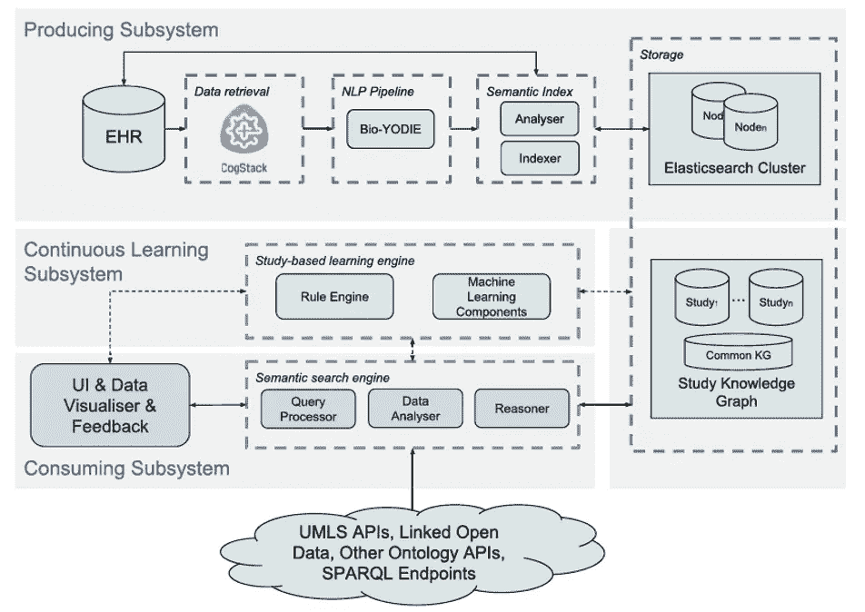

图片作者——seme HR 系统架构:基线 NLP 使用 KG +持续学习解决两个主要挑战

让我们来看看在 SemEHR 中，为了应对两个主要挑战，事情是如何结合在一起的。这个图是 SemEHR 的系统架构。让我们跳过单个组件的细节。三个水平的灰色矩形表示三个子系统。最上面的一个是生产子系统，它利用 UMLS(又名生物医学 T-box)来生产基线 NLP 系统。这解决了知识表示的第一个主要挑战。

中间的灰色矩形是所谓的持续学习子系统，它实现了一个迭代学习框架，以实现基于用户验证反馈的逐步改进。

底部的矩形是处理第三个挑战的消费子系统，我称之为使用该系统的第二个挑战。让我们用一个用例来说明知识图是如何对此有所帮助的。

# 缓解挑战#3 的自动推理

2017 年，我支持了一项关于情绪稳定剂和心脏病之间联系的研究。

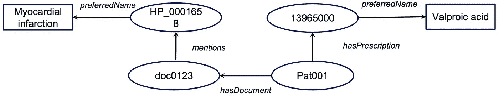

按作者分类的图像—知识图格式的自然语言处理结果

假设我们的 NLP 结果生成了这样一个简单的结构化知识图。它说:一个病人`Pat001`开了一个 ID 为`13965000`的东西的处方，这个东西有一个更好的名字叫做`Valproic acid`；同样，这个病人有一个 ID 为`doc0123`的文档，它提到了另一个 ID 为`HP_0001658`的东西，它有一个 preferredName `Mayocardial infarction`。

好了，现在，为了回答我们的研究问题，我们有第一个问题:

> 有服用情绪稳定剂的病人吗？

只看 A-box 数据(上图)，电脑可能会说不，我没有看到任何服用该药的患者。但是，请记住，我们使用知识图技术从自由文本中填充数据。知识图还有另一个重要的组成部分，叫做 T-box。

作者照片——SnO med-CT 称丙戊酸是一种情绪稳定剂

在这种情况下，从一个叫做 SNOMED CT 的临床术语中，集成了 UMLS，有一个公理说这个东西`13965000`是`358927005`的一个子类，它有一个标签叫做`mood stablizing drug`。

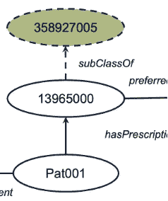

作者照片——计算机用 T-box 知识扩展你的 A-box，推断 Pat001 实际上是情绪稳定器

有了这个公理，实际上，计算机可以用一个新的断言**扩展**我们的 A-box，这告诉我们`Pat001`实际上是在一种类型的**情绪稳定器**上。(见左)

好，我们研究问题的第二个疑问是

> 情绪稳定剂使用者有心脏病吗？

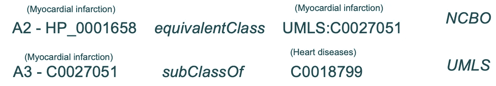

作者照片——来自两个本体论的 T-box 公理，说心肌梗死实际上是一种心脏病

同样，使用 A-box 只有计算机会说不。但是，使用 T-box 扩展，在这种情况下，使用两个本体(见上文)，A-box 可以被扩展。现在，我们知道`Pat001`实际上患有一种叫做`myocardial infarction`的**心脏病**。

最终的知识图包括使用的 T-box 公理和扩展的 A-box 断言，如下所示。

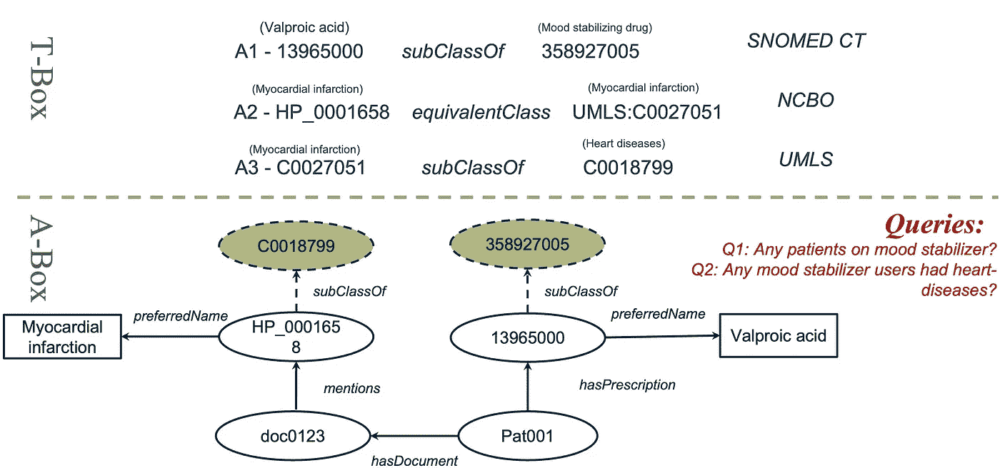

作者图片—包括相关 T-box 公理+扩展 A-box 的完整知识图

# 基于规则的推理

我们刚才看到的推理都是基于 T 盒中公理的推理的子类。此外，还有基于规则的推理，使计算机更加智能。例如，我们知道`ischemic stroke`是一种`stroke`类型，大脑的血液和氧气被阻断。所以，如果我们给计算机一个基于 T-box 概念的规则，说任何人都有`STROKE`和`BLOCKED BRAIN BLOOD VESSEL`，那么这个人很可能有`ISCHEMIC STROKE`。所有这些大写单词都是 T 字盒中的概念，例如 UMLS。

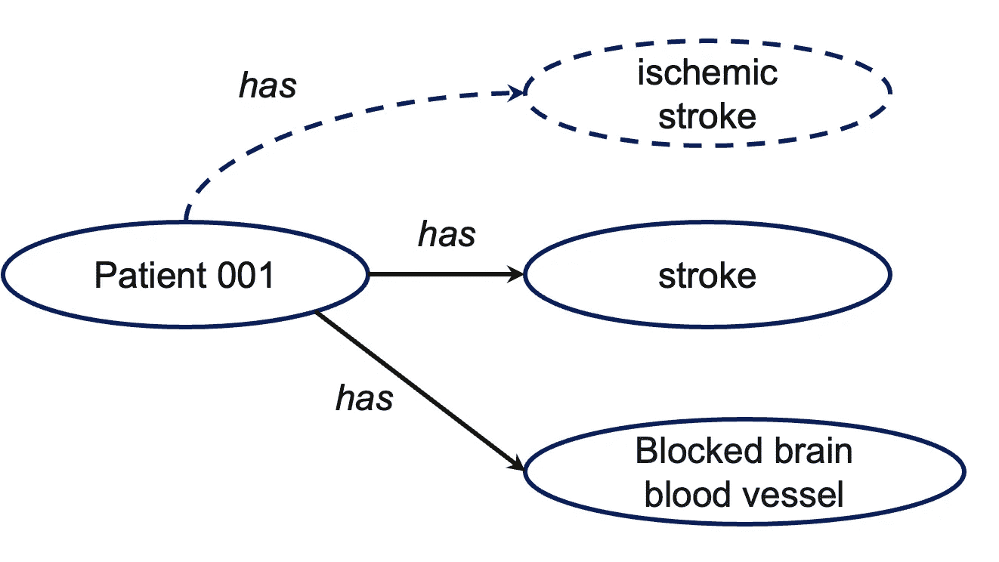

按作者分类的图像-使用特定于域的规则推断笔画子类型

然后，有了这个规则和这个 A 框，计算机就能推断出`Patient 001`有`ischemic stroke`。

# 案例研究:从自然语言处理到知识驱动的表型分析

> ***开发英国生物银行疾病分型的自动化方法:一项关于中风的范例研究。***
> rannikme 等《BMC 医学信息学与决策》第 21 卷，文章编号:191 (2021)。[https://doi.org/10.1186/s12911-021-01556-0](https://doi.org/10.1186/s12911-021-01556-0)

最近，我们与英国生物银行合作，应用这种知识图技术从自由文本数据中自动进行疾病分型([rannikme 等人 DOI:10.1186/s 12911–021–01556–0](https://doi.org/10.1186/s12911-021-01556-0))。英国生物库是一项大型长期生物库研究，有 50 万参与者。在之前的研究中，我们发现 40%的中风发病率被编码为未指定，这意味着对于这些患者，结构化数据无法告诉您患者患有何种类型的中风。我们知道不同的中风需要不同的治疗方法。只知道未指明的中风在临床上用处不大。

我们的假设是，我们可以使用知识图+ NLP 技术从自由文本数据中自动导出中风亚型。我们获得了这些患者的脑成像报告，并使用 SemEHR 来识别所有中风相关的表型。

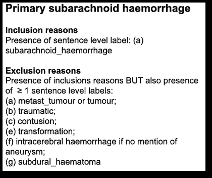

作者图片——诊断蛛网膜下腔出血中风的神经科医生书面规则

然后，我们请领域专家，即神经学家，写下他们诊断中风亚型的规则。这些规则随后被编码到我们的 T-box 中。然后，前面提到的推论被应用于从 NLP 结果中自动推断中风亚型。我们证明了这种方法对中风非常有效。

显然，这是一个超越 NLP 进行患者水平表型分析的范例研究，这要感谢知识图技术的力量。

虽然我们在这种情况下只专注于中风，但这样的技术肯定适用于广泛的疾病，因为我们使用的知识图涵盖了所有人类疾病。

# 总结:反思与思考

好了，这就是我想和你分享的所有主要内容。现在，让我们花点时间快速回顾一下我们讨论的内容，以及我对医疗保健知识图表挑战的一些想法。

*   我们已经讨论了知识图的概念，知识图由描述领域中的概念及其关系的 T 盒和描述实体及其关系的 A 盒组成。
*   我介绍了 SemEHR 系统，它使用知识图和 NLP 技术从自由文本健康数据中识别所有人类疾病。
*   具体来说，我们讨论了这些技术如何帮助解决三个挑战:实现中的两个主要挑战和使用中的一个挑战。

## 在医疗保健中使用知识图谱的作品有哪些？

因此，如果我必须用一句话来总结知识图表对医疗保健的好处，那将是:**提供超级有价值的生物医学 T-box 加上轻量级推理机制**。

## 医疗保健知识图谱缺少什么？

当前健康知识图表中缺少什么？我想说的第一件事是患者层面的知识缺失。当你把一个病人生命时间线上的事情结合起来，事情确实是互相冲突或者有因果关系的。但是目前的知识图技术不能代表这些。例如，我们知道，如果一个人患有 1 型糖尿病，他/她就不太可能患有二型糖尿病。但是我们没有在任何本体论中表达这种冲突的知识。

同样，缺血性卒中和出血性卒中都有可能吗？思维敏捷的人可能会说不，因为这两种机制不兼容。但是，如果一个病人发生了缺血性中风，然后摔了一跤呢？同样，我们在患者水平上没有这样的机制知识表示。