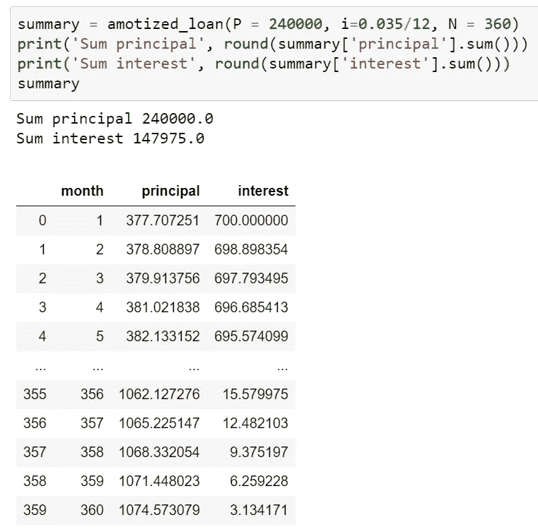

# 从头开始推导抵押贷款摊销公式

> 原文：<https://towardsdatascience.com/derive-mortgage-amortization-formula-from-scratch-7e61e0cba7f7?source=collection_archive---------16----------------------->

## 通过 Python 可视化探索房地产中的数学之美

# 一.定义

如果你在抵押贷款上付了首付，很可能你是在申请**分期偿还贷款**。

> 分期偿还贷款是指你每月支付的确切金额，以便在贷款期限结束时还清债务和利息。

每月摊销包括**利息支付**和**本金支付。**利息支付归入利息，而本金支付归入你的实际债务。

Source Huy Bui

值得注意的是，当你的债务减少时，下个月的利息减少，本金增加。你支付的利息越少，你就能投入越多的钱来减少潜在的债务。

比如你买了一套 30 万美元的房子，首付 20%。利率是 3.5%，你打算在 30 年内还清。这是你每年必须支付的费用。

来源:卡尔的抵押贷款计算器

本金栏的总和是房贷的 80%(首付 20%)，利息栏的总和是贷款人的利润。请注意，每一期你都支付相同的金额。

# 二。衍生物

让我们从表示不同的变量开始:

每个月`j`我们支付相同的金额`x`，

每个月的利息都是按照余额来计算的。重复这个逻辑，我们得到:

通过首先展开所有的项，递归可以转化为一个排他的公式…

…然后观察模式来推断出**本金**，

`N`期的总额是原始本金加上所有月份的总利息，

因此，

因为分母看起来像几何和，

我们可以进一步简化，得到**月付款** `x`，

这些公式将有助于我们稍后开发 Python 代码。

# 三。密码

应用公式(1)、(2)和(3)，我们获得以下代码:

假设我们借 24 万，30 年后年息 3.5%。结果是:

最后，我们用 Plotly 添加了一些可视化

您可以在此访问互动版本[。](https://chart-studio.plotly.com/~williamhuybui/1/#/)

我们只是从零开始推导摊销公式，并用 Plotly 可视化我们的结果。

你可以在 LinkedIn 上找到我