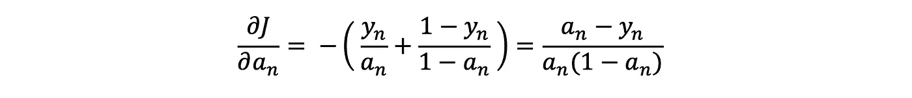
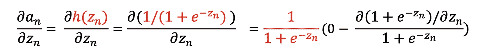

# 利用交叉熵损失推导反向传播

> 原文：<https://towardsdatascience.com/deriving-backpropagation-with-cross-entropy-loss-d24811edeaf9?source=collection_archive---------3----------------------->

## 最小化分类模型的损失

你可以为你的神经网络选择无数的损失函数。损失函数的选择对于网络的性能是必不可少的，因为最终网络中的参数将被设置为使得损失最小化。

可爱的狗和猫[1]

如果手头的问题是一个分类问题，交叉熵损失是一个流行的选择，并且它本身可以被分类为类别交叉熵或多类交叉熵(二元交叉熵是前者的特例)。)如果你对这些有多大的不同感到困惑，我会在深入研究它们的起源之前尝试介绍每一个。

让我们从分类交叉熵开始。对于这个损失函数，我们的 *y* 被一键编码以表示我们的图像(或任何东西)所属的类别。因此，对于任何 *x，* y 的长度等于类的数量，并且我们的模型中的最后一层对于每个类有一个神经元。我们在最后一层使用 Softmax 来得到 *x* 属于每个类的概率。这些概率总和为 1。

范畴交叉熵举了一个例子。 *aᴴ* ₘ是最后一层(h)的第*个*个神经元

我们将这个故事作为一个检查点。在那里，我们考虑了二次损失，最后得到了下面的等式。

L=0 是第一个隐藏层，L=H 是最后一层。δ是∂J/∂z

注意，最后一层的输出(激活向量)是 *aᴴ* ，在索引符号中，我们将写 *aᴴₙ* 来表示最后一层中的第*个*神经元。这同样适用于预激活向量 z *ᴴ.*

在上面的系统中，我们期望改变的唯一方程是δ *ᴴ* 的方程，因为我们使用了损失函数的显式公式来找到它。因此，我们将只处理推导过程中的最后一层**，所以我们现在也可以去掉上标，并且记住，每当我们写 *a* 、 *z* 或 *δ* 时，我们都是针对最后一层的。**

**由此，损失函数为**

****

**范畴交叉熵。**

**随着最后一层中第*个第 n*个神经元的激活**

****

**Softmax 激活。我们将在下面多次使用它。牢记在心。**

**请注意，第*个*神经元的激活取决于该层中所有其他神经元的预激活。如果最后一层涉及 Sigmoid 或 ReLU 激活，情况就不会如此。由于这个原因，为了找到最后一层中某个神经元的δ，我们使用链式法则**

****

**等式 1.0**

**如果我们把它写成**

****

**考虑 m=n 且 m≠n，然后相加**

**从∂J/∂开始*我们可以写一个* ₙ**

****

**第 n 个神经元是∂ *和ₙ*求和的唯一幸存者**

**对于∂，我们有一个ₙ/∂zₙ**

****

**你可以用商法则得到导数，但是还有其他方法[值得一试。](https://essamamin99.medium.com/differentiation-revisiting-the-product-rule-112b8b0bf7b6)**

**现在把我们的结果相乘，代入原来的方程，我们得到**

****

**通过插入等式。一**

**对于剩余的总和，让我们首先通过写来计算∂J/∂ *a* ₘ**

****

**如果一个公式包含所有内容的总和，你可以随时改变指数以避免混淆**

**然后对于∂ *一个* ₘ/∂zₙ ( *m≠n* )我们有**

****

**你也可以使用商法则得到同样的结果。**

**现在将两个结果相乘，我们得到**

****

**并将其传播回我们得到的原始方程**

****

**这可以简化为**

****

**假设 y 是一个热矢量，我们知道σₘyₘ=1；因此，我们可以写**

****

**或者在重新加上上标(H 表示最后一层)后以矢量形式显示**

****

**为了结束证明，让我们把反向传播方程更新为**

****

**只有红色的变了。**

**我们还没有完全做到。使用分类交叉熵，你的模型可以很好地将下面的图片分类为一只狗；但是，您的数据集可能包含许多既有猫又有狗的图像。在这种情况下，如果图像中存在两个类， *y* 不再是一个热点向量(而是看起来类似于[0 1 0 0 1]。)于是，我们使用多类交叉熵，在最后一层避免使用 Softmax 相反，我们使用乙状结肠。如果一个类的 Sigmoid 激活大于某个阈值(例如 0.5)，则我们推断该类存在于图像中。)**

****

**快乐的狗[2]**

**一个例子的多类交叉熵损失函数由下式给出**

****

***aᴴ* ₘ是最后一层(h)中的第*个*神经元**

**如果我们回到去掉上标，我们可以写**

****

**因为我们使用乙状结肠，我们也有**

****

**不像 Softmax *a* ₙ只是 zₙ的一个功能；因此，为了找到最后一层的 *δ* ，我们需要考虑的是**

****

**情商。2**

**或者更准确地说**

****

**哪个是**

****

**通过微分(就像我们之前做的那样)然后把我们得到的两个分数相加**

****

**现在我们需要在代入方程 2.0 之前考虑∂是ₙ/∂zₙ**

****

**这只是 Sigmoid 函数的导数**

****

**用ₙ代替它的定义，我们得到**

****

**你可能已经知道了。**

**现在使用原始方程中的两个结果**

****

**因此，**

****

**现在重新加上上标，用向量的形式写出来**

****

**这与我们用 Softmax 作为激活的范畴交叉熵得到的结果非常相似。所以我们仍然使用**

****

**作为我们的反向传播方程。**

**如果你喜欢阅读，并希望看到更多这样的故事，那么请考虑给帖子一些掌声，并跟我来。下次见，再见。**

****参考文献:****

**[1] *Pixabay* ，2021，[https://pix abay . com/de/photos/haustiere-nied lich-katze-hund-3715733/。【2021 年 10 月 2 日访问。](https://pixabay.com/de/photos/haustiere-niedlich-katze-hund-3715733/.)**

**[2]洛罗伊，波林。“照片由 Pauline Loroy 在 Unsplash 上拍摄”。*Unsplash.Com*2021 年[https://unsplash.com/photos/U3aF7hgUSrk.](https://unsplash.com/photos/U3aF7hgUSrk.)2021 年 10 月 2 日访问。**