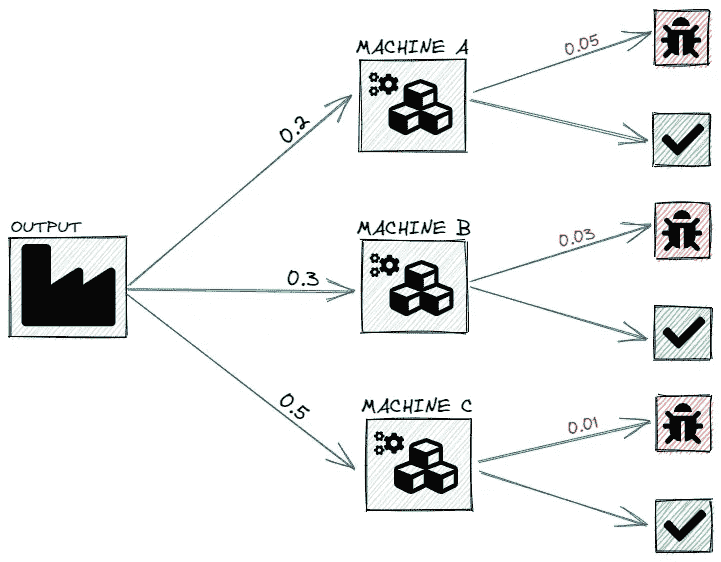
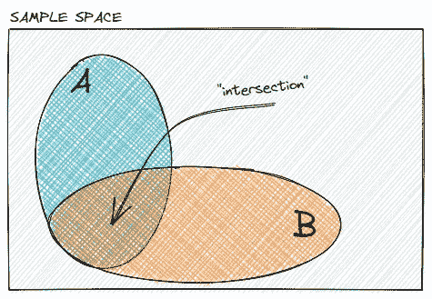
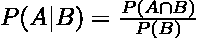
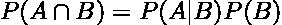
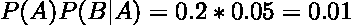
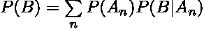
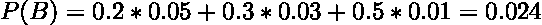
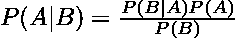
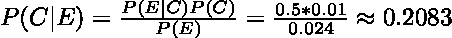

# 贝叶斯定理的简易推导

> 原文：<https://towardsdatascience.com/deriving-bayes-theorem-the-easy-way-59f0c73496db?source=collection_archive---------20----------------------->

## 基本原则

## 从基本概念到更深层次的理解

在 [Unsplash](https://unsplash.com?utm_source=medium&utm_medium=referral) 上由 [Zuzana Ruttkay](https://unsplash.com/@zuzi_ruttkay?utm_source=medium&utm_medium=referral) 拍摄的照片

我还记得第一次看到贝叶斯定理的方程。我对概率论或数学符号一无所知，完全不知所措。

我迷失了，因为我根本没有概率论基础。

在本文中，我们将构建这个基础。使我们能够推导和理解贝叶斯定理，该定理在工业(例如金融)和机器学习(例如分类、贝叶斯优化)中仍然发挥着重要作用

# **打基础**

照片由[绿色力量人员](https://unsplash.com/@greenforce_staffing?utm_source=medium&utm_medium=referral)在 [Unsplash](https://unsplash.com?utm_source=medium&utm_medium=referral) 上拍摄

为了能够推导出贝叶斯定理，我们首先需要放下一些基本概念。扎实的基础，以及强烈的直觉，会让我们更容易、更深刻地理解贝叶斯定理。

在接下来的章节中，我们将学习*条件概率*、*乘法法则*、*全概率定理*，最后是*贝叶斯定理*。

</understanding-probability-models-and-axioms-c0f498972b80>  

但首先，让我们创建一个真实世界的场景，使我们能够非常直观地推导出基本概念。

## 场景:机器缺陷率

机器缺陷率示例[图片由作者提供]

在我们的场景中，我们使用三台机器，每台机器生产相同类型的产品，但产出比例不同。例如，总产量的 20%由机器 A 生产，30%由机器 B 生产，50%由机器 C 生产。此外，每台机器都有特定的缺陷率，例如机器 C 生产的产品有 1%有缺陷。

到目前为止，我们将很快回到这个例子，但首先，让我们走一个小弯路。

## 条件概率

想象一下，我们知道一个人在随机的一天咳嗽的概率大约是 5%。现在想象我们也知道这个人感冒了。这难道不会改变我们对这个人咳嗽可能性的看法吗？

*条件概率*测量一个事件 A 发生的概率，假设另一个事件 B 已经发生。换句话说，可以看作是概率 B 与 a 相交的分数。

A 和 B 的交集[图片由作者提供]

形式上，条件概率可以定义 *(Kolmogorov 定义)*如下:给定 B 的概率等于 A 和 B 相交的概率除以 B 的概率。

我们可以重新排列上面的等式，它直接把我们引向乘法法则。

## 乘法法则

不严格地说，乘法规则允许我们*在我们的示例*中沿着分支乘以概率。所以可以解释为 B 的概率乘以 A 的概率，假设 B 已经发生。

现在让我们将我们的新知识应用到我们的场景中。机器 A 生产的产品有缺陷的概率是多少？

我们知道机器 A 生产一个单位的概率是`P(A) = 0.2`并且一个产品有缺陷的概率是`P(B|A) = 0.05`使用沿着*“顶部分支”*的乘法规则，我们得到以下结果:

因此，有 1%的机会，一个单位是由机器 A 生产的，是有缺陷的。

## 全概率定理

全概率定理表达了几个不同事件的结果的*全概率*。在我们的场景中，这将是一个项目有缺陷的总概率的问题。

为了计算总概率，我们只需将乘法规则应用于所有*“有缺陷率的分支”*并将结果相加。

代入我们场景中的概率，我们得到的总概率是 2.4%。

# 贝叶斯定理

最后，我们收集了推导贝叶斯定理所需的所有部分，如下式所示:

到目前为止，我们应该能够认识到等式中一些熟悉的部分。

*分子* `P(B|A)P(A)`无非是乘法法则或者一个条件概率的定义，我们之前用过。*分母* `P(B)`就是全概率定理，我们在前面的部分也应用了。

但是贝叶斯定理有什么特别之处呢？

贝叶斯定理允许我们*从经验中学习*，基于相关条件的知识更新我们先前的信念。

假设我们想知道机器 C 生产随机选择的缺陷产品的概率。根据产量比例，我们的先验信念可能是`P(C) = 0.5`，因为机器 C 生产了总产量的一半。

然而，我们现在得到了额外的信息，因为我们知道这个项目是有缺陷的。这个相关条件允许我们应用贝叶斯定理，并用后验置信更新我们的先验概率。

计算概率我们得到以下结果:

C =机器 C；E =缺陷项目

虽然机器 C 生产了总产量的一半，但它生产的次品与总产量的比率要小得多。因此，我们先前 50%的概率可以更新为 20.83%。

# 结论

在本文中，我们学习了条件概率的定义和乘法法则。我们还利用全概率定理最终导出了贝叶斯定理，这多少是偶然的。

尽管贝叶斯定理是在将近 250 年前发明的，但它仍然很重要。它的核心是整合新获得的信息的能力，或者换句话说，从经验中学习。

> 感谢您的阅读！确保保持联系&在 [Medium](https://medium.com/@marvinlanhenke) 、 [Kaggle](https://www.kaggle.com/mlanhenke) 上关注我，或者在 [LinkedIn](https://www.linkedin.com/in/marvin-lanhenke-11b902211/) 上说声“嗨”

*喜欢这篇文章吗？成为* [*中等会员*](https://medium.com/@marvinlanhenke/membership) *继续无限学习。如果你使用下面的链接，我会收到你的一部分会员费，不需要你额外付费。*

<https://medium.com/@marvinlanhenke/membership>  

**参考资料/更多资料:**

视频讲座:[麻省理工学院 2012 年春季课程](https://www.youtube.com/playlist?list=PLUl4u3cNGP60hI9ATjSFgLZpbNJ7myAg6)概率导论