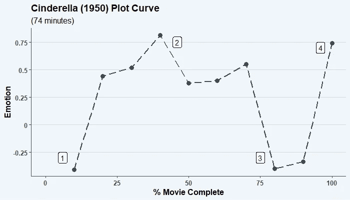
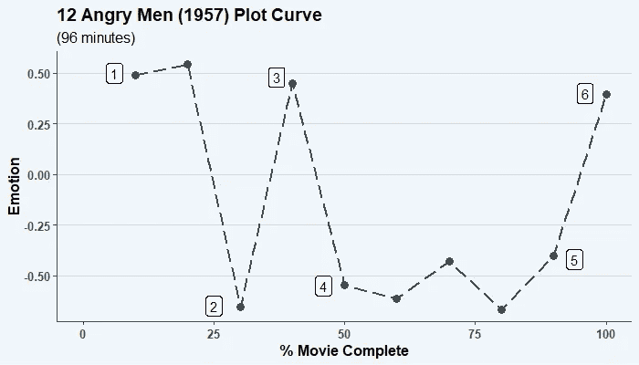
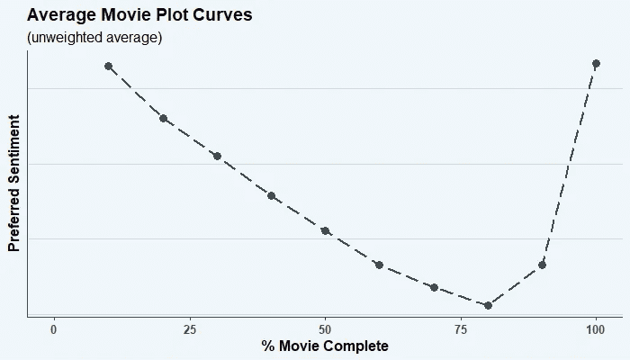
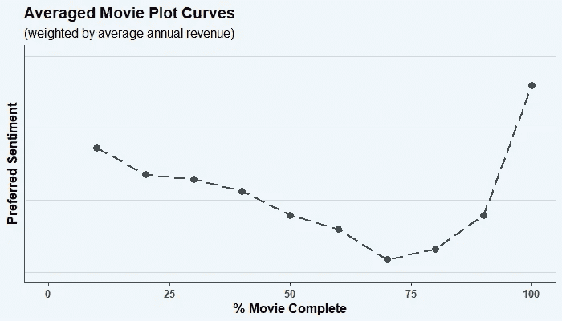

# 从数据中获取最有利可图的电影情节

> 原文：<https://towardsdatascience.com/deriving-the-ideal-movie-plot-from-data-438a7d1122b9?source=collection_archive---------44----------------------->

## [实践教程](https://towardsdatascience.com/tagged/hands-on-tutorials)

## 一种情感驱动的方法来识别哪种情节线可以最大化收益。

图片来自 [Pixabay](https://pixabay.com/?utm_source=link-attribution&utm_medium=referral&utm_campaign=image&utm_content=2974645) 的 [Igor Ovsyannykov](https://pixabay.com/users/igorovsyannykov-6222956/?utm_source=link-attribution&utm_medium=referral&utm_campaign=image&utm_content=2974645) 。

# 介绍

在当今世界，故事(在电视节目、电影、书籍、甚至商业广告中)通常采用几个著名的情节之一。例如，有一个**“白手起家”**的故事，主角开始于冲突，结束于幸福(例如*汉瑟尔和葛丽特*、*灰姑娘*、奥斯汀的*傲慢与偏见*等)。).有一个**“洞里的人”**故事(最常见的一个)，主角快乐地存在，但经历痛苦和损失来解决问题，最终最终回到他们的快乐中(例如迪士尼的*海底总动员*，托尔金的*霍比特人*等)。).有些故事不符合任何特定的模式，但仍然保留了其他类别的特征。

尽管如此，电影还是吸引了每个人的注意力。尤其是在 2020 年(到目前为止是在 2021 年)，电影是人们娱乐的方式！所有的注意力都集中在电影上，一个相关的问题是:

> 哪种类型的故事弧线最成功？在电影界会赚钱的「理想」故事情节是怎样的？

为了找到答案，我提取了一些电影元数据(收入、片名等。)从 Kaggle 上的一个[数据集](https://www.kaggle.com/rounakbanik/the-movies-dataset)中找到了[另一个](https://www.kaggle.com/jrobischon/wikipedia-movie-plots)包含了维基百科大约 35000 部电影的情节描述。你可以在我的 GitHub 上找到这个项目的代码，[这里](https://github.com/abhinavr2121/Plot_Sentiments)。

# 数字化电影的情感

我的方法是用电影情节来传达电影中特定时刻的整体情感。更具体地说，我想对一部电影进行完整的情节总结，并逐句进行情感分析，以构建故事曲线。比如下面是*灰姑娘*的剧情描述 *:* 的节选

> 灰姑娘是一个善良的年轻女子，她与邪恶的继母和丑陋的继姐妹住在一起。他们虐待她，把她当成女佣。灰姑娘认为她在这个世界上是孤独的，但不知道有一位仙女教母一直在帮助她。

情绪分析程序可能会查看这些简短的句子，并将前两个句子解释为明显的否定，而将第三个句子解释为带有一点肯定的否定(因为“help”是句子的关键部分)。因此，我们可以得出结论，在电影的这一点上，事情看起来对灰姑娘不是很好。

我的目标是用这种方法构建每部电影的情节，然后根据它们的成功程度(电影的年收入)进行加权平均。这也可以解释为大多数人喜欢看的电影。这样我更关注表现好的情节。

在我对情节描述进行情感分析后，我最终得出了描绘出电影大致情节的数字。对于大部分电影来说，它真的很好。这是《T2》的灰姑娘(1950 年)的剧情曲线:

灰姑娘的剧情曲线。灰姑娘开始贫穷(1)，发现她有一个仙女教母(2)，在午夜钟声敲响时离开王子(丢失了她的拖鞋)(3)，然后最终与白马王子在一起，从此幸福快乐(4)。图片作者。

注意 y 轴上的负数对应的是负面情绪。*灰姑娘*从消极开始，变得积极，再次变得消极，然后最终以积极结束。

另一个更复杂的例子是*十二怒汉* (1957):

十二怒男剧情曲线。这部电影以相当积极的态度开始(1)，然后随着人们争论(2)，改变立场(3) (4)而遇到问题，最后达成决议(5) (6)。图片作者。

# 结果:“理想”电影

对所有情节进行简单的平均会得出*有史以来最常见的电影情节:*

电影的平均曲线展示了一个“洞里的人”的情节。图片作者。

不出意外，**是“洞里的人”故事情节**。这看起来有点道理，因为这是一个更容易创造的弧线，让观众最终感到完整和满足(对儿童电影尤其有用！).更多这样的例子你可能知道:迪士尼的*怪兽公司*，刘易斯·卡罗尔的*爱丽丝梦游仙境*和*后天* (2004)。

但我试图回答的问题不是哪种弧最常见，而是**哪种弧最成功**。

我按总收入对每部电影进行了加权(本质上是少关注表现不那么好的电影，多关注成功的电影)，并重新计算了电影情节。

收入加权平均电影曲线。arc 还是“洞里人”的变种！图片作者。

“理想的”故事弧线是…那个“洞里的人”！这种情节极其常见(这意味着有大量的失败和成功，但大多数是失败，因为在电影中做好是一项艰巨的任务)，但它表现如此之好的事实充分说明了其他主题和角色赋予简单情节的力量。

世界上如此多的古代神话(从希腊人到古印度人到阿兹特克人)主要基于洞中男人的故事情节是有原因的。我个人觉得很有趣的是，一个最古老和最受欢迎的故事类型继续在我们的现代世界中存在，甚至通过多种媒介。