# 描述性统计:期望与现实(探索性数据分析)

> 原文：<https://towardsdatascience.com/descriptive-statistics-expectations-vs-reality-exploratory-data-analysis-eda-8336b1d0c60b?source=collection_archive---------23----------------------->

一种简单的描述性统计方法，通过对每个探索性数据分析过程的集中趋势测量和扩散测量来总结数字和分类数据变量。


凯瑟琳·汉隆在 [Unsplash](https://unsplash.com?utm_source=medium&utm_medium=referral) 上的照片

# 关于探索性数据分析(EDA)

EDA 是数据分析过程的第一步。它允许我们**通过**描述** **和** **总结**数据集的主要特征来理解**我们正在处理的数据，通常通过**可视化** **方法**如条形图和饼图、直方图、箱线图、散点图、热图等等。

## EDA 为什么重要？

*   最大限度地洞察数据集(能够*倾听*您的数据)
*   揭示潜在的结构/模式
*   检测异常值和异常情况
*   提取和选择重要变量
*   提高计算效率
*   测试潜在假设(如商业直觉)

此外，为了能够探索和解释数据集的特征及其所有属性，获得数据的洞察力和有效的数字摘要，我们需要**描述性统计**的帮助。

统计分为两个主要领域:

*   **描述性统计**:描述和汇总数据；
*   **推断统计学**:利用样本数据对总体做出一般性结论(推断)的方法。

本教程重点介绍数字变量和分类变量的描述性统计数据，分为两部分:

*   **集中趋势的度量**；
*   **展开**的措施。

# 描述统计学

也称为**单变量分析**(一次一个特征分析)，简而言之，描述性统计通过给出关于样本和数据测量的简短数字摘要来帮助描述和理解特定数据集的特征。

**描述性统计**仅仅是**探索**，因为它们**不**允许我们在已经分析的数据之外做出结论，或者得出关于我们可能做出的任何假设的结论。

**数字**和**分类**变量，正如我们将很快看到的，有**不同的**描述性统计方法。

让我们回顾一下变量的类型:

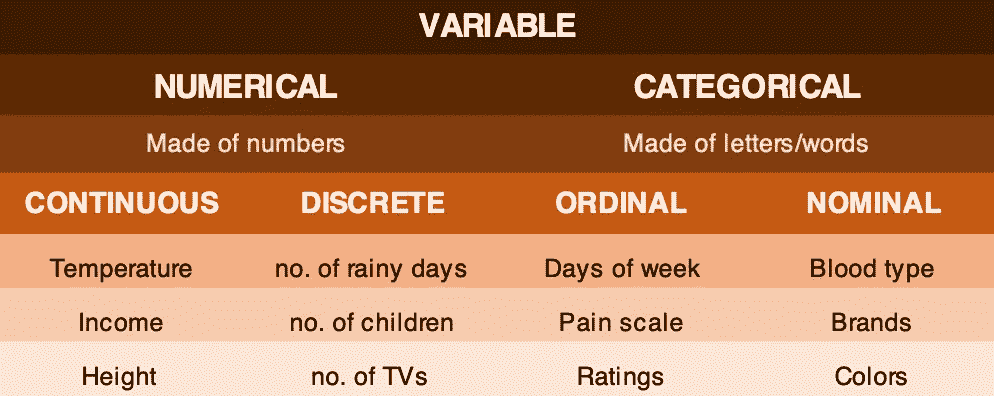

变量类型-按作者分类的图像

*   **数值连续**:数值不可数，有无限多种可能(某人的年龄:25 岁 4 天 11 小时 24 分 5 秒等等到无限)。
*   **数值离散**:数值是可数的，有有限个可能(欧盟不可能数出 27.52 个国家)。
*   **分类序数**:层次中隐含着一个顺序(一月总是在二月之前，十二月之后)。
*   **分类名词**:等级中没有隐含的顺序(女性/男性，或者风向:北、南、东、西)。

## 数字变量

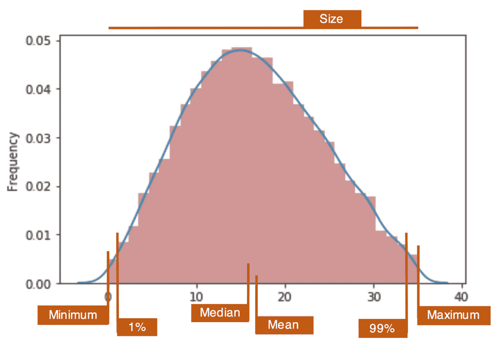

数值连续变量的直方图。作者图片

*   **集中趋势**的测量:平均值、中间值
*   **扩散**的度量:标准差、方差、百分位数、最大值、最小值、偏斜度、峰度
*   **其他**:大小、唯一、唯一数量

一种显示数据的方法是通过箱线图。它给出了 5 个基本统计数据，如最小值、第一个四分位数(第 25 个百分位数)、中值、第三个四分位数(第 75 个百分位数)和最大值。

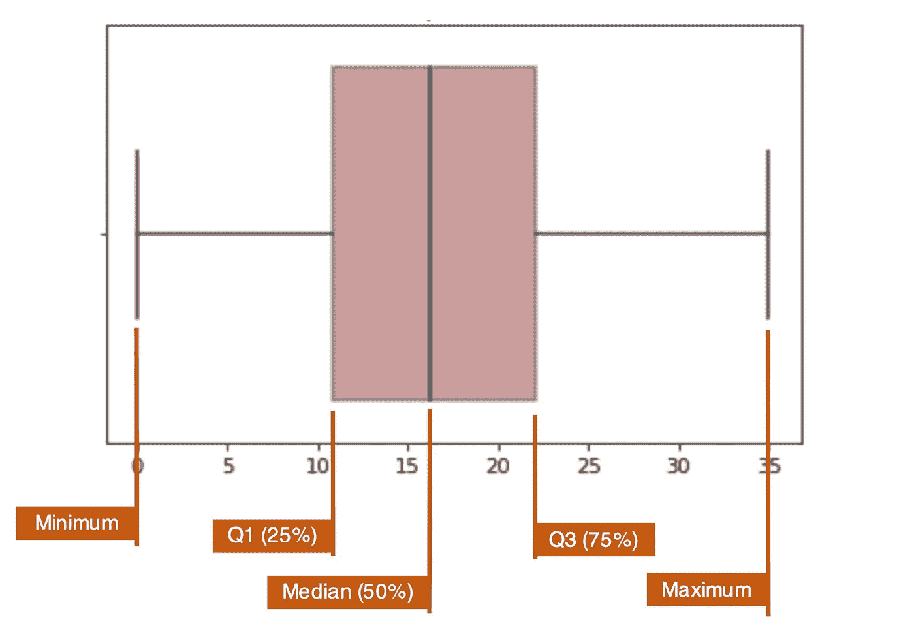

数值连续变量的箱线图。作者图片

## 分类变量

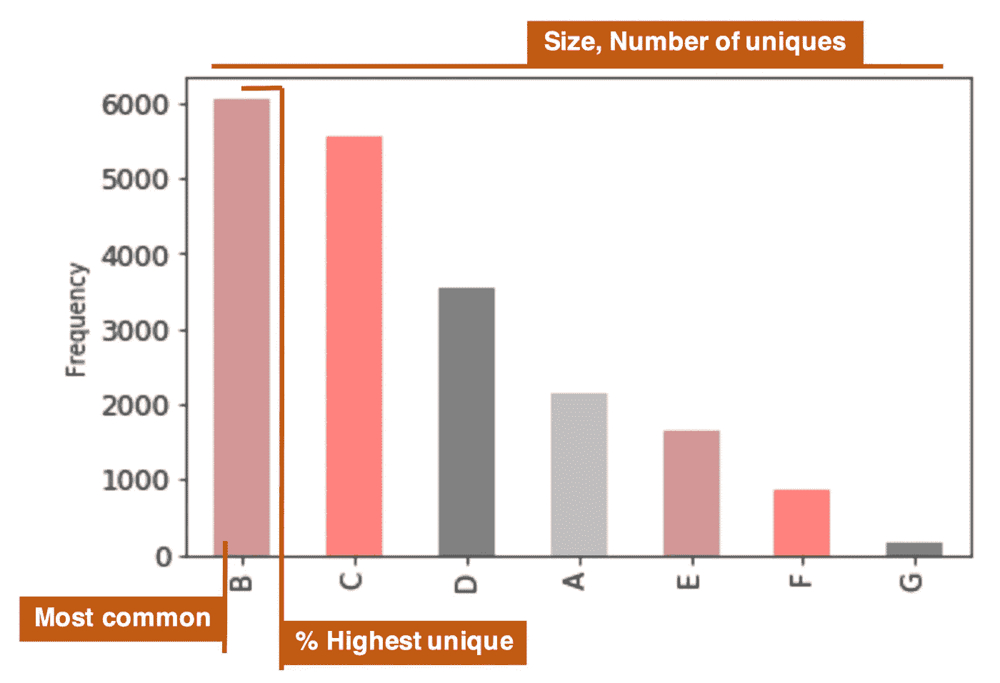

分类序数变量的条形图。作者图片

*   **集中趋势**的测量:模式(最常见)
*   **扩散**的度量:唯一数
*   **其他**:大小，%最高唯一

理解:

## 集中趋势测量

*   **均值**(平均值):数值总和除以总观测值。平均值对异常值高度敏感。
*   **中位数**(中心值):一个有序数字序列的总计数除以 2。中位数不受异常值的影响。
*   **模式**(最常见):最常观察到的值。同一个变量中可以有多个模态值。

## 传播的量度

*   **方差**(平均值的可变性):标准差的平方。它也会受到异常值的影响。
*   **标准差**(集中在平均值周围):偏离平均值的标准量(距离)。std 受到异常值的影响。它是方差的平方根。
*   **百分位数**:数据百分比低于该值的值。第 0 个百分点是最小值，第 100 个百分点是最大值，第 50 个百分点是中间值。
*   **最小值**:最小或最低值。
*   **最大值**:最大或最高值。
*   **唯一数**(完全不同):完全不同的观察值的总数。
*   **unique**(distinct):观察到的不同值或值组。
*   **偏斜度**(对称):一个分布从正态分布中派生出来的程度。 *> >在下一节解释歪斜的概念。*
*   **峰度**(离群值的数量):尾部有多长，分布的峰值有多尖锐。
    *> >在下一节解释峰度概念。*

## 其他人

*   **计数**(大小):观察值的总和。计算平均值、中值和众数也需要计数。
*   **%**

# 歪斜

在理想情况下，数据的分布假定为钟形曲线(高斯或正态分布)，但在现实世界中，数据分布通常是不对称的(=偏斜的)。

因此，偏斜度表示我们的分布从正态分布(偏斜度值为零或非常接近)派生的程度。

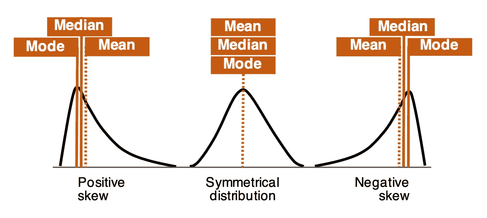

偏斜曲线。作者图片

有三种通用类型的分布:

*   **对称**【中值=均值】:在正态分布中，均值(平均值)在中值或接近中值处对称地划分数据。
*   **正偏斜**【中位数<均值】:分布不对称，尾部向曲线右侧偏斜/变长。在这种类型中，大部分观察值集中在左尾，偏度值为正。
*   **负偏斜**【中值>均值】:分布不对称，尾部向曲线左侧偏斜/变长。在这种类型的分布中，大多数观察值集中在右尾，偏度值为负。

经验法则:

*   **对称**分布:数值在- **0.5 到 0.5** 之间。
*   **中度**歪斜:数值在- **1 和-0.5** 和 **0.5 和 1** 之间。
*   **高**偏斜:值 **< -1** 或 **> 1** 。

# 峭度

峰度是量化分布形状的另一个有用工具。它测量了尾部有多长，但最重要的是，以及分布的峰值有多尖锐。

如果分布具有更尖锐、更高的峰和更短的尾部，则它具有更高的峰度，而当分布的峰更平坦且尾部更细时，可以观察到低峰度。峰度有三种类型:

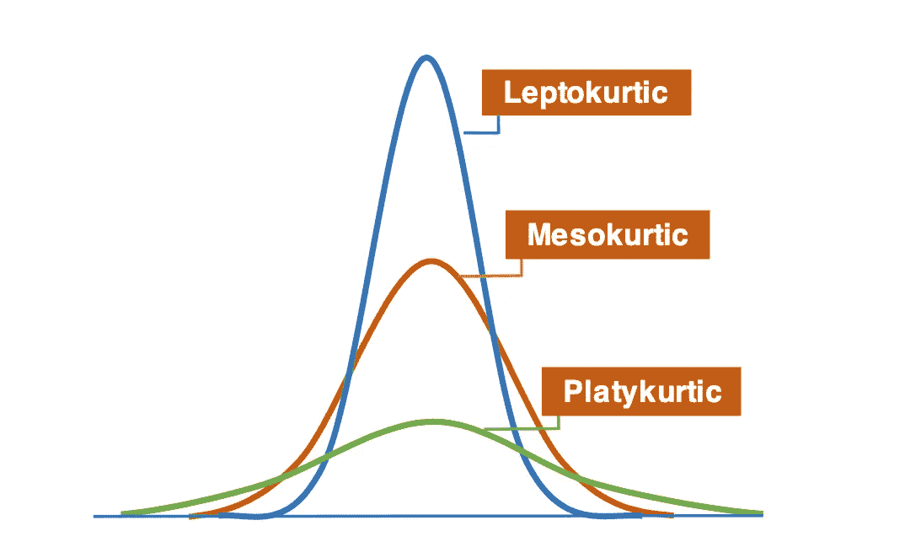

峰度曲线。作者图片

*   **Leptokurtic** :分布高瘦。轻子的值必须是> 3。
*   这个分布看起来与正态分布相同或非常相似。一个“正常的”中间黑洞的值是= 3。
*   **Platykurtic** :分布具有更平坦、更宽的峰值和更细的尾部，这意味着数据适度分散。platykurtic 的值必须是< 3。

## 峰度值仅决定异常值的数量。

峰度是通过将标准化数据的平均值提高到四次方来计算的。如果我们将任何标准化数字(小于 1)提升到 4 次方，结果将是一个非常小的数字，接近于零。如此小的值不会对峰度有太大贡献。结论是，对峰度有影响的值应该是远离峰值区域的值，换句话说，就是异常值。

# Jupyter 笔记本— IPython

在本节中，我们将给出关于数据集的集中趋势和离散度的不同度量的简短数字统计摘要。

让我们通过熊猫的描述性统计环境来研究一些实际的例子。

**>** [**回购代码此处**](http://bit.ly/2LJDuNe) **。**

从**导入**所需的库开始:

```
import pandas as pd
import numpy as np
import scipy
import seaborn as sns
import matplotlib.pyplot as plt
%matplotlib inline
```

**加载**数据集:


**打印**数据:


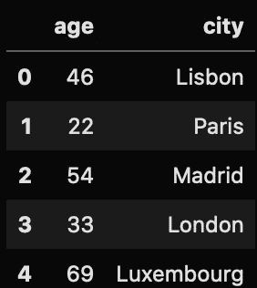

作者图片

在进行任何统计演算之前，我们先来看一下**的数据** :
`df.info`

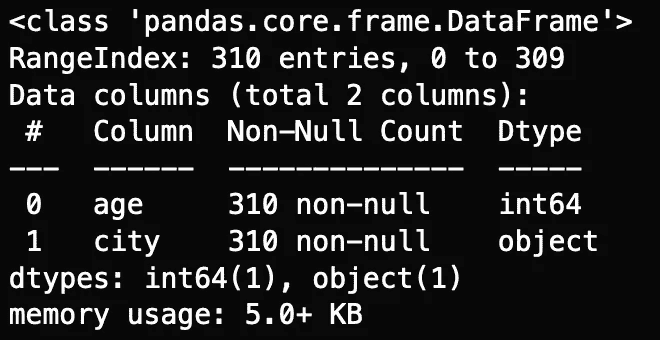

作者图片

数据集由 310 个观察值和 2 列组成。一个属性是数字的，另一个是分类的。两列都没有缺失值。

# 数字变量

我们要分析的**数值变量**是`age`。第一步是目视观察变量。让我们画一个直方图和一个箱线图。

```
plt.hist(df.age, bins=20)
plt.xlabel(“Age”)
plt.ylabel(“Absolute Frequency”)
plt.show()
```

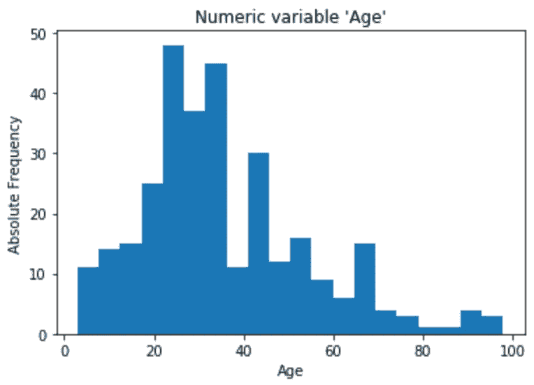

年龄直方图。作者图片

```
sns.boxplot(x=age, data=df, orient="h").set(xlabel="Age", title="Numeric variable 'Age'");
```

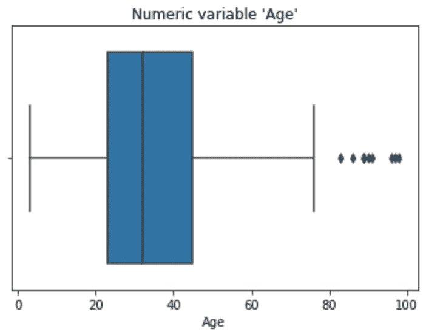

年龄箱线图。作者图片

也可以结合直方图和箱线图直观地观察变量。我发现这是一个有用的图形组合，并在我的报告中大量使用。

```
age = df.agef, (ax_box, ax_hist) = plt.subplots(2, sharex=True, gridspec_kw= {"height_ratios": (0.8, 1.2)})mean=np.array(age).mean()
median=np.median(age)sns.boxplot(age, ax=ax_box)
ax_box.axvline(mean, color='r', linestyle='--')
ax_box.axvline(median, color='g', linestyle='-')sns.distplot(age, ax=ax_hist)
ax_hist.axvline(mean, color='r', linestyle='--')
ax_hist.axvline(median, color='g', linestyle='-')plt.legend({'Mean':mean,'Median':median})
plt.title("'Age' histogram + boxplot")ax_box.set(xlabel='')
plt.show()
```

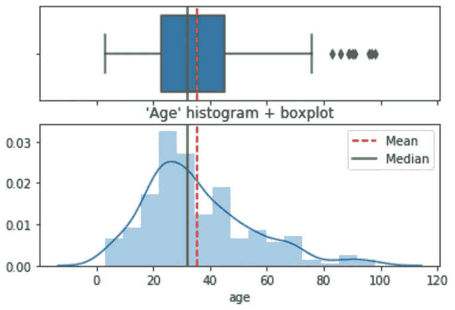

年龄直方图和箱线图。作者图片

## 集中趋势测量

1.**的意思是**:
T4

```
35.564516129032256
```

2.**中位数:**
`df.age.median()`

```
32.0
```

## 传播的量度

3.**标准差:**
`df.age.std()`

```
18.824363618000913
```

4.**方差**:


```
354.3566656227164
```

5.a) **百分位数 25%** :
`df.age.quantile(0.25)`

```
23.0
```

b) **百分位数 75%** :
`df.age.quantile(0.75)`

```
45.0
```

c)在**一气呵成** : `df.age.quantile(q=[.25, .75)`

```
0.25    23.0
0.75    45.0
Name: age, dtype: float64
```

6.**最小值**和**最大值** :
`df.age.min(), df.age.max()`

```
(3, 98)
```

7.**偏斜度**(带 scipy):
`scipy.stats.skew(df.age)`

```
0.9085582496839909
```

8.**峰度**(带 scipy):
`scipy.stats.kurtosis(df.age)`

```
0.7254158742250474
```

## 其他人

9.**尺寸**(行数):
`df.age.count()`

```
310
```

10.**唯一数**(完全不同)
`df.age.nunique()`

```
74
```

11.**独特的**(独特的):
`df.age.unique()`

```
array([46, 22, 54, 33, 69, 35, 11, 97, 50, 34, 67, 43, 21, 12, 23, 45, 89, 76, 5, 55, 65, 24, 27, 57, 38, 28, 36, 60, 56, 53, 26, 25, 42, 83, 16, 51, 90, 10, 70, 44, 20, 31, 47, 30, 91, 7, 6, 41, 66, 61, 96, 32, 58, 17, 52, 29, 75, 86, 98, 48, 40, 13, 4, 68, 62, 9, 18, 39, 15, 19,  8, 71, 3, 37]) 
```

# 分类变量

我们要分析的**分类变量**是`city`。让我们画一个条形图，并得到一个变量的视觉观察。

```
df.city.value_counts().plot.bar()
plt.xlabel("City")
plt.ylabel("Absolute Frequency")
plt.title("Categoric variable 'City'")
plt.show()
```

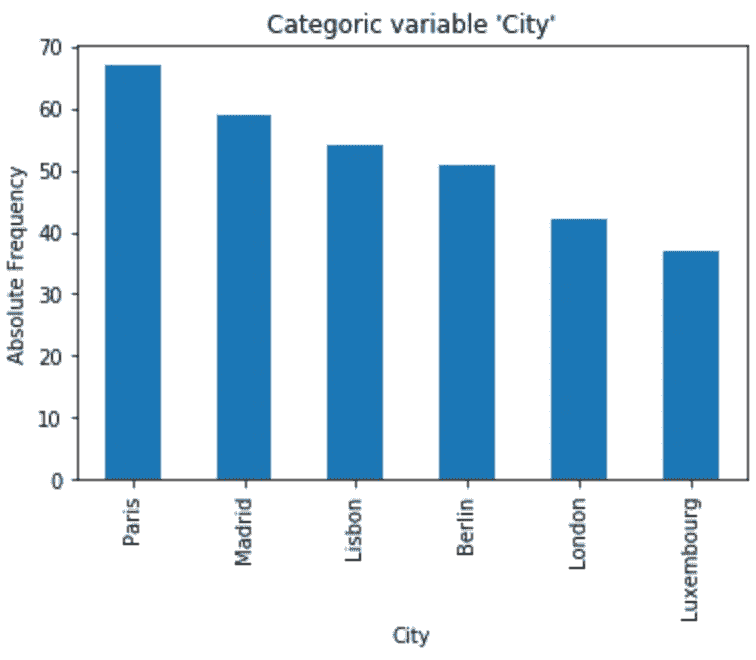

“城市”酒吧地块。作者图片

## 集中趋势测量

1.**模式**:


```
'Paris'
```

## 传播的量度

2.**唯一数:**
`df.city.nunique()`

```
6
```

3.**独特的**(独特的):
`df.city.unique()`

```
array(['Lisbon', 'Paris', 'Madrid', 'London', 'Luxembourg', 'Berlin'], dtype=object) 
```

4.**最频繁** **唯一**(数值计数):
`df.city.value_counts().head(1)`

```
Paris     67
Name: city, dtype: int64
```

## 其他人

5.**尺寸**(行数):
`df.city.count()`

```
310
```

6. **%**

```
21.6%
```

`describe()`方法显示在一个表中收集的描述性统计数据。默认情况下，**统计数字数据**。结果被表示为熊猫数据帧。


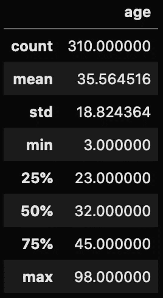

作者图片

添加**其他非标准**值，例如“方差”。


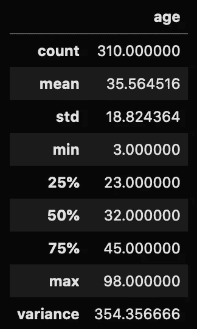

作者图片

显示**分类**数据。
`df.describe(include=["O"])` <=>`df.describe(exclude=['float64','int64'])` <=>`df.describe(include=[np.object])`

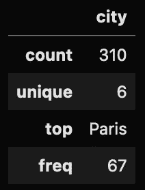

作者图片

通过传递参数`include='all'`，同时显示数字和类别变量。
`df.describe(include='all')`

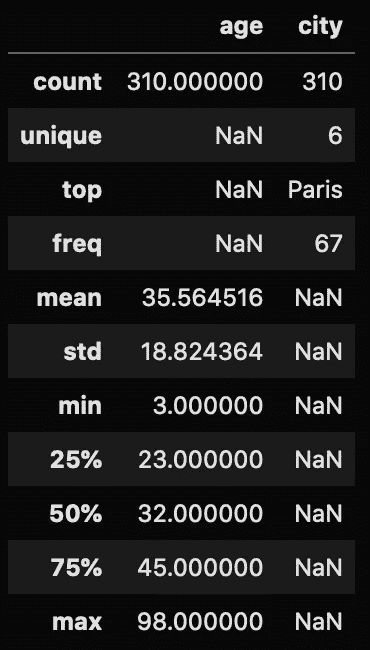

作者图片

# 结论

在 Pandas、Numpy、Scipy、Matplolib 和/或 Seaborn 的帮助下开发探索性数据分析项目时，这些是描述性统计的基础。如果执行得好，这些统计数据有助于我们理解和转换数据，以便进一步处理。

记住永远保持怀疑的态度。用自己的眼睛看数据(不要完全依赖统计数据)，用图形直观化变量(视觉效果的使用和滥用)。

**>** [**回购代码此处**](http://bit.ly/2LJDuNe) **。**

查看您可能也想阅读的其他文章:

</best-string-super-skills-you-must-have-regex-2f5ecbfd2bca>  </pandas-made-easy-the-guide-i-81834f075893>  </machine-learning-costs-prediction-of-a-marketing-campaign-exploratory-data-analysis-part-i-758b8f0ff5d4>  

# 联系人

*   [领英](http://bit.ly/2ybRqYT)
*   [推特](https://bit.ly/3gAwMTP)
*   [中型](https://bit.ly/3gDC5Sp)
*   [GitHub](https://bit.ly/3hHvuHR)
*   [卡格尔](https://bit.ly/31Co038)
*   [邮件](mailto:goncaloggomes@gmail.com)

好的阅读，伟大的编码！