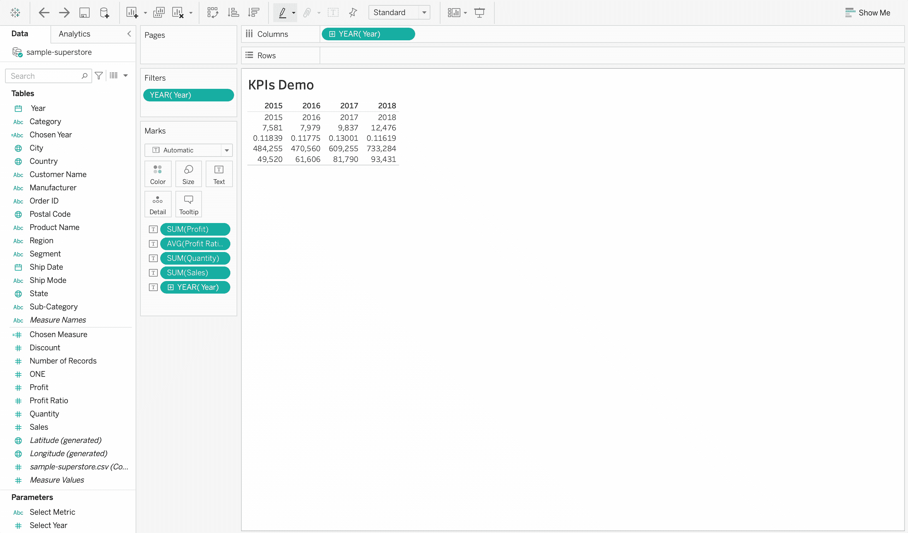

# 用 Tableau 设计动态数据仪表板

> 原文：<https://towardsdatascience.com/design-a-dynamic-data-dashboard-with-tableau-e78cb91af212?source=collection_archive---------8----------------------->

## 创建您自己的数据仪表板的分步指南

欧洲在 [Unsplash](https://unsplash.com?utm_source=medium&utm_medium=referral) 上拍摄的照片

****这篇文章有很多 gif。他们可能加载得有点慢。***

在本文中，我将解释如何使用 Tableau 构建动态数据仪表板，以便用户可以选择指标和年份来评估销售业绩。

我将为这个项目使用 Tableau Public，它是免费的，您可以从这里下载:

<https://public.tableau.com/en-us/s/>  

# 问题陈述

我将使用的数据集由 *Udacity 数据可视化*课程提供。这是一个超市数据集样本，可在以下位置找到:

<https://docs.google.com/spreadsheets/d/1YVR_cOGIlSJnDWZHrsUrmfqXrvEZhkdmofhGDiQ3jzM/edit#gid=1909165549>  

基于数据集，我们的目标是建立一个动态仪表板。从仪表板上，观众应该能够了解到以下见解:

*   年度顶级收入、利润、利润比率和销售量。
*   按客户群(客户群是指公司、消费者、家庭办公室)划分的同比绩效。
*   按活动指标(从收入、利润、利润率和销售量)查看子类别绩效。
*   对于所选指标，每个客户群中表现最佳的子类别。

总的来说，构建这个仪表板有四个主要步骤:

*   首先，在 Tableau 中将顶级 KPI 格式化为 BANs。
*   然后，用折线图直观显示客户群的同比表现。
*   然后，用柱状图直观显示每个客户群下的年同比子类别绩效。
*   最后，定义指标和年度用户选择下拉列表。

仪表板概述

****我将订单日期列重命名为年份。很抱歉在下面的演示中可能会有混乱。***

# KPI

为主要 KPI 创建一个 BANs，如**利润**、**收入**、**平均利润率**和**销售单位**，这总是向不太了解数据集细节的观众展示您的见解的好方法。

我将一步一步地指导你如何在 Tableau 中创建这样一个 BANs。

KPI 演示第 1 部分

在第一部分中，我首先选择了我希望纳入禁令的 KPI。然后，我将每个度量拖到*标记*部分的*标签*中。默认情况下，Tableau 假定聚合是度量值的总和。但是，对于利润率，我们希望计算平均值，而不是总和。您可以通过右键单击*标记* 部分中的聚合度量来将其更改为平均值。

KPI 演示第 2 部分

在第二部分中，我通过右键单击*年*并选择*显示过滤器*来创建一个*年*过滤器。然后，通过左键点击*标记*部分的*文本*并选择*三个点*，我们可以更改 BANs 中正文文本的字体、大小和颜色。

KPI 最终版本

现在，我们已经完成了 KPI 部分，但是您可能会发现年度筛选器并不是可视化控制的最佳方式。例如，如果我们有多个工作表，并且每个工作表都包含一个年份过滤器，那么最终的仪表板看起来会非常混乱。因此，在本文的最后一部分，我将向您展示如何通过创建新的参数和计算字段在 Tableau 中添加自定义选择下拉列表。

# 同比细分市场绩效

除了之前的顶级见解，观众可能希望进一步了解每个细分市场的同比表现。

现在，我将指导您完成创建符合要求的线图的过程。

同比细分市场绩效

您也可以通过左键点击 *SUM(Profit)* 的箭头来编辑线图的颜色。

回到仪表板的要求，观众也应该能够看到一个活跃的指标(从收入，利润，利润率和销售单位)的表现。正如 KPI 部分末尾提到的，我们将在文章的最后部分创建活动指标和年度选择下拉列表。

# 同比子类别绩效

在这一步中，我将使用条形图显示在所选指标*利润*下每个细分市场的同比子类别绩效。

同比子类别绩效

此外，您还可以通过点击聚合度量并选择*编辑颜色*来编辑条形图颜色。

您可能会发现，在此图中，year 过滤器再次出现，它已经出现在前两个图中。没有必要在最终仪表板中保留每个图表的所有三年过滤器。

因此，现在我将介绍如何构建和连接年度和指标(来自收入、利润、利润率和销售量)过滤器的用户选择下拉列表。

# 用户选择

用户选择

我们想要实现的下拉列表将在最终的数据仪表板中显示如上。两个选择下拉列表，一个用于活动指标，一个用于选定的年份。

从 KPI 开始，我们需要将*选择年*定义为新的参数，将*选择年*定义为新的计算字段。

创建年度选择

由于您可以在其他工作表中使用新创建的参数和计算字段，您可以简单地用新的*选择的年份*替换图表中的任何年份变量，并重复*显示参数*步骤。它应该也适用于其他两个工作表。

最后，我们正在创建*选择指标，*它实际上比*选择年份更容易。*

创建度量选择

类似于*选择年份，*选择指标参数和**选择度量*计算字段可以在其他表中找到。不同之处在于每个筛选器中的数据类型和公式。*

*最后，要创建一个仪表板并调整其布局，只需点击*新仪表板*图标，拖动您需要的工作表并将其作为您的设计进行移动。*

*我的最终仪表板如下所示:*

**

*最终数据仪表板快照*

# *摘要*

*设计一个伟大的数据仪表板实际上涉及的不仅仅是数据科学。通常，我们希望它既有知识性(有见地)又有美感。有时，每个部分的文字大小、字体风格和颜色对浏览者是否会喜欢它并愿意停留更长时间有很大的影响。*

*在设计过程中，我发现了一些很棒的工具/网站，可以帮助你创建自己的数据仪表板。我会把它们列在*灵感*部分。*

*感谢您的阅读！希望你喜欢这篇文章，觉得有帮助~*

# *灵感*

*[***土坯颜色***](https://color.adobe.com/zh/)*

*[***即调色板***](https://projects.susielu.com/viz-palette)*

*[***Canva 调色板***](https://www.canva.com/colors/color-palette-generator/)*

*[***颜色***](https://coolors.co/)*

*[***Pinterest***](http://pinterest.com/)*

*[***滴水不漏***](https://dribbble.com/colors/8930e8)*

*<https://www.behance.net/>*

**[***探索其他仪表盘上的画面***](https://public.tableau.com/app/discover)**

**<https://www.thedataschool.co.uk/ellie-mason/tableau-tip-formatting-bans>  <https://blog.graphiq.com/finding-the-right-color-palettes-for-data-visualizations-fcd4e707a283> **