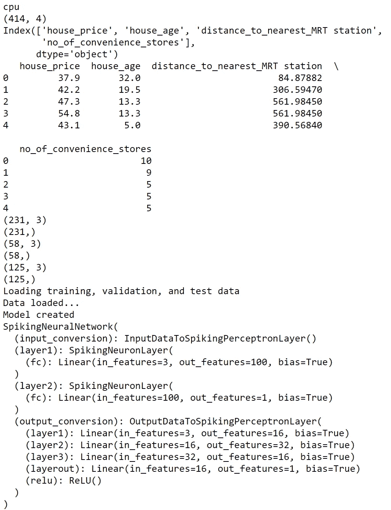
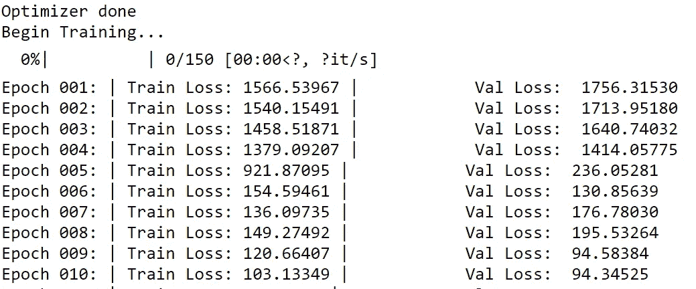
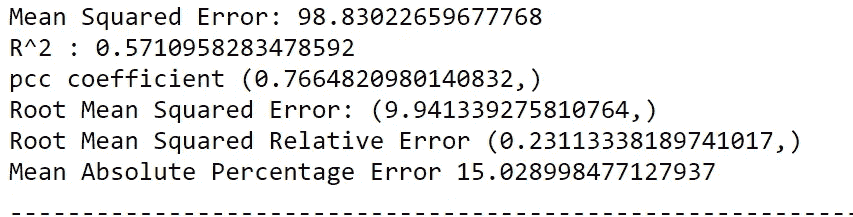
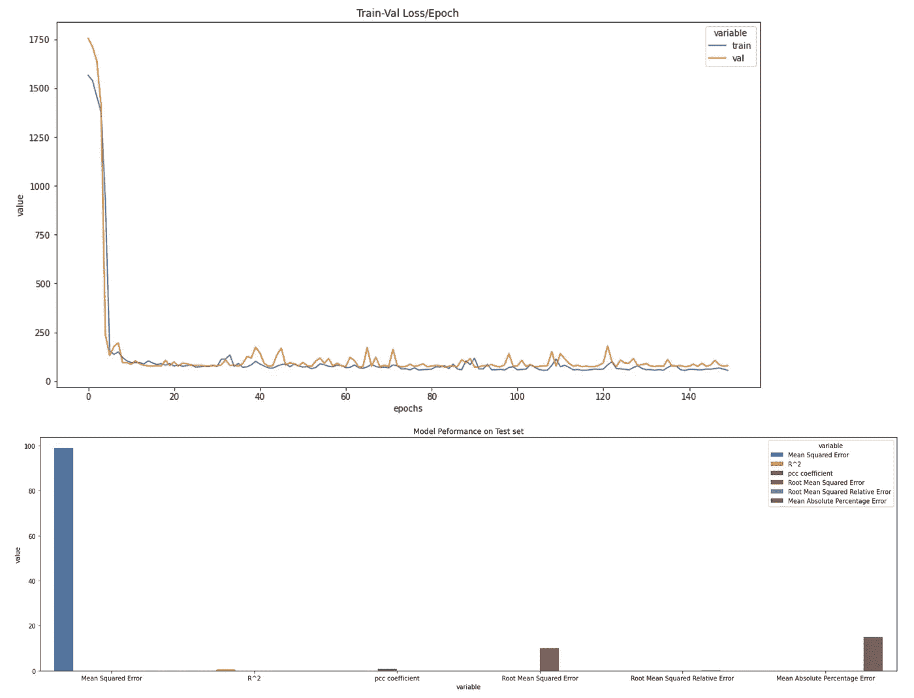

# 用 pytorch 设计神经形态预测网络结构

> 原文：<https://towardsdatascience.com/design-a-neuromorphic-predictive-network-architecture-with-pytorch-72d523e16930?source=collection_archive---------24----------------------->

## 用脉冲神经元网络进行深度学习——脉冲神经网络是未来吗？

朋友们好，今天我们将看到一个非常有趣的话题，用*第三代神经网络*构建一个**脉冲神经元**网络，即脉冲神经网络(SNN)。我们将看到低代码解决方案“ [**pynmsnn**](https://github.com/ajayarunachalam/pynmsnn) ”是一个 python 库，可以轻松用于设计&部署这样一个具有 snn 的神经形态预测模型。

**为什么要建立神经形态 SNN 预测模型？**

神经形态结构非常类似于我们用来进行计算的生物大脑结构。简单地说:神经形态脉冲神经网络密切模仿我们的生物神经元的工作方式。人们可以使用这些类型的网络来绕过具有少量样本或数据点的数据中传统的学习规则的缺乏，并且还特别针对没有潜在模式和趋势的数据，该数据基于原理“**一起激发的神经元，连接在一起”**，这是来自 hebbian learning 的著名习语。在 SNNs 中，有一个**时间轴**和**神经网络通过时间**看到数据，并且**激活函数是超过某个预激活阈值**的尖峰。如果神经元不够兴奋，预激活值会不断减弱。把它想象成一个*时间分布的 ReLU，在特定的时间步长上有尖峰或者没有尖峰*。

更多细节请看这里

**为什么是 pynmsnn？**

[**pynmsnn**](https://pypi.org/project/pynmsnn/) 是一个开源的低代码 **python 库**到**使用【尖峰神经网络(SNNs)】**构建神经形态预测模型(分类&回归问题) **。**

谁可以使用 pynmsnn？

PYNMSNN 是一个开源库，非常适合:-

*   偏爱低代码解决方案的数据科学家。
*   希望提高模型准确性和生产力的经验丰富的数据科学家。
*   参与构建概念验证(POC)项目的数据科学专业人员和顾问。
*   快速概念验证的研究人员。
*   ML/AI 爱好者。

有关安装步骤和先决条件，请查看此处的[和](https://github.com/ajayarunachalam/pynmsnn#requirements)

**开始—让我们为回归问题创建一个尖峰神经网络架构。**

演示回归:房价数据集。这个博客的完整代码可以在[这里](https://github.com/ajayarunachalam/pynmsnn/blob/main/pyNM/spiking-regressor-model.ipynb)找到

首先，我们将导入所有必要的库& T4 pynmsnn T5 库。对于这个回归问题，我们从模块中导入了“ **spiking_regressor** ”。

接下来，我们创建一个名为“ **run_regressor** 的函数，该函数将分别分配计算资源、加载数据集、预处理数据、分配预测器&响应变量以及将数据集分割成 train-val-test 集合。

我们还定义了模型参数，并使用数据加载器创建了 pytorch 数据集，使您的数据易于管理，并有助于简化您的机器学习管道。

然后，我们创建我们的尖峰神经网络架构。我们为网络模型使用 3 个隐藏层。

让我们来看看创建的网络模型

作者提供的图片:显示正在使用的计算设备、数据集信息、train-val-test 大小和 SNN 网络架构

此外，我们初始化创建的模型，选择适当的优化器，以及相应的损失函数(在本例中为 MSE)。我们创建了一个字典来存储每个时期的训练丢失和验证丢失。然后，从模型训练开始。显示列车和阀门组在每个时期的相应损失。此外，我们使用所有常见的回归指标来评估模型的性能。这里，我使用了库“[**regressormetricgraphplot**](https://github.com/ajayarunachalam/regressormetricgraphplot)”对设计的 SNN 回归器模型进行评估。这个包有助于简化回归模型的通用评估指标的绘制。该库的度量部分包括皮尔逊相关系数(r)、决定系数(r 平方)、均方误差(mse)、均方根误差(rmse)、均方根相对误差(rmsre)、平均绝对误差(mae)、平均绝对百分比误差(mape)等。

作者图片:显示培训和验证损失

作者图片:评估指标

作者图片:显示测试集上的训练和验证损失/时期和模型性能的图

**查看更多分类和回归问题的示例，代码如下**

*   *在这里找到 Spiking 神经网络多类分类器预测模型演示的笔记本*:-[https://github . com/ajayarunachalam/pynmsnn/blob/main/pyNM/Spiking-multi class-classifier-model . ipynb](https://github.com/ajayarunachalam/pynmsnn/blob/main/pyNM/spiking-multiclass-classifier-model.ipynb)
*   *在这里找到非尖峰神经网络多类分类器预测模型演示的笔记本:-*[https://github . com/ajayarunachalam/pynmsnn/blob/main/pyNM/Non Spiking-multi class-classifier-model . ipynb](https://github.com/ajayarunachalam/pynmsnn/blob/main/pyNM/nonspiking-multiclass-classifier-model.ipynb)
*   *在此处找到 Spiking 神经网络二元分类器预测模型演示的笔记本:-*[https://github . com/ajayarunachalam/pynmsnn/blob/main/pyNM/Spiking-Binary-classifier-model . ipynb](https://github.com/ajayarunachalam/pynmsnn/blob/main/pyNM/spiking-binary-classifier-model.ipynb)
*   *在此找到非尖峰神经网络二元分类器预测模型演示的笔记本:-*[https://github . com/ajayarunachalam/pynmsnn/blob/main/pyNM/nonspiking-Binary-classifier-model . ipynb](https://github.com/ajayarunachalam/pynmsnn/blob/main/pyNM/nonspiking-binary-classifier-model.ipynb)
*   *在这里找到 Spiking 神经网络回归器预测模型演示的笔记本:-*[https://github . com/ajayarunachalam/pynmsnn/blob/main/pyNM/Spiking-Regressor-model . ipynb](https://github.com/ajayarunachalam/pynmsnn/blob/main/pyNM/spiking-regressor-model.ipynb)
*   *在这里找到非尖峰神经网络回归器预测模型演示的笔记本:-*[https://github . com/ajayarunachalam/pynmsnn/blob/main/pyNM/nonspiking-Regressor-model . ipynb](https://github.com/ajayarunachalam/pynmsnn/blob/main/pyNM/nonspiking-regressor-model.ipynb)

# 连接

你可以在 ajay.arunachalam08@gmail.com 找到我

我们上 [linkedin](https://www.linkedin.com/in/ajay-arunachalam-4744581a/) 连线吧，干杯:)

# 参考

[https://en.wikipedia.org/wiki/Spiking_neural_network](https://en.wikipedia.org/wiki/Spiking_neural_network)

[https://www . Intel . com/content/www/us/en/research/neuromorphic-computing . html](https://www.intel.com/content/www/us/en/research/neuromorphic-computing.html)

[https://towards data science . com/neuromorphic-and-spiking-or-not-894 a 836 DC 3 b 3](/neuromorphic-and-spiking-or-not-894a836dc3b3)

[https://www . embedded . com/neuromorphic-ai-chips-for-spiking-neural-networks-处女作/](https://www.embedded.com/neuromorphic-ai-chips-for-spiking-neural-networks-debut/)

[https://www . frontier sin . org/articles/10.3389/fnins . 2018.00774/full](https://www.frontiersin.org/articles/10.3389/fnins.2018.00774/full)

[https://arxiv.org/ftp/arxiv/papers/1809/1809.09707.pdf](https://arxiv.org/ftp/arxiv/papers/1809/1809.09707.pdf)

<https://www.frontiersin.org/articles/10.3389/fnins.2020.00662/full>  <https://pytorch.org/>    </spiking-neural-networks-the-next-generation-of-machine-learning-84e167f4eb2b> 