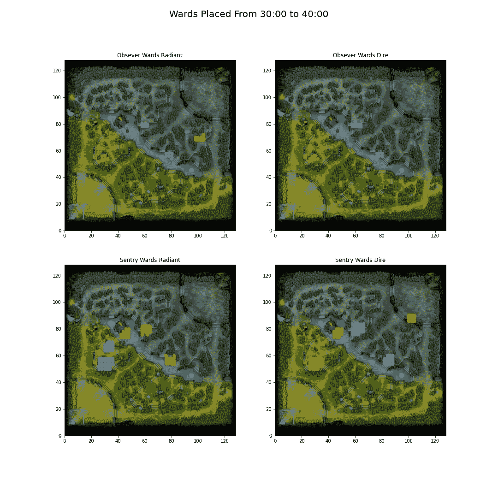
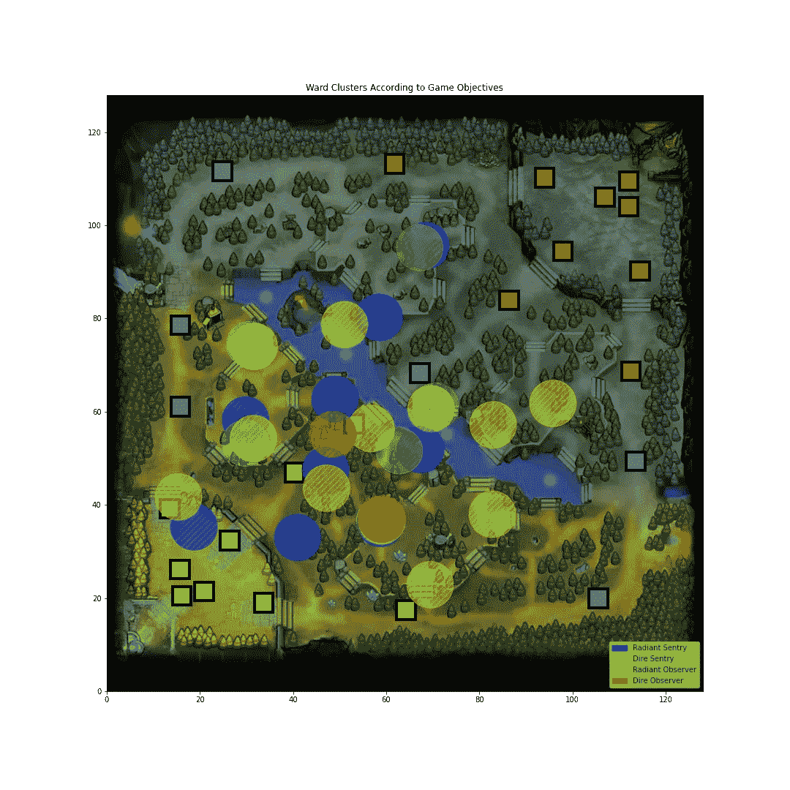
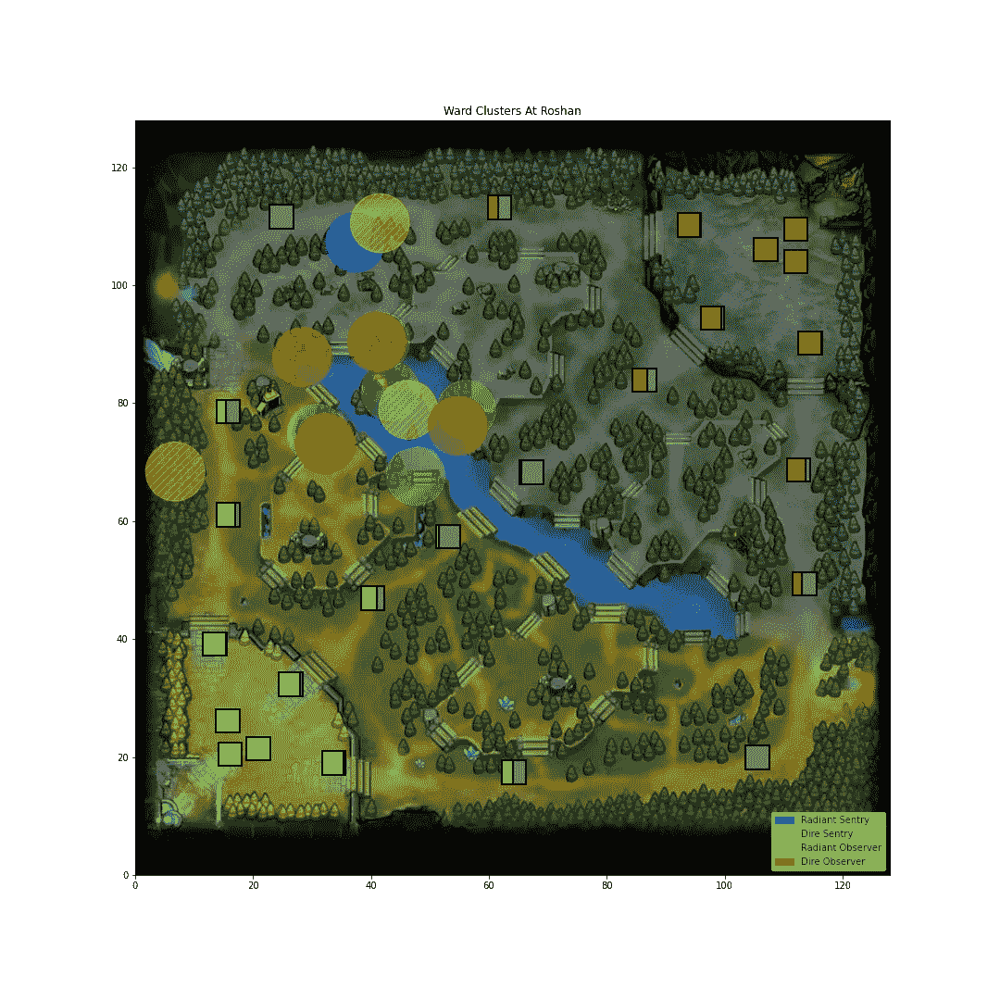
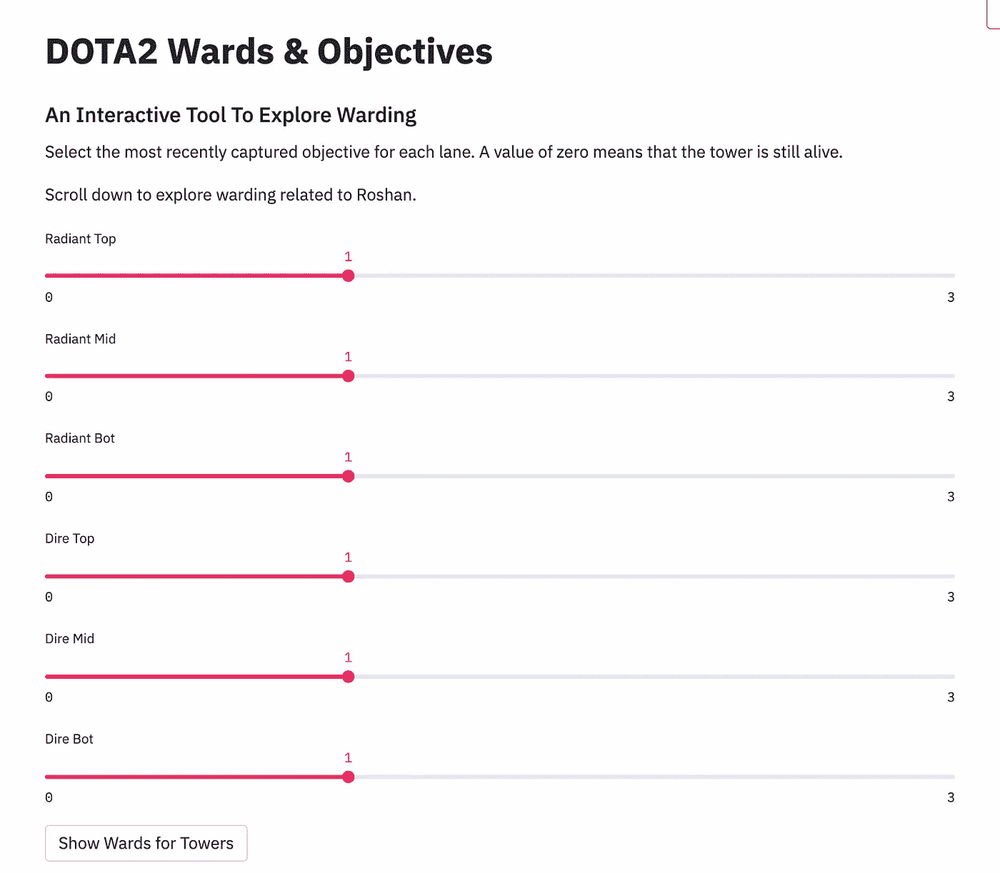

# Web 应用程序的设计考虑

> 原文：<https://towardsdatascience.com/design-considerations-for-a-web-app-4b8ebb58315?source=collection_archive---------14----------------------->

## 从 Jupyter 笔记本到全功能网络应用

来源: [Dota2 Wiki](https://dota2.fandom.com/wiki/Custom_Wards) ，可在 [CC BY-NC-SA 3.0](https://www.fandom.com/licensing) 下获得

不久前，我为 DOTA2 创建了一个 ward cluster finder，并在 medium 和 Reddit 上的 DOTA2 社区[分享了它](https://www.reddit.com/r/DotA2/comments/q021rw/i_analyzed_where_pro_players_place_wards/?utm_source=share&utm_medium=web2x&context=3)[。](/where-to-place-wards-in-dota2-84f534b9b64e)目标是解析职业比赛并识别职业球员的防守模式。此外，我想将我的发现与付费的 [DOTA Plus](https://www.dota2.com/plus) 服务的建议进行比较。

我觉得把一个附带的项目变成了有实际价值的东西很有成就感。除了好评，我还收到了很多关于如何改进的反馈。这篇文章的目的是探索数据科学 web 应用程序的设计考虑因素、用户反馈的重要性以及如何预测未来的需求。

要跳到最终产品，请点击下面的链接:

[https://share . streamlit . io/nadimkawwa/dotawardfinder/main/appward objectives . py](https://share.streamlit.io/nadimkawwa/dotawardfinder/main/appWardObjectives.py)

对于存储库:

<https://github.com/NadimKawwa/DOTAWardFinder>  

# 观众是谁？

在创建任何东西之前，思考谁将使用它以及如何使用它是很重要的。我预计这个项目主要是 DOTA2 玩家，一些数据科学家，或许还有玩 DOTA2 的数据科学家使用。这意味着使用大量的技术术语可能会令人不快，应该避免。此外，它有助于将你自己放在观众的位置上，在这种情况下，这意味着玩一些 DOTA2 游戏来很好地掌握游戏机制。

# 获得用户的初步反馈

在各种论坛上分享项目的好处是用户的反馈和改进建议。由于害怕某个东西不完美，或者某处有致命的缺陷，所以推迟发布它是完全正常的。就我个人而言，我担心这个项目还没有完成到值得任何人反馈的程度。然而，请记住，我们被允许失败，批评是一种有效的改进方式。我最终部署了这个模型，并在接下来的几周里思考我收到的反馈。

有三个想法不断出现，并在这个项目中得以实施。下图取自原始项目，显示了 30-40 分钟之间的换班示例。在接下来的小节中，我将解释这个情节的缺点，以及我是如何解决用户所关心的问题的。

作者图片

## 更少的簇，更多的圈

一个观察者守卫提供一个区域的视野，如果使用者在那个区域有视野，一个哨兵守卫显示不可见的单位。前面的图显示了病房聚类，每种颜色对应一个不同的聚类(红色、橙色、粉色等)。

我了解到，虽然这显示了病房集中的地方，但并没有真正显示它们覆盖的区域。用户想知道:被监控的一般区域是什么？因此，我用各自的平均质心替换了聚类，并在它周围画了一个圆。

此外，属于同一团队和类别的所有病房的配色方案将是相同的。结果是一个更简洁的表示，并且用户识别守卫点的工作量更少。

## 作为目标的函数，而不是时间的函数

也许最深刻的观察是，并非所有的游戏都遵循同样的节奏。事实上，一些游戏只需 25 分钟就能结束，而另一些则需要一个多小时。游戏的节奏是由占领目标决定的，比如塔和兵营。

因此，基于时间的结界是相当误导的，因为它没有考虑到我们在游戏中领先了多远。我修改了分段过程，使其成为目标而不是时间的函数。

## 更少的图像意味着更少的困惑

一些用户的帖子大意如下:

*   如果你在手机上，很难看到任何东西。
*   情节标题很小，很难阅读。
*   为什么我们看不到并排的星团？

解决这个问题的方法是将四个小的次要情节合并成一个更大的，包罗万象的情节。它允许用户以统一的格式查看所有内容，并有望防止眯着眼看小字体。

## 实施反馈

结果是如下图所示。一个额外的增强是显示塔的状态，以便情节是自明的。例如，辐射最后剩下的塔在第三层，两个队都竞争在那里有一个岗哨。

作者图片

# 其他设计考虑

用户反馈打开了反思之前选择的大门。事实上，一旦我们开始改变事情，我们就开始质疑是否需要重写整个代码段。这一节将介绍这些被完全重写的代码部分。

## 计算工作量

选择的聚类算法是 DBSCAN，并且计算量可能很大。此外，寻找最佳参数需要多次迭代。最后但同样重要的是，随着数据集变得越来越大，它阐述了计算工作，这让我们产生了一个问题:训练算法应该托管在云平台上吗？

答案是不，不一定。为什么要强迫云服务一遍又一遍地计算同样的事情呢？此外，为什么让用户等待计算完成呢？解决方案是在本地一次手动完成所有计算，然后将静态图上传到存储服务上(我想到了 AWS S3)。这简化了事情，因为所有的代码只是获取一个图像并显示给用户。

## 要求用户输入太多信息

这个项目的前一个版本要求用户做三件事:

*   匹配时间范围
*   ε参数
*   最小样本参数

对于几乎没有数据科学背景的人来说，最后两个要点不是很清楚。因此，这些输入会导致不必要的麻烦。事实上，在没有花费大量时间探索数据的情况下，如何猜测最佳参数呢？

这些参数被一个简单的问题所代替:请陈述在守卫的时候什么塔是活的？

## 罗山坑

罗山的坑是一个相当奇特的目标，不需要杀死罗山就可以赢得游戏。后者放弃了不朽之盾，这给了玩家死后的轮回。而且，随着游戏的进行，玩家越来越强大，罗山也是如此。

另一个有趣的事实:罗山在一定的时间间隔内重生，并且可以被杀死多次(在一场团队液体游戏中[多达 7 次](https://www.opendota.com/matches/6080190774))。

罗山的守卫图是一个特例，需要反映被捕获目标的平均状态。因此，塔被部分着色以反映游戏的平均进度。例如，如果在罗山死亡时，45%的第二层塔还活着，那么塔的 45%是红色的，55%是灰色的。

此外，通常在*罗兴*(杀死罗山的行为)前 2 分钟放置病房，并且只考虑这些病房。另一个简化是只扫描位于地图左上象限的病房。

结果是下面的图像，显示了一个守卫坑的入口的竞争。

作者的情节

## 边缘案例

总共有 6 个通道，每个通道可以有四种状态，从没有塔被带走到第 3 层塔在该特定通道中被摧毁。这意味着我们要考虑 4096 种组合。

前面的说法只是部分正确，因为这些案例大多不存在或数据点太少。因此，让用户知道他们在处理一个边缘情况是有帮助的。

# 履行

解释完所有设计注意事项后，我们可以继续实施了。简化的解决方案是一系列滑块，将用户输入转换为静态图的路径。只需将值滑动到所需的状态，点击“显示塔楼病房”并观看结果清单。

作者图片

# 额外收获:对于数据科学家来说

对于那些对在本地运行脚本感兴趣的人，可以随意克隆 [GitHub repo](https://github.com/NadimKawwa/DOTAWardFinder) ，特别是[笔记本#7](https://github.com/NadimKawwa/DOTAWardFinder/blob/main/07_WardCircles.ipynb) 。下面的代码片段显示了一个模拟 scikit-learn 熟悉度方法的示例运行。

# 结论

第一步是分享一些东西，不管它是如何“完成”的，并希望有人觉得它有用。在设计应用程序时，收集用户的反馈，并尝试预测他们的需求。此外，如果没有 DOTA2 社区的宝贵意见，我不可能把这个项目进行到现在。