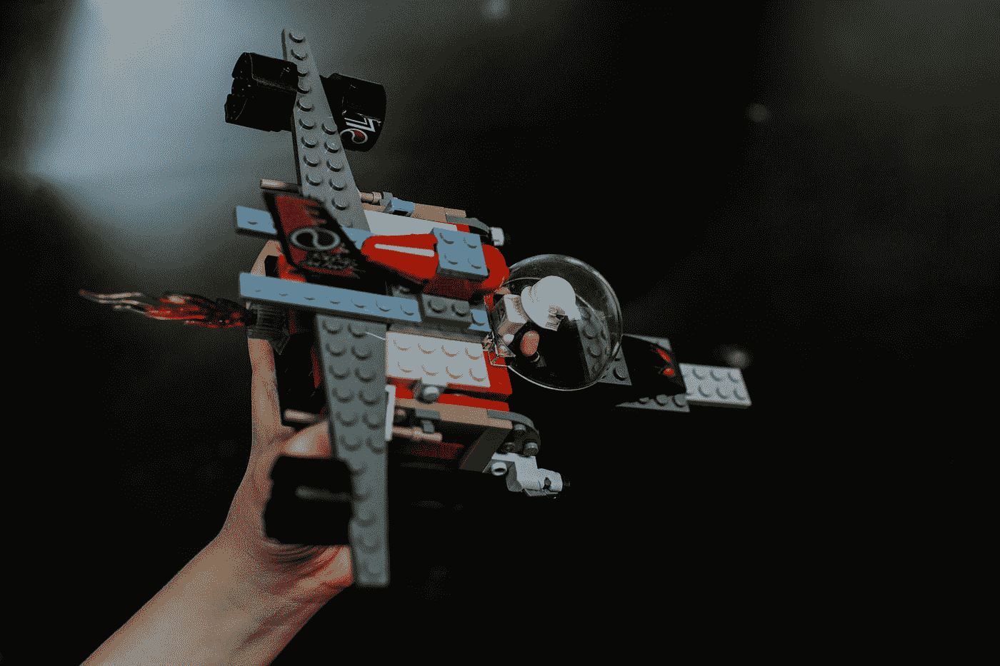

# 机器学习的设计模式

> 原文：<https://towardsdatascience.com/design-patterns-for-machine-learning-410be845c0db?source=collection_archive---------11----------------------->

## 将最佳 ML 实践抽象成可重用的设计模式

凯利·西克玛在 [Unsplash](https://unsplash.com?utm_source=medium&utm_medium=referral) 上的照片

随着机器学习无处不在，获取最佳实践和解决方案来解决常见的 ML 问题变得越来越重要。设计模式是捕捉这些问题的一种方式，并使用通用的和经过良好验证的 ML 设计提供可重用的答案。它们是设计解决方案或构建 ML 系统时的思考方式。

现在的问题是，我们能把最好的机器学习实践抽象成设计模式吗？

根据维基百科，“设计模式是程序员在设计应用程序或系统时可以用来解决常见问题的形式化的最佳实践”。

这里有一本最近出版的关于这个主题的新书，[“机器学习设计模式”](https://www.oreilly.com/library/view/machine-learning-design/9781098115777/)。这本书详细介绍了机器学习中的 30 种设计模式，这些模式被分为几类，如问题表示、模型训练、弹性服务、可再现性和负责任的人工智能。

在这篇文章中，我将重点总结书中一些我感兴趣的设计模式。

## **1。再平衡** : *问题表现设计模式*

不平衡数据集是欺诈检测、异常检测、垃圾邮件检测等分类问题中的常见场景。但是用于分类的典型 ML 模型在假设所有类别都是平衡的情况下工作，因此导致较差的预测性能。用于处理不平衡数据集的一些最常用策略如下:

**1。** ***选择正确的性能指标*** :虽然准确性是最常用的指标，但在不平衡数据集的情况下，它可能不是最好的指标，因为类分布是偏斜的。这种情况下的目标是最大化精确度和召回率，因此 F1 分数或 AUC 等指标更有效地评估性能。

**2。*采样方法*** :重采样是一种广泛采用的技术，用于平衡数据集中类内的样本。

a) *过采样*:这种方法涉及过采样少数类。简单的方法包括从少数类中复制样本，这不会向数据集添加任何附加信息。其他高级技术，如 SMOTE(合成少数过采样技术)从现有数据中合成新样本。

b) *下采样*:这种方法涉及选择多数类的随机子集，以达到少数类的相同大小，这可能会导致信息丢失。

**3。*加权类* :** 这种方法包括使用惩罚学习算法，这增加了少数类中错误分类的成本。也就是说，少数民族分类错误的成本与少数民族代表性不足的程度成正比。

## **2。转换:***R****e 生产性设计模式***

这种设计模式的关键思想是将输入与功能分离。为了训练模型，我们从原始输入中提取特征。但是在大多数机器学习问题中，输入并不直接作为特征使用。许多转换，如标准化、缩放、编码等。应用于输入，将它们转换为输入算法的特征。但是，如果这些转换是作为预处理步骤执行的，那么在预测时再现它们就成了一个问题，因为预测的输入仍然是原始格式。因此，清楚地将输入从特征中分离出来、封装预处理步骤并将其包含到模型中以确保可重复性是很重要的。这种设计原则允许通过分离输入、特征和转换，将机器学习模型容易地移植到生产中。TensorFlow 提供 tf.transform 来高效地执行转换并保存它们，以便在预测时间内通过应用 tf.serving 来再现它们。

## **3。检查点:** *模型训练设计模式*

弹性和容错是可伸缩系统的主要特征。检查点是模型内部状态(包括权重、当前学习率)的快照，因此训练可以在以后的任何时间点从该状态恢复。断电、操作系统故障、任务抢占或任何其他不可预见的错误都可能在培训过程中发生，尤其是深度学习模型，这可能会导致整个时间和资源的损失。包括 TensorFlow、Keras 和 PyTorch 在内的大多数深度学习框架都启用了检查点。实现检查点的方法之一可以是:
1。在每个时期结束时保留一个检查点
2。以最佳精度保存模型
TensorFlow 和 Keras 提供了 tf 等 API。Estimator API 和 ModelCheckpoint API，模型权重可以保存在 PyTorch 中实现检查点。

## **4。工作流程:** *再现性设计模式*

这种设计模式旨在将机器学习工作流的各个步骤隔离并封装到一个有组织的工作流中，以确保可维护性和可扩展性。机器学习开发工作流通常是单一的，它包含从数据收集到训练模型及其评估的一系列任务。但是机器学习任务本质上是迭代的。但是在开发过程中，跟踪工作流中所有的小变化变得很复杂，因为过程迭代的次数越来越多。这引入了 MLOps 的概念，它包含与 DevOps 中类似的概念，如持续集成和持续交付(CI/CD ),但还包含持续评估和持续培训的其他概念。MLOps 和 DevOps 的主要区别在于，在 MLOps 中，不仅是代码，数据也必须不断地进行测试和验证。工作流中每个任务的容器化是实现这种设计模式的方法。作者提出了 ML 流水线，它是 ML 步骤的可执行 DAG(有向无环图), ML 步骤是容器。它解决的主要问题是“相关性跟踪”，这样，如果在流水线的某个步骤中发生了变化，只有相关的步骤才会重新运行，从而确保可再现性。

## **5。可解释的预测** : *负责任的人工智能设计模式*

机器学习模型一般都是黑箱。但是对模型行为有一个清晰的理解对于诊断错误和识别潜在的偏差以决定是否可以使用它们是非常重要的。在机器学习中引入可解释性是负责任的人工智能的一个主要因素。因此，这种模式的关键思想是解释机器学习模型，以理解模型为什么以及如何以某种方式做出预测。但是，当前的评估指标只谈论给定数据集的预测的相对正确性，但它们没有提供任何关于模型为什么会得出该预测的见解。ELI5、SHAP 和 LIME 是模型可解释性方面使用最广泛的 Python 库。

尽管上述技术在大多数机器学习实践中得以实现，但定义设计模式有助于为常见问题创建通用的可重用解决方案。它们有助于工程师之间的沟通，并通过提供现成的解决方案来快速解决常见问题。

快乐学习！！