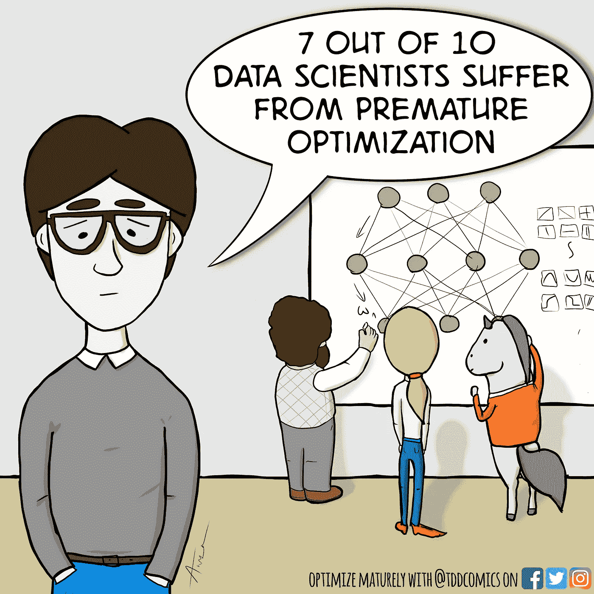

# 机器学习中的设计模式

> 原文：<https://towardsdatascience.com/design-patterns-in-machine-learning-b73eea4882cd?source=collection_archive---------17----------------------->

## 我们能把最佳实践抽象成真正的设计模式吗？

根据它的[定义](https://en.wikipedia.org/wiki/Software_design_pattern)，设计模式是一个常见问题的可重用解决方案。在软件工程中，这个概念可以追溯到 [1987 年](http://c2.com/doc/oopsla87.html)，当时 Beck 和 Cunningham 开始将其应用于编程。到了 2000 年，设计模式——尤其是面向对象的坚实设计原则——被认为是程序员的常识。快进 15 年，我们来到了[软件 2.0](https://karpathy.medium.com/software-2-0-a64152b37c35) 的时代:机器学习模型开始在越来越多的代码中取代经典函数。今天，我们将软件视为传统代码、机器学习模型和底层数据的融合。这种融合需要这些组件的无缝集成，考虑到这些领域通常不同的历史和发展，这通常不是微不足道的。

> 今天，我们将软件视为传统代码、机器学习模型和底层数据的融合。

然而，设计模式还没有被扩展来处理这个新时代的挑战。在软件 2.0 中，常见的挑战不仅出现在代码层面，还出现在问题定义、数据表示、训练方法、缩放以及人工智能系统设计的伦理方面。这为机器学习*反模式*的实践创造了肥沃的土壤。不幸的是，今天甚至博客帖子和会议有时也以反模式为特色:认为可以改善事情，但实际上却使事情变得更糟的实践。因为反模式也需要技能，所以它们通常不被从业者认可。因此，在下面，我将给出两个常见 ML 挑战的例子，但是，我将首先介绍它们的解决方案反模式，而不是从设计模式开始。

## 该模型在评估指标上表现不佳

在常见的场景中，在收集、清理和准备数据之后，工程师训练第一个模型，并发现它在测试数据上表现不佳。一个常见的反模式是用一个更复杂的模型(例如，通常是梯度提升树)替换第一个模型，并以此提高性能。这个反模式的一个变体可以遵循这个步骤，通过模型平均来组合几个模型。

Donald Knuth 的名言“过早优化是万恶之源”已有近 50 年的历史，现在仍然适用。经 [tddcomics](https://www.instagram.com/tddcomics/) 许可的图像。

这些方法的问题在于，它们只关注问题的一部分，即模型，并选择通过增加模型的复杂性来解决问题。这些步骤迫使我们接受过度拟合的高风险，用可解释性换取额外的预测能力。虽然有有效的做法来减轻这种选择的副作用(如石灰)，我们不能完全消除它们。

设计模式是错误分析。在实践中，这意味着通过评估模型在不同测试集上的适用性，或者甚至通过查看我们的模型出错的个别案例，来查看我们的模型在哪里出错。尽管我们都听说过“垃圾进，垃圾出”，但仍然很少有人意识到这是真的，即使是数据中很小的不一致。也许标签来自不同的评分者，每个人都有自己的，对标签指南略有不同的解释。也许收集数据的方式已经随着时间的推移而改变了。对于小数据问题，误差分析的效果尤其明显。然而，我们还应该记住，在大数据的很大一部分情况下，我们还会处理长尾事件(例如，从入学考试中识别稀有人才)。

错误分析的真正力量来自于这样一个事实，即我们不会通过应用它来交换可解释性或过度拟合的风险，事实上，单独应用它会产生关于数据分布的关键知识。此外，错误分析使我们能够选择以模型为中心(例如更复杂的模型)和以数据为中心(例如进一步的清理步骤)的解决方案。

## 部署模型的性能随着时间的推移而下降

该模型经过了广泛的验证，并被部署到生产中。用户很高兴，并给予积极的反馈。然后，一个月/一个季度/一年后，关于预测缺陷的报告接踵而至。这通常是概念漂移的一种表现，即你的模型所了解到的输入和输出之间的联系已经随着时间而改变。在有些地方，这种概念漂移是众所周知的(单词语义、垃圾邮件检测器)，但“概念”漂移可能发生在任何领域。例如，面具和社会距离的规定也挑战了许多以前部署的计算机视觉模型。

没有再训练的 ML 系统假设输入和输出之间的学习关系没有变化。经[TDD 经济组](https://www.facebook.com/tddcomics)许可的图像。

一种常见的反模式是将这些例子归因于噪声，并期望情况随着时间的推移而稳定下来。这不仅意味着缺乏行动，也意味着错误的归因，这在数据驱动的企业中通常是不鼓励的。稍微好一点的反模式是通过快速重新训练和部署新模型来对报告做出反应。这是一个反模式，即使在团队假设他们遵循敏捷软件开发原则并因此选择快速响应变化的情况下。问题是，这种解决方案解决了症状，但没有解决系统设计中的缺陷。

设计模式是对性能的持续评估，这意味着您预期会发生偏差，因此，设计系统以尽快注意到它。这是一种完全不同的方法，因为重点不是反应速度，而是检测速度。这使得整个系统处于更加可控的过程中，为任何反应的优先化提供了更多的空间。持续评估意味着建立流程和工具，为一小部分新数据持续生成基础事实。在大多数情况下，这涉及到人工标签，通常使用众包服务。不过，在某些情况下，我们可以使用其他更复杂但在部署环境中不可行的模型和设备来生成地面实况标签。例如，在自动驾驶汽车的开发中，来自一个传感器(例如激光雷达)的输入可以用于为另一个传感器(例如摄像机)生成地面实况。

## 机器学习的坚实设计原则

我写设计模式的原因是，这个领域已经达到了成熟的水平，我们不仅应该分享我们的最佳实践，而且应该能够将它们抽象为真正的设计模式。幸运的是，这项工作已经由多个小组开始了。事实上，最近已经出版了两本关于这个主题的书[ [1](https://www.oreilly.com/library/view/machine-learning-design/9781098115777/) ，[ [2](https://www.manning.com/books/deep-learning-design-patterns) ]。我喜欢阅读它们，但我仍然有一种感觉，尽管我们正朝着正确的方向前进，但我们距离为 ML 从业者制定坚实的设计原则仍有几步之遥。我相信，虽然基础知识已经可用，并用于构建今天的人工智能产品，但设计模式和反模式方面的工作是迈向软件 2.0 时代的重要一步。

设计模式是机器学习技术的基础。经[TDD 经济组](https://twitter.com/tddcomics)许可的图像。

[https://www.kdnuggets.com/2021/08/top-stories-2021-jul.html](https://www.kdnuggets.com/2021/08/top-stories-2021-jul.html)