# Tableau 中的设计思维

> 原文：<https://towardsdatascience.com/design-thinking-in-tableau-6165912f0791?source=collection_archive---------9----------------------->

## [可视化](https://towardsdatascience.com/data-visualization/home)

## 使用业务模型画布的插图

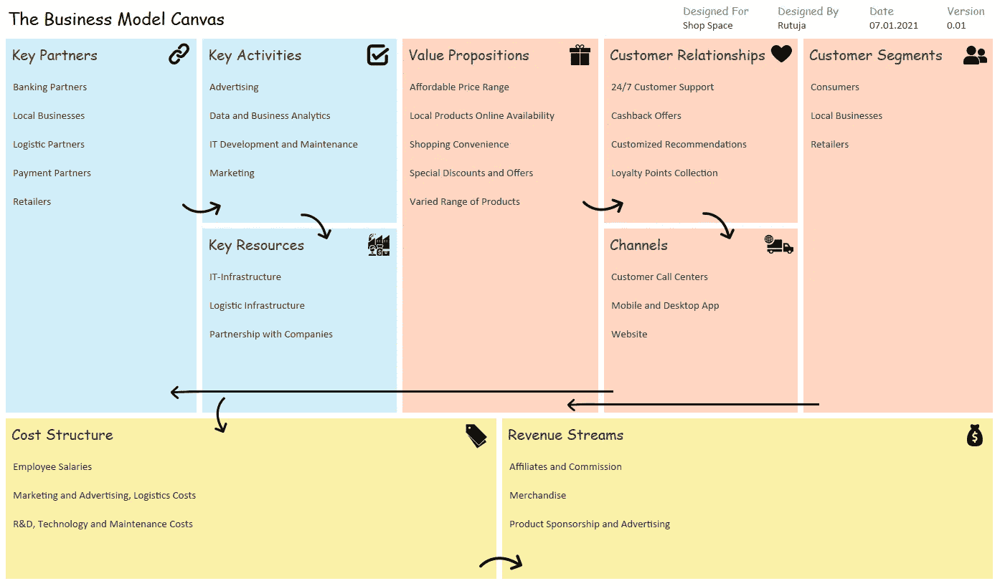

Tableau 中的商业模式画布(Design⁴,⁵,⁶)(图片来源:作者提供)

D 设计思维是一个基于以用户为中心的设计的过程，有助于建立用户同理心，引导寻求突破性创新。同样，通过使用*业务模型画布*，设计思维可以被用于战略性地构建新业务模型的开发或现有业务模型的文档。业务模型画布作为一个有价值的模板，根据业务如何创造、交付和获取价值，可视化地设计和原型化业务的重要方面。

但是想象一下，如果你能够**将设计思维和数据驱动的分析结合起来，你会怎么样！通过这种方式，你可以拥有一个动态的商业计划和实时的洞察力。这在计划合作时变得特别重要和有帮助，尤其是当你想开始一项新的商业冒险时。这正是本文所阐述的如何使用 [Tableau](https://www.tableau.com/) 开始并实现这个概念。**

我们将首先查看主画布的实现细节，然后查看它与实时洞察的链接，

**数据来源:**我们将首先创建一个表格格式的 Excel 文件，包含两个工作表，即*版本*和*画布详细信息。*版本表由需要在画布表头填写的详细信息组成，有四个字段，分别是*设计人、设计人、日期*和*版本*。使标题动态化可以确保正确的版本控制。

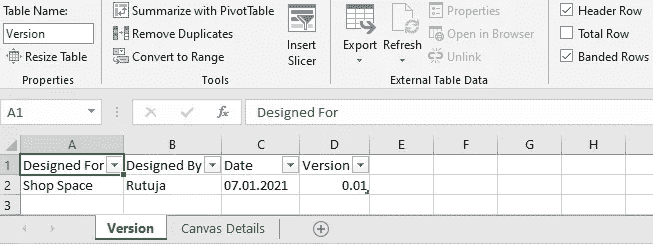

单张版(来源:图片由作者提供)

Canvas Details 表由九个模块的主要 Canvas 字段组成，即*关键合作伙伴、关键活动、关键资源、价值主张、客户关系、渠道、客户群、成本结构、*和*收入流。*

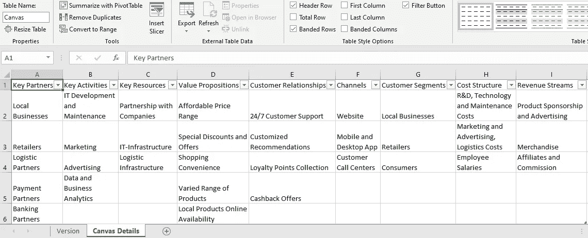

床单画布细节(来源:图片由作者提供)

**连接数据源:**在*数据源*面板中，选择*数据- >新建数据源。*选择 Microsoft Excel 文件数据源，并找到您在上述步骤中创建的文件。由于我们的两个 excel 表是分离的，记住创建**两个数据源连接**，一个带有*画布细节*，另一个带有*版本*表，如下图所示。

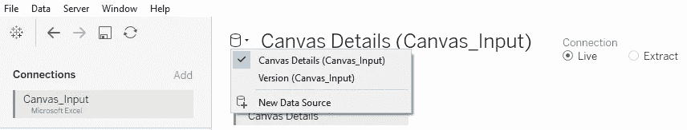

数据源连接(来源:图片由作者提供)

为了促进团队协作，仪表板应该发布到 [Tableau 服务器](https://www.tableau.com/products/server)，确保您使用的是**实时连接**到保存在共享位置的 excel 文件，并且服务器可以访问该文件。这样，不同的用户可以编辑和更新，所做的更改会自动反映在画布上。

**画布的设计和实现:**首先，在一个普通的仪表板(自定义尺寸 1400 x 827)上，布局&根据 template⁴,⁵和以下组件设计业务模型画布:

***视图:*** 总共创建 10 个页面，每个模块一个，包括版本页面。通过将相关的 excel 字段拖放到*行*和将计算的*空白*字段拖放到标记卡*上的文本来创建文本视图。*

*使用的格式:* *标题-Comic Sans MS (15 磅)，字段-Calibri (11 磅)，调色板:#D0EEF7，#FFD5C2，#FAE99F*

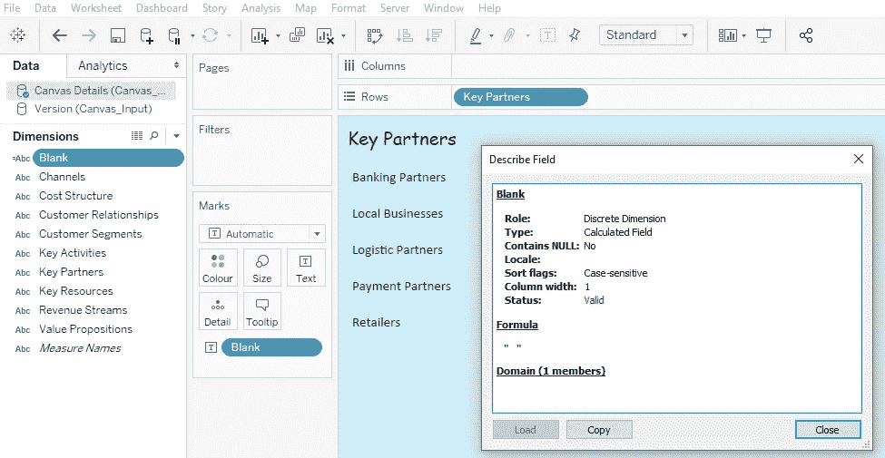

主要合作伙伴的示例表(来源:图片由作者提供)

*使用的格式:Title-Comic Sans MS (11 磅)，Fields-Calibri (11 磅)*

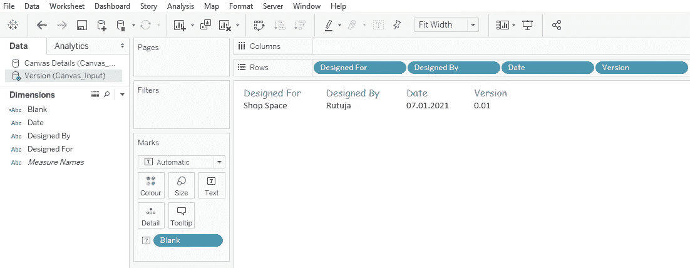

版本的样张(来源:图片由作者提供)

***Header:*** 使用*Objects->Text(Comic Sans MS-18 pt)*添加画布标题。此外，从*表单*窗格中，拖放*版本的*表单，完成画布的标题。相应地，对齐并调整割台部件。

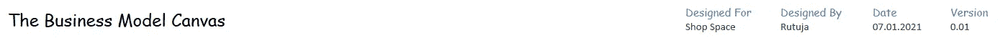

画布页眉(来源:作者图片)

***主画布:*** 为了创建不同的块，通过使用容器( *Objects- > Horizontal，Vertical* )来相应地安排仪表板上的布局。然后，这些容器将容纳相应的纸张。然后从*料板*面板将相应的料板拖放到容器中。

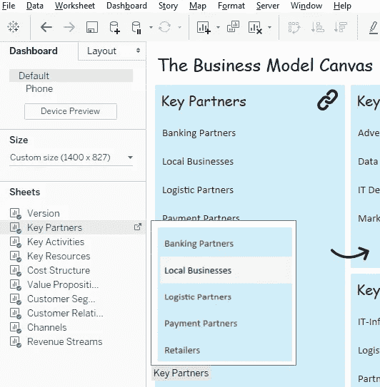

工作表窗格(来源:作者图片)

为了使仪表板更有创意，继续将您选择的相关 icons⁶作为*对象- >按钮(图像)*添加到每个块中。这些按钮反过来将有助于导航到数据分析仪表板。

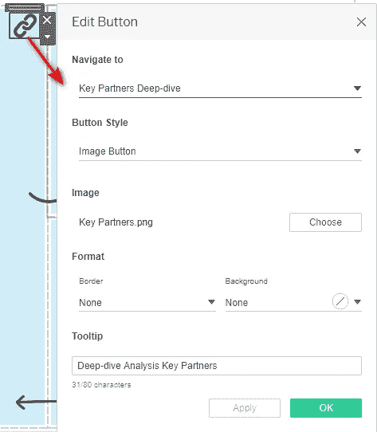

按钮配置键合作伙伴(来源:图片由作者提供)

此外，通过放置 arrows⁶作为对象 *- >图像*来完成设计，以可视化仪表板流程。最终的画布看起来会像这样，

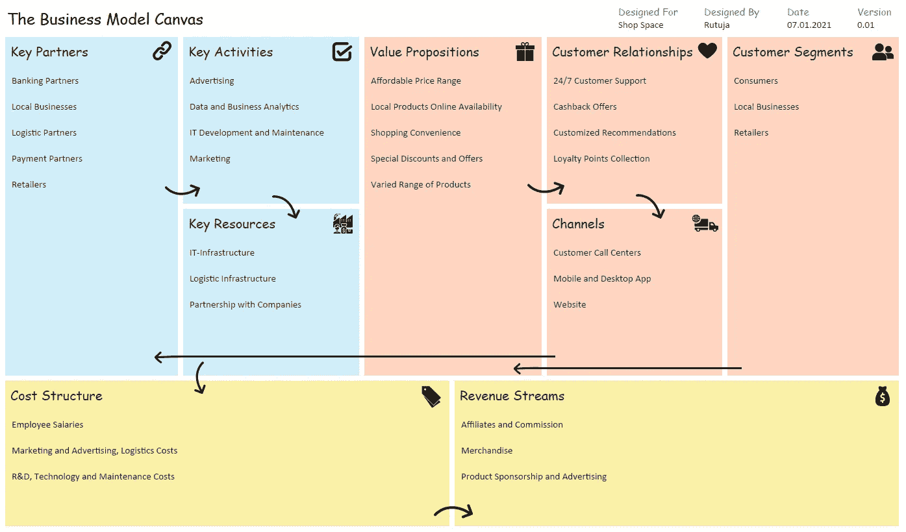

Tableau 中的商业模式画布(Design⁴,⁵,⁶)(图片来源:作者提供)

**链接数据驱动的洞察:**一旦画布的设计和实现完成，我们可以进一步为九个块中的每一个创建单独的仪表板，并通过图像按钮提供它们从主画布的来回导航。这些单独的仪表板，例如这里的关键合作伙伴(修改后的 illustration⁷)提供了深入的统计数据和分析，以了解不同的关键合作伙伴以及如何衡量他们对业务的影响。这些单独的控制面板是数据分析控制面板，以直观的可视化形式呈现与每个块相关的关键数据。此处可视化的数据可以从各种数据源(包括数据库、excel 等)中收集。

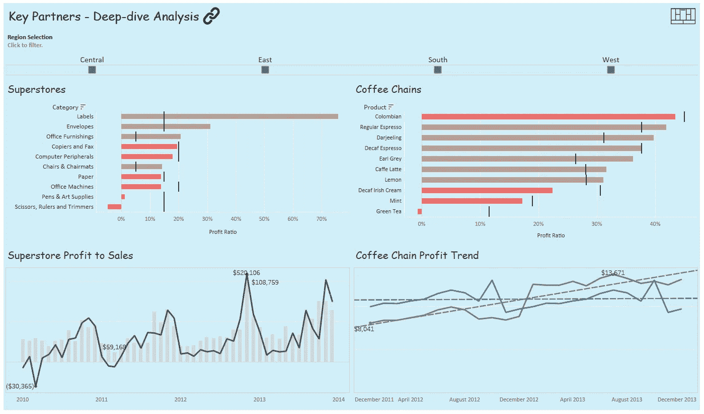

主要合作伙伴的说明性 Dashboard⁷(来源:图片由作者提供)

不要忘记在每个独立的块仪表板上添加一个统一的*图像按钮*，以导航到主画布。

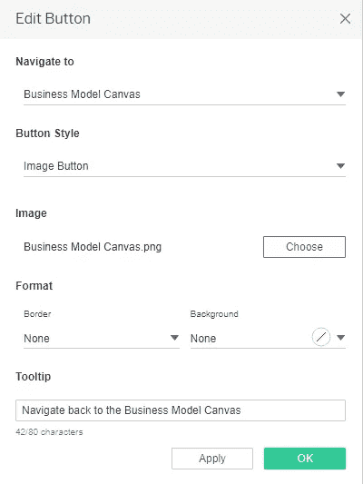

按钮配置(来源:图片由作者提供)

最后，这里以关键合作伙伴的端到端流程为例，看起来像这样，

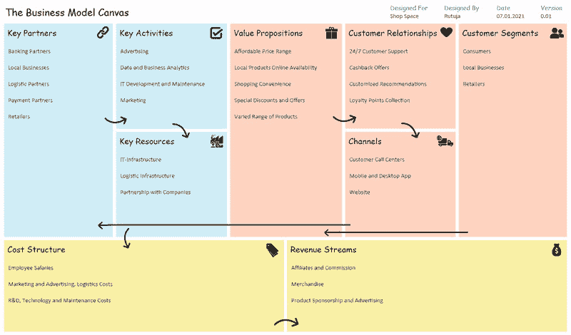

块关键合作伙伴的说明性流程(来源:图片由作者提供)

此外，可以同时实现其他块的仪表板。最终，我们将拥有一个**完整直观的动态流程，您的业务计划与深入分析仪表板**相链接，从而帮助您简化、战略性地规划&管理您的业务。

总而言之，这篇文章展示了如何使用商业智能(BI)工具将设计思维与数据分析结合起来，创建结构化的流程，进而发现新的可能性。由于基本思想保持不变，本文中的实现步骤是说明性的，可以根据您选择的 BI 工具进行**调整。作为例子，你可以参考我的另一篇文章[Power BI](https://www.analyticsvidhya.com/blog/2021/01/design-thinking-in-power-bi/)中的设计思维，它是这篇文章的另一个变体。**

## 参考

[1][https://labs . so geti . com/using-design-thinking-to-design-business-models/#:~:text = The % 20 business % 20 model % 20 canvas % 20 is，creates % 2C % 20 delivers % 20 and % 20 captures % 20 value](https://labs.sogeti.com/using-design-thinking-to-design-business-models/#:~:text=The%20Business%20Model%20Canvas%20is,creates%2C%20delivers%20and%20captures%20value)。

[https://en.wikipedia.org/wiki/Business_Model_Canvas](https://en.wikipedia.org/wiki/Business_Model_Canvas)

[3][https://kb . tableau . com/articles/how to/automatically-updating-data-in-server-workbook-that-uses-live-connection-to-excel？_ ga = 2.16856729](https://kb.tableau.com/articles/howto/automatically-updating-data-in-server-workbook-that-uses-live-connection-to-excel?_ga=2.168567329.180703225.1615071648-332750078.1615071648)16685.766666666667

[4][https://en . Wikipedia . org/wiki/Business _ Model _ Canvas #/media/File:Business _ Model _ Canvas . png](https://en.wikipedia.org/wiki/Business_Model_Canvas#/media/File:Business_Model_Canvas.png)

[5][https://online . visual-paradigm . com/diagrams/templates/business-model-canvas/categorized/](https://online.visual-paradigm.com/diagrams/templates/business-model-canvas/categorized/)

[6]图标:根据[知识共享署名(CC BY)](http://creativecommons.org/licenses/by/3.0/) 获得许可。

[链接](https://thenounproject.com/search/?q=link&i=1713473)图标由[名词项目](http://thenounproject.com/)中的 Luiz Carvalho 设计。

名词项目中 Prashanth Rapolu 的[勾选](https://thenounproject.com/search/?q=tick&i=2174974)图标。

[Gift](https://thenounproject.com/search/?q=gift&i=3673202) 图标由 Vectorstall 从[名词项目](http://thenounproject.com/)中取出。

“[心](https://thenounproject.com/search/?q=heart&i=858723)图标由 Gimzy7 从[名词项目](http://thenounproject.com/)而来。

[客户](https://thenounproject.com/search/?q=customers&i=2837107)图标由 shashank singh 从[名词项目](http://thenounproject.com/)中获得。

[资源](https://thenounproject.com/search/?q=resources&i=2973437)图标由 dDara 从[名词项目](http://thenounproject.com/)中获得。

[物流](https://thenounproject.com/search/?q=logistics&i=1748429)图标由 Adrien Coquet 从[名词项目](http://thenounproject.com/)而来。

“[标签](https://thenounproject.com/search/?q=tags&i=464246)图标由吉尔姆从[名词项目](http://thenounproject.com/)获得。

名词项目中 Ralf Schmitzer 的[收入](https://thenounproject.com/search/?q=revenue&i=631052)图标。

[圆形右箭头](https://thenounproject.com/term/rounded-right-arrow/546322/)图标由来自[名词项目](http://thenounproject.com/)的星形和锚形设计而成。

[圆形向下箭头](https://thenounproject.com/term/rounded-down-arrow/546320/)图标由来自[名词项目](http://thenounproject.com/)的星形和锚形设计。

[弧形向下箭头](https://thenounproject.com/term/curved-down-arrow/546316/)图标由星形和锚形设计而来[名词项目](http://thenounproject.com/)。

[弧形右箭头](https://thenounproject.com/term/curved-right-arrow/546321/)图标由星形和锚形设计而来[名词项目](http://thenounproject.com/)。

[箭头](https://thenounproject.com/search/?q=left+arrow&i=2905806)图标由来自[名词项目](http://thenounproject.com/)的 Subur Imam Hidayat 制作。

[https://www.tableau.com/learn/classroom/desktop-two](https://www.tableau.com/learn/classroom/desktop-two)