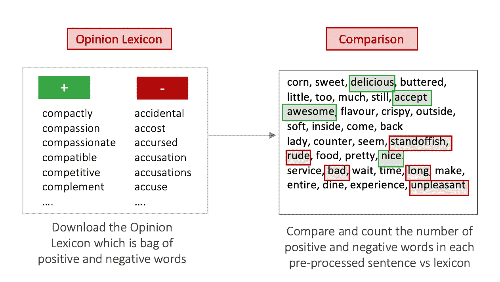

# 设计你自己的情感分数

> 原文：<https://towardsdatascience.com/design-your-own-sentiment-score-e524308cf787?source=collection_archive---------5----------------------->

## Python 熊猫中的情感分析


照片由来自 [Unsplash](https://unsplash.com/photos/-fRAIQHKcc0) 的 [Markus Winkler](https://unsplash.com/@markuswinkler) 拍摄

情感分析是一种常用的 NLP(自然语言处理)技术，用于确定文本是正面的、负面的还是中性的。它经常被用来根据评论情绪来查看客户满意度，或者在我们对文本数据进行分析时作为一个额外的视角。

有 python 包可以像 [NLTK Vadar](https://www.nltk.org/howto/sentiment.html) 一样直接计算情绪得分(样例代码在后面)。然而，本文的主要目的是帮助您根据自己的逻辑设计和创建自己的情感得分。

## 为什么我们要创造自己的情感得分？

1.  你知道你得到了什么(因为你设计了情感分数的计算逻辑)
2.  您可以根据需要灵活地更改逻辑。(例如，如果你在做餐馆评论情感分析，你可以使用与用餐相关的正面和负面词汇列表)
3.  当您使用多种逻辑来计算情感得分时，您有多种特征可供分析

> 好了，现在让我们来看例子！

# 我们使用的数据:

**餐馆评论数据:**我们使用的样本是来自 Yelp 的餐馆评论数据。数据可以从 [Kaggle](https://www.kaggle.com/yelp-dataset/yelp-dataset) 下载。餐馆评论的输出可用于评估不同餐馆的顾客满意度。

**正反词列表:**这是我们在网上找到的与餐厅相关的正反词列表。它们以 positive-words.txt 和 negative-words.txt 的形式存在。你可以在网上找到一个版本，并根据你所关注的行业继续添加。

**停用词:**经常出现但没有任何情感价值的词的列表，通常如“the”、“to”等。我使用 nltk 包中的停用词，因为它非常标准。

# 数据预处理:

首先将所有数据导入熊猫数据框。

```
import pandas as pd
# Import data
sample=pd.read_csv(file_path+'/train.csv')
sample.columns=['rating','review']
train['review_id']=train.index
positive=pd.read_csv(file_path+'/positive-words.txt',header=None)
positive.columns=['words']
negative=pd.read_csv(file_path+'/negative-words.txt',header=None)
negative.columns=['words']
stop_words=stopwords.words('english')
```

数据预处理:复习通常包含许多对我们确定情绪没有用处的标点符号、数字或停用词。

> 原始评论文本将被词干化(包括小写和单词词干化)、标记化(被分解成单词)、移除数字和停用词。

下面是一个例子，说明我们如何从预处理的每一步中得到最终的单词。(移动用户可能需要放大才能清楚地看到步骤)


文本预处理示例，示例文本来自 Yelp 数据集

```
import re
import nltk
nltk.download('punkt')
nltk.download('stopwords')
from nltk.corpus import stopwords
from nltk.stem.porter import *
stemmer = PorterStemmer()#preprocess function 
stem_words=lambda x: stemmer.stem(x)
break_into_words = lambda x : re.findall("[a-zA-Z0-9]+", x)
skip_stop_words = lambda x: [w for w in x if w not in list(stop_words)]
skip_numeric = lambda x : [w for w in x if not w.isnumeric()]#apply pre-processing steps
processed_text=sample['review'].map(to_lower)\
        .map(break_into_words)\
        .map(skip_stop_words)\
        .map(skip_numeric)sample['processed']=processed_text
```

# 统计正面和负面单词的出现次数:

基于正面和负面单词列表，您可以为每个评论生成正面和负面单词出现的计数。请注意，这一步会很慢，因为这是一个多对多的映射。如果您的数据量非常大，您可以考虑切换到 Hive Sparks 以获得更快的执行速度。



正面和负面单词计数示例

```
#count number of positive words
positive_words_count=processed_text.map(lambda x: len([w for w in x if w in list(positive['words'])]))#count number of negative words
negative_words_count=processed_text.map(lambda x: len([w for w in x if w in list(negative['words'])]))sample['positive']=positive_words_count
sample['negative']=negative_words_count
```

# 最后，计算情感得分:

**方法一:用正计数-负计数计算绝对分数**


```
sample['sentiment_score_1']=sample['positive']-sample['negative']
```

**赞成和反对:**这是一个直接而简单的计算评价的正面/负面程度的方法。好处是**直截了当，简单易懂**。然而，分数可能**有利于更长的评论**，因为它们往往有更多的正面/负面词汇，即使它们有相同的情感。

例如，“出色的食物和服务，但背景音乐可以改进”和“我认为这家餐厅的优点是食物很好，服务员很友好，我喜欢他们的食谱设计，但背景音乐很糟糕，等等”可能是相同的情感，但第二句的得分要大得多，因为文本较长。

**方法 2:根据评论的长度将分数标准化**


```
sample['normalized_sentiment_score']=(sample['positive']-sample['negative'])/(len(sample['processed'])
```

这里的逻辑是用复习的长度来归一化分数，因为问题出在方法 1 上。**你可以通过除以正面字数+负面字数** *来调整逻辑(那么分数会在-1 到 1 之间变化)。*

**利弊:**评分考虑了评论文本的长度，但数量可能非常小，很难区分。您可以选择将所有分数乘以一个固定的数字，以便于比较。

**方法三:计算正负字数之比**


```
sample['positive_negative_ratio']=sample['positive']/(sample['negative']+1)
```

方法 3 考虑了正面和负面评论的极性。这个比率也部分地规范了文本的长度，因为对于更长的评论，正面和负面分数的计数往往一起增加。分数范围在 0–无穷大之间，分数在 1 左右被认为是中性的。

**利弊:**这是归一化和解释之间更平衡的计算方式。这种逻辑的缺点是，你将更难确定中性情绪的范围，因为分母有“+1”

# **使用 Vadar 包计算情感得分**

**最快速、最简单的方法——无需文本预处理:)**

```
import nltk
nltk.download('vader_lexicon')
from nltk.sentiment.vader import SentimentIntensityAnalyzeranalyser = SentimentIntensityAnalyzer()
sample['review'].map(lambda x: analyser.polarity_scores(x))
```

# 限制

1.  我们只探究了积极和消极的单个单词。然而，可以有多个单词组合，比如“必须尝试”,我们可以将它们放入正面单词列表中。如果我们想要合并 2-gram 或 3-gram 短语，计算量会更大。
2.  不同的正面词被赋予相同的分数 1，但是例如“优秀”比“良好”具有更大的范围，因此我们可以为不同级别的词赋予不同的分数，然后相加
3.  双重否定短语在这里不像“不错”，这可以通过使用两个或三个肯定或否定单词列表来部分缓解。

# 结论

个人比较喜欢方法三的情感评分计算。然而，这三种方法只是例子，你可以有无限的新方法来设计和计算你自己的情感分数。您应该根据您的项目需求来设计您的逻辑。另外，如果你觉得只是想快速拥有一个情感分，可以选择使用如上图的 NLTK Vadar 方法。

如果您有一个标记良好的数据集(具有真实的情感得分)，您可以考虑使用分类方法。更多细节请参考我下面的另一篇文章

</sentiment-analysis-using-classification-e73da5b4159f> 