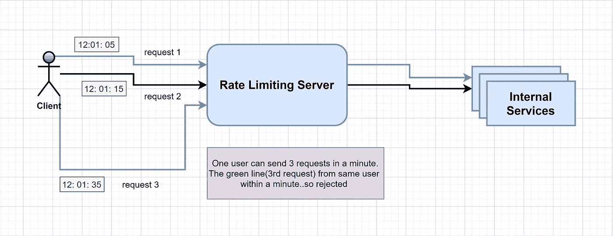
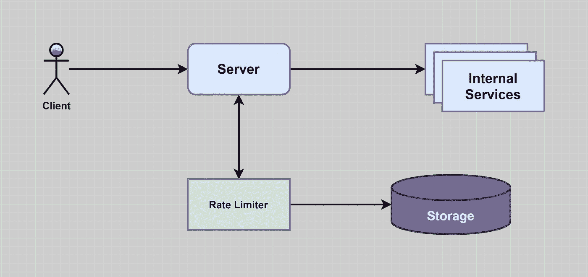
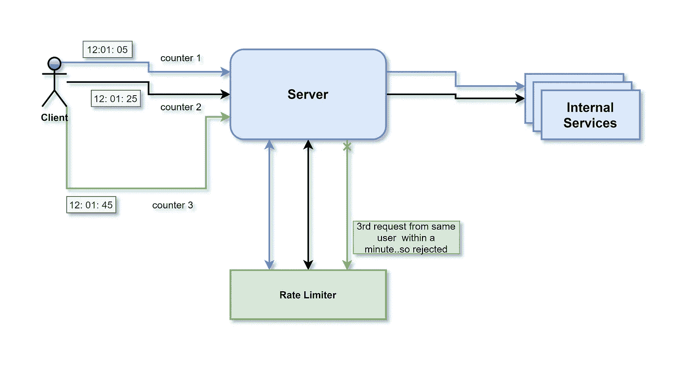
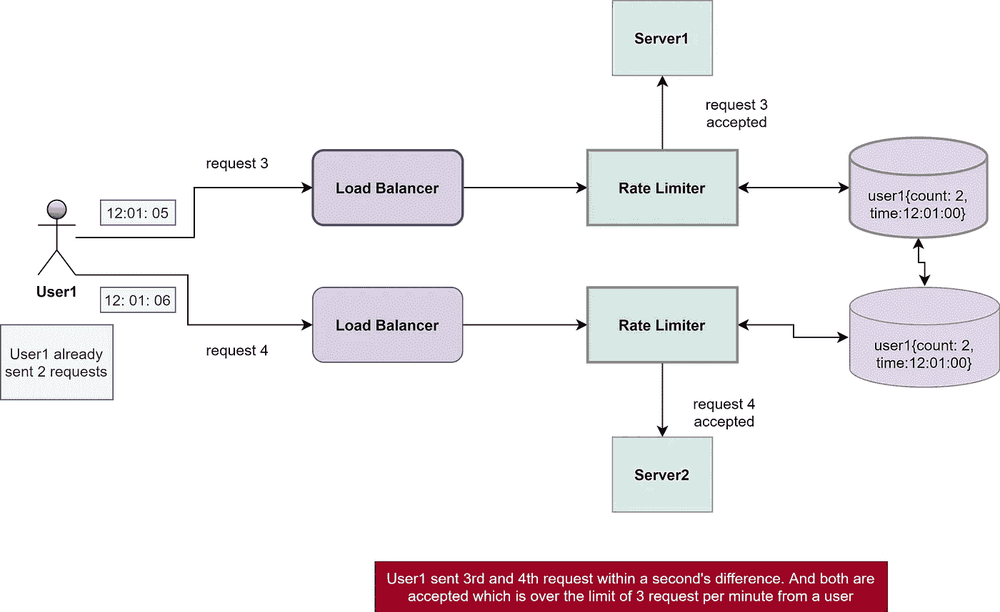
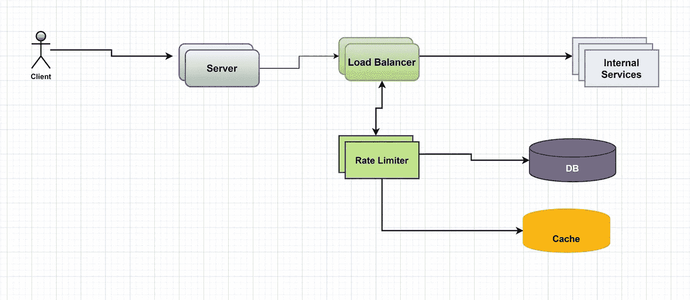

# 设计限速器

> 原文：<https://towardsdatascience.com/designing-a-rate-limiter-6351bd8762c6?source=collection_archive---------0----------------------->

## [系统设计基础知识](/system-design-101-b8f15162ef7c?sk=be3d26de1f9d1671b4abe379aae814f8)

## 你如何设计限速服务？

照片由[雅各布·索比](https://unsplash.com/@jakobsoeby?utm_source=medium&utm_medium=referral)在 [Unsplash](https://unsplash.com?utm_source=medium&utm_medium=referral) 上拍摄

系统设计是软件工程中最重要的概念之一。对于一个新手来说，学习设计变得很混乱，因为各种软件架构书籍中没有固定的指南，很难理解。你检查的每个地方似乎都有不同的方法。

于是，我根据自己学习建筑课程的经验，着手设计一个系统。这是初学者系统设计系列的一部分(下面给出了链接)。对于本文，让我们设计一个速率限制器服务。

## 什么是速率限制？

速率限制是一个容易理解的概念，但是对于大规模系统来说却是至关重要的。它用于安全目的以及性能改进。例如，一个服务每秒可以处理有限数量的请求。但是，如果一个服务一次接收大量的请求，服务器可能无法处理。在这种情况下，甚至服务器可能会关闭。为了处理这类问题，我们需要某种限制机制，只允许一定数量的服务请求。

简单来说，限速就是用某个阈值限制某些操作。如果超过这些阈值，系统将返回错误。您可能会说速率限制限制了在给定时间内执行的操作数量。

图 1:速率限制器拒绝第三个请求(图片由[作者](https://medium.com/@ashchk)提供)

速率限制可以分层实施。例如，网络请求可以被限制为每秒 1 个请求、每分钟 4 个请求、每 5 分钟 10 个请求。

## 为什么需要限速？

需要速率限制来保护系统不被黑客破坏。要了解速率限制的重要性，我们必须了解 DOS 攻击。

拒绝服务攻击，通常被称为 DOS 攻击，是指黑客试图在短时间内用大量请求淹没系统以关闭系统。因为服务器在一定时间内可以处理的请求数量是有限的。因此，系统不能适当地处理请求的洪流；它不能恰当地处理它们。

速率限制可以防止这种情况发生，因为它可以防止系统被有意的不必要的请求淹没。超过阈值后，系统返回错误。

比方说，在 Leetcode 或一些我们可以执行代码的网站上，可能需要速率限制，这样用户就不会不必要地发送垃圾代码执行服务。

我们可以用各种方式限制系统的速率，比如基于用户 id。比方说，我们可以将用户对服务器的请求操作限制为 5 次/分钟。速率限制的其他方式可以基于 IP 地址、区域等。

甚至我们可以对整个系统使用速率限制。例如，系统可能不会处理超过 20K 分钟的请求。如果用户请求总数在一分钟内超过这个数字，系统将返回错误。

# 系统的定义:

系统设计是一个很大的话题；如果我们不把它缩小到一个特定的目的，那么设计系统就会变得复杂，尤其是对于新手来说。在本文中，我们设计了一个速率限制器服务，它将在一个时间范围内限制客户端对服务器的请求数量。

照片由[米切尔罗](https://unsplash.com/@mitchel3uo?utm_source=medium&utm_medium=referral)在 [Unsplash](https://unsplash.com?utm_source=medium&utm_medium=referral)

## 系统的要求和目标

在这一部分，我们需要详细说明系统的功能。要求分为两部分:

**功能需求:**

1.  客户端可以在一个时间窗口内向服务器发送有限数量的请求，例如每秒 10 个请求。
2.  如果单个服务器或不同服务器组合的请求超过了定义的阈值限制，客户端应该会收到一条错误消息。

**非功能性需求:**

1.  该系统应该是高度可用的，因为它保护我们的服务免受外部攻击。
2.  性能是任何系统的重要因素。因此，我们需要小心，速率限制器服务不应该给系统增加大量的延迟。

## 内存估计:

让我们假设我们将所有的数据保存在一个散列表中。假设我们有一个键值对结构。密钥将是用户 ID 的散列值，并且值将是计数和开始时间的结构，例如*用户 ID {计数，开始时间}用户 ID {计数，开始时间}*

现在，让我们假设' UserID '占用 8 个字节，2 个字节用于' Count '，它可以计数到 65k，这对于我们的用例来说足够了。虽然结束时间需要 4 个字节，但我们只能存储分钟和秒钟部分。如果我们不考虑一个小时的窗口，小时部分是不必要的。现在，它需要 2 个字节。所以，我们总共需要 12 个字节来存储一个用户的数据。

现在，如果我们的哈希表每个记录有 20 字节的开销，并且我们需要随时跟踪 100 万个用户，那么我们需要的总内存是:

(12 + 20)字节* 100 万=> 32MB

如果我们需要一个 4 字节的数字来锁定每个用户的记录，以解决我们的原子性问题，我们将需要总共 36MB 的内存。

## 领域模型/概要设计:

当一个新的请求从客户端到达时，服务器首先要求速率限制器决定它是被服务还是被拒绝。如果请求没有被拒绝，那么它将被传递到内部 API 服务器。

速率限制器的责任是决定哪个客户请求将被服务，哪个请求将被拒绝。

图:领域模型/高层设计(图片由[作者](https://medium.com/@ashchk)提供)

## 固定窗口算法:

在该算法中，我们可以考虑从开始到结束时间单元的时间窗口。例如，我们的窗口周期可以被认为是 0–60 秒，一分钟，而不考虑客户端请求服务器的时间范围。我们已经想到了 count 和 startTime 的结构，例如 *UserId {Count，StartTime}*

图一:速率限制器允许客户端每分钟发出两个请求(图片由[作者](https://medium.com/@ashchk)提供)

图 1 显示了一个客户端每分钟可以发出两个请求的场景。因此，速率限制器允许请求 1 和请求 2。但是来自同一用户的第三个请求在 1 分钟内被阻塞。这种算法被命名为**固定窗口**算法。在这个算法中，一个周期被认为是 1 分钟(对于这个例子),而不管两个 API 请求被允许的时间范围。

特定客户端发出第一个请求 1 分钟后，将为该用户重置开始时间。这是限速器的一种简单方法。但是这种方法有一些缺点。

**缺点:**

它可以允许每分钟两倍的请求数。假设用户在一分钟的最后一秒(12:01:59)发送了两个请求，并在下一分钟的第一秒(12:02:00)立即又发送了两个请求。对于两个请求来说，这似乎是个小问题。但是如果请求的数量高得多(例如，50 个请求)或者时间范围低得多(例如，15 秒),则它会导致对服务器的大量请求。特别是我们在这里只考虑一个用户。想象一下，服务于数百万用户的服务将会发生什么。

此外，在分布式系统中,“先读后写”的行为会产生竞争条件。例如，想象一下，如果客户机的当前请求计数是 2，并且又发出了两个请求。如果两个独立的进程服务于这些请求中的每一个，并且在它们中的任何一个更新计数值之前并发地读取该计数值，则该进程将导致客户端没有达到速率限制。因此，我们可能需要锁定每条记录。

## 滑动窗口算法:

如果我们在一个时间范围内跟踪每个用户的每个请求，我们可以将每个请求的时间戳存储在哈希表的“值”字段中的一个排序集中。但是，这需要很大的内存。因此，我们可以在计数器上使用滑动窗口。现在，考虑一下，如果我们使用多个固定时间窗口来跟踪每个用户的请求计数。

例如，如果我们有一个每小时一次的窗口，当我们收到一个计算限制的新请求时，我们可以计算每分钟的请求数，并计算过去一小时所有计数器的总和。这将减少我们需要的内存。

假设我们将速率限制在每小时 500 个请求，每分钟 10 个请求。这意味着，当过去一小时内计数器的总和超过限制请求时，客户端已经超过速率限制(500)。

对于较小的时间范围，客户机每分钟不能发送超过 10 个请求。这将是一个混合和合理的考虑，因为我们可能认为没有一个真正的用户会发送如此频繁的请求。即使他们这样做，他们将获得重试成功，因为他们的限制得到重置每分钟。

## 分布式环境中的问题:

在分布式系统的情况下，我们讨论的算法会有一些问题。你可以查看下图，找出问题所在。允许用户在一分钟内请求 3 次。场景是用户已经发出了 2 个请求，并且在 2 秒钟内发出了两个新请求。来自用户的请求到达两个不同的负载平衡器，然后到达两个不同的速率限制器服务。由于 DB 已经包含计数值 2，速率限制器服务获得低于阈值的值并允许请求。因此，我们现在允许同一个用户在一分钟内发出 4 次请求，这打破了速率限制器的限制。这就是不一致的问题。

图 1:分布式环境中的问题(图片由[作者](https://medium.com/@ashchk)提供)

作为一个解决方案，我们可以使用粘性会话负载平衡来确保一个用户的请求将总是到达相同的速率限制器服务。但这里的问题是，这不是一个容错设计。因为如果限速器服务关闭，系统将无法满足用户的请求。

我们可以使用锁来解决这个问题。一旦服务使用了数据库中的计数器数据，它就会锁定它。因此，在计数器数据更新之前，其他服务不能使用它。但是这个程序也有它自己的问题。这将为锁定增加额外的等待时间。因此，我们需要在可用性和性能之间做出权衡。

## 缓存:

这个系统可以从缓存最近的活跃用户中获得巨大的好处。在访问后端服务器之前，服务器可以快速检查缓存是否包含用户的计数器值。这应该比每次都去数据库要快。

我们可以通过仅更新缓存中的所有计数器和时间戳来使用**回写缓存**策略。然后，我们可以以固定的时间间隔(例如 1 小时)写入数据库。这可以确保用户请求的最小延迟，从而改善锁延迟问题。

当服务器读取数据时，它总是首先命中缓存。当用户达到最大限制时，这将非常有用。速率限制器读取没有任何更新的数据。

我们可以使用最近最少使用(LRU)作为我们系统的缓存回收策略。

图 1:限速器的最终设计(图片由[作者](https://medium.com/@ashchk)提供)

## DoS 攻击:

为了防止系统受到 DoS 攻击，我们可以采取其他策略来限制 IP 地址或用户的速率。

**IP:** 在这个策略中，我们限制每个 IP 的请求；这可能不是区分普通用户和攻击者的好方法。但是，有一些保护总比什么都没有好。

基于 IP 的速率限制的最大问题是当多个用户共享一个公共 IP 时。例如，在网吧或智能手机中，用户正在使用同一个网关。另一个问题可能是，黑客甚至可以从一台计算机上获得大量 IPv6 地址。

**用户:**在用户认证之后，系统将向用户提供一个令牌，用户将在每次请求时传递这个令牌。这将确保我们可以对具有有效身份验证令牌的 API 进行速率限制。但问题是，我们必须对登录 API 本身进行速率限制。

这种策略的弱点是黑客可以通过提供最大限度的错误凭证来对用户进行拒绝服务攻击；之后，实际用户可能无法登录。

因此，我们可以同时使用这两种方法。但是，这可能会导致更多的缓存条目，每个条目包含更多的详细信息。因此，我们需要更多的内存和存储。

## 结论:

速率限制器可以限制实体(用户、IP 等)的事件数量。)可以在一个时间窗口中执行。例如，用户每分钟只能发送五个请求。我们可以基于“用户标识”对数据进行分片来分发用户的数据。我们应该使用一致的散列法来实现容错和复制。我们可以为每个用户或 IP 的不同 API 设置不同的速率限制器。

速率限制器的任务是限制进出系统的请求数量。速率限制最常用于限制来自用户的传入请求数量，以防止 DoS 攻击。系统可以基于 IP 地址、用户帐户等来实施它。

我们应该小心的是，正常的 DoS 攻击可以通过速率限制来防止。但是在分布式 DoS 攻击的情况下，可能就不够了。

本文是[系统设计基础](https://ashchk.medium.com/all-the-article-links-in-one-place-85c8526ead70?sk=7e6ee3a65895cc893a32f97d5496bed4)的一部分。*这里给出了该系列的一些文章链接:*

[***设计带消息队列的通知系统***](/designing-notification-system-with-message-queues-c30a2c9046de)

[***系统设计基础:缓存入门***](/system-design-basics-getting-started-with-caching-c2c3e934064a?sk=dd4e6d96a768481d68e3b0bd80227f1f)

[***系统设计基础知识:客户端-服务器架构***](/system-design-basics-getting-started-with-the-client-server-architecture-b02f9c9daae8?sk=d186470a4df5355b9f405010e8c4150e)

[***系统设计基础知识:负载平衡器 101***](https://codeburst.io/system-design-basics-load-balancer-101-adc4f602d08f)

[***谷歌自动建议服务的系统设计***](https://codeburst.io/system-design-analysis-for-auto-suggestion-service-d28bf1701658)

[***谷歌驱动***](/system-design-analysis-of-google-drive-ca3408f22ed3) 系统设计分析

[***系统设计分析***](/system-design-of-url-shortening-service-b325b18c8f88)

[***分布式系统中的可用性***](/availability-in-distributed-systems-adb43df78b9a)

参考:钻研系统设计面试课程。

感谢您阅读本文。 ***过得愉快***