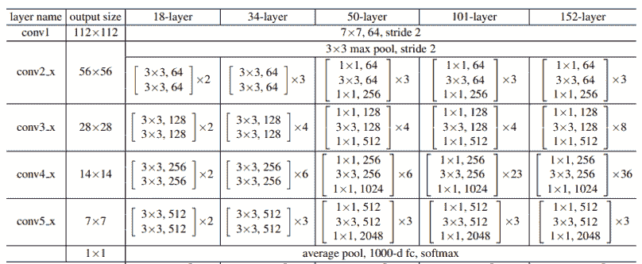

# 在 PyTorch 中设计自定义 2D 和 3D CNNs

> 原文：<https://towardsdatascience.com/designing-custom-2d-and-3d-cnns-in-pytorch-712c4976a4fb?source=collection_archive---------24----------------------->

## 带代码的教程


来源:[维基百科](https://commons.wikimedia.org/wiki/File:WU_Wien,_Library_%26_Learning_Center,_Zaha_Hadid_2.JPG)(知识共享许可)。

本教程基于我的知识库 [pytorch-computer-vision](https://github.com/rachellea/pytorch-computer-vision) ，其中包含 pytorch 代码，用于根据自定义数据训练和评估自定义神经网络。学完本教程后，您应该能够:

*   在 PyTorch 中设计定制的 2D 和 3D 卷积神经网络；
*   了解图像维度、滤镜维度、输入维度；
*   了解如何选择内核大小、步幅和填充；
*   了解 PyTorch 相关的面向对象编程基础；
*   了解如何使用 nn。更好的模型组织顺序。

## **第一步:下载代码。**

包含所有代码的库是[https://github.com/rachellea/pytorch-computer-vision](https://github.com/rachellea/pytorch-computer-vision)

如果您想继续学习本教程和/或使用代码，您应该克隆或下载存储库。想了解更多关于使用 Git 的背景知识，请看[这篇文章](https://glassboxmedicine.com/2020/09/22/how-to-organize-machine-learning-projects-python-git-anaconda-code-and-no-jupyter-notebooks/)。

## **第二步:创建 conda 环境**

在存储库中，有一个 yml 文件 tutorial_environment.yml，它包含了运行教程代码所需的所有依赖项。为了创建包含所有依赖项的 conda 环境，

(a)安装 Anaconda。[https://docs.anaconda.com/anaconda/install/](https://docs.anaconda.com/anaconda/install/)

创造康达环境:

```
conda env create -f tutorial_environment.yml
```

请注意，在 conda 环境中，Python 版本和包版本并不“前沿”,因此该环境应该可以在 Linux、Mac 或 Windows 上工作。关于 Anaconda 的更多背景知识以及它为什么对机器学习项目有用，请看[这篇文章](https://glassboxmedicine.com/2020/09/22/how-to-organize-machine-learning-projects-python-git-anaconda-code-and-no-jupyter-notebooks/)。

# **2D 卷积神经网络**

这篇文章主要关注卷积神经网络(CNN)，它在计算机视觉任务中很受欢迎。关于 CNN 的 5 分钟介绍，见[本帖](https://glassboxmedicine.com/2020/08/03/convolutional-neural-networks-cnns-in-5-minutes/)；更长的介绍见[本帖](https://glassboxmedicine.com/2019/05/05/how-computers-see-intro-to-convolutional-neural-networks/)。

对于许多任务，[使用现有的 CNN 架构是合适的，比如预定义的 ResNet](https://glassboxmedicine.com/2020/12/08/using-predefined-and-pretrained-cnns-in-pytorch-tutorial-with-code/) 。在其他情况下，您可能想要修改现有的 CNN，例如，在使用预训练的卷积特征提取器之后，添加一些定制的卷积层[。最后，也许你想完全从头开始编写自己的 CNN，没有任何预定义的组件。在这篇文章中，你将学习如何在 PyTorch 中构建你自己的 2D 和 3D CNNs。](https://github.com/rachellea/ct-net-models)

## **图像尺寸**

2D CNN 可以应用于 2D 灰度或 2D 彩色图像。2D 图像有 3 个维度:[通道，高度，宽度]。

灰度图像有一个颜色通道，用于不同的灰度。灰度图像的尺寸为[1，高度，宽度]。


胸部 CT 扫描显示气胸。2D 灰度图像(1 个颜色通道)，*例如*尺寸【1，400，500】。来源:[维基百科](https://en.wikipedia.org/wiki/File:Pneumothorax_CT.jpg)(授权:CC)

彩色图像有三个通道，分别用于红色、绿色和蓝色(RGB)。因此，彩色图像的尺寸是[3，高度，宽度]。


沙滩上的萨摩耶。2D 彩色图像(3 个颜色通道)，*例如*尺寸【3400500】。来源:[维基百科](https://commons.wikimedia.org/wiki/File:BeachDog2.jpg)(公共领域)

尽管这些“2D”图像实际上有三个维度(通道、高度、宽度),我们仍然认为它们是“2D ”,因为当它们向人们展示时，只有两个空间维度被明确显示。

## **过滤器尺寸**

一个“2D”CNN 有三维过滤器:[频道，高度，宽度]。关于展示 2D CNN 3D 滤镜的动画，请看[这个链接](https://i.stack.imgur.com/FjvuN.gif)。

接受灰度图像的 CNN 的输入层必须指定 1 个输入通道，对应于输入灰度图像的灰色通道。

接受彩色图像的 CNN 的输入层必须具有 3 个输入通道，对应于输入彩色图像的红-绿-蓝颜色通道。

## **总输入尺寸**

总的来说，一个“2D”CNN 有 4D 输入:[批量大小，频道，高度，宽度]。batch_size 维度索引到一批示例中。一批样本是从整个数据集中选出的样本的子集。该模型一次训练一批。


4D 输入到 2D CNN 的灰度图像示例。图片作者。


示例 4D 输入到 2D 有线电视新闻网的彩色图像。图片作者。

## **在 PyTorch 中定义 2D CNN 图层**

在 PyTorch 中，定义 2D 卷积层的函数是 [nn。Conv2d](https://pytorch.org/docs/stable/generated/torch.nn.Conv2d.html) 。以下是一个图层定义示例:

```
nn.Conv2d(in_channels = 3, out_channels = 16, kernel_size = (3,3), stride=(3,3), padding=0)
```

在上面的定义中，我们定义了 3 个输入通道(例如，3 个输入颜色通道)。out_channels 可以被认为是我们想要在该层中检测的不同模式的数量。一个 CNN 层的 out_channels 的数量将变成下一个 CNN 层的 in_channels 的数量。


解剖 2D CNN 层。图片作者。

## **代号为**的 2D CNN 小品

这是一个 2D CNN 的草图:


2D CNN 小品。图片作者。来自[无线媒体](https://prod-images-static.radiopaedia.org/images/29750156/e41805727ab19df1a8cb0b0b0c2c78_big_gallery.jpeg)的正常 CT 切片

所示的该 CNN 的 2 层的 PyTorch 代码是:

```
self.conv_two_layers = nn.Sequential( 
        nn.Conv2d(in_channels = 1, out_channels = 8, 
                  kernel_size = (2,2), stride=(2,2), padding=0),
        nn.Conv2d(in_channels = 8, out_channels = 16, 
                  kernel_size = (2,2), stride=(2,2), padding = 0))
```

请注意，在本例中，我们的 1 通道灰度输入图像是如何通过第一个 CNN 层的处理转换为 8 通道中间表示的。在由第二 CNN 层处理之后，该 8 声道中间表示变成了 16 声道中间表示。

CNN 的一层中 out_channels 的数量决定了该层的输出中将出现的通道/特征的数量。

## **内核大小(过滤器大小)**

在 CNN 中，内核(过滤器)滑过图像并检测图像中的某些模式。内核检测到的模式取决于内核的权重。反过来，核的权重是在训练过程中学习的。

2D CNN 中的内核大小由高度和宽度指定。下面是几个不同的 kernel_size 选项的可视化。(注意，内核元素的实际数值不太可能像这里显示的值那么大，它们肯定不会是精确的整数——显示这些数字只是为了强调内核是一个有组织的数字集合):


不同内核大小的示例。图片作者。

ResNet 是一种流行的预定义 CNN 架构。在 ResNet 论文中，他们总结了一些 ResNet 架构:



下表显示了几种 ResNet 的 CNN 架构的定义:ResNet-18(“18 层”)、ResNet-34(“34 层”)、ResNet-50(“50 层”)、ResNet-101(“101 层”)和 ResNet-152(“152 层”)。从表中可以看出，3×3 是一个流行的内核大小。

## **1×1 内核/ 1×1 卷积**

从这个表中还可以看出，有时会使用 1×1 内核。乍一看，1×1 卷积似乎没有用，一次只考虑一个元素有什么意义呢？

这里的关键是要记住内核实际上是三维的。您在编写代码时指定了所需的高度和宽度，但是生成的实际内核也将覆盖整个通道维度。几乎在每种情况下，都会有不止一个通道，因此，即使是 1×1 内核也会覆盖不止一个数字。例如，将 1×1 卷积核应用于具有 16 个通道、32 个高度和 32 个宽度的表示，将产生具有 1 个通道、32 个高度和 32 个宽度的输出表示。

(仅存在 1 个通道的一种情况是对于输入灰度图像；然而，这里你不会应用 1×1 内核，因为这没有意义。)

以下是 2×2 内核与 1×1 内核应用于 8 通道表示的对比图:


作者图片

从图中我们可以看到，即使是 1×1 内核也在计算多个数字，在本例中，它涵盖了 8 个数字，每个数字来自 8 个通道。

2×2 内核的整体大小实际上是 2×2×8 = 32。

1×1 内核的整体大小实际上是 1×1×8 = 8。

使用 1×1 卷积有什么意义？重点是组合不同通道/特征的信息，而完全不压缩空间维度。

## **大步流星**

“步幅”是内核的“步长”——它在两次计算之间移动的距离。步幅越大，输出贴图越小。

填充是指附加的数字，通常是零，连接到表示的边界。可以使用填充的原因包括:

*   默认情况下，输入边缘上的像素只与内核边缘交互。如果我们希望每个边缘像素都有机会与内核的任何其他部分进行交互，我们需要使用填充。
*   默认情况下，如果不填充，表示将在空间上变得更小，因为内核始终保持在输入的边界内(参见下面的 gif)。如果我们使用填充，我们可以选择保留整个 CNN 的空间大小。

请注意，填充并不是绝对必要的，许多 CNN 在没有填充的情况下也能正常工作。

[vdumoulin/conv 算术](https://github.com/vdumoulin/conv_arithmetic)有一些很棒的步幅和填充的可视化效果。在这些可视化中，蓝色贴图是输入，青色贴图是输出。这里显示了一些可视化效果:

*没有填料，就没有步伐。*您可以从这个可视化效果中看到，在没有填充的情况下，青色输出小于蓝色输入，因为滤镜没有超出输入的边界。另请注意，“无步长”与“步长为 1”相同，即每次步长为 1 个像素:


*没有填充，是的大步走*。大步意味着过滤器一次“跳跃”预先指定的像素数。这里的步幅为 2，因此滤波器跳过 2 个像素:


*有垫高，无跨步。*你可以看到这里，添加了很多填充。事实上，添加了如此多的填充，以至于青色输出甚至比蓝色输入还要大。这是一个相当大的填充量，在实践中并不常用，但它有利于说明:


*是的填充，是的大步走。*在这个例子中，填充和步幅都被使用。


以上 4 个 gif 是 vdumoulin 的 2016 版权所有，可在 MIT 许可下使用(免费使用、复制、发布和分发)。请访问 [vdumoulin/conv 算术](https://github.com/vdumoulin/conv_arithmetic)查看填充、步长、转置卷积和扩张卷积的其他动画。

## **选择内核大小、步长和填充**

通常选择相同的内核大小和步距

*   kernel_size=(1，1)和 stride=(1，1)
*   kernel_size=(2，2)和 stride=(2，2)
*   kernel_size=(3，3)和 stride=(3，3)

然而，内核大小和步幅不必相同，内核大小也不必如此之小。例如，GoogLeNet 包括具有以下组合的层(参见[本文](https://arxiv.org/pdf/1409.4842.pdf)，表 1):

*   kernel_size=(7，7)和 stride=(2，2)
*   kernel_size=(3，3)和 stride=(2，2)
*   kernel_size=(3，3)和 stride=(1，1)
*   kernel_size=(7，7)和 stride=(1，1)

流行的内核大小包括(3，3)，(5，5)，有时是(7，7)。

PyTorch 中的默认填充为 0，即没有填充。

关于内核大小、步幅和填充的其他观点，请参见[“卷积神经网络填充和步幅的简明介绍”](https://machinelearningmastery.com/padding-and-stride-for-convolutional-neural-networks/)

# **3D 卷积神经网络**

## **图像尺寸**

3D CNN 可以应用于 3D 图像。有许多不同种类的 3D 图像，包括视频和医学图像，如 CT 扫描或磁共振成像。3D 图像有 4 个维度:[通道、高度、宽度、深度]。


狗飞奔的视频。来自[维基百科](https://commons.wikimedia.org/wiki/File:Dog_galloping_slow_motion.gif)(公共领域)。该灰度视频具有 1 个颜色通道、2 个空间维度(高度 x 宽度)和 1 个时间维度，总共 4 个维度。


扑翼飞机的视频。来自[维基百科](https://commons.wikimedia.org/wiki/File:Skybird.gif)(公共领域)。该彩色视频具有 3 个颜色通道、2 个空间维度(高度 x 宽度)和 1 个时间维度，总共 4 个维度。


CT 扫描体积图像。来自[维基百科](https://commons.wikimedia.org/wiki/File:Computed_tomography_of_human_brain_-_large.png)(知识共享许可)。CT 扫描是“非堆叠的”,因此有可能一次欣赏所有 3 个空间维度。这种 CT 有 1 个彩色通道(灰色)和 3 个空间维度(高 x 宽 x 深)。

## **过滤器尺寸**

一个 3D CNN 过滤器有 4 个维度:[通道，高度，宽度，深度]。

## **总体输入尺寸**

3D CNN 具有 5 维输入:[批量大小、通道、高度、宽度、深度]。

## **在 PyTorch 中定义 3D CNN 图层**

PyTorch 中定义 3D CNN 层的函数是 [nn。Conv3d](https://pytorch.org/docs/stable/generated/torch.nn.Conv3d.html) 。示例:

```
nn.Conv3d(in_channels = 3, out_channels = 16, kernel_size = (3,3,3), stride=(3,3,3), padding=0)
```

请注意，这与定义 2D CNN 层非常相似，只是我们可以为内核定义 3 个维度，为步幅定义 3 个维度。

注意，这些维度都不需要相同——如果我们愿意，我们可以将 kernel_size 定义为(1，2，5 ),将 stride 定义为(2，4，3 )(尽管很难想出选择这种看似随机的内核大小和步数的原因)。

如同 3D CNNss 一样，在 3D CNN 中，通常选择相同的核大小和步距。

这是一个展示 3D CNN 的 4D 过滤器的插图。这是一个输入为医学图像的示例，我们提取了 512 个不同的特征，其中每个特征的维度对应于输入的 3D 维度(右/左、前/后和上/下=颈/胸/腹):


作者图片

# **py torch 中完整 2D CNN 的结构**

这是 PyTorch 中一个功能齐全的小型自定义 2D CNN，您可以将其作为自己自定义 CNN 的起点:


作者图片

此代码可从[这里](https://github.com/rachellea/pytorch-computer-vision/blob/master/models/custom_models_base.py)获得。所有模型定义都可以在 models/custom_models_base.py 中找到。(将重复使用的网络存储在单独的模块中通常很方便。例如，如果您有一组要在许多不同模型中使用的卷积层，您可以将该组层存储在 components.py 中。)

# 【PyTorch 模型的面向对象编程

如果您不是面向对象编程方面的专家，不要担心——为了开始在 PyTorch 中构建自己的 CNN，您不需要了解太多。本节涵盖了您需要了解的关于面向对象编程的一切，以便成功地构建您自己的 CNN。

首先让我们看看 TinyConv 内部的方法。要在 PyTorch 中定义 CNN，至少需要两个方法:一个叫做 __init__()另一个叫做 forward()。

__init__()定义模型的层。从技术上讲，这些层不必按照任何特定的顺序来定义，但是如果按照它们被使用的顺序来定义，视觉效果会更好。

forward()定义了模型应该如何计算输入 x。注意，我们已经将 x 传递给 forward，as forward(self，x)。如前所述，输入“x”对于 2D CNN 是 4 维的[批处理大小，通道，高度，宽度]，对于 3D CNN 是 5 维的[批处理大小，通道，高度，宽度，深度]。

## **类和对象**

下图总结了类、对象和属性:


作者图片

PyTorch 中的每个 CNN 都是用一个“类”定义的——因此代码的第一行定义了“class TinyConv(nn。模块)”。

单词“方法”仅仅意味着“在类内部定义的函数”

TinyConv 是类的名称。该类可以随意命名，甚至可以命名为 superawesomemodeltsolveeverything。

如果我们使用这个类来创建一个模型的实例，我们实际上将使用它来进行[训练、验证和测试](https://glassboxmedicine.com/2019/09/15/best-use-of-train-val-test-splits-with-tips-for-medical-data/)，例如通过运行下面这行代码:

```
mymodel=TinyConv()
```

那么这个实例“我的模型”就被称为“对象”“对象”是一个类的实例。

## **属性**

在 TinyConv 的 __init__()方法中，我们定义了 self.conv 和 self.fc。这些属性定义了构成模型的层。

单词“self”使这些属性可以在 TinyConv 中的任何地方被访问，而不需要显式地将它们作为参数传入。你需要在一些地方使用“自我”:

*   作为所有方法的参数:__init__(self)和 forward(self，x)
*   定义所有属性时:例如 self.conv = something
*   当您使用任何属性时，例如 x = self.conv(x)

面向对象编程的一个优点是你不必像传递参数一样传递那么多的“东西”，因为我们可以直接使用属性。

## **继承**

通过查看最上面一行，您会注意到，class TinyConv(nn。Module)我们正在使用“nn.Module”，nn 是什么？模块？


作者图片

nn。模块是 PyTorch 中所有神经网络的“基类”。在 PyTorch 文档中，你可以在这里阅读更多关于 T2 的内容。简单来说，nn。模块为您的定制模型提供了大量的功能，包括允许您的模型跟踪其可训练参数，并允许您在 CPU 和 GPU 之间切换模型。

你不需要担心通读 nn.Module 的所有代码。你需要做的就是确保你的定制模型“继承”nn.Module。当你的模型“继承”nn 时。模块，您的模型将获得 nn。模块提供。

继承就像贴 nn 一样简单。模块，如 TinyConv 示例所示。

类 TinyConv()不从 nn 继承。模块，并且不会工作。

类 TinyConv(nn。模块)确实继承自 nn。模块，并将正常工作。

为了使继承正常工作，您需要的另一部分是这行代码:

```
super(TinyConv, self).__init__()
```

在这里，您可以将“TinyConv”替换为您为定制模型指定的任何名称。

关于 super()在做什么的更多细节，可以看这些参考资料: [ref1](https://www.w3schools.com/python/ref_func_super.asp) 、 [ref2](https://discuss.pytorch.org/t/is-there-a-reason-why-people-use-super-class-self-init-instead-of-super-init/15891) 、 [ref3](https://www.programiz.com/python-programming/methods/built-in/super)

# **用神经网络组织模型。顺序**

你会注意到在 TinyConv 中，我们使用了一个叫做 nn.Sequential. nn 的东西。PyTorch 提供了 Sequential 来帮助组织神经网络的层。这里是同一个 TinyConv 网络，定义时使用和不使用 nn。顺序:


作者图片

你也可以在这里查看 TinyConv 和 TinyConvLessOrganized [的代码。](https://github.com/rachellea/pytorch-computer-vision/blob/master/models/custom_models_base.py)

技术上来说 nn。不一定要使用顺序——但最好使用它，因为它有助于保持代码更有组织。

# **代码演示:微小数据上的微小 CNN(在 CPU 上运行)**

您可以使用这个库中的代码运行几个定制 CNN 的演示。要运行演示，您需要做的就是更新演示文件中的路径，以指定您想要存储结果和数据的位置。

演示 1 将在微小的数据上训练和评估一个微小的 CNN，特别是 CNN“tinyconvewithetsequential ”,这是上面显示的模型，其中 NN。不使用顺序。请注意，这个 CNN 和数据集非常小，因此您应该可以在任何计算机上运行 Demo 1，包括带有小 CPU 且没有 GPU 的小型笔记本电脑。

要运行演示 1，请更新 Demo-1-tinyconvewithoutsequential-tiny data . py 中的结果路径，然后在一个解释器中运行下面的命令，该解释器具有本文开头描述的 conda 环境:

```
python Demo-1-TinyConvWithoutSequential-TinyData.py
```

演示 2 将在微小的数据上训练和评估一个微小的 CNN，特别是模型“TinyConv”，如上所示，它使用了 nn.Sequential。

下面是如何运行演示 2:

```
python Demo-2-TinyConv-TinyData.py
```

如果您看一下演示代码，您可以看到正在使用的模型和数据集被定义为演示配置的一部分。这意味着您可以轻松地换入您自己的模型和数据集，并使用这些代码来训练、评估和测试您感兴趣的问题。

# **代码演示:更大数据上的更大 CNN(需要 GPU)**

演示 3 将在[的 PASCAL VOC 2012 自然图像数据集](http://host.robots.ox.ac.uk/pascal/VOC/voc2012/)上训练和评估 CNN，使用一个带有在 ImageNet 上预先训练的 VGG-16 特征提取器的模型。要运行这个演示，您可能需要使用 GPU。

```
python Demo-3-VGG16-PASCAL.py
```

最后，演示 4 将使用带有 VGG-16 特征提取器的模型，在 PASCAL VOC 2012 数据上训练和评估几个不同的 CNN 变体。在 VGG 特征提取器之后，不同的 CNN 具有稍微不同的层。一些 CNN 使用在 ImageNet 上预先训练的特征提取器，而其他的使用随机初始化的特征提取器。

```
python Demo-4-VGG16Customizable-PASCAL.py
```

请注意，为了运行演示 3 或演示 4，您需要取消演示文件中的一些代码的注释，以下载 PASCAL VOC 2012 数据集。下载完数据后，您可以重新注释这些代码行并运行演示。

# **使用 src/run_experiment.py** 进行训练、评估和测试

模块 [src/run_experiment.py](https://github.com/rachellea/pytorch-computer-vision/blob/master/src/run_experiment.py) 包括实际运行实验的所有核心代码。run_experiment.py 提供了一个类来训练、评估和测试不同的模型。你可以传入任何数据集，也可以传入任何用[多标签分类交叉熵损失](https://glassboxmedicine.com/2019/05/26/classification-sigmoid-vs-softmax/)训练的模型。(如果您看一下代码，也可以直接将交叉熵损失替换为您想要的任何类型的损失。)run_experiment.py 还包括重新启动已经崩溃的模型的功能，提前停止的代码，以及性能指标 [AUROC 和平均精度](https://glassboxmedicine.com/2020/07/14/the-complete-guide-to-auc-and-average-precision-simulations-and-visualizations/)的计算(通过导入 evaluate.py)。

run_experiment.py 的几个关键部分包括这些方法:

*   运行模型(第 166 行)
*   火车(206 线)
*   有效(第 213 行)
*   测试(第 243 行)
*   iterate _ through _ batches(258 行)

run_model()初始化模型(第 167 行)，初始化优化器(第 172 行)，然后执行指定的任何任务—“train _ eval”(在训练集上训练并在验证集上评估)、“restart_train_eval”(在模型崩溃后重新开始训练/验证)、“predict_on_valid”(在验证集上进行预测)或“predict_on_test”(在测试集上进行预测，这[应该仅在模型开发完成](https://glassboxmedicine.com/2019/09/15/best-use-of-train-val-test-splits-with-tips-for-medical-data/)后进行)。

train()将模型置于“训练模式”(第 207 行)，然后通过调用 iterate_through_batches 进行实际的训练。它还调用函数来保存丢失的值以用于日志记录，并绘制性能度量(第 210 行)。

valid()与 train()类似，只是它指定模型应该处于评估模式(第 214 行)，并且还确保不会计算任何梯度(第 215 行)。它还执行早期停止检查。早期停止是一种基于验证集上的性能停止训练的技术。你可以在这里阅读更多关于早停[的内容。](https://machinelearningmastery.com/early-stopping-to-avoid-overtraining-neural-network-models/)

test()将加载一个保存的模型，并使用该保存的模型对测试集进行预测，并计算测试集性能。

最后，iterate_through_batches()提供了训练、验证和测试过程的核心——它支持遍历数据集并将数据提供给模型。在训练期间，数据上的预测将与实际情况进行比较，以便更新模型的参数。在验证和测试期间，模型将用于对验证或测试数据进行预测。

在 iterate_through_batches()中，我们存储每个批次的预测概率和基本事实，以便在一个时期结束时(即，当我们检查完数据集的所有批次时)，我们可以计算整个时期的整体性能指标。一个关键的技巧是，只使用预先分配的 numpy 数组来存储批次间的预测概率和基本事实。使用预分配的数组(第 263–266 行)可以更好地利用内存。我根据经验发现，使用 numpy 数组串联(而不是预先分配的 numpy 数组)会导致疯狂的内存碎片，并降低训练速度，尤其是在批量很小时。如果 Python 垃圾收集器正确地处理掉了旧的 numpy 数组，那么串联实际上不应该是一个大问题…但是在任何情况下，我已经看到了在一些不同的设置中发生的串联内存问题，这就是为什么我现在总是使用预分配的 numpy 数组来跨批存储预测和基本事实。

# **构建定制 CNN 的技巧**

*   如果您正在构建一个分类 CNN，通常如果您使用预训练的卷积特征提取器，而不是完全从零开始构建的 CNN，您将获得更好的性能或至少更快的收敛。你可以使用一个预先训练好的特征提取器，然后是定制层，如示例模型[vgg 16 可定制](https://github.com/rachellea/pytorch-computer-vision/blob/master/models/custom_models_base.py)所示。
*   您要在一个图层中使用的滤镜数量在概念上类似于您要在该图层中检测的“模式”数量。
*   一层中的滤波器数量定义为该层的 out_channels 数量。
*   层的入通道数等于(a)输入图像中的通道数(如果是第一层),或者(b)对于 CNN 中的后续层，层的入通道数等于前一层的出通道数。

## **从卷积层过渡到全连接层的技巧**

*   如果要从卷积层过渡到全连通层，首先需要扁平化表示:[batch_size，channels，height，width]必须变成[batch_size，channels*height*width]。例如，[batch_size，64，4，4]必须变成[batch_size，1024]。这个展平步骤的一个例子显示在第 128 行[这里](https://github.com/rachellea/pytorch-computer-vision/blob/master/models/custom_models_base.py)通过 x = torch.flatten(x，start_dim=1，end_dim=-1)行。
*   请注意，全连接图层的输入维度需要等于您将输入到该全连接图层的输入数据的实际大小。你可以在前一个卷积层的输出的基础上计算这个输入维度，这将需要[一点算术来计算出那个卷积层的输出形状应该是基于所有在前层的](https://glassboxmedicine.com/2020/12/08/using-predefined-and-pretrained-cnns-in-pytorch-tutorial-with-code/)。或者，如果你想节省时间并跳过算术运算，你可以只为完全连接的层输入指定一些任意的维度，让模型崩溃，然后检查展平步骤输出的实际形状，以了解你需要什么形状作为完全连接的层的输入形状(这在使用 [pdb，Python 调试器](https://glassboxmedicine.com/2020/09/22/how-to-organize-machine-learning-projects-python-git-anaconda-code-and-no-jupyter-notebooks/)时效果最好)。
*   从卷积层过渡到全连接层时要小心。如果试图指定一个太大的完全连接的图层，很容易就会耗尽内存。如果需要减少全连接层的输入大小，可以尝试(a)通过指定较小的 out_channels 数量或使用后续的 1×1 卷积来减少前一卷积层的通道数量，(b)增加前一卷积层的滤波器大小和步幅，添加自适应平均池或最大池等池操作，或者(d)简单地添加几个无填充的卷积层，使表示更小。

# **构建定制 CNN 的清单**

*   你在你的第一层中选择了正确的输入通道数吗？(1 用于灰度输入，3 用于彩色输入)
*   您是否确保了特定卷积层的输入通道等于前一个卷积层的输出通道？
*   您是否记得在您的 CNN 模型定义中定义了 __init__()和 forward()方法？
*   您是否记得将“self”指定为 __init__()和 forward()方法的参数？
*   您是否记得在 __init__()中定义的、您希望在 forward()方法中使用的任何属性的名称前使用“self”？如 self.conv2d，self.fc，self.first_conv，self.classifier…
*   您是否记得从 forward()方法返回一些东西，以便您的模型实际上发出它的最终预测？
*   你记得继承 nn 吗？模块，方法是使用语法“模型的类名(nn。模块)”定义你的模型的时候？
*   有没有记得更新 line super(NameOfModel，self)。_init_()与您的模型的实际名称，以便继承正常工作？如果这个超级行与您在定义类时选择的名称不匹配，您将遇到一个错误。

# **总结**

PyTorch 让你可以自由定义任何你喜欢的 CNN 模型。在本教程中，我们介绍了 [pytorch-computer-vision](https://github.com/rachellea/pytorch-computer-vision) 库，用于在任何数据集上训练、验证和测试任何定制 CNN。我们已经概述了图像/内核/输入维度、CNN 结构、内核大小、步幅、填充、一些面向对象的编程，以及 PyTorch CNN 模型定义的关键组件。

快乐造型！

*原载于 2021 年 2 月 6 日 http://glassboxmedicine.com*<https://glassboxmedicine.com/2021/02/06/designing-custom-2d-and-3d-cnns-in-pytorch-tutorial-with-code/>**。**