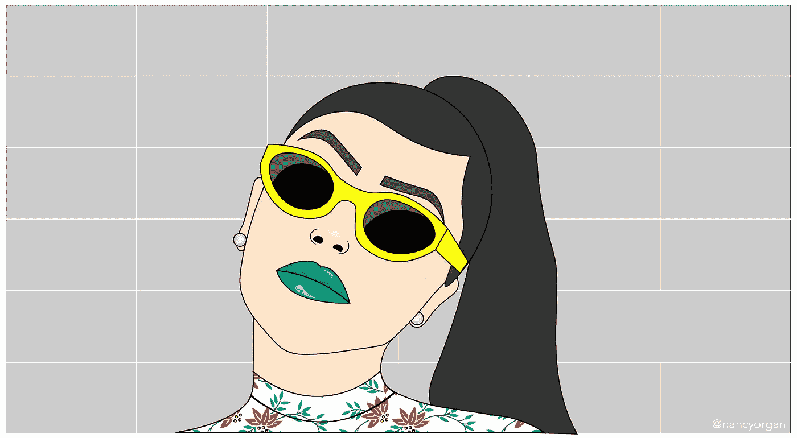
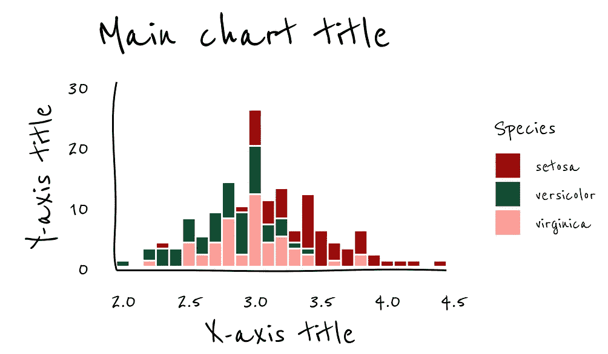

# 设计自定义 ggplot2 主题

> 原文：<https://towardsdatascience.com/designing-custom-ggplot2-themes-65fb4b86d925?source=collection_archive---------25----------------------->

## 给你的图表一种态度



作者的原创艺术

R 与 Python 的辩论是数据科学家最喜欢的话题。然而，当谈到数据可视化时，*your truly*有一个非常明确的偏好:`ggplot2`in R all way。

除了数据处理和格式化的便利性，`ggplot2`在它的可定制性方面表现出色。默认设置看起来很棒，虽然非常独特，但是通过一点规划，你完全可以改变可视化效果，以适应任何可以想象的审美。在这篇文章中，我将介绍如何创建一个自定义的`ggplot2`主题，可以应用到你的图表中。

# 重要的事情先来

打开一个新的 R 脚本，它将包含您的定制。为了使您的设置可用，您将在构建任何可视化之前运行该脚本。你也可以把它打包成一个库，尽管这不是绝对必要的。

确保加载必要的库。这里没有什么令人惊讶的，只是确保`ggplot`和`scales`在你做任何其他事情之前被载入。

```
library("ggplot2")
library("scales")
```

# 字体

新字体，新的你。对吗？在图形中使用自定义字体有几种选择。

第一种选择是使用你机器上已经有的字体。要访问它们，加载`extrafont`库并将所有字体导入 r。警告:这很慢。一旦你运行了`font_import()`，把它注释掉，不要管它。如果你不确定哪些字体是可能的，使用`system_fonts()`查看列表。

```
library("extrafont")
font_import() # only run this once then comment out. It's slow!
extrafont::loadfonts()library("systemfonts")
system_fonts() # shows you available fonts
```

第二个选择是添加谷歌字体。`showtext`库将允许您使用`font_add_google()`功能从谷歌字体页面导入字体。在这个例子中，我导入了 *Reenie Beanie* 字体以获得有趣的手写效果。

```
library("showtext")
## Loading Google fonts ([https://fonts.google.com/](https://fonts.google.com/))
graphFont = "Reenie Beanie"
font_add_google(graphFont)
```

# 主题

在正常情况下，您可能会使用`theme()`参数对默认设置进行小的更改。因为`ggplot2`是分层的，将`+theme()`添加到可视化的末尾将覆盖任何之前的设置。

我们可以通过定义一个定制的主题来利用这种行为，该主题可以添加到任何可视化的末尾。这意味着你甚至可以回到旧的工作，应用你的新主题来实现一个一致的投资组合。在这个例子中，我定义了一个简单的主题，将所有的文本变成黑色，指定各种背景填充，并设置字体。不带运行`theme`*R 中的括号会显示所有可能的主题选项。*

```
theme_custom = function(){
  theme(
    panel.background = element_blank(),
    panel.grid = element_blank(),
    axis.ticks = element_blank(),
    axis.text = element_text(color = "black"),
    legend.box.background = element_blank(),
    legend.key = element_rect(fill = NA),
    text = element_text(graphFont),
    plot.title = element_text(size = 16)
  )
}
```

# 色阶

设置颜色预先计划的色阶可以节省大量时间——告别猜测你上次使用的洋红色的阴影。我喜欢用 [coolors](https://coolors.co/) app 创建调色板，然后创建一个十六进制代码的矢量。

请记住，您需要为`scale_color_manual()`和`scale_fill_manual()`设置一个比例，以说明不同的几何图形。

```
pal_custom = c("#9e0a0a", "#115035", "#ff9e97", "#f6cb4c")### Scales 
custom_color_manual = function(){
  scale_color_manual(values = pal_custom)
}
custom_fill_manual = function(){
  scale_fill_manual(values = pal_custom)
```

# 自定义几何图形

如果您希望特定类型的图形具有特定的行为，那么定制 geoms 是一种不错的方法。`update_geom_defaults()`功能完成了这个任务。在这些例子中，我要求点的大小至少为 3，条的轮廓为白色，线的大小为 1。

```
update_geom_defaults("point", list(size = 3))
update_geom_defaults("bar", list(color = "white"))
update_geom_defaults("line", list(size = 1))
```

# 分层主题

如果一个主题还不够，你可以将主题分层。例如，如果你只是对一个现有的 `[ggplot](https://ggplot2.tidyverse.org/reference/ggtheme.html)` [主题](https://ggplot2.tidyverse.org/reference/ggtheme.html)做一些小的改动，你可以先运行原来的，然后再添加你的改动。

在这个例子中，我使用了 Emilio Torres-Manzanera 的 xkcd 主题来实现轴的手绘外观，然后在最后应用了我的自定义主题。

```
ggplot(data=iris, aes(x=Sepal.Width)) + 
  geom_histogram(binwidth=0.1, aes(fill=Species)) + 
  custom_fill_manual() + 
  xlab("X-axis title") +  
  ylab("Y-axis title") + 
  ggtitle("Main chart title") + 
  theme_xkcd() +
  xkcdaxis(range(iris$Sepal.Width),range(c(0, 30)))  + 
  theme_custom()
```

# 之前和之后

这个特殊的主题可能不适合你，但它肯定不同于默认的外观:



默认 ggplot2 主题(左)与自定义主题(右)的对比

# 测试

为你的可视化建立一个定制的美学需要一些迭代和测试。我建议构建一些测试视觉效果，可以在更新主题时运行——这将让您预览不同图表类型的效果。拥有少量的测试图也可以让你进行可访问性检查，并确保你的主题是用户友好的。我使用 [Sim Daltonism](https://apps.apple.com/us/app/sim-daltonism/id693112260?mt=12) 应用来评估调色板，使用 [Accessibility Insights](https://accessibilityinsights.io/en/downloads/) 扩展来检查网页元素。

knitter(`.Rnw`)或 R Markdown ( `.Rmd`)脚本非常适合测试，因为它可以很容易地重新编译以生成一个可共享的文档。像这样简单的事情就能达到目的:

```
\documentclass[a4paper]{article}
\begin{document}<<projections, include=FALSE, cache=FALSE>>==
source("branding.R")
opts_chunk$set(dev='cairo_pdf')
@<<renderimage, echo = FALSE, fig.height = 3, fig.width = 5, fig.align='center'>>==ggplot(data=iris, aes(x=Sepal.Width)) + 
  geom_histogram(binwidth=0.1, aes(fill=Species)) + 
  custom_fill_manual() + 
  xlab("X-axis title") +  
  ylab("Y-axis title") + 
  ggtitle("Main chart title") + 
  theme_xkcd() +
  xkcdaxis(range(iris$Sepal.Width),range(c(0, 30)))  + 
  theme_custom()@\end{document}
```

就是这样！我希望这能给你一些如何为自己的`ggplot2`作品创建自定义主题的想法。从小处着手，看看什么有效，然后在此基础上进行构建。你的图表很快就会引人注目。

思考数据可视化中的可访问性？太好了！以下是一些开始的方法:

[](/an-incomplete-guide-to-accessible-data-visualization-33f15bfcc400) [## 易访问数据可视化的不完整指南

### 做得更好的实用技巧。

towardsdatascience.com](/an-incomplete-guide-to-accessible-data-visualization-33f15bfcc400)