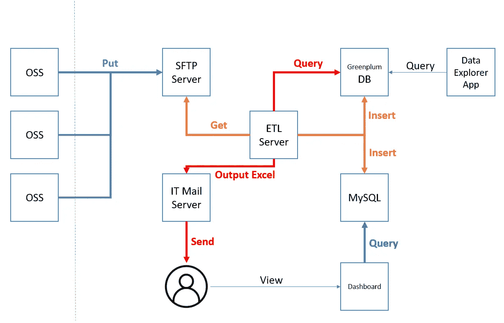
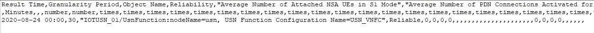
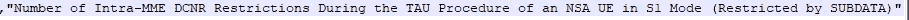
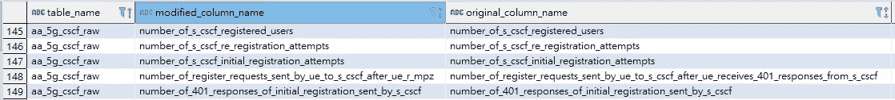
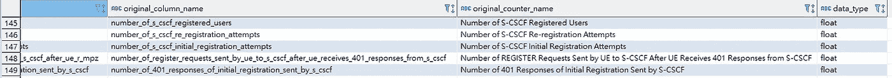

# 使用 Apache 气流设计电信性能测量的数据管道系统

> 原文：<https://towardsdatascience.com/designing-data-pipeline-system-for-telco-performance-measurement-3fa807dbd009?source=collection_archive---------45----------------------->

## [实践教程](https://towardsdatascience.com/tagged/hands-on-tutorials)

## 为绩效监控建立自动报告系统


照片由在 [Unsplash](https://unsplash.com?utm_source=medium&utm_medium=referral) 上拍摄

最近，我为一个新部署的 5G 移动网络设计了一个数据管道系统，用于网络性能监控。我想分享我是如何设计的，我使用过的工具，以及对原始数据的一些特殊处理。

首先，并非所有人都来自电信行业，让我们了解一下什么是绩效管理。

# 性能管理

性能管理(PM)是由电信管理网络(TMN)定义的功能。它负责监控、分析和控制网络性能。性能管理是通过定期收集网络、设备、功能、服务或其他对象的性能数据，并集中存储和管理收集的数据来实现的。负责操作这些任务的系统称为操作支持系统(OSS)。

# 数据流



简化系统图。这张和下面所有的图都是作者准备的。

1.  OSSs 定期通过北向接口将 CSV 文件上传到 SFTP 服务器。
2.  ETL 服务器从 SFTP 服务器获取 CSV 文件，将其转换并插入 Greenplum DB 和 MySQL。
3.  基于原始数据在 Greenplum DB 和 MySQL 上创建关键性能指数(KPI)视图。
4.  仪表板从 MySQL 的视图中查询 PM KPI 数据。
5.  对于报告生成，ETL 服务器从 Greenplum DB 的视图中查询 PM KPI 数据，修改 Excel 模板的数据页，并将报告发送给收件人。
6.  由 [Streamlit](https://www.streamlit.io/) 构建的 Data Explorer 应用程序直接查询 Greenplum DB。

# 数据准备

## 数据格式



CSV 样本



由特殊字符组成的列名

结果时间:这是收集时间。
粒度周期:测量任务的采样间隔，单位为分钟。
对象名称:被测网元及功能。
可靠性:这个测量是否可靠。
之后各种计数器。

## 处理特殊字符

正如您在图片中看到的，在列名中有空格、大写字母、小写字母，甚至还有特殊字符，如 *()-/* 。在数据库列中使用空格和特殊字符不是一个好主意，我们需要在使用下面的代码将数据插入数据库之前处理它们。

```
counter_column_mapping = {}for counter in df.columns:
    column_name = ''.join(e if e.isalnum() else "_" for e in counter).lower()
    counter_column_mapping[column_name] = counter
    df.rename(columns={counter: column_name}, inplace=True)
```

对于每个列和字符，我们检查它是否是一个字母或数字，如果不是，我们将其更改为 _。然后使所有字符小写。

## 表列名映射

OSS 输出数据文件的一个棘手的特性是列的数量是可变的。这种变化可能是由网络元件的软件升级引起的。可以添加新的计数器和移除旧的计数器。有时，计数器名称可能会改变。如果我们需要在每次软件升级时手动更改数据库模式，这将是乏味且容易出错的。因此，我们设计了一个自动处理列修改的过程。

我们创建一个名为 table_column_name_mapping 的表，并将修改后的列名和原始的计数器名映射存储到数据库中，以便进一步处理。我们每次都检查这个表，以验证数据文件中是否有新的列。如果在数据文件中发现了新列，我们首先将新列添加到相关的表中，然后插入数据。



表 _ 列 _ 名称 _ 映射(1)



表 _ 列 _ 名称 _ 映射(2)

## 修剪列名长度

一些计数器名称超过 63 个字符，不符合我们的数据库限制。我们通过将字符串缩减为 59 个字符并在字符串末尾添加三个随机选择的字母来防止重复的列名，从而解决了这个问题。(见上图第 148 行)

```
for col in df.columns:
    if not col in mapping_col.original_column_name.tolist():
        if len(col) > 63:
            while True:
                new_col = col[:59] + '_' + ''.join(random.choice(string.ascii_letters.lower()) for x in range(3))
                if len(mapping_col[mapping_col.modified_column_name == new_col].values) == 0:
                    break
            df.rename(columns={col: new_col}, inplace=True)
        else:
            new_col = col
```

# 提取、转换和加载(ETL)

我使用[气流](https://airflow.apache.org/)构建了 ETL 管道。在其官方网站上，它声明 Airflow 是一个由社区创建的平台，用于以编程方式创作、调度和监控工作流。它使用标准的 Python 特性来创建工作流，包括用于调度的日期时间格式和用于动态生成任务的循环。

我最喜欢的 Airflow 特性之一是，您可以通过一个强大的现代 web 应用程序来监控、调度和管理您的工作流。我可以全面了解已完成和正在进行的任务的状态和日志。


DAG 运行状态

我为数据插入构建了三个重要的 Dag，分别是“sensor”、“insert_data”、“create_view”。传感器 DAG 会定期检查 SFTP 服务器是否有新的 CSV 文件，并通过 API 触发 insert_data DAG。

在下面的链接中找到更多关于 Airflow REST API 的信息。

  

有一个名为 sense_master 的表，用于存储“**传感器**检测到并触发“插入数据”过程的所有文件名。每隔 5 分钟，传感器会将 SFTP 服务器目录中的文件列表与数据库表中存储的文件列表进行比较。它将需要处理的文件名传递给 insert_data DAG。

**insert_data** DAG 然后执行数据准备并插入到数据库中相应的表中。

**create_view** 使用公式表创建 KPI 的视图。KPI 是根据收集的原始计数器计算的。让我们看看下面的例子。KPI“CSCF 成功初始注册 UE 原因的比率”通过以下公式使用四个原始计数器值进行计算。

```
SUM(Number of S-CSCF Successful Initial Registrations + Number of 401 Responses of Initial Registration Sent by S-CSCF — Number of REGISTER Requests Sent by UE to S-CSCF After UE Receives 401 Responses from S-CSCF)/NULLIF(SUM(Number of S-CSCF Initial Registration Attempts), 0) * 100
```

同样，KPI 和公式之间的映射存储在数据库中，并在每次触发 create_view 时进行查询。

## 报表生成

对于报告生成，Excel 报告模板中有几个隐藏的“数据页”。图表链接到相应的数据页面。“**daily _ report**”DAG 查询相应的视图并自动替换数据。然后将生成的 Excel 报告以附件的形式发送给电子邮件收件人列表。

我用来操作 Excel 的 Python 库叫做 **openpyxl** 。我所做的基本上是将从数据库视图中读取的整个数据帧复制到 Excel 表中。如果你们感兴趣，我可以写另一篇关于如何使用 openpyxl 用 Python 操作 Excel 的文章。

# 未来的改进

这个数据管道系统此时是同步的。传感器通过 API 请求直接触发 insert_data DAG。它不是一个分离的架构，因为一个流程故障可能导致整个系统的故障。在我们的示例中，如果 Greenplum DB 长时间失败，并且 insert_data 达到其重试限制，数据将会丢失，因为传感器已经“检测”到数据文件，它将不会再次触发该过程。

更好的方法是事件驱动架构。传感器找到需要处理的新数据文件后，会向事件总线发送一条消息。insert_data DAG 从事件总线中提取并处理它需要处理的任何数据。在这种情况下，如果 Greenplum database 出现故障，数据插入不会完成，但消息/事件仍包含在事件总线中。一旦数据库恢复，需要处理的数据文件被再次提取并插入数据库。

我还在学习事件驱动架构。我希望将来我能构建一个事件驱动的架构，并再次与大家分享。

如果您想了解更多关于 Apache Airflow 的知识，Udemy 上有一个很好的课程，可以教授 Airflow 的基础知识，还可以动手构建数据管道。如果您有兴趣，请参考以下附属链接:

<https://click.linksynergy.com/deeplink?id=0wsuN4lypZM&mid=39197&murl=https%3A%2F%2Fwww.udemy.com%2Fcourse%2Fthe-complete-hands-on-course-to-master-apache-airflow%2F>  <https://click.linksynergy.com/link?id=0wsuN4lypZM&offerid=916798.19111388448&type=2&murl=https%3A%2F%2Fwww.coursera.org%2Flearn%2Fetl-and-data-pipelines-shell-airflow-kafka> 