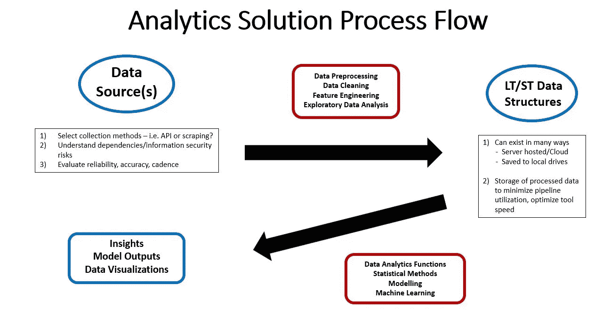

# 用 R 语言设计和实现 NFL 分析工具

> 原文：<https://towardsdatascience.com/designing-implementing-an-nfl-analytics-tool-in-r-3532034b7ff2?source=collection_archive---------19----------------------->

## 让自己在日常生活中运用分析技巧


戴夫·阿达姆松在 [Unsplash](https://unsplash.com?utm_source=medium&utm_medium=referral) 上拍摄的照片

作为一名数据科学专业人员，我欣赏分析工具的设计和实施，这些工具为组织内的关键利益相关者提供数据驱动的见解。这些工具的结构和功能各不相同，从嵌入在业务报告应用程序中的生产级机器学习系统，到针对半常规用例跨多种编程语言手动执行的脚本。不管一个工具看起来像什么，创造和开发的过程是这些工具成功背后的驱动力，可以应用于商业和娱乐。随着 2021 年国家橄榄球联盟赛季的开始，我决定建立一个解决方案，让我能够灵活地分析 NFL 的比赛数据，以收集见解。通过这个，我希望展示一些我在职业生涯中使用的成功实践。我很感激对这篇文章内容的任何评论。

你可能会觉得有趣的是，我将在这个项目中使用 R。目前，Python 似乎是数据科学和分析专业人士首选的主要编程语言；以至于有些文章甚至觉得没有必要明确指出他们是在用 Python 编码。我相信这两种语言都为我可能会在这里做的绝大多数事情提供了很好的解决方案，而且在 [dplyr](https://dplyr.tidyverse.org/) 被创造出来之前我就已经在使用 R 了，所以我对它更加得心应手。可能的话，我会用不同的方式来计算事物，以展示语言的多样性。最后，我在 PC 上通过 RStudio 使用 R 4.0.4。

让我们从确定项目范围和目的开始。

## **定义目的&分析解决方案的范围**

对项目范围的全面考虑将引出分析解决方案的目的。在这个发现阶段，我向组织提出的一些问题包括:

*   用例影响哪些业务部门？
*   谁是解决方案的最终用户或消费者？这些观众的专业技术水平如何？
*   该解决方案要解决的关键难点是什么？
*   对关键利益相关者来说，成功是什么样的？
*   需要哪些数据？需要外部获取吗？
*   这是一次性的事情，还是一个重复的过程？
*   什么类型的定量工具可以增加价值而不牺牲效用？



图一。作者图片

我还考虑任何项目的高级过程流，以识别核心结构和功能。通常，分析解决方案从数据源开始。提取、转换、预处理和特征工程被执行以“清洗”数据流；这包括操作和网络安全方面的考虑。探索性数据分析将确定数据完整性和准确性问题。一旦完成这些步骤(有时不止一次)，清理后的数据将以可访问的方式存储在长期和/或短期存储中，并根据需要创建连续收集和存储的方法。

在构建了这个关键的基础设施之后，功能层提供了进一步的处理和量化方法来满足项目的需求。

考虑到我对这种解决方案的随意使用，我不必太担心耐用性或生产化。我是最终用户。只是一个真正喜欢看和分析 NFL 比赛的人。我在几个梦幻足球联盟踢球，并且住在一个体育博彩合法的州。我希望有一种方法来动态地检查游戏，测试假设，并比较玩家和团队。灵活性对我来说将是关键，因为我想随着赛季的进展增加功能。我认为现在这个解决方案的目的是为我编写函数和脚本提供上面 R 中描述的基础设施。

就我的数据要求而言，这意味着什么？我想要至少三年的详细数据。我最有可能使用 web 抓取或 API 来收集这些数据。我想在本地存储清理后的数据；我不需要不断地导入和处理多年的数据。我想每周收集新数据。

## **建立或利用现有的数据管道**

通常，我不想以可靠和准确的形式编写已经存在的代码。比如我不手动计算 vector 的平均值；我总是用*表示(x)。*它存在，它是正确的，它节省我的时间。我会一直尝试以合法的方式识别和利用来自知名来源的现有软件包。考虑到我目前没有任何内部数据源，我将把我的数据收集选项限制为从一个数据源手动抓取这些数据或者识别一个可靠且准确的 API。我发现了一些开源的 R 包，它们提供了获取、清理和转换 NFL 比赛数据的高级功能，*NFL scrapr*&*NFL fastr*。前者通过 NFL.com JSON 提要获取数据，而后者依赖于第三方 JSON 提要。在查阅文档之后，我决定使用 [*nflfastR*](https://www.nflfastr.com/) ，主要是因为它似乎是一个更大的生态系统 [*nflverse*](https://github.com/nflverse) 的一部分。我鼓励你通过上面的链接查看他们的网站，以便你自己进行评论。在这个集合中还有其他几个有趣的包，稍后我将会看一看。

在我开始使用这个包之前，我想尽可能多地了解所使用的方法。这样，我将能够预测输出并识别边缘情况，以及了解解决方案将使用哪些功能，以及我必须定制或在其他地方找到哪些功能。[官方文档](https://cran.r-project.org/web/packages/nflfastR/nflfastR.pdf)和[用户指南](https://www.nflfastr.com/articles/beginners_guide.html)为使用和实施提供了很好的信息。

首先，我需要检查任何其他的包依赖或需求。根据您的设置，您可能需要安装或更新某些项目。您可以使用 *utils* 中的 *available.packages()* 来检查包的依赖性和导入，并查找相应的包:

```
pkgs<-available.packages()
pkgs["nflfastR", c("Depends","Imports")]
```

我最后不得不安装 *gsisdecoder* 来解码玩家 id 和更新 *Rcpp。*

经过审查， *nflfastR* 通过一个由几种不同格式的文件组成的 [Github 存储库](https://github.com/nflverse/nfldata)提供 NFL 的详细比赛数据(你可以在本文末尾找到版权和许可信息)。对于倾向于 Python 的人，该团队提供了一种在他们的站点上导入这些数据的简洁方法。首先，您必须从*fast _ scraper _ schedules():*a[tible](https://tibble.tidyverse.org/)中获取 17 列的结果。第一列称为 *game_id* ，用作获取数据的输入。让我们获取数据并进行探索；注意为了简洁起见，我将排除一些输出:

*   标识返回的数据对象的类别
*   看看数据对象的结构
*   看一个实际数据的例子
*   确定游戏的总数
*   按赛季周检查比赛数量

```
library(gsisdecoder)
library(nflfastR)game_ids_2021<-fast_scraper_schedules(2021)class(game_ids_2021)
# [1] "tbl_df"     "tbl"        "data.frame"str(game_ids_2021)
# tibble [269 x 17] (S3: tbl_df/tbl/data.frame)
# $ game_id    : chr [1:269] "2020_01_HOU_KC" "2020_01_SEA_ATL" "2020_01_CLE_BAL" "2020_01_NYJ_BUF" ...
# $ season     : int [1:269] 2020 2020 2020 2020 2020 2020 2020 2020 2020 2020 ...
# $ game_type  : chr [1:269] "REG" "REG" "REG" "REG" ...
# $ week       : int [1:269] 1 1 1 1 1 1 1 1 1 1 ...
# $ gameday    : chr [1:269] "2020-09-10" "2020-09-13" "2020-09-13" "2020-09-13" ...
# $ weekday    : chr [1:269] "Thursday" "Sunday" "Sunday" "Sunday" ...
# $ gametime   : chr [1:269] "20:20" "13:00" "13:00" "13:00" ...
# $ away_team  : chr [1:269] "HOU" "SEA" "CLE" "NYJ" ...
# $ home_team  : chr [1:269] "KC" "ATL" "BAL" "BUF" ...
# $ away_score : int [1:269] 20 38 6 17 34 27 20 43 11 17 ...
# $ home_score : int [1:269] 34 25 38 27 30 23 27 34 21 27 ...
# $ home_result: int [1:269] 14 -13 32 10 -4 -4 7 -9 10 10 ...
# $ stadium    : chr [1:269] "Arrowhead Stadium" "Mercedes-Benz Stadium" "M&T Bank Stadium" "New Era Field" ...
# $ location   : chr [1:269] "Home" "Home" "Home" "Home" ...
# $ roof       : chr [1:269] "outdoors" "closed" "outdoors" "outdoors" ...
# $ surface    : chr [1:269] "astroturf" "fieldturf" "grass" "astroturf" ...
# $ old_game_id: chr [1:269] "2020091000" "2020091300" "2020091301" "2020091302" ...head(game_ids_2021)head(game_ids_2021)nrow(game_ids_2021)
# [1] 272count(game_ids_2021, week)
# A tibble: 18 x 2
#     week     n
#   <int> <int>
#  1     1    16
#  2     2    16
#  3     3    16
#  4     4    16
#  5     5    16
#  6     6    14
#  7     7    13
#  8     8    15
#  9     9    14
# 10    10    14
# 11    11    15
# 12    12    15
# 13    13    14
# 14    14    14
# 15    15    16
# 16    16    16
# 17    17    16
# 18    18    16
```

现在我们知道了返回对象的列名和数据类型。不要忘记，由于多了一场常规赛，我们今年还有 18 周。此外，请注意数据流的节奏似乎足以满足我的需求；我们有所有第 1 周的数据，而且似乎每天都在更新。这可以通过上面链接的 Github repo 看出来。

这个包的主要功能是加载和解析原始的逐场播放数据，这个功能是 *fast_scraper()，*，它从*fast _ scraper _ schedules()*中提取结果的一个子集，这是一个[tible](https://tibble.tidyverse.org/)，列为 *game_id。*同时，通过 *clean_pbp()* 执行清理原始数据的动作。本质上，这个函数构建了我们将要保存和构建功能的数据结构。还有几种创建特征的方法，包括 *add_qb_epa()、add_xyac()、add_xpass()* 。这个包背后的团队已经开发了***build _ nflfastR _ pbp()***，这是一个调用这五个函数的高级函数，以及 *decode_player_ids()* ，它为所有球员创建了一个标准的 GSIS ID 字段，用于以后的球员统计。

```
# Subset the 2021 schedule to obtain Week 1 games;
# You can do it many different ways.
# Through dplyr, with and without the standard syntax:game_ids<-subset(game_ids_2021, week == 1, select = “game_id”)
game_idsgame_ids<-game_ids_2021$game_id %>% filter(week ==1)
game_ids<-game_ids$game_id# Or use vectorization 
game_ids<-game_ids_2021[game_ids_2021$week == 1, colnames(game_ids_2021)==”game_id”]# Run the ETL pipeline 
pbp_data_2021<-build_nflfastR_pbp(game_ids, decode = TRUE)
```

现在我们已经有了管道的结果，让我们研究数据以了解它的结构并检查质量问题。虽然我在这里只处理一些事情，但是这是您想要进行 EDA 最佳实践的地方。

*   查看数据集的结构，包括它的维度
*   通过一些关键分组变量检查观察值的分布
*   查找任何缺少的值，并获取键列的不同值

```
# Understand the structure of the play-by-play datastr(pbp_data_2021)
class(pbp_data_2021)
# [1] "tbl_df"     "tbl"        "data.frame"
ncol(pbp_data_2021)
# [1] 372
nrow(pbp_data_2021)
# [1] 2911# Look at the number of plays by game for Week 1count(pbp_data_2021, game_id)
# A tibble: 16 x 2
#   game_id             n
#   <chr>           <int>
# 1 2021_01_ARI_TEN   182
# 2 2021_01_BAL_LV    213
# 3 2021_01_CHI_LA    155
# 4 2021_01_CLE_KC    165
# 5 2021_01_DAL_TB    203
# 6 2021_01_DEN_NYG   159
# 7 2021_01_GB_NO     156
# 8 2021_01_JAX_HOU   206
# 9 2021_01_LAC_WAS   178
# 10 2021_01_MIA_NE    164
# 11 2021_01_MIN_CIN   212
# 12 2021_01_NYJ_CAR   175
# 13 2021_01_PHI_ATL   191
# 14 2021_01_PIT_BUF   189
# 15 2021_01_SEA_IND   169
# 16 2021_01_SF_DET    194# Look for NAs/missing values in the play_id columnnrow(pbp_data_2021[is.na(pbp_data_2021$play_id),])
# [1] 0# Obtain distinct values for the column play_typepbp_data_2021 %>% distinct(play_type)
# A tibble: 10 x 1
#  play_type  
#   <chr>      
# 1 NA         
# 2 kickoff    
# 3 run        
# 4 pass       
# 5 punt       
# 6 no_play    
# 7 field_goal 
# 8 extra_point
# 9 qb_spike   
# 10 qb_kneel
```

在这一点上，我们已经取得了 2021 年 NFL 的比赛数据，净化了它，并审查了结果的问题和见解。一旦我感到满意，我会将结果保存到本地驱动器，以备将来使用。

```
save(pbp_data_2021, file = “nfl_pbp_data_2021.RData”)
```

在这篇文章中，我应用了我在专业数据科学环境中使用的一些原则，为我的一个爱好设计和构建了一个分析解决方案。我希望我已经激励你也这样做了。虽然我的工具的基础结构已经设计好了，但是在这个基础结构上构建功能将是以后文章的主题。我也将进行分析来检查 NFL 的所有事情，希望我能把我获得的经验传递给其他人。我将以一个小例子来结束，说明我们如何从数据中获取有价值的信息。

出于各种原因，看看 NFL 进攻的跑位/传球分类可能会很有趣。让我们使用 dplyr 的 *left_join()* 函数来检查第 1 周的情况。请注意，team 的 *NA* 值表示暂停和季末等比赛，应该忽略。

```
# Get run and pass plays by team and join togetherrun_plays<-pbp_data_2021[pbp_data_2021$play_type == “run”,]
run_plays<-count(run_plays, posteam)
pass_plays<-pbp_data_2021[pbp_data_2021$play_type == “pass”,]
pass_plays<-count(pass_plays, posteam)
off_plays_by_team<-left_join(run_plays, pass_plays, by = “posteam” )
colnames(off_plays_by_team)<-c(“team”,”run_plays”,”pass_plays”)# Calculate run and pass play percentages and use cbind() to combinerun_percent<-off_plays_by_team$run_plays/(off_plays_by_team$run_plays + off_plays_by_team$pass_plays)
pass_percent<-off_plays_by_team$pass_plays/(off_plays_by_team$run_plays + off_plays_by_team$pass_plays)
off_plays_by_team<-cbind(off_plays_by_team, run_percent, pass_percent)
off_plays_by_team
# team run_plays pass_plays run_percent pass_percent
# 1 ARI 33 34 0.4925373 0.5074627
# 2 ATL 26 38 0.4062500 0.5937500
# 3 BAL 33 33 0.5000000 0.5000000
# 4 BUF 25 54 0.3164557 0.6835443
# 5 CAR 24 36 0.4000000 0.6000000
# 6 CHI 26 43 0.3768116 0.6231884
# 7 CIN 36 31 0.5373134 0.4626866
# 8 CLE 27 30 0.4736842 0.5263158
# 9 DAL 18 59 0.2337662 0.7662338
# 10 DEN 28 38 0.4242424 0.5757576
# 11 DET 24 62 0.2790698 0.7209302
# 12 GB 15 37 0.2884615 0.7115385
# 13 HOU 40 34 0.5405405 0.4594595
# 14 IND 31 41 0.4305556 0.5694444
# 15 JAX 15 52 0.2238806 0.7761194
# 16 KC 21 39 0.3500000 0.6500000
# 17 LA 19 27 0.4130435 0.5869565
# 18 LAC 26 49 0.3466667 0.6533333
# 19 LV 21 57 0.2692308 0.7307692
# 20 MIA 20 29 0.4081633 0.5918367
# 21 MIN 22 52 0.2972973 0.7027027
# 22 NE 30 40 0.4285714 0.5714286
# 23 NO 37 21 0.6379310 0.3620690
# 24 NYG 19 38 0.3333333 0.6666667
# 25 NYJ 18 44 0.2903226 0.7096774
# 26 PHI 32 35 0.4776119 0.5223881
# 27 PIT 18 34 0.3461538 0.6538462
# 28 SEA 27 26 0.5094340 0.4905660
# 29 SF 27 26 0.5094340 0.4905660
# 30 TB 14 50 0.2187500 0.7812500
# 31 TEN 22 42 0.3437500 0.6562500
# 32 WAS 27 22 0.5510204 0.4489796
# 33 <NA> 116 116 0.5000000 0.5000000
```

我将引用这段话。虽然它是关于“真正的”足球，我认为它也适用于美国版本。

> 有些人认为足球是生死攸关的事情。我向你保证，比那严重得多。—比尔·香克利

不隶属于国家足球联盟。

*nflverse* 和 *nflfastR* 版权 2020 Sebastian Carl 本·鲍德温并在麻省理工学院许可下分发。

通过 *nflfastR* 函数从[李夏普](https://twitter.com/LeeSharpeNFL)通过[NFLGameData.com](https://nflgamedata.com/schedule.php)获得的数据。