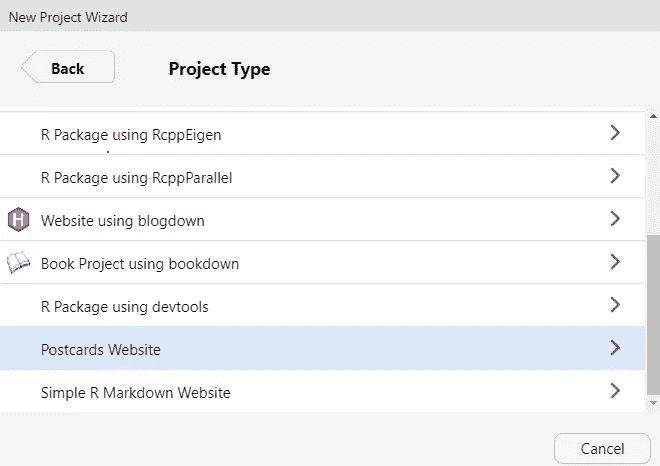
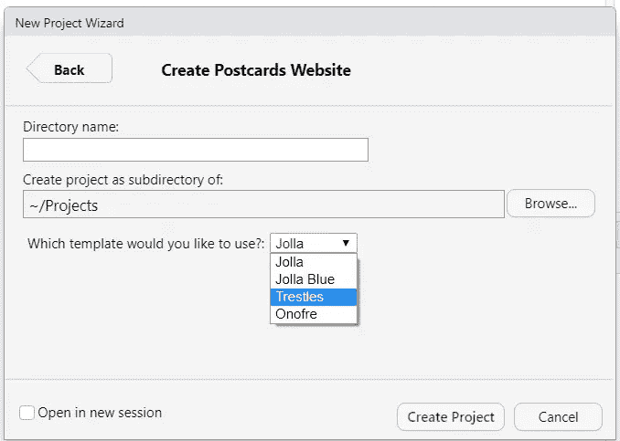
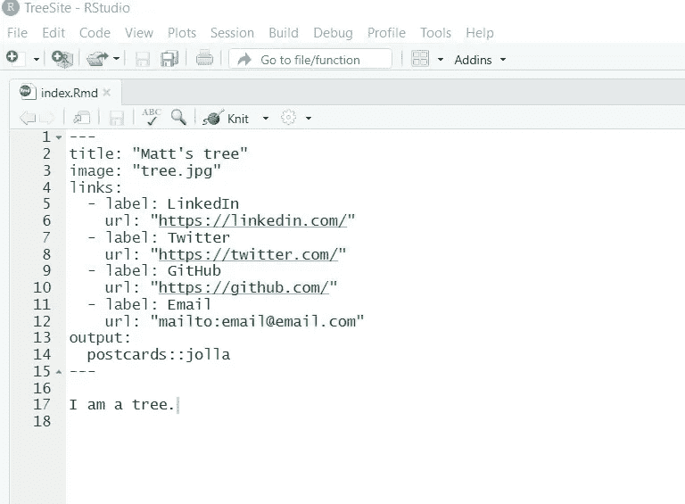
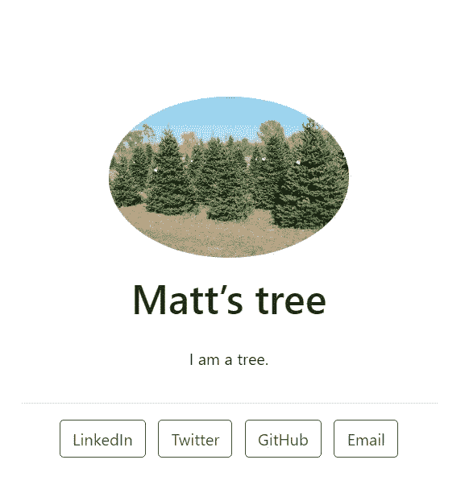
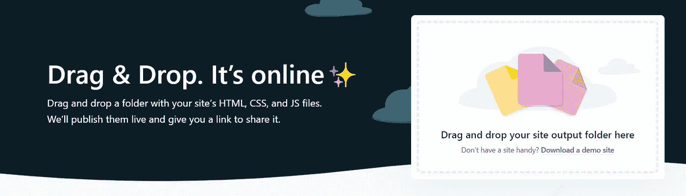

# 用 R 语言设计简单的明信片网站

> 原文：<https://towardsdatascience.com/designing-simple-websites-with-postcards-in-r-c9fcbcb4677a?source=collection_archive---------32----------------------->

## 拥有一个简单的网站，展示您当前的项目和互联网存在，对于数据科学社区的任何人来说都是必不可少的。


作者用 R. Image 明信片包装设计的网站。

我喜欢墨西哥食物。在新冠肺炎疫情酒店住了大约两个月后，我和妻子准备从我们最喜欢的墨西哥餐馆叫外卖。长话短说，我们最终没有向他们订购。为什么？他们没有一个网站列出他们的菜单或如何联系他们外卖。

这家餐馆因为没有网站而失去了我的生意。虽然企业拥有一个网站是必不可少的，但对于职场人士来说，拥有一个设计良好的网站也变得越来越重要。

我总是鼓励学生和年轻的专业人士花时间开发一个网站，展示他们的专业成就和他们正在从事的项目。至少，一个完善的 LinkedIn 个人资料可以做到这一点。特别是对于数据科学社区的专业人士来说，一个作为登录页面的网站可以为你的同事、客户和潜在雇主指明方向，这可以让你与众不同，让你的工作大放异彩。

# 如果你不在网上，你就不存在

对于那些从未有过网站的人来说，在线建站工具的数量是压倒性的。它们中的许多(例如 Squarespace 和 Wix)都很昂贵，并且能够做的事情远远超过了数据科学专业人员的需求，例如维护一个提供当前项目信息和联系信息的网站。

对于那些已经有一个或多个网站的人来说，你可能没有一个“登陆页”来指向你正在做的所有项目。这些可以包括专业和个人的追求和冒险。许多人还与多个机构和组织有联系(如学术机构)，您可能希望通过一个网页向您的观众展示您参与的项目的多样性。

这就是为什么我喜欢[明信片](https://github.com/seankross/postcards)，这是一个 R 包，它使用 R Markdown 创建简单的网站和登陆页面。当[罗杰·彭](https://rdpeng.org/)在《努力报告》播客中提到他有一个新网站时，我知道了这件事。我很感兴趣，因为看起来他的网站是用 R Markdown 设计的，这让我想到了明信片包装。

# R 中的明信片包装

明信片的开发版可以安装在 R:

```
remotes::install_github("seankross/postcards@main")
```

任何网页都可以在一个 R Markdown 文档中创建。如果您使用的是 RStudio，导航到**文件**->-**新项目** - > **新目录，创建一个新项目。**然后导航至**明信片网站**项目类型:



使用 RStudio 创建明信片网站。

然后，指定要存储项目的目录。从四个模板中选择一个来设计你的网站。我为[我的明信片网站](https://mbrussell.org/)选择了 Trestles 模板，因为它允许以易于阅读的格式添加更多文本:



现在，更改标题，将标签和 URL 更新到社交媒体空间和您想要指向的其他页面，并添加一些文本。RStudio 的 [R Markdown 网页](https://rmarkdown.rstudio.com/)为那些想了解更多 Markdown 语言的人提供了极好的信息和一份备忘单。在您创建 R 项目的目录中，添加您自己的 JPEG 图像。下面是我用 Jolla 模板为一个树木玩具网站创建的一些信息:



明信片网站的降价版本。

这是用明信片构建的最终渲染网页:



一个用 r 语言明信片搭建的简单网站。

要让你的网站活起来，我推荐 [Netlify Drop](https://app.netlify.com/drop) 。GitHub pages 是另一种可以使用的方法。在 Netlify Drop 中，拖放您为明信片网站创建的 R 项目文件夹，其中包含 HTML 文件，一切就绪。Netlify Drop 提供免费托管和 URL:



Netlify 下降。

您可以选择通过 Netlify 购买自定义域，而不是所提供的默认站点 URL。我每年为 mbrussell.org 支付 10.99 美元，这给你的网页增加了一些个性化。该站点将被设置为手动部署。

# 结论

拥有一个简单的网站，展示您当前的项目和互联网存在，对于数据科学社区的任何人来说都是必不可少的。R 包明信片使用 R Markdown 创建一个优雅的网站。可以使用 RStudio 将新网站设置为项目，然后使用 Netlify Drop 等工具部署到 web 上。

—

*特别感谢 Sean Kross 的* [*明信片*](https://github.com/seankross/postcards) *包裹。*