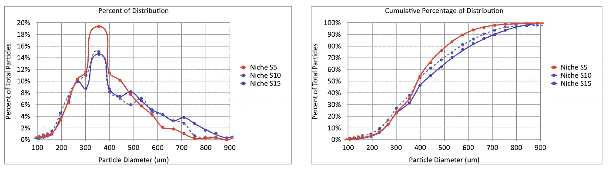
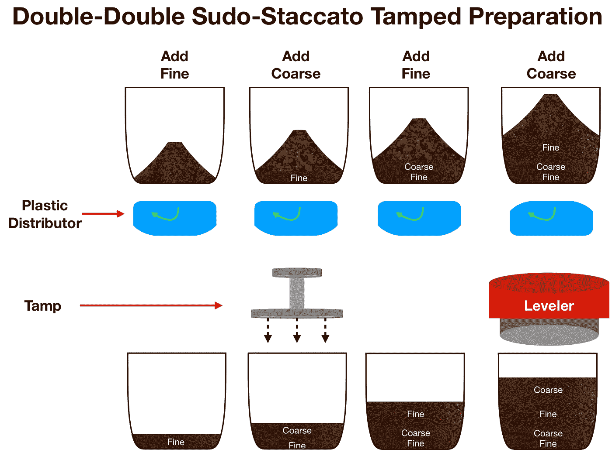
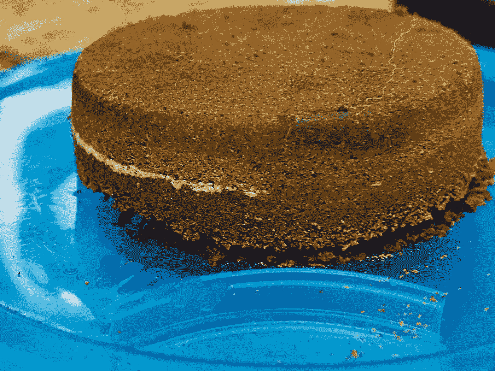
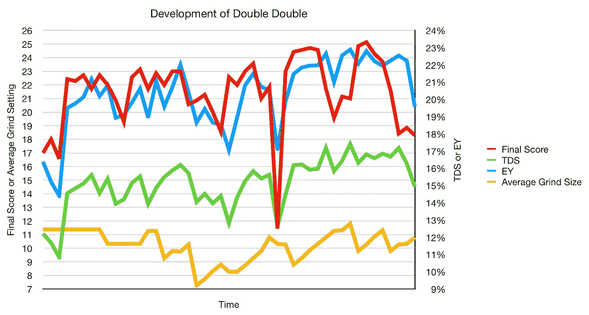
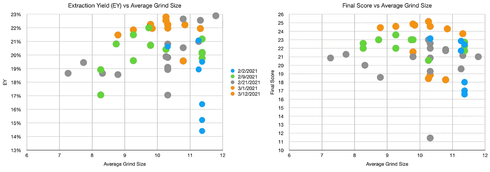
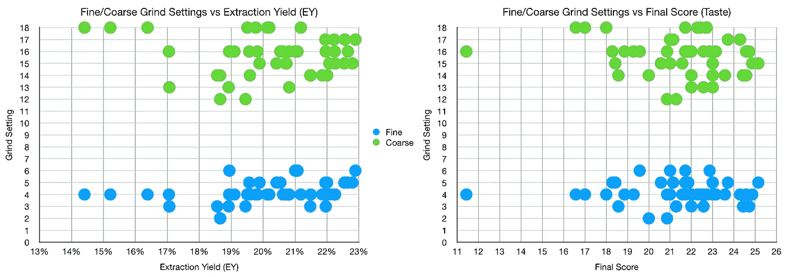
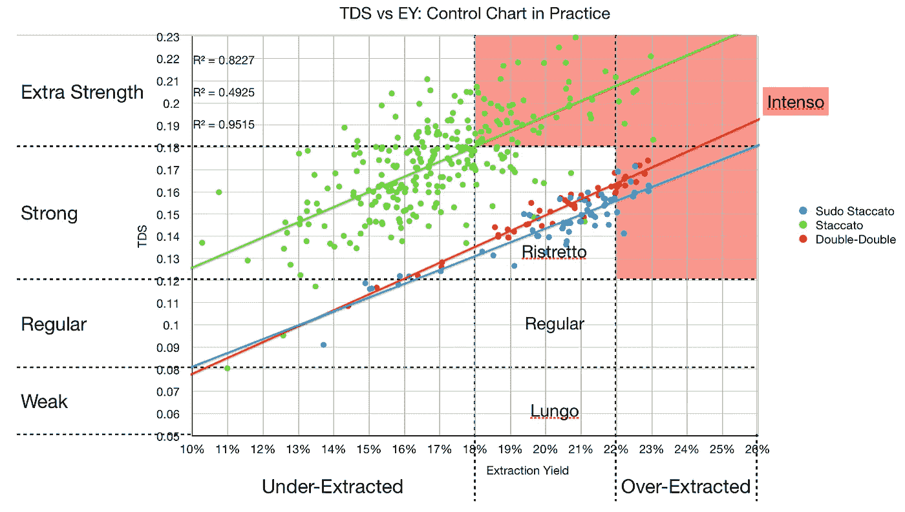

# 设计双双 Sudo-Staccato 浓缩咖啡

> 原文：<https://towardsdatascience.com/designing-the-double-double-sudo-staccato-espresso-shot-5c435c292672?source=collection_archive---------29----------------------->

## 咖啡数据科学

## 再往下是分层射击兔子洞

sudo-staccato 技术是真正的 [staccato](https://medium.com/overthinking-life/staccato-espresso-leveling-up-espresso-70b68144f94) espresso shot 的绝佳替代品，但我很难提高提取率。我一直在切割用过的冰球，并测量剩余的咖啡，结果表明，粗糙和中间层提取的咖啡比精细层少。结果我一直在看怎么把这个镜头设计的更好，结果就是双双 Sudo-Staccato。如果我用筛子来做两个不同的层面，这将是一个双重的断奏。

首先，我开始修改 sudo-staccato 镜头的中层和粗糙层的研磨尺寸，但是在修改层和修改流之间有一个平衡。我还是想要更高的提取率。我不得不重新考虑拍摄，所以让我们去掉粗糙的图层，但保持流畅。

不是三个研磨设置，而是堆叠在四层中的两个怎么样？好的，粗糙的，好的，粗糙的，或者像有些人说的，一个双双的。

# 设计双双

薄的精细层将限制沟道效应，而粗糙层将允许在下一层之前进行流动校正。两个目标之间的平衡将导致更高的提取率:

1.  降低平均粒度(研磨设置)
2.  保持流速

我的目标是得到一个更好的整体研磨设置。通常，当我拨入一颗咖啡豆时，我会在壁龛上设置 13。我一直在研究粒子分布，设置 5 和 15 的差别很大。我在这里画了 5，10 和 15，其中 10 是 5 和 15 之间的平均值。

所有图片由作者提供

镜头准备与其他分层镜头类似:

这是提取后颠倒的照片。这张照片有一点暗点，流动不均匀，但仍然是一张好照片。

# 镜头性能指标

我将这些定义放在这里，因为在这一节之后，我将使用这些指标评估不同数量的纸质过滤器。

我使用了两个指标来评估镜头之间的差异:[最终得分](https://link.medium.com/uzbzVt7Db7)和[咖啡萃取](https://link.medium.com/EhlakB9Db7)。

最终得分是 7 个指标(强烈、浓郁、糖浆、甜味、酸味、苦味和余味)记分卡的平均值。当然，这些分数是主观的，但它们符合我的口味，帮助我提高了我的拍摄水平。分数有一些变化。我的目标是保持每个指标的一致性，但有时粒度很难，会影响最终得分。

使用折射仪测量总溶解固体(TDS ),该数字用于确定提取到杯中的咖啡的百分比，并结合一杯咖啡的输出重量和咖啡的输入重量，称为提取率(EY)。

# 开发过程中的提取和品尝

随着时间的推移，我绘制了前几个镜头，因为我对精细和粗糙层的研磨尺寸进行了一些调整。我的品味(最终得分)和 EY 稳步上升。由于与布料过滤器相关的问题，出现了一些颠簸。

我根据各层的加权平均值及其研磨尺寸计算了平均研磨值。有一个总的趋势是地面越来越高。作为参考，大多数时候我在设置 13 左右拨入一个常规镜头。

我们也可以看看这些镜头中的个别研磨设置。我没有看到任何一个层研磨大小的趋势，但我没有探究它们，看看事情在哪里崩溃。

然后，我将 TDS 和 EY 与其他分层镜头进行了比较，以了解这些镜头的趋势，似乎它们比 Sudo-Staccato 镜头的斜率略高，但它的趋势不太像 Staccato 镜头。

断奏的镜头如果做得好，是惊人的和令人兴奋的，但这需要筛选，这是典型的爱的劳动。然而，通过使用研磨设置和多层，可以在不需要筛选的情况下对典型的镜头进行很大的改进。

如果你愿意，可以在 Twitter 和 YouTube 上关注我，我会在那里发布不同机器上的浓缩咖啡视频和浓缩咖啡相关的东西。你也可以在 [LinkedIn](https://www.linkedin.com/in/robert-mckeon-aloe-01581595?source=post_page---------------------------) 上找到我。也可以在 [Medium](https://towardsdatascience.com/@rmckeon/follow) 或者 [Patreon](https://www.patreon.com/EspressoFun) 上关注我。

# [我的进一步阅读](https://rmckeon.medium.com/story-collection-splash-page-e15025710347):

[浓缩咖啡系列文章](https://rmckeon.medium.com/a-collection-of-espresso-articles-de8a3abf9917?postPublishedType=repub)

[工作和学校故事集](https://rmckeon.medium.com/a-collection-of-work-and-school-stories-6b7ca5a58318?source=your_stories_page-------------------------------------)

[个人故事和关注点](https://rmckeon.medium.com/personal-stories-and-concerns-51bd8b3e63e6?source=your_stories_page-------------------------------------)

[乐高故事首页](https://rmckeon.medium.com/lego-story-splash-page-b91ba4f56bc7?source=your_stories_page-------------------------------------)

[摄影飞溅页面](https://rmckeon.medium.com/photography-splash-page-fe93297abc06?source=your_stories_page-------------------------------------)

[使用图像处理测量咖啡研磨颗粒分布](https://link.medium.com/9Az9gAfWXdb)

[改进浓缩咖啡](https://rmckeon.medium.com/improving-espresso-splash-page-576c70e64d0d?source=your_stories_page-------------------------------------)

[断奏生活方式概述](https://rmckeon.medium.com/a-summary-of-the-staccato-lifestyle-dd1dc6d4b861?source=your_stories_page-------------------------------------)

[测量咖啡磨粒分布](https://rmckeon.medium.com/measuring-coffee-grind-distribution-d37a39ffc215?source=your_stories_page-------------------------------------)

[咖啡萃取](https://rmckeon.medium.com/coffee-extraction-splash-page-3e568df003ac?source=your_stories_page-------------------------------------)

[咖啡烘焙](https://rmckeon.medium.com/coffee-roasting-splash-page-780b0c3242ea?source=your_stories_page-------------------------------------)

[咖啡豆](https://rmckeon.medium.com/coffee-beans-splash-page-e52e1993274f?source=your_stories_page-------------------------------------)

[浓缩咖啡滤纸](https://rmckeon.medium.com/paper-filters-for-espresso-splash-page-f55fc553e98?source=your_stories_page-------------------------------------)

[浓缩咖啡篮及相关主题](https://rmckeon.medium.com/espresso-baskets-and-related-topics-splash-page-ff10f690a738?source=your_stories_page-------------------------------------)

[意式咖啡观点](https://rmckeon.medium.com/espresso-opinions-splash-page-5a89856d74da?source=your_stories_page-------------------------------------)

[透明 Portafilter 实验](https://rmckeon.medium.com/transparent-portafilter-experiments-splash-page-8fd3ae3a286d?source=your_stories_page-------------------------------------)

[杠杆机维修](https://rmckeon.medium.com/lever-machine-maintenance-splash-page-72c1e3102ff?source=your_stories_page-------------------------------------)

[咖啡评论和想法](https://rmckeon.medium.com/coffee-reviews-and-thoughts-splash-page-ca6840eb04f7?source=your_stories_page-------------------------------------)

[咖啡实验](https://rmckeon.medium.com/coffee-experiments-splash-page-671a77ba4d42?source=your_stories_page-------------------------------------)