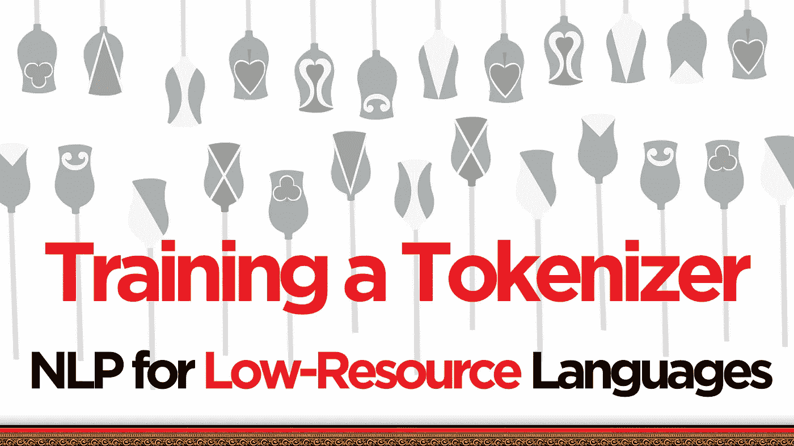
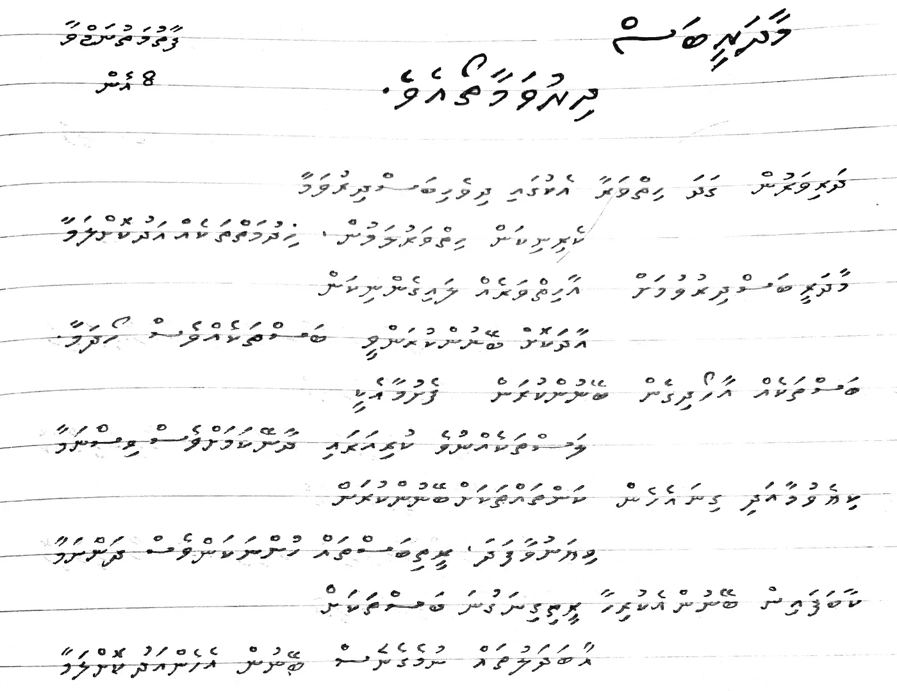
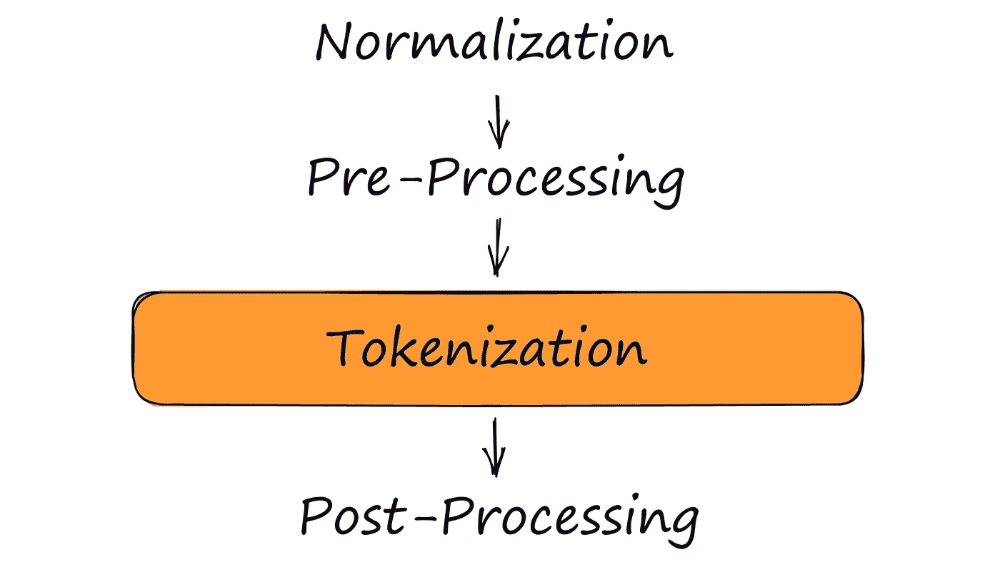
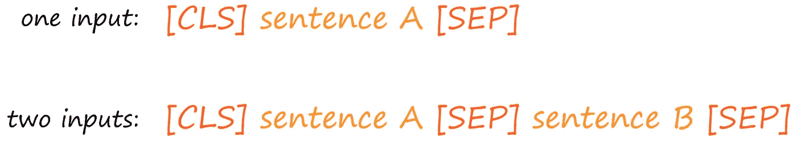

# 为低资源语言设计标记化器

> 原文：<https://towardsdatascience.com/designing-tokenizers-for-low-resource-languages-7faa4ab30ef4?source=collection_archive---------17----------------------->

## 为什么为迪维希·ދިވެހި这样的语言构建 NLP 标记器如此困难



作者图片

我一直在和马尔代夫的伊斯梅尔·阿什拉克讨论自然语言处理。印度洋上一个美丽的群岛，令人难以置信地稳定在平均 25.2-31.6 摄氏度(对于那些生活在 18 世纪的人来说，那是 77.4-88.9 华氏度)。

Ashraq 向我介绍了迪维希语(或马尔代夫语)，这种语言令人着迷。它使用一种叫做 Thaana 的复杂书写系统，我完全无法理解其中的任何一种。它与我所知道的任何事物都大相径庭——但是，就像这个群岛一样，它看起来棒极了。



[手写迪维诗，来源](https://twitter.com/NajwaFathimath/status/1332701529816621056)。

NLP 和马尔代夫不是我通常会在同一背景下想到的两个事物。然而，事实证明，有很多人这样做。

Ashraq 就是其中之一，他描述了将 NLP 应用于他的母语迪维希语的困难。这有几个原因:

*   迪维希几乎有- **零预训车型**。即使是涵盖数百种语言的多语言模型也错过了迪维希。
*   非结构化的迪维希文本数据很难找到，带标签的数据更难找到。
*   许多现有的 transformer 模型不仅从未见过 Dhivehi，而且由于独特的脚本，现有的 transformer tokenizers 无法处理 Dhivehi 字符(只输出未知的令牌)。

这些都是困难的障碍，但并非不可能克服。本文将探讨我们如何解决构建一个有效的 Dhivehi 单词片段分词器的第一步。

文章的视频演示。

# 获取数据

在构建我们的标记器之前，我们应该首先找到或创建一些数据。这里[有几个迪维希数据集](https://github.com/Sofwath/DhivehiDatasets)，质量还算合理。但是我们需要更大更干净的东西。

Ashraq 整合了一个新的迪维希语数据集，包含了从网上搜集的 1600 多万个迪维希语样本。它并不完美——但它是很好的，也是目前构建我们的标记器(以及后来的模型)的最佳公开可用资源。

为了下载数据集，我们使用:

我们已经设置了`streaming=True`来避免将整个数据集下载到我们的本地机器。这样，我们将迭代地下载每个样本。

因为我们将把数据提供给标记器训练函数，所以我们需要修改生成器输出，只生成 Dhivehi 文本，而不是包含 Dhivehi 文本的字典。

这个输出是我们需要的格式，所以现在让我们把数据留在这里，继续进行 wordpartecokenizer 的设置。

# 构建标记器

令牌化过程包括几个子步骤，它们是:

1.  **规范化** —文本清理，如小写，用 [Unicode 规范化](/what-on-earth-is-unicode-normalization-56c005c55ad0)去除重音或怪异字符等。
2.  **预标记化** —分裂成多个部分，通常分裂成由空格字符指示的单词或子单词标记。
3.  **模型**——例如*“标记化”*或将字符或子词合并成更大的*逻辑*组件。
4.  **后处理** —添加特殊令牌，将令牌转换为令牌 id 等。
5.  ***解码器*** —获取标记化数据并将其转换回人类可读文本的过程。这一步不是“标记化”过程的一部分，但对于理解任何基于文本的模型输出是必需的。

我们将利用优秀的🤗 ***分词器*** 库把所有这些都放在一起。我们必须首先初始化**模型**，因为我们将通过 tokenizer 模型属性添加剩余的步骤。

现在我们可以添加前两步，规范化和预标记化。

## 正常化

迪维希语既不包含大写字符，也不包含小写字符。迪维希语中根本就没有“格”这个词，老实说，英语中有这个奇怪的概念不奇怪吗？

奇怪的是，小写字母的发展(很可能)是因为抄写员急于写得更快——产生了一种更随意的小写字母。

随着时间的推移，将重要的句子和单词(比如你的名字)的开头大写成了标准做法。数百年前，印刷店将单个字母“印刷品”保存在名为*盒*的盒子里。

打印店将那些不常用的正式大写字母保存在难以接触到的*大写字母中，*而更常用的小写字母保存在容易接触到的*小写字母中*。

有时，看似不起眼的小物品的起源故事可能会引人入胜。*反正*，回到我们迪维正常化。

虽然我们不需要担心小写或大写的 Dhivehi，但我们的数据仍然会包含一些非 Dhivehi 文本。这个非 Dhivehi 文本不是我们关注的焦点，所以我们将所有内容都小写，以尽量减少可能产生的标记。

为什么？假设我们在训练数据中找到单词“hello”和“Hello”。如果没有小写，我们可能会产生两个令牌；`Hello`和`hello`。对于小写，我们只创建一个令牌；`hello`。

因此，我们在标记化中的第一个组件是一个小写函数，用于最小化非 Dhiveh 标记。

另一个好的规范化组件是 **Unicode 规范化**。我们不会深入讨论这个问题(更多信息，请点击)，但它允许我们匹配以下内容:

```
ℕ𝕃ℙ == NLP
```

对于一个角色来说，通常有不同的角色代表，对我们人类来说，代表着同一个事物——比如ℕ𝕃ℙ和 NLP。但是，变压器不会将这些视为相同。Unicode 标准化允许我们解决这个问题，将这些字符变体映射到单个字符。

在应用 NFKD 规范化之后，我发现了 600，000 个样本发生了变化。对于 1670 万个样本来说，这个变化似乎很显著，所以我在标记器中添加了一个 NFKD 规范化步骤。

我们小写并将 NFKD Unicode 规范化应用于所有传入的文本进行规范化。

我们继续下一个部分。

## 预标记化

预标记化组件描述了将文本串分成初始块/标记。这里的标准做法是将文本分成单词和标点符号。意思是这句话:

```
"hello world! hey have you seen my pet koala?"
```

变成了:

```
['hello', 'world', '!', 'hey', 'have', 'you', 'seen', 'my', 'pet', 'koala', '?']
```

要做到这一点，我们只需要一个`Whitespace`预归类器。

目前，这就是我们将添加到记号赋予器的全部内容。培训完后，我们将返回到**后处理**组件*。*

## 训练分词器

前三个组件、规范化、预处理和标记化模型初始化后，我们可以继续训练标记化器。

我们需要迪维希数据(已经存储在🤗 ***数据集*** 迭代器)并指定几个分词器*训练*参数。

这里我们指定:

*   `vocab_size` —标记器词汇表中目标标记的数量。数字越大意味着令牌越多，但训练时间越长，令牌化器文件也越大。
*   `special_tokens` —将在我们的 vocab 中包含的特殊令牌，BERT 模型稍后将需要这些令牌。
*   `min_frequency` —“合并”在训练数据中出现的最少次数将被视为成为新令牌。
*   `continuing_subword_prefix` —单词片段标记器在子单词标记前附加一个特殊字符。单词`upright`可能会变成`['up', '##right']`，而单词`right`可能会变成`['right']`。令牌`##right`和`right`不一样。第一个是子词标记。

这样，我们的记号赋予器`trainer`就准备好了，我们现在要做的就是调用一个`tokenizer`训练方法，并把它传递给我们的`dv_text()`生成器和训练器。因为我们将数据存储在一个可迭代的`dataset`对象中，所以我们可以调用`train_from_iterator`方法。

培训结束后，我们可以进入第四步——后处理。

## 后加工

我们将*的后处理步骤定义留在*训练之后，因为它使用将在我们的标记化器词汇表中定义的特殊标记，该词汇表是在训练步骤期间构建的。

在我们的后处理步骤中，我们定义了要应用于我们的标记器的输出的任何转换。



后处理步骤应用于标记化步骤的输出。

这个后处理步骤具体应该做什么？我们正在为 BERT 构建这个标记器，其他 BERT 模型使用的标准格式(翻译成可读文本)是:



带有特殊**【CLS】**和**【SEP】**标记的典型 BERT 输入格式。

为了定义这种格式化，我们使用了一个叫做`TemplateProcessing`的东西。这个类允许我们指定如何处理单句或双句输入。但是，如果在预处理过程中不使用[**N**ext**S**entence**P**radio(NSP)](https://youtu.be/1gN1snKBLP0)，我们就不一定需要使用对语句格式。

在那些模板定义中有一些东西需要解开。首先，我们有两个特殊的令牌；`[CLS]`和`[SEP]`，它们分别是‘序列开始’**cl**a**s**si fier 和 **sep** arator 令牌。

我们将传递给分词器的第一句定义为`$A`，将第二句(如果给定的话)定义为`$B`。使用这种格式，句子`"hello world"`将被后处理为`[CLS] hello world [SEP]`。或者对于两个句子`"hello world"`和`"pet koala"`，我们会看到`[CLS] hello world [SEP] pet koala [SEP]`。

还有一件事是已经提到的每个组件后面的`:0`和`:1`。这些定义了各个组件的`token_type_id`值(BERT 使用`token_type_ids`来区分不同的句子)。

这就是我们的令牌化组件，但是还有最后一个额外的组件要添加。

## 解码器

解码器步骤是将转换器可读的令牌 id 翻译回人类可读的文本。当我们使用单词片段标记化时，我们设置`decoder`属性来使用`WordPiece`解码器，并指定前面定义的子单词前缀。

## 节约

我们的标记器现在已经完全定义好了。剩下的就只有救了！这样我们就可以直接从🤗 ***变形金刚*** (而不是用*)，我们必须将当前`tokenizer`加载到一个变形金刚记号化器对象中:*

*我们还再次指定了每个特殊标记。之后，我们保存记号赋予器，现在，我们可以像加载任何其他 ***变形金刚*** 记号赋予器一样加载它。*

# *使用*

*现在可以通过`from_pretrained`方法加载 Dhivehi 分词器了，就像加载其他分词器一样。*

*然后，我们可以继续对迪维希语文本进行标记。*

*这就是为低资源语言构建标记器的介绍。非常感谢 Ashraq 向我介绍了他的迪维希项目，并让我也参与其中。他正在做一堆很酷的以迪维希语为中心的 NLP 项目，我很期待看到它的进展。*

*tokenizer 是为迪维希语言模型和工具建立更多支持的早期步骤。很自然，下一步是创建一个迪维希预训练的 BERT——我们将很快介绍它。*

*如果你想马上使用迪维希模特，你可以在[我自己的](https://huggingface.co/jamescalam)和[阿什拉克的](https://huggingface.co/ashraq)拥抱脸简介上找到她们。*

*同时，你可以通过[这个链接](https://jamescalam.medium.com/subscribe)获得最新的文章。我还在 YouTube 上上传 ML 和 NLP 的每周视频。*

*感谢阅读！*

*🎁[面向语义搜索的 NLP 免费课程](https://www.pinecone.io/learn/nlp)*

*🤖[变压器课程 NLP 的 70%折扣](https://bit.ly/nlp-transformers)*

*[文章笔记本脚本](https://github.com/jamescalam/dhivehi_nlp/blob/main/examples/00_create_dv_base/01_tokenizer_components.ipynb)*

***除另有说明外，所有图片均出自作者之手**